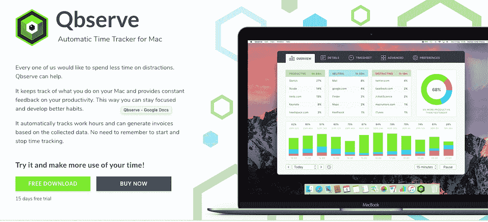
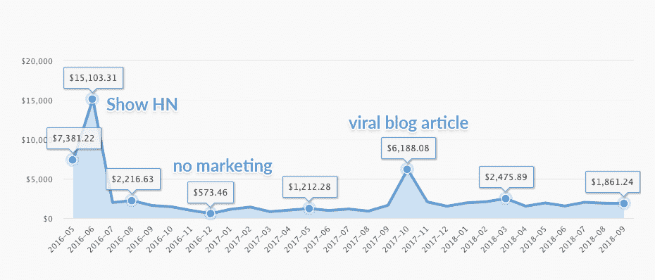

# 在没有营销经验的情况下，让我的第一款应用实现盈利

> 原文：<https://www.indiehackers.com/interview/growing-my-first-app-to-profitability-with-no-marketing-experience-31549472ff>

## 你好！你的背景是什么，你在做什么？

嗨！我是 Ivan Mir，我和我的联合创始人兼妻子 Irina 一起经营着一家名为 [QotoQot](https://qotoqot.com/) 的小公司。我们来自俄国的圣彼得堡，但现在住在智利南部的小城[瓦尔迪维亚](https://valdiviaguide.com)。

QB serve(“cube-serve”)是一个用于 Mac 的自动时间跟踪器，它给你实时的生产力反馈，自动跟踪项目时间，然后生成时间表和发票。与我们的大多数竞争对手不同，这款应用没有任何团队功能，而是专注于提供最佳的个人时间跟踪体验。另一个重要的区别是隐私:Qbserve 记录你所有的浏览和文档历史，但这些都不会离开你的 Mac。

因此，这款应用的核心受众是那些希望私下追踪自己工作效率或工作时间的个人——而不是因为他们的老板命令他们安装追踪软件。两年半后，Qbserve 每月收入约 2000 美元，拥有超过 4000 名用户。

 

## 是什么促使你开始使用 Qbserve？

在我们的[游戏初创公司](https://www.gamasutra.com/blogs/IvanMir/20150217/236560/Postmortem_Traps_for_Friends__our_attempt_at_fair_IAP_multiplayer.php)于 2014 年 12 月关闭后，我们开始寻找自由职业者的工作，以在游戏开发领域之外建立新的财务缓冲，因为游戏开发领域变得过于拥挤，提供的远程工作也很少。我决定转向桌面和移动应用程序，以利用我的 Objective-C 和 C#知识。

在创业之前，我们已经在客户和独立项目的循环中工作了五年，所以开发一些新产品是不可避免的。我们之前都用过 RescueTime，甚至还为 pro 版付费了一年，但是发现没多大帮助。他们的每周生产率报告只是让我们对浪费的时间感到些许内疚。当然，没有自托管的解决方案让我毛骨悚然——将我所有的浏览历史发送到他们的服务器让我很不舒服。

所以我们停止使用它。但我一直梦想有一个更好的选择，并认为现在是尝试的最佳时机。在最好的情况下，这个项目将最终实现我的自由职业的梦想。在最坏的情况下，我会得到一个我一直想要的产品和我投资组合中的第一个应用程序。我知道 RescueTime 很受欢迎，所以我没有做太多的市场研究，只是大胆地假设我可以通过提供更好的用户体验来获得他们的一部分观众。

## 构建最初的产品需要什么？

Qbserve 是一个用 Objective-C 和 SQLite 构建的原生应用。跟踪本身在很大程度上依赖于 macOS 针对残疾人的屏幕阅读 API。不幸的是，如此接近 macOS 的独特功能意味着该应用程序无法移植到其他操作系统，包括出于安全原因不允许应用程序跟踪的 iOS。这也是为什么 Qbserve 没有出现在 Mac App Store 上的原因——苹果要求对在那里销售的应用程序进行限制性的沙箱处理。

很难估计与自由职业并行花费的时间(如果我当时有 Qbserve 来跟踪它就好了！)，但我觉得总共是半年左右的全职工作。这当然比我预期的要长，尽管我试图防止过度工程化和特性蠕变。例如，我已经预料到子项目跟踪对于许多客户来说是重要的，但是最小可行产品的目标是在个人生产力跟踪的不太繁忙的领域中竞争。我也知道一些拥有多台 MAC 的客户会要求数据同步，但我缺乏这种复杂程度所必需的经验，所以我甚至没有尝试规划应用程序与服务器配合使用的架构。

永远从你的目标受众那里寻找反馈，即使你正处于构思阶段。

TweetShare

相反，我专注于简单的 UX 胜利，比如动态图标，其愤怒的红色让你羞于工作，或者灵活的跟踪设置，这些设置不难实现，但允许用户根据自己的工作流程调整应用程序。我还手动分类了数以千计的热门网站和应用程序，以便 Qbserve 可以自动将它们分为“高效”、“中性”和“分散注意力”三类。

最困难的阶段是在发布之前，我们花了几周时间编写和重写各种文本，建立一个登录页面，建立一个经销商帐户，进行 beta 测试，并做所有其他预发布的事情。多任务处理如此繁重，以至于最终该应用程序以其奇怪的工作名称 Qbserve 发布，因为我们放弃了寻找任何与时间跟踪相关但尚未被采用的内容。这个名字可能会损害它的整体口碑，因为当你听到它时，它既难记又难拼写。

## 你们是如何吸引用户并壮大 Qbserve 的？

在发布之后，我们将这款应用发布到 Product Hunt 上，并在当天成为第五名。10 天后，我在 Hacker News 上创建了一个“ [Show HN](https://news.ycombinator.com/show) ”节目，Qbserve 成为了那周最热门的投稿之一，带来了大量的销售和反馈。我花了好几天什么也没做，只是回复了几十条评论和支持请求。

尽管发射成功，我们的媒体宣传却是失败的。一些网站的记者(大部分是非英语网站)联系我进行评论，但除此之外，媒体对 Qbserve 根本不感兴趣。甚至苹果相关的网站也忽略了我们的宣传，两年多过去了，我们仍然没有收到他们的评论。

好软件容易推广的想法，就和“好软件卖自己”的神话一样傻。

TweetShare

后来，我开始明白 Mac 应用评论根本不能带来足够的流量，即使是对专注于苹果生态系统的网站来说也是如此，因为 Mac 与其他平台相比没有那么受欢迎(仅占全球桌面的 10%，美国的 20%)。但当时这非常令人沮丧，为了解决这个问题，我们决定去参加苹果全球开发者大会，亲自采访一些记者。这是该应用程序历史上最昂贵的错误。事实证明，苹果相关的媒体社区更像是一个私人俱乐部，而不是我们在游戏开发世界中经历的那种自由竞争。所以尽管我们尽了最大努力，我们还是很少和任何人联系。但是，即使我们认识了合适的人，我也怀疑飞往加州是推广这款应用的划算方式。

在被记者忽视后，我们试图在允许用户提交的地方最大化应用的曝光率:

*   问答网站:[苹果。堆栈交换](https://apple.stackexchange.com/questions/40631/is-there-a-good-automatic-time-tracking-tool-for-mac-os-x/)、[询问商品搜索](https://www.producthunt.com/ask/8-what-is-best-for-time-tracking)、 [Quora](https://www.quora.com/What-is-the-best-time-tracking-app-for-me/answer/Ivan-Mir)
*   软件目录:[可选](https://alternativeto.net/software/qbserve/)、[软音](https://en.softonic.com/solutions/software/qbserve)、 [Capterra](https://www.capterra.com/p/153002/Qbserve/)
*   GitHub 上的工具和资源集合: [Awesome Mac](https://github.com/jaywcjlove/awesome-mac) 、 [Awesome Remote Job](https://github.com/lukasz-madon/awesome-remote-job) 等。

虽然所有这些网站本身带来的流量很少，但你永远不知道谁会在那里找到你的产品。慢慢地，Qbserve 开始被列入那些典型的“X 的最佳应用”文章中——也许作者已经在这些列表中找到了它？我们用来提高 Qbserve 知名度的另一个“喷雾祈祷”方法是参与许多赠品和每份许可证支付不到 1 美元的廉价应用捆绑销售。

在尝试了获取应用程序登录页面链接的大部分选项后，我们转向了内容营销。我花了几个月的时间学习如何写得更好，并为我们的博客起草了一些有深度的文章。他们中的几个登上了黑客新闻的顶端，并吸引了高质量的反向链接到我们的网站，但大多数都没有超越几个时事通讯。

我们还用 [Sloth Worth](https://qotoqot.com/sloth-worth/) 尝试了“副项目营销”策略，这是一个跟踪因拖延而损失的金钱的浏览器扩展。通过使用 Qbserve 中分散网站的数据库很容易构建。这个扩展在产品搜索上做得很好，并带来了一些来自知名网站的反向链接，包括 Lifehacker。

效果不佳的营销渠道:

*   Twitter——即使我的文章被一个拥有超过 60，000 名真正粉丝的流行开发者发布，也只有几百次点击。此外，没有长期影响，因为推文“存活”不到一天。
*   Reddit——转换率接近于零，许多 subs 非常不喜欢自我推销，即使内容很好。虽然像树懒沃思这样的赠品可以做得很好。
*   与苹果相关的博客和时事通讯中的广告——其中大部分甚至没有达到收支平衡(我们用折扣代码跟踪转化率)。
*   联盟计划——大多数申请来自垃圾网站，少数好的合作伙伴没有带来任何销售。

 

## 你的商业模式是什么，你是如何增加收入的？

Qbserve 的售价是每个座位 40 美元，我们不收取更新费用。这种慷慨定价模式的原因是，从来没有将应用程序开发成更大的东西的计划。我们做了许多具体的改进，但没有一项能证明升级费用或大多数客户的订阅是合理的。唯一的例外是项目跟踪，但在添加它的时候，客户群仍然很小，大多数人仅在一年前购买了该应用程序。为了避免下一个产品出现这样的问题，我会在早期规划财务和路线图。

我们使用 FastSpring 作为经销商，因为他们处理国际销售税和许可证生成。他们的费用是每笔交易的 8.9%，这有点高，但仍然比应用商店收取的 30%好得多。除此之外，还有每月 10 美元的网站托管费，没有固定支出，所以剩下的 90%是利润。

我已经提到了黑客新闻(Hacker News)对该应用的巨大推动:我们在一个月内赚了 20，000 美元，在对大多数新客户的试用结束当天达到了 4，269 美元的峰值。在接下来的一年里，收入只有 15，370 美元，所以如果没有黑客新闻，我几乎不可能全职从事 Qbserve 的工作。

再好的关于商业或营销的文章和书籍，也是一张地图，而不是一片领地。了解这个领域的唯一方法就是探索它。

TweetShare

蜜月很快就结束了。两个月后，Qbserve 开始赚不到 1000 美元。由于该应用程序的低可见性，我犯了一个典型的错误，并决定如果我们添加更多的功能，如项目跟踪，该应用程序将获得更多的销售和评论者的喜爱。但是当然，经过半年多的工作和所有闪亮的新功能，收入几乎没有变化，我的推销仍然被记者和博客忽视。

写这么多代码的一个积极的副作用是过度优化了我的工作流程，达到了每月 200 小时的工作时间(尽管这意味着以目前的收入每小时 5 美元)。一篇提到 Qbserve 的文章再次登上了 Hacker News 的头条，并在那个月为我们带来了 4000 美元的额外收入，伴随着销售增长的长尾效应。从那以后，它就像病毒一样传播开来(到目前为止已经超过 125，000 次阅读),并给我们的网站带来了许多反向链接，这有助于它在搜索结果中排名更高。

当你为 Mac 搜索时间追踪器时，Qbserve 仍然不是最重要的，但提高搜索的有机流量对我们来说是最好的增长战略，因为我们不能像我们基于订阅的竞争对手那样竞价广告。

 

## 你未来的目标是什么？

与第一次迭代相比，Qbserve 已经感觉有点太复杂了，当时它是一个纯粹的生产力跟踪体验。与此同时，我们现在很少收到任何功能请求，所以我希望它不要再膨胀了。相反，我们将打磨现有的功能，使其使用起来更加舒适，并做一些小的翻新，以匹配较新的 macOS 版本的视觉风格。

目前，我们决定不本地化该应用程序，因为大多数非英语国家的购买量低于 2%。本地化需要大量的工作，无论是在网站上还是在代码中，考虑到当前的收入，它可能不会为自己买单。除了俄语和西班牙语，我们也不能提供其他语言的支持，所以让我们的网站使用法语或德语会有些误导。

在营销方面，我们将继续寻找提高网站在搜索结果中排名的方法，因为这是 Qbserve 收入增长的主要渠道。这也将有利于我们未来的项目，因为我们将所有的产品放在同一个域中。

## 你面临的最大挑战和克服的障碍是什么？如果你必须重新开始，你会做什么不同的事？

最大的挑战是对现代互联网经济如何运作的非常天真的理解。好软件容易推广的想法，就和“好软件卖自己”的神话一样傻。我肯定会花更多的时间学习营销。即使有了 Qbserve 的所有经验，我仍然有很多东西要学。

从财务角度来说，我还会将许可分成基础和专业两个层次，让复杂的功能物有所值。从一开始就这么做是很容易的，但是现在需要在设计和代码上做很多调整。

虽然我对代码库的可扩展性和稳定性非常满意，但我希望我们已经花了更多的时间来规划未来的 ui。例如，由于早期的设计错误，Qbserve 仍然不支持全屏窗口调整大小。如果不重新设计应用程序，现在很难纠正这些错误，但我们已经改善了用户体验，成千上万的客户已经习惯了 Qbserve。我认为可以肯定地说，每个人都讨厌重新设计(除了他们的作者)，所以我们会尽可能小心地解决这些问题。

## 有没有发现什么特别有帮助或者有优势的？

有一个联合创始人真的很有帮助，因为你可以随时询问第二种意见。当你开始从工程的角度看待产品或沉迷于不重要的细节时，这一点尤其重要——合作伙伴可以让你恢复理智。

我从来没有想到会有这样的事情，但是我们的客户已经证明是令人惊讶的——他们不仅给了我们许多有用的建议，而且给了我们很多好的印象。当你为某事奋斗了几个星期，突然收到一封感激的电子邮件，说你的产品如何帮助别人花更多的时间和他们的孩子在一起，这真是不可思议，会立即给你的电池充电。

有一个联合创始人真的很有帮助，因为你可以随时询问第二种意见——你有一个可以让你恢复理智的合作伙伴。

TweetShare

可能最大的优势是有机会按照自己的节奏学习和做事，因为我们有额外的收入来源——第一年我兼职做自由职业者，Irina 全职制作她的股票插图组合，当我需要她的帮助时，她会切换到 QotoQot 任务。如果我有没钱生活的压力，我会犯更多的错误。

## 对于刚刚起步的独立黑客，你有什么建议？

即使是最好的关于商业或营销的文章和书籍也只是一张地图，而不是一个领域。了解领域的唯一方法是探索它，所以[开始小规模](https://robwalling.com/2015/03/26/the-stairstep-approach-to-bootstrapping/)并尽快释放。避免陷入代码中，因为开发只是销售产品的一种手段。

除非你有五位数的预算用于顶级机构，否则不要雇佣任何人来做营销、媒体推广或搜索引擎优化——自己做，结果会比你用自举资金得到的好很多倍。至少花一段时间在 Ahrefs 等服务上试用，以了解信息在互联网上是如何流动的——你会对所有的水下潮流和趋势感到惊讶。

非常注重用户体验，不仅仅是用户界面，而是与你的公司和产品的整个互动。永远从你的目标受众那里寻找反馈，即使你正处于构思阶段。

以下是我用来学习这些主题的资源:

*   [简单可行的营销播客](https://everyonehatesmarketers.com)
*   [妈妈测试](http://momtestbook.com)
*   [Ahrefs 的 SEO 博客](https://ahrefs.com/blog/)
*   [筋疲力尽的博主公关指南](https://www.amazon.com/gp/product/B00NFAT238/)
*   [为网络写作](https://www.nngroup.com/topic/writing-web/)
*   [好的 UI 创意](https://goodui.org)

## 我们可以去哪里了解更多？

参见 [Qbserve](https://qotoqot.com/qbserve/) 本身以及我们在[QotoQot.com](https://qotoqot.com)的小型产品。我偶尔会在[我的慢 Twitter](https://twitter.com/ivmirx) 上分享一些有趣的文章，Irina 会在 [Instagram](https://www.instagram.com/irmirx/) 上发布她每天的插画。

此外，看看我们的博客中关于构建你自己的产品和保持高效的指南。我特别推荐[“作为一家软件公司的创始人，你应该知道什么”的文章](https://qotoqot.com/blog/founder-skills/)，因为它包含了许多链接，即使对于一个经验丰富的独立黑客来说也可能是有用的。

有许多细微差别不适合采访，所以我很乐意在评论中更详细地回应。

——[<picture id="ember7998221" class="user-avatar ember-view user-link__avatar"></picture>伊万·米尔](/ivmirx?id=Y5EfUXdQyiejijsKjXUFKkTJ16i1)，Qbserve 创始人

## 想像 Qbserve 一样建立自己的事业？

你应该加入[独立黑客社区](/)！🤗

我们是几千名创始人，互相帮助建立有利可图的业务和副业。来分享你正在做的事情，并从你的同事那里获得反馈。

还没准备好开始使用你的产品吗？没问题。这个社区是一个认识人、学习和实践的好地方。随意[随便浏览](/)！

——[<picture id="ember7998226" class="user-avatar ember-view user-link__avatar"></picture>考特兰艾伦](/csallen?id=ibTLPyjwVebnZjMGKvz6ztarnuV2)，独立黑客创始人

60votes