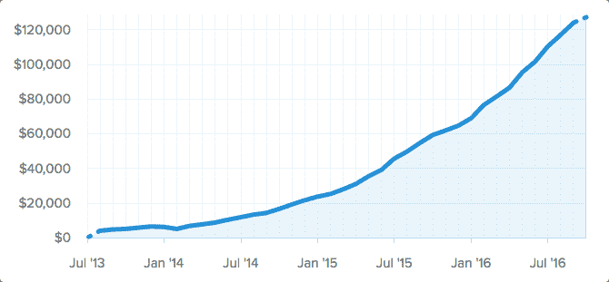

# 将我的“生活方式”业务增长到每月 13 万美元的收入

> 原文：<https://www.indiehackers.com/interview/growing-my-lifestyle-business-to-130-000-mo-in-revenue-fabeda2627>

## 告诉我们关于你自己和你正在做的事情。

大家好，我是戴夫·内沃特，我和贾里德·布朗是 [Hubstaff 时间追踪](https://hubstaff.com)的联合创始人。我经营在线业务已经很长时间了，这是我第一次真正的软件业务。过去的两次是在电子商务和服务领域。

[Hubstaff](https://hubstaff.com) 是一个为远程团队提供工作证明的时间跟踪平台。我们帮助客户管理跨多个时区的员工，并根据谁在做什么设定优先级。

## 你是怎么开始做 Hubstaff 的？

我需要一个解决方案，但当时什么都没有。早在 2008 年，我就开始寻找类似于 [Hubstaff](https://hubstaff.com) 的东西，但收效甚微。我试过一些，但是没有一个真的有效。当我们开始开发想法时，也没有为远程团队开发任何软件，这使得它看起来像是一个好机会。

Hubstaff 是根据我的具体需求打造的，随着我们的成长和客户的增多，我们让他们来驱动产品方向。我们根据客户的要求构建大部分功能。

## 你是如何找到时间和资金来建立你的企业的？

Hubstaff 是一家自助企业，所以资金来自我们的个人储蓄。两位联合创始人之前都有业务，我们能够从中获得投资。最初的投资是每个 2.6 万美元，所以总共 5.2 万美元。

考虑到时间，我们在经营其他业务的同时也在建设这个项目。随着 Hubstaff 的规模不断扩大，我们能够在业务上投入越来越多的时间。这是一个渐进的过程。大约花了 7-8 个月的时间，我们才能够发布产品并开始向客户收费。

## 你们是如何吸引用户和壮大 Hubstaff 的？

我们的大部分增长来自现有用户的口碑相传，以及频繁发布高质量的内容。最初，我们在 2013-2014 年做了一些广告，这能够为我们带来免费用户，但一旦我们转换为付费模式，就没有太多利润，所以今天我们没有做太多传统的付费广告。

我们从一个免费的产品开始，直到它好到可以收费，我们在 2013 年 8 月推出了这个产品。在关于[获得早期采用者](http://blog.hubstaff.com/acquiring-early-adopters)的博客文章中，我们写了很多关于我们在市场营销早期的经历。

转化率在开始时非常好，现在仍然很好。(大约 6%的主页访问者注册了免费试用。)将该产品作为免费选项效果很好，并产生了更高的免费试用转换率，但随后在从免费账户转向付费账户时效果不佳。我们在关于 [SaaS 定价和免费计划](http://blog.hubstaff.com/saas-pricing-free-plan-mistake)的博客中写下了这段经历。

## 你的营收背后有什么故事？

我们是一家透明的公司，所以你可以在 Baremetrics 上看到[我们所有的增长指标](https://hubstaff.baremetrics.com):

当我们推出时，我们有大约 2000 名免费会员使用该软件，我们向这些人提供 40%的终身优惠。我们关闭了大约 275 个付费账户，这并不是很好。我们学到的很多东西在[上面提到的“免费计划的错误”博客文章](http://blog.hubstaff.com/saas-pricing-free-plan-mistake)中都有提及:

> 我们对我们的免费计划和注册的用户抱有很大的期望，但这些期望从未实现。我们的免费计划最终让我们赔钱，阻碍了我们的发展！以下是我们学到的一些东西:
> 
> *   付费产品承载更多价值
> *   免费用户带来更多免费用户
> *   免费用户吃光了支持
> *   人们利用免费账户

对我们来说，收入增长是一个非常缓慢而稳定的攀升。时间是我们取得目前成就的最大财富。我们了解到，向 SaaS 小企业客户销售主要是关于产品和功能。甚至我们的营销页面测试也在我们撰写的销售文案中反映了这一点——获胜的测试通常与功能有关，而不是利益。

在运营的四年中，我们一直在不断发布新功能。一部分是为了跟上整个行业，一部分是为了增加免费试用和付费客户的转化率。

## 你未来的目标是什么？

我们一直想保持这种生活方式。我们非常相信远程工作，我们不希望未来有 300 名员工/承包商。我们更愿意坚持类似于 Basecamp 这样的公司所拥有的团队规模。我们不希望获得资金和一个大办公室，我们宁愿保持对如何发展业务和服务客户的完全控制。

我们还想花时间开发新产品，就像我们为 [Hubstaff](https://hubstaff.com) 所做的那样。我们有一个新的自由职业者和中介机构名录，叫做 [Hubstaff Talent](https://talent.hubstaff.com) 。发布工作或寻找和联系承包商为您的公司工作是完全免费的。我们这样做是为了帮助我们目前的客户解决他们的头号问题，即找到优秀的人才来帮助他们的业务向前发展。

## 如果你必须重新开始，你会做什么不同的事？

我对 [Hubstaff](https://hubstaff.com) 没有太多不同。我想我会比我更早地了解谁是我真正的客户，以及我们如何吸引他们。这将给我们一些重要的见解，因此我们可以更早地调整一些策略。

我也希望我们能选择一家不需要桌面软件的公司。这是一厢情愿的想法，因为在我们的业务中，这只是一个要求，但它增加了大量的开销，因为我们被迫为 Windows、Mac、Linux、iOS 和 Android 创建产品。这有点像支持 5-6 种产品，而不是只支持一种产品(仅限于 web)。这转移了我们的资源，使招聘变得更加困难。

关于业务的另一件事是，我们需要支持每个付费账户 6-7 个用户，因为承包商和雇主都需要在我们的平台上一起工作。这造成了入职和支持的复杂性，但这也是该软件表现良好的主要原因，所以我完全了解它的这一方面。

总的来说 [Hubstaff](https://hubstaff.com) 已经超出了我们的预期，表现非常出色。

## 你最大的优势是什么？

具有讽刺意味的是，我们拥有的最好的优势恰恰是来自上面的困难方面。由于我们现在已经建立了所有的桌面和移动版本，它向需要为特定设备进行良好时间跟踪的用户开放。这也增加了进入的障碍。

事实上，我们有雇主和承包商在我们的平台上一起工作，这导致了大量的口碑增长。一个客户雇佣了一个自由职业者，这自然会把他们介绍给我们的平台，然后这个自由职业者可以把关于 [Hubstaff](https://hubstaff.com) 的消息传播给他们的其他客户。

所以，我想这个故事的寓意是，有时候解决难题是值得的。

## 你会和有抱负的独立黑客分享什么建议？

我推荐阅读理查德·科赫的《80/20 原则》。我还建议企业家在做风险/回报决策时，考虑最好/最坏的情况。一个例子是当与一个可能有一个 15 美元的计划并且不高兴的顾客打交道时。他们在网上传播一个坏故事的风险比你放弃自我，给他们一个 6 个月的免费账户要糟糕得多。当你看到最好/最坏的情况时，它会帮助你看得更清楚，做出明智的决定。

如果你要开一家软件公司，我肯定会建议你选择只需要网络的东西。你将能够更好地集中精力，也更容易找到工作。

## 我们可以从哪里了解更多信息？

我的 Twitter 账号是 [@dnevogt](https://twitter.com/dnevogt) ，你也可以关注 [@Hubstaff](https://twitter.com/Hubstaff) ，在脸书上找到我们[。我在 Hubstaff 博客](https://www.facebook.com/hubstaffapps)上写了类似于这次采访的博文，这是一个关于我们如何设法发展我们的业务以及这些年来我们到底做了什么的增长时间表。

你也可以在下面留言，我会尽量回复你的！

—[<picture id="ember5277396" class="user-avatar ember-view user-link__avatar"></picture>达文沃格](/DaveNevogt?id=xp5sw8duxJVHWHL6RN05owoSJ8o2)【hub staff】的创建者

## 想像 Hubstaff 一样建立自己的事业？

你应该加入独立黑客社区！🤗

我们是几千名创始人，互相帮助建立有利可图的业务和副业。来分享你正在做的事情，并从你的同事那里获得反馈。

还没准备好开始使用你的产品吗？没问题。这个社区是一个认识人、学习和实践的好地方。随意[随便浏览](/)！

—[<picture id="ember5277401" class="user-avatar ember-view user-link__avatar"></picture>考特兰艾伦](/csallen?id=ibTLPyjwVebnZjMGKvz6ztarnuV2)，独立黑客创始人

3votes