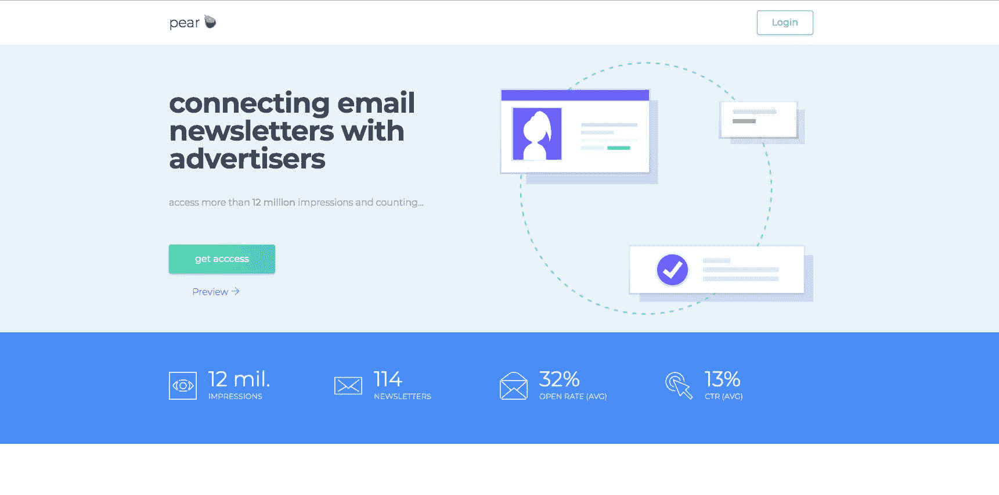
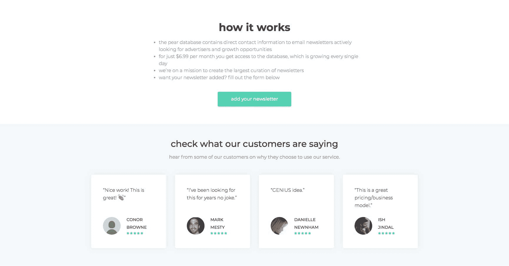

# 在没有代码的情况下，我的副业每月收入增长到数百

> 原文：<https://www.indiehackers.com/interview/growing-my-side-hustle-to-hundreds-in-monthly-revenue-without-code-75132cf76f>

## 你好！你的背景是什么，你在做什么？

我叫安德鲁·艾丁格。我来自南佛罗里达，从 2017 年 3 月开始一直住在湾区。在佛罗里达大学获得硕士学位期间，我为产品搜索远程工作了一年半，然后搬到了旧金山，为 Twitter 工作。上个月，我作为第一个全职员工加入了 Atoms。

在 Twitter 工作时，我创建了一个电子邮件通讯付费数据库 [Pear](https://thepear.co) 。人们使用梨有两个主要原因:

1.  随着脸书在广告收入中占据更高的份额，广告客户渴望找到替代的广告方式，电子邮件简讯具有可预测性和高度针对性。
2.  电子邮件简讯的数量正在增加，但增长它们是艰难的。其他电子邮件简讯也在注册 Pear，寻找交叉推广的机会。

在零付费收购的情况下，Pear 已经有 147 个客户每月支付 5-7 美元(总量为 3500 美元)。事实上，唯一的收购方式一直是在产品搜索上发起。

 

## 是什么促使你开始接触梨？

在我短暂的职业生涯中，大部分时间都专注于增长和产品营销。我在 Product Hunt 工作期间，参与了我们的第一次货币化工作——在《每日文摘》上创建、测试和销售广告位(有趣的是:Product Hunt 几乎是盈利的)。我们的第一次对话进行得非常顺利，但是手动为高度参与的电子邮件简讯寻找潜在的广告客户花费了太多的时间。

然后，在我搜索产品和使用 Twitter 的间隙，我开始做一些咨询，但是寻找时事通讯的问题仍然存在。在与其他一些熟悉这个问题的人交谈后，我决定建立一个无代码 MVP。

## 构建最初的产品需要什么？

我在 [Carrd](https://carrd.co/) 上创建了 Pear 的第一个版本，利用了 Airtable、Zapier、Stripe 和 Mailchimp。总的来说，这项测试花费了大约 20 美元。

从开始到结束花了不到 10 天的时间，但考虑到我在 Twitter 做全职工作，又花了 2-3 周的时间播种时事通讯。在发布时，我想要 50 份积极寻找广告商的时事通讯。也就是说，时事通讯知道它们被添加到 Pear 数据库中(以及为什么)。

最初，我在本·托塞尔的帮助下独自开发了 Pear，但 6 个月后，我与克萨巴·基西合作开发了一个完整的网络应用。我认识 Csaba 是因为帮助他发布了一些产品，很高兴能和他一起开发 Pear 2.0。

我们使用 Pear 2.0 的目标是实现账户创建过程的自动化，并将系统转换成真正的 SaaS。Pear 2.0 构建于 Laravel framework 版之上，后端有一个 MySQL 数据库。我们使用 Mailgun 来处理发出的电子邮件。当谈到处理订阅时，我们决定使用 Stripe，因为它易于实现，并且支持我们用来处理失败支付的 webhooks。

## 你们是怎么吸引用户，种出梨的？

很像 Pear 的[第一版，我们推出了](https://www.producthunt.com/posts/pear) [Pear 2.0](https://www.producthunt.com/posts/pear-2-0) 。独家产品搜索。尽管数量相对较少，但我们的订户参与度很高，他们在寻找广告和增长机会。

对我们来说，留住用户是最大的关键，而不是专注于扩大用户群。鉴于我们的整个商业模式是付费访问信息，我们继续向数据库添加新信息至关重要。我们推出了 50 份简讯，现在已经超过 240 份。

我们批量向 Pear 添加简讯，并发送后续电子邮件，让订户知道添加了多少简讯和印象。印象(数据库中简讯的订阅者数量)是我们最重要的指标。添加 10 份订阅人数为 100 人的简讯(1，000 次展示)远不如两份订阅人数为 10，000 人的简讯(20，000 次展示)有价值。

## 你的商业模式是什么，你是如何增加收入的？

商业模式简单而单一:订阅。我们不从添加到数据库的时事通讯、代理交易或推广时事通讯中赚钱……严格地说是从订户那里。如果他们对服务不满意，他们可以取消订阅，不会问任何问题。

然而，我们如何证明价值以获得第一批付费客户，却是一件困难的事情。我们曾考虑进行免费试用，但最终决定创建一种方式，让潜在订户在看不到相关信息(简讯名称和链接、联系人姓名、电子邮件)的情况下，查看数据库中简讯的质量(简讯描述、订户、打开率、点击率、行业、目标演示、位置)。

因为我们当时使用的是 Airtable，所以我们复制了数据库，用“🔒升级解锁🔒”，并在登录页面上嵌入了该版本的数据库。我们今天仍然在主页上使用那个预览。

 

自 2.0 推出以来，Pear 一直是每周 1 小时的“旁门左道”。一方面，我很惭愧地承认这一点，因为我知道更多的时间=更多的收入，但我也很自豪我们一起破解了一个服务于 300 多家企业的想法。

在过去的几个月里，Pear 一直处于次要地位，因为 Csaba 和我专注于其他项目，我开始了一份新工作。自然，缺乏关注导致了订户和收入的下降。如今，Pear 有 38 名活跃用户，每月付费 5-7 美元(大约 200 美元/月 MRR)。

这个启动过程的想法教会了我很多——很多我希望我已经做了的事情，我希望我没有做的事情，以及我本可以以不同方式做的事情。最重要的是，这次经历教会了我去争取。有一段时间，我不确定媒介应该是什么，商业模式，我是否应该建立一个完整的 web 应用程序或 MVP，我仍然不确定我是否有这些问题的答案，但从建立和启动中获得的学习体验和满足感是惊人的。

我给技术经验有限或没有技术经验的人的主要建议是，在你投资建立一个应用程序或网站之前，想办法测试你的假设。在不知道如何编码的情况下，有无数种方法可以创建一个功能网站或应用程序。

在每一个决定中，快速决策和完美决策之间都有一个平衡。有时候快速的方法，虽然可能不完美，却是最好的方法。

在每一个决定中，快速决策和完美决策之间都有一个平衡。有时候快速的方法，虽然可能不完美，却是最好的方法。

TweetShare

## 你未来的目标是什么？

梨的未来很有趣。在目前的状态下，每周一小时，增长是有问题的，但数据库可以显著增长，从而使保留保持令人满意。然而，Pear 可以每周多花几个小时专注于发展漏斗顶端——获得新用户。

我真的相信，现在的 Pear，只要每天花上几个小时，就可以成为每月 2000-3000 美元的生意。如果我再进一步，Pear 有很多机会成为一个市场。

然而不幸的是，这些天我几乎所有的注意力都在原子上。为了正确对待当前的订户，我仍然时不时地用新的时事通讯更新数据库，但是我对 Pear 超越其当前订户的野心不幸地被搁置了。

## 你面临的最大挑战和克服的障碍是什么？如果你必须重新开始，你会做什么不同的事？

到目前为止，找时间是我面临的最大挑战。我刚搬到一个新的城市开始新的工作，就启动了这个项目。不幸的是，一天中没有足够的时间来完成所有你想做的事情。最近，我一直在努力更好地利用我的时间——更好地计划和优先处理任务。不过，我想如果我在开始之前用梨做了这些，我可能不会真的完成它。

## 有没有发现什么特别有帮助或者有优势的？

我一直很钦佩那些自举项目和公司的人，尤其是那些在公共场合建造的项目和公司，比如皮特里维斯和 T2 aj T3。在这个世界上，每个人都沉迷于(为数不多的)数十亿美元的企业，重要的是要记住，人们在没有筹集数千万美元或出售你的数据的情况下，就可以建立令人惊叹的公司。

但也许最有帮助的是本·托塞尔和乔巴·基西。Ben 是因为他在创建无代码 MVP 方面的专业知识，Csaba 是因为他是一名摇滚明星工程师。我绝对不认为你需要找一个联合创始人来启动一个副业项目，但是有一个你信任的人来提供想法是非常有价值的。如果你有一个想法，我总是乐于提供未经过滤的反馈。

## 对于刚刚起步的独立黑客，你有什么建议？

有条不紊，但不要想多了。如果你发现自己在一个特定的方面深思熟虑了很长一段时间，继续前进，带着一副全新的眼光回来。

有条不紊，但不要想多了。如果你发现自己在一个特定的方面深思熟虑了很长一段时间，继续前进，带着一副全新的眼光回来。

TweetShare

一年多来，我在产品搜索上看到了几乎所有提交的产品。制造商的范围和多样性是惊人的。没有关于谁制造了人们喜欢的好产品的简介。好主意和后续行动胜过一切。去做吧。说真的。去吧。如果不是现在，那是什么时候？

## 我们可以去哪里了解更多？

我的推特 [@andrewett](https://twitter.com/andrewett) 是和我保持联系的最好方式，但是我很乐意在下面的评论中回答任何关于梨或其他东西的问题。

——[<picture id="ember8117121" class="user-avatar ember-view user-link__avatar"></picture>艾丁格](/andrewett?id=wI0fQ4GbXBeWpaS0gTGRWA76XKC2)，梨的创始人

## 想像梨一样建立自己的事业？

你应该加入[独立黑客社区](/)！🤗

我们是几千名创始人，互相帮助建立有利可图的业务和副业。来分享你正在做的事情，并从你的同事那里获得反馈。

还没准备好开始使用你的产品吗？没问题。这个社区是一个认识人、学习和实践的好地方。随意[随便浏览](/)！

——[<picture id="ember8117126" class="user-avatar ember-view user-link__avatar"></picture>考特兰艾伦](/csallen?id=ibTLPyjwVebnZjMGKvz6ztarnuV2)，独立黑客创始人

46votes