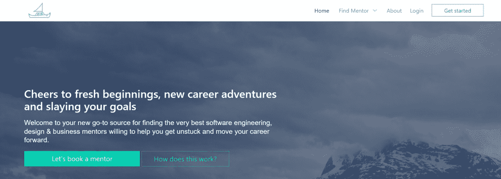
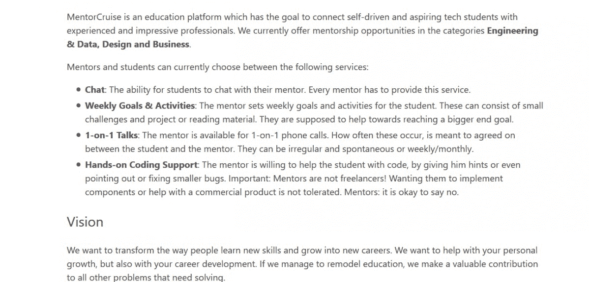

# 尽管通勤时间长达三小时，我的副业项目仍实现了盈利

> 原文：<https://www.indiehackers.com/interview/growing-my-side-project-to-profitability-despite-a-three-hour-commute-c157eb9f87>

## 你好！你的背景是什么，你在做什么？

嘿！我叫多米尼克·莫恩，是 [MentorCruise](https://mentorcruise.com/) 的创始人。在我的“现实生活”中，我是一名深度学习工程师(AI ),在远离瑞士的硅谷初创公司工作。

MentorCruise 是一个连接技术领域导师和学员的市场。导师制度被证明可以帮助人们在职业生涯中取得成功，所以我们正在帮助你寻找一位导师。我们目前提供来自苹果、谷歌、微软和脸书等公司的 60 位导师的服务，在软件工程、数据科学、设计、商业等方面为您提供帮助。

 

如今，我们的月收入约为 1500 美元。我们于 2018 年 3 月推出，并在过去几个月中实现了大约 20%的稳定增长。因为我们是一个市场，我们不能保留大部分。

我们的提取率是 15%，我们希望将来能降低。剩下的送给我们所有乐于助人的导师。我们的市场上有超过 600 名注册用户，其中 50 人正在接受指导。

## 是什么促使你开始使用 MentorCruise？

我在 Udacity 上了一门在线课程后，有了创办 MentorCruise 的想法。我没上过大学，所以在线教育一直是我掌握最新情况的好方法。那段时间我得到了一个 Udacity 导师的支持，这是一次很神奇的经历，也是我人生中第一次有一个正式的导师。

当我毕业时，我留在船上作为别人的导师，但我再也没有机会接触自己的导师了。我遇到了其他人，他们经历了同样的对导师的需求，我想，“需要有一个简单的方法来解决这个问题。”

通过与和我处境相同的人交谈，我得到了认可。尤其是自学成才的人经常试图向更有经验的人寻求指导，但他们被忽视了。“师徒关系不是正式的，它是自然发展的，”这是他们经常听到的一句话。然而，如果你急切地想找到一个人在你的道路上帮助你，或者你对你的职业生涯中该做什么有点困惑，这个评论是令人沮丧的。所以我决定尽可能以最正式的方式建立导师关系:市场。

## 构建最初的产品需要什么？

这过去是，现在仍然是一个附带的项目，所以我能够在这上面工作的时间主要限于晚上和周末。不言而喻，在一天的工作和(当时)3(！)数小时的通勤是一种痛苦。我花了大约 5 个月的时间才获得一个——不可否认——被过分强调的 MVP。这无疑涉及到许多漫长的夜晚，没有空闲时间。

我很早就决定以市场的形式来做这件事，我会收取“手续费”来维持生计。剩下的就是决定我将为导师们实现什么工具来有效地指导。今天，我会为此采访用户，但当时我没有考虑到这一点。我最终决定了一些核心工具，其中一些对导师来说比其他的更有用。

我还想让新导师申请导师职位，这样我就可以剔除没有经验的导师或不良档案。然后，学员必须向导师申请。我必须建立一个聊天，支付和支出流程，以及一个管理仪表板。今天，我将采取一种更精简的方法。

这个平台是用 Django 构建的，我用布尔玛让它在前端达到一个可接受的状态。我从来不是一个大前端的家伙，并且有很多 Django 的经验，这是我选择那个技术的唯一原因。我知道有更好、更快、更新的技术，但是我对 Python 和 Django 很熟悉，可以在没有技术的情况下继续编码。由于我们与印度的许多导师合作，Stripe 不是处理付款的选项，所以我们使用 PayPal，这在过去几个月里让我相当头疼。

## 你是如何吸引用户和发展 MentorCruise 的？

推出一个市场比推出你的 SaaS 需要更多的前期工作。有一个著名的“鸡和蛋”的问题。你需要平衡供应商(导师)和客户(学生)双方。根据你正在建立的市场类型，你需要先饱和一面。

例如，优步必须先吸引司机，然后才能吸引乘客。但是如果没有人开车，吸引司机就很困难。同样的事情也适用于易贝、Airbnb 等。

 

对于 MentorCruise 来说，情况很清楚:在我们推出之前，我们需要大量的导师。我最终建立了一个小型登录页面，并亲自在 Twitter 上联系导师。我还联系了很多潜在的导师，他们在社交媒体上有很多追随者。我的想法是，如果他们成为导师，他们会在社交媒体上分享他们的导师档案，他们的大量追随者会进来，获得导师，或浏览其他导师。

当我的导师邮件列表上有大约 120 人时，我决定试运行一下，和我的导师们一起播种市场。嗯，在 120 个人中，只有大约 20 个人最终报名了。老实说，这有点乏味，但至少我有一些朋友。

我决定在 HN、ProductHunt、BetaList 上发布——只要是你能想到的。经过 6 个月的工作、导师收购和公开发布，结果是少数人投了赞成票，只有一名学员获得了报酬。我泄气了。

我开始在我们的博客上公开采访导师，这在社交媒体分享方面要成功得多。然后我去了像/r/mentor 这样的子网站，无耻地推销我的服务。

我还在 Twitter 上花了很多时间接触导师，这帮助我结识了很多非常棒的导师，也帮助我认识了很多非常棒的人。随着越来越多的导师加入，许多学员也加入进来。获得学员符合大多数导师的利益，因此他们成为了通过分享个人资料带来新用户的重要组成部分。

我意识到我需要测试尽可能多的获取渠道，并对那些有效的渠道加倍下注。例如，接触媒体不起作用，但在适当的子网站上发帖起作用。这需要一些时间来弄清楚。

## 你的商业模式是什么，你是如何增加收入的？

决定商业模式对我们来说很困难。通常，市场有一个收取率(流向平台的交易的百分比)，但付费导师不是一个东西。我们决定把它做成一件事，但保留免费导师作为一种选择，在这种情况下，我们也将一无所获。

这个计划很棒。如今，付费模式主要是一种能够淘汰坏演员的方式，并为认真对待改变和成长的学员提供更多机会。这是让学员负起责任。我们可以保留 15%的交易。

由于我们不得不在某个时候支付这笔钱，我们不得不去寻找一个支持这一点的支付处理器。我最初想用 Stripe，后来意识到它还没有在国际上推出。我与 PayPal 一起建立了一个过于复杂的系统，包括账单协议(能够每周向客户收费)，检查他们的状态(如果有人用完了信用额度/取消了他们的 PayPal)，然后使用 Payouts API 创建支出。

测试时一切顺利，但当我上线时，我突然不能再支付了。经过一番努力，我发现我必须在 MRR 完成$50k 后才能访问 Payouts API，所以我现在必须手工完成。在接下来的几个月里，我在 PayPal 上遇到了一些愚蠢的问题，这些问题占用了我很多时间。

上个月，我们处理了大约 1，500 美元的收入，并保留了其中的 200 美元(15%)作为佣金/利润。由于早期客户失去兴趣、不活跃的导师以及导师离开平台，我们早期的收入有所下降，但后来我们解决了这些问题，每个月都在稳步增长。

我的建议是不要太早关注你的 MRR，而是关注你的产品和你的用户。

TweetShare

我的建议是不要太早关注你的 MRR，而是关注你的产品和你的用户。当我在 MRR 第一次喝酒时，我很恼火，也非常失望。我太专注于获取用户和带来新的、新鲜的资金，以至于我没有考虑与我的用户群交谈并解决他们的问题。可以说，比获得新用户更重要的是留住你已经拥有的用户！

## 你未来的目标是什么？

在接下来的几个月里，我们希望:

*   扩大我们的导师选择范围，尤其是在商业领域
*   处理我们在过去几个月收到的一些反馈，这些反馈应该有助于学员对自己的选择感到更加放心
*   我们刚刚实现了一个用户反馈循环，所以我们很高兴看到会有什么结果
*   联系更多的学员和他们的完美导师

收入方面，我们没有明确的目标。这是一个附带的项目，我不希望它在不久的将来占据我的生活。我相信，如果我们都继续尽我们最大的努力，解决我们学生的问题，成长就会自然而然地到来。也就是说，如果我们能保持每月 20%的增长，我就非常满意了。

## 你面临的最大挑战和克服的障碍是什么？如果你必须重新开始，你会做什么不同的事？

我想我做了三个错误的关键决定，现在我不得不接受:

1.  用贝宝。他们的客户支持不关心小玩家。我们经常不得不与我们的帐户被封锁、响应时间长、陷入支持循环(被传递给不同的支持代理)和其他随机性作斗争，例如，德国没有计费协议。迁移所有用户将是一个巨大的痛苦。
2.  构建一个包含许多不必要特性的 MVP。如今，我非常精益和快速地构建我的产品。在发货之前，我很少在一个产品上花超过一周的时间。有了 MentorCruise，我现在有了一个相当沉重的代码库，里面有很多不必要的功能，还有一些其他的功能缺失了。告诉你的用户，人们。
3.  Reddit 上的烧桥。PSA:在 Reddit 上做广告在大多数子网站上是可以的，如果你把它和一条好的建议结合起来，或者分享一篇博客文章，而不是宣传你的产品。我早就不在乎这个了。这就是为什么我的产品和用户名现在在一些非常有价值和活跃的子网站上被禁止了。

## 有没有发现什么特别有帮助或者有优势的？

最有帮助的事情是从第一批导师那里得到了最初的启发。我花了三个多月获取用户。如果我没有这么做，我可能还会坐在少数几位导师身边。

我也很高兴我接受了很多反馈，但也决定忽略一些。尤其是在定价的时候，你需要把好的建议(“我认为这对于它所提供的价值来说有点太贵了”)和糟糕的建议(“收费是个笑话，我自己可以很容易地构建这个”)。

我最近还贴出了我在 ProductHunt 上找到的一本免费电子书。对我来说有点太晚了，但它完美地描述了市场面临的许多挑战，可能会帮助你获得用户的最初种子，并决定定价技术:https://versionone.vc/marketplaces-guide-ed2/

## 对于刚刚起步的独立黑客，你有什么建议？

尤其是技术人:管好你的登陆页和文案。设计一个好的、可转换的登录页面是一门艺术，你可能想从其他 IndieHackers 那里得到帮助。我的第一个登录页面真的很粗糙，即使我目前的第五次迭代并不完美，我肯定会看到更多的人注册。一般来说，关注产品的好处，而不是功能。

管好你的登陆页和文案。设计一个好的、可转换的登录页面是一门艺术，你可能想从其他 IndieHackers 那里得到帮助。

TweetShare

人们也应该学会对他们的产品不那么积极。迭代是好的，但我看到 IndieHackers 周围的人在一两个月后改变、关闭或重新设计他们的产品。当很难找到客户时，问题几乎总是出在你的获取渠道和/或你的登陆页面上。如果你没能留住客户，说明你的产品或定价有问题，你可以通过接触他们来找出问题所在。

不要因为有人告诉你他们在几天内就赚到了 MRR 的 1 万美元而沮丧。那不是常态。我们中的大多数人工作数年来获得最低生活工资。

## 我们可以去哪里了解更多？

找到我或与我联系的最好方式是我的推特。我喜欢聊天！我总是在 IndieHackers 附近，所以如果你有任何问题，请在下面的评论区发表！

——[<picture id="ember8003817" class="user-avatar ember-view user-link__avatar"></picture>dq monn](/dqmonn?id=42pI8HGLcKcyvc7IYfuhHH6VLcP2)，门多萨创始人

## 想像 MentorCruise 一样建立自己的事业？

你应该加入[独立黑客社区](/)！🤗

我们是几千名创始人，互相帮助建立有利可图的业务和副业。来分享你正在做的事情，并从你的同事那里获得反馈。

还没准备好开始使用你的产品吗？没问题。这个社区是一个认识人、学习和实践的好地方。随意[随便浏览](/)！

——[<picture id="ember8003822" class="user-avatar ember-view user-link__avatar"></picture>考特兰艾伦](/csallen?id=ibTLPyjwVebnZjMGKvz6ztarnuV2)，独立黑客创始人

42votes