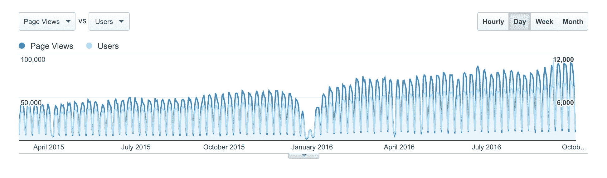
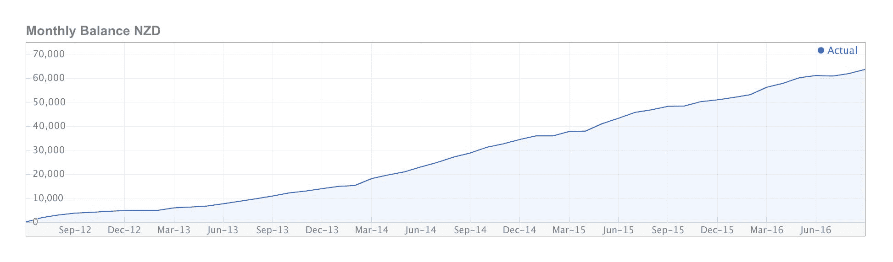

# 将我们的小型内部副业项目发展成为一个强大的企业

> 原文：<https://www.indiehackers.com/interview/growing-our-small-in-house-side-project-into-a-powerhouse-business-270d3d6632>

## 告诉我们关于你自己和你正在做的事情。

大家好，我是戴尔·温克，我的联合创始人是内森·卡特。我们建立了[商数](https://www.quotientapp.com/)，这是一种让任何企业都能创造出好看的报价和提案的方式。它最适合提供某种专业服务的小团队。

## 你是怎么入门商数的？

2003 年，我和内森一起为一个共同的客户做一个网络项目。我们从那里继续为别人的企业建立数百个网站。

在我们的设计和开发实践中，我们有几个对我们很有效的核心信念，比如永远不要参与免费的设计宣传，以及预先为项目指定固定的价格。我们相信在完成任何实际工作之前估算时间是一个绝好的机会。把所有的事情都摆到桌面上来定义双方的期望。客户知道他们得到的是什么，这让做生意变得容易。

当时，这种方式效果很好，但我们只是需要一种方式让客户接受我们的定价，这种方式要比在电话中口头“说吧”要好。因此，我们创建了自己的内部工具，客户可以查看和接受他们的报价。我们的客户喜欢他们所看到的。他们经常告诉我们，我们的报价看起来有多么创新和专业，这有助于我们从竞争对手中脱颖而出。经常有人问我们是否可以为他们建立一个类似的系统，用于他们自己的业务。

直到 2010 年末，我们才决定做点什么。我们知道，作为一个独立的产品，这里可能会有一些需求，所以我们通过权衡实际付费客户的时间损失与我们需要“赢得”的客户数量来处理这些数字。不用说，他们只是没有叠加起来。

但我们还是咬紧牙关。这是一个为我们自己创造伟大事物的机会。当别人不付钱的时候，你不需要证明什么。你可以成为艺术家，设计出你想要的东西。所以我们从零开始开发我们的报价系统。一年后，在 2011 年 12 月，我们推出了商数。

## 你用什么技术来构建商数？

我们用 PHP，MySQL，Redis。我们还大量使用 AWS 我们的用户数据在两个大洲的 5 个数据中心复制。AWS 通过其现有的按钮工具(S3、RDS 等)使这变得容易。

## 你是怎么找到时间和资金来做这些的？

我们真的很幸运，已经有了稳定的收入。最初，商数只是众多付费客户工作中的一个项目。这只是牺牲一点客户时间的问题。

随着时间的推移和数字的增长，我们可以证明花越来越多的时间在商数上是合理的。两年后，商的被动收入已经超过了我们的客户工作。

在财务上，我们在过渡期也做得不错。我们有一些最大的客户项目，同时我们在商数上花费了更多的时间。我们通过收取额外费用减轻了一些压力。正如我们所说，报价是你赚钱的地方:)

## 你是如何吸引顾客和发展业务的？

从我们推出的那天起，就有一些客户排着队要求我们提供商数。我们马上用一个手持演示给他们报名。那时入职还没有自动化。我们甚至没有销售网站，所以我们手动创建他们的帐户。

与 Xero 会计软件的集成在早期给我们带来了很大的吸引力，因为它们在某些地区有所增长。对于许多人来说，从接受的报价直接生成发票是一个很好的无缝解决方案。我们还使用了其他集成渠道。自 2016 年初以来，Quickbooks 一直很棒，我们看到了稳定的推荐流。

AdWords 对今天的我们来说并不相关，但我们在拥有真正的有机谷歌流量之前就使用过它。因此，我们会看到世界另一端的人们找到我们的网站并注册。我们仍然记得第一个人创建帐户时观看直播(实时谷歌分析)。今天，既然我们已经达到了一定的势头，有机谷歌流量使所有其他渠道相形见绌。

我们还听到许多新用户说，他们是从收到的报价中找到我们的。如果他们作为最终客户有良好的体验，他们可能会在谷歌上搜索一下，然后找到我们。我们看到大约 6%的付费客户通过这种方式找到我们。这实际上是我们的一个希望，激发我们建立商数，所以很高兴看到它的发生。昔日的口碑引荐依然是黄金。做好事，人们往往会告诉别人。

## 你的营收背后有什么故事？

我们按月收取订阅费，并提供一个月的免费试用。我们保持简单(和透明)的两种定价方案。

我们的收入一直很稳定。即使考虑到新西兰元的波动，它每个月都在增加。感觉我们要赢了！

顺便提一下:在早期，我们推迟了构建一个计费系统来实际向我们的客户收费。我们曾经开玩笑说，这不是我们的客户迫切需要的功能。我们花了 8 个月的时间才最终开始对信用卡收费。不确定我们是否会推荐这种方法:)

我们最大的变化发生在去年，当时商数的收入增长超过了我们的网页设计业务。我们最终卖掉了我们的其他业务，现在我们完全专注于商数。换句话说，我们不再卖时间了。我们 100%致力于产品。

## 到目前为止，你最大的挑战是什么？

这个行业每天面临的挑战是知道什么时候关注什么。尤其是当你是一家两人公司时，这一点至关重要。随着产品的每一次主要发布，我们都可以看到对赢得新客户的一般“活动”的直接影响。

随着客户数量的增长，我们的风险也在增加。随着时间的推移，我们增加了托管基础设施的冗余，但我们知道在某个时候，我们两个必须做同样的事情，壮大团队。

## 在建立你的企业时，哪些资源是有帮助的？

我们用 Trello 来列清单，区分优先次序，检查事情。关于应用支持和知识库:Zendesk。其他的:谷歌应用和 Dropbox。

我们将 AWS 用于服务器，并使用他们的许多核心服务，如 S3、RDS 和 Elasticache。现在使用这些具有成本效益，并允许我们将精力集中在其他地方。

我们尽可能将一切自动化，例如按钮式部署。这些过程和检查可以节省大量时间和不必要的错误。

## 你对有抱负的独立黑客有什么建议？

我们经历了两种截然不同的“自己当老板”的版本。经营一家网站设计公司完全是在卖时间。说到底，你还是有老板，是你的客户——他们拥有你，因为他们付钱。

但是制造和销售一个产品是非常不同的。一开始，你是在为自己创造东西。然后你会得到愿意为此付费的顾客。但最终它不会改变:你早上起床，创造你想要创造的东西。如果你在赚钱，你总是可以选择卖出或者退出。

## 我们从哪里可以了解更多关于你和商数的信息？

你可以查看[商科博客](https://www.quotientapp.com/blog)，我们的推特账户([@商科应用](https://twitter.com/quotientapp))，或者更好的是，访问[网站](https://www.quotientapp.com/)。也可以在下面留个问题。

—[<picture id="ember5273343" class="user-avatar ember-view user-link__avatar"></picture>dalevink](/dalevink?id=AZLMiT6X5DR7HSd9JYl0zOxFZnL2)，商的创造者

## 想像商数一样建立自己的事业？

你应该加入[独立黑客社区](/)！🤗

我们是几千名创始人，互相帮助建立有利可图的业务和副业。来分享你正在做的事情，并从你的同事那里获得反馈。

还没准备好开始使用你的产品吗？没问题。这个社区是一个认识人、学习和实践的好地方。随便去[随便浏览](/)！

——[<picture id="ember5273348" class="user-avatar ember-view user-link__avatar"></picture>考特兰艾伦](/csallen?id=ibTLPyjwVebnZjMGKvz6ztarnuV2)，独立黑客创始人

6votes