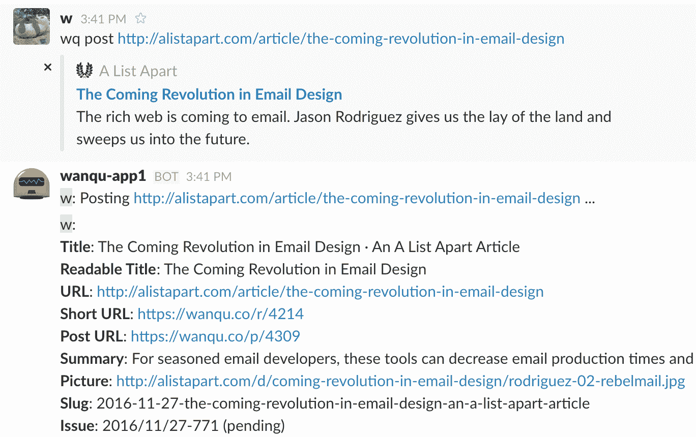
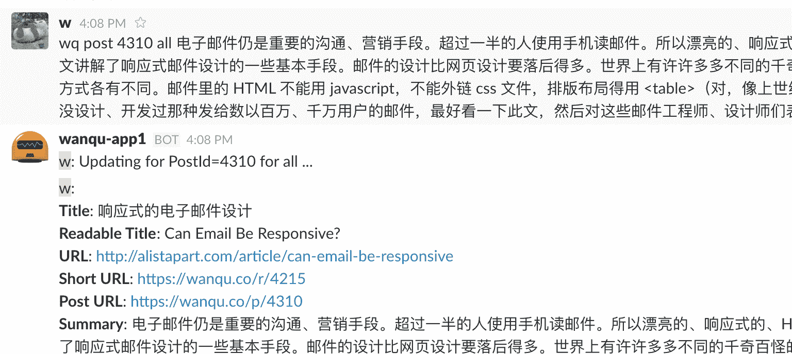
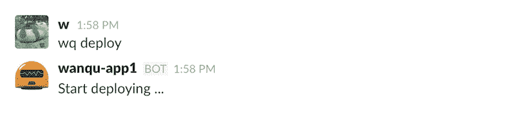
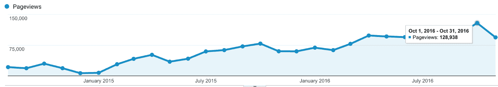

# 通过自动化、社交媒体和体验成长

> 原文：<https://www.indiehackers.com/interview/growing-through-automation-social-media-and-experience-991cd6afcd>

## 你好！告诉我们你的背景和你在做什么。

我叫 w。我从中国来到美国攻读计算机科学博士学位。然而，我放弃了博士课程，最终在旧金山的一家初创公司担任软件工程师。

[Wanqu](https://wanqu.co/?s=indiehacker) is my side project that I started in August 2014\. The actual name for this side project is 湾区日报, which means "Bay Area Daily". It's [pinyin](https://medium.com/r/?url=https%3A%2F%2Fen.wikipedia.org%2Fwiki%2FPinyin) of 湾区 (Bay Area).

Wanqu 实际上是一个博客，我每天为中国读者整理 5 篇关于科技和创业的英文文章。对于每篇文章，我都想出一个中文标题和几句中文评论。这是一个非常简单的公式。文章(以及我的评论)通过 8 个渠道分发，例如社交账户、iOS 推送通知、电子邮件简讯等。就是这样！

## 你的观众是什么样的？有多少人阅读你策划的文章？

我的听众是双语者，既说中文也说英文。其中 50%生活在中国，25%生活在美国，10%生活在台湾，15%生活在日本、香港、新加坡和世界其他地区。他们在科技行业工作。大部分是创客(工程师/设计师)；他们中的许多人是创业公司的创始人；他们中的一些人是投资者；其中一些是学生。在所有内容分发渠道中，大约有 81，000 人关注 [Wanqu](https://wanqu.co/?s=indiehacker) 。

在写这篇文章的时候，我已经做了 844 天了。在这 844 天里，我已经策划了 3855 篇文章，写了 80 多万字的中文评论。

这个副业的目标不是赚钱，也不是成为我的全职。然而，我仍然需要一些经济奖励来保持每天的动力，因为我只是另一个爱钱的普通人:)

[Wanqu](https://wanqu.co/?s=indiehacker) 通过 iOS 应用程序内购买、Google AdSense、赞助、不同的联盟项目和销售 t 恤，每个月给我带来大约 500 美元。

## 你是如何开始玩趣的？

我每天都会阅读大量网络文章，尤其是科技和创业相关的文章。我和我的同事经常会交换好的物品。当然，这些文章都是英文的。我希望我十年前在中国的时候能多读点书，这样我现在就更聪明，见识更广了:)

年轻时的我当然会喜欢阅读由某个有品位的创造者策划的文章。所以我想，好吧，也许中国有很多像我年轻时一样的年轻人，他们渴望学习科技/创业相关的东西，但可能需要一点帮助。

2014 年 8 月 6 日开始[玩趣](https://wanqu.co/?s=indiehacker)。我用 [nFiles](http://nfil.es) (我另一个没人用的副业项目)策划了 5 篇文章——我只需要一个简单的网页。然后我把[的网址](http://nfil.es/w/Dd1nHx/%E6%B9%BE%E5%8C%BA%E6%97%A5%E6%8A%A5-20140806-%E5%88%9B%E5%88%8Auberjustin.tv/)发布在[一个流行的在线论坛](https://www.v2ex.com/t/126421)上，在那里我得到了一些积极的反馈。第二天[我又做了一次](https://www.v2ex.com/t/126493)，并在同一个论坛上发帖。又一次[第三天](https://www.v2ex.com/t/126692)。

那时我还没有域名或网站。如果你能看懂中文或者用谷歌翻译阅读论坛上的评论，你会发现有些人要求我添加 RSS 或者创建社交账户，这样他们就可以订阅或者关注了。然后在接下来的日子里，我弄了一个域名[wanqu.co](https://wanqu.co/?s=indiehacker)，用[鹈鹕](https://github.com/getpelican/pelican)建立了一个静态页面集合，建立了微博/推特/脸书/微信账号，不停的在同一个论坛发帖。渐渐地，整理文章成了我的日常习惯。从第一批开始，我就扩大了我的观众，并不断得到积极的反馈。

2014 年 8 月底，万趣的网站换成了 [WordPress。并且在 2015 年 3 月，我用 Python / Django / Postgres 从零开始搭建了整个网站，这是我超级熟悉的技术栈。正如你所看到的，在我运行了 8 个月的 Wanqu 之前，我一行代码都没写过！](https://web.archive.org/web/20141218143936/http://wanqu.co)

此时，我知道我想让万曲尽可能长时间地浮在水面上。我试图用代码自动化整个发布和内容分发过程，这样我就可以更专注于那些不能自动化的事情:用中文阅读文章和写评论。

2015 年 6 月，我为万趣(在 Swift)搭建并推出了 [iOS app。](https://itunes.apple.com/us/app/wan-qu-ri-bao/id995762924?mt=8&tduid=1010l6Sv&ign-mpt=uo%3D4)

## 你是怎么找到时间和资金来建造一切的？你的自动化流程是什么样的，你使用什么技术？

就像我上面说的，在万趣的前 8 个月，我一行代码都没写。在最初的 8 个月里，我简单地通过养成一个习惯来策划 5 篇文章，从而“建立”了万趣。

每天晚上晚饭后，我坐下来，开始阅读口袋里的文章，这是白天增加的时间。然后我用 WordPress admin 为每篇文章创建了一个新帖子，并用中文写了评论。一旦我准备好了 5 篇文章，我就会手动登录每个社交账户，输入信息。整个过程花了我 2 到 3 个小时。这很费时间，但我很高兴我熬过了这 8 个月。

有时我会因为我的日常工作而忙得不知所措，所以我可能会有 1-2 天不去策划任何文章。读者会给我发电子邮件询问发生了什么，我认为这是一个信号，表明我正在为人们提供一些价值:)

然后我在 2015 年 3 月的一个周末，从零开始搭建了整个网站。这实际上是一个超级简单(和丑陋)的 CMS。在接下来的几个周末，我添加了越来越多的代码来优化我的发布工作流程。我使用 [Slack/Hubot](https://github.com/slackapi/hubot-slack) 构建了一个机器人来帮助我的日常操作。每天晚饭后，我也开始阅读口袋里的文章。然后我和 Slack 说话，像这样:

机器人提取了大部分元数据(例如 url slug，文章链接)并在我的 Django 后端创建了一个新帖子。然后我用机器人作为 CMS，在那里我输入中文评论:

一旦我告诉机器人文章准备好了，它也会在微博、推特和脸书上发布消息。一旦我完成了这 5 篇文章，我会告诉机器人，它会向 iOS 应用程序和 Chrome 浏览器的用户发送推送通知。我使用 [MailChimp 的 RSS 驱动的活动](http://eepurl.com/cb60-X)来安排向所有电子邮件订阅者发送电子邮件。

如您所见，这个支持 Slack 的 CMS 节省了我很多时间。我是一名工程师，我熟悉命令行操作。整个发布和内容分发过程现在只需要我 1 到 2 个小时，比以前快了。

我还使用 Slack bot 部署网站/API 服务器和所有后端代码。我所需要做的就是输入“wq deploy”并等待 1-2 分钟。它是如此方便和令人愉快，以至于我每天晚上向读者推送内容后都会发布几次小的改进，或者在周末一天发布 20-30 次。

2015 年 6 月初的一个周末，我学习了 Swift，然后开发并发布了万趣的 iOS 应用。我很无耻的把一个超级丑的版本发到 App Store。然后我几乎每周都发布新版本，直到最近达到稳定状态。该应用程序的主要目的是支持推送通知，因此 iOS 用户可以在我的文章发布后立即获得它们。

在时间投入方面，我要说的是，在早期，我每天花 2-3 个小时整理文章，现在每天花 1-2 个小时，这要感谢我建立的自动化系统。我会利用零碎的空闲时间编写代码和发布特性，即使我只有 10 分钟或 15 分钟的空闲时间。当我心情好的时候，我会在周末花更多的时间来写很多代码，比如整个周六下午。

建设和运营万曲不需要很多钱。我花了 499 美元从 [99designs](http://ninetyninedesigns.7eer.net/c/342239/185967/3172) 雇了一个人来设计[我的 logo](https://wanqu.co/brand-assets?s=indiehacker) ，每个月还要花 694.11 美元来运作整个事情。694.11 美元里有什么？

*   94.11 美元/月是[数字海洋](https://www.digitalocean.com/?refcode=001e7dc7ce80&utm_campaign=Referral_Invite&utm_medium=Referral_Program&utm_source=CopyPaste) +苹果 iOS 开发者会员+域名+ SSL 证书的服务器费用。
*   600 美元/月是我的时间。我平均每天花 2 个小时在玩趣上，我愿意拿[加州最低工资](http://www.dir.ca.gov/dlse/faq_minimumwage.htm)，10 美元。哈哈~

## 你们是如何吸引用户，壮大万趣的？

如我所说，我于 2014 年 8 月 6 日在一个网络论坛上“推出”[万趣](https://wanqu.co/?s=indiehacker)。我在那里张贴了 20 天左右的策划文章，直到我意识到我必须在我更能控制的渠道中建立自己的受众，例如社交账户或邮件列表，而不是在线论坛。

在我建立了所有的内容分发渠道后，受众的增长缓慢但稳定，主要是通过口碑传播。以下是我目前所有主要频道和粉丝数量的快照:

*   [微博](http://weibo.com/login.php):32823
*   [RSS](http://wanqu.co/feed/):~ 20000(估计)
*   [iOS 应用推送通知](https://itunes.apple.com/us/app/wan-qu-ri-bao/id995762924?mt=8&tduid=1010l6Sv&ign-mpt=uo%3D4):6538 条
*   [Chrome 推送通知](https://wanqu.co/b/47/2016-07-03-chrome-push-notification.html?s=footer):4697 个
*   [微信](https://wanqu.co/wechat?s=left):6448
*   推特:5111 人
*   电子邮件简讯:1931
*   脸书:815

我不打算把玩趣变成我的全职。我只想让它尽可能长久地持续运行。因此，我没有积极地扩大观众规模。但是我还是做了一些有趣的事情:

*   预定的社交内容。我建立了一个类似于 [Buffer](https://buffer.com) 的社交分享系统，该系统以一定的概率调度每小时向微博、推特和脸书发送旧的策划文章。我的社交账户平均每天更新 20-30 次。由于社交平台的推荐算法，保持社交账户活跃对于增加受众非常重要。
*   我很清楚自己在做什么，为什么要这么做。我将所有运营指标[公之于众](https://wanqu.co/)(例如，所有内容分发渠道的关注者数量、iOS 应用下载数量、应用内购买数量、[费用](https://wanqu.co/cost)...).我也写了一些[博文](https://wanqu.co/blog)来解释[我是如何从一个工程师的角度来构建 Wanqu](https://wanqu.co/b/7/2015-05-24-behind-the-scenes.html?s=indiehacker) 的。似乎人们喜欢学习这类东西。这种透明度的副作用是与我的读者建立信任。
*   放大页面。是的，万曲有 AMP 页。这对 SEO 有一点帮助。
*   用 [iOS 应用更新消息](https://wanqu.co/california_street?s=indiehacker)讲故事。每发布一个新的应用程序，我都会写一些在硅谷工作的趣闻:)
*   与我的读者的每一次互动都是一次营销机会。我尽最大努力回复读者的来信，但是你知道，随着你的读者越来越多，没有人能回复每一封邮件。
*   策划好文章，写好评论，把好东西分享给我的观众。如果你做好事，真的让世界变得更好，那么人们会为你传播这个世界。口碑是有史以来最好的营销渠道。

该网站每月的浏览量在 11 万到 13 万之间，增长缓慢:

Wanqu iOS 应用程序有 23780 次下载，其中 1628 人支付了 3.99 美元的应用内购买，为我买了半杯咖啡:)

## 你的营收背后有什么故事？

我一直在为万趣探索不同的货币化方法，但目标只是赚足够的钱让我保持动力(而不是“辞职”或“让我变得富有”——类型的钱)。

从一开始，我就把 Google Adsense 放在网站上。然而，这些广告给我的读者提供了一个很差的体验，而且针对性也很差。两年来，我已经赚了 1400 美元。

我把 Google AdMob 放在 Wanqu iOS 应用程序中，它在大多数屏幕底部为自由层用户显示横幅广告。但用户可以支付 3.99 美元删除广告，并为我买半杯咖啡:)谷歌 AdMob 给我带来的钱微不足道，总共不到 150 美元。然而，有 1628 个应用内购买，这远远超出了我的预期。

我还加入了亚马逊、T2、蓝主机、T4、99 设计、数字海洋和 T7 的联盟计划。这些代销商总共给我带来了 1500 美元左右。

我也卖 Teespring 的 T 恤衫，但是不太理想，因为运费对我在中国的大多数观众来说太高了。我卖 t 恤总共赚了大概 100 美元左右。

2016 年 11 月刚从[赞助](https://wanqu.co/ads?s=indiehacker)开始。想法类似于 [Daring Fireball 的赞助计划](https://daringfireball.net/feeds/sponsors/):在特定的时间段内，只有一个赞助商，广告会投放到所有的内容分发渠道。这个月，我从中国得到了两个真正的赞助商，总共赚了 400 美元。没有赞助商的时候，我会为我的联盟项目做广告或者卖 t 恤:)

最后，人们可以通过 PayPal、Stripe 或支付宝向万趣捐款。到目前为止，我已经得到了大约 300 美元的捐款。

总的来说，加上最近的赞助，我每个月至少能赚 500 美元。我对这个结果很满意，考虑到我是一个人兼职经营万趣的。正如我所说的，运行 Wanqu 的费用是每月 694.11 美元，所以我仍然要努力做到收支平衡:)

如果你读到这里，并且你想接触到世界各地的中国科技精英，你应该考虑赞助万趣。详情请发邮件给我: [【邮件保护】](/cdn-cgi/l/email-protection#660e0f261107081713480509)

## 你未来的目标是什么？

我的目标很简单:尽可能长时间地跑完万曲。这是促使我的读者和我自己多读书的好方法，所以我们一天天地变得更聪明、更见多识广。我收到了很多读者的感谢信，我觉得我现在对这个世界有点用处了:)

当然，也有挑战。

1.  中国的读者有一堵众所周知的墙，它阻挡了我策划的许多文章。例如，中国的读者在没有设置 VPN 的情况下，无法阅读来自 Medium、NYTimes 和 Blogger 的文章。
2.  随着年龄的增长，我会对家庭和工作承担更多的责任。我希望我能挤出足够的时间继续跑完这段路程。

## 如果你必须重新开始，你会做什么不同的事？

我会尽可能地减少分心，例如，不要太担心从我的社交账户上发来的信息。没错，网络巨魔是无国界的。他们是真实的。一旦你有了一定数量的社交追随者，他们就会来烦你。使用你所拥有的任何工具来阻止它们，然后继续做实际的有意义的工作，对我来说就是为我的读者策划好的文章。

万曲唯一的瓶颈就是我自己。我需要不断要求自己专注，专注，专注。为了保持专注，尽量减少分心，我尽量让自己匿名。我是谁，对于真正只想看优质文章的读者来说并不重要。就个人而言，我深受初创公司 L. Jackson 的启发:“当不清楚演讲者是公立学校的辍学生还是持有 1 亿美元支票簿的人时，有人的想法会受到关注吗？”

## 你认为帮助你成功的最大优势是什么？

到目前为止，我不认为万曲是成功的。如果有一两个未来的中国马克·扎克伯格受到万趣(以及我策划的文章)的启发，那么万趣将被视为成功的:)

我认为我站在一个独特的位置来做这篇文章的策展工作:

我是一名创客，这是一种说我是一家真实公司的软件工程师的花哨说法:)正如万趣的[宣传语所说:“由创客创造，为创客服务”。我作为一名创客为创客策划内容。我不认为一个非创客编辑知道创客想看什么。](https://wanqu.co)

我喜欢阅读和写作。是的，创客需要阅读其他创客策划的东西。问题是，大部分创客不喜欢写作。所以，我可以做其他制造商不想做的事情。

我刚好有足够的技能来建立网站、iOS 应用程序和自动化系统。但这些都是美好的东西。对于玩趣来说，最重要的部分是好的内容(5 篇策划好的文章+我每天的评论)。其他的都是次要的。

最后，我不是一个完美主义者。最初，我把策划好的文章放在难看的页面上，并在互联网上分享，我认为这完全没问题。然后我得到了积极的反馈。接下来，我花了一个周末的时间建立了一个半生不熟的网站，并推出了它，我认为这很好。然后我迭代了很多。接下来，我用了一个周末的时间构建了一个 hello-world 级别的 iOS 应用程序，并将其发布到 App Store，我认为这很好。然后，我不得不重复了很多。换句话说，我不要脸，但我觉得这对于一个副业来说没问题。

## 你会和有抱负的独立黑客分享什么建议？

[胸怀大志。从小处着手。动作要快。](https://medium.com/@azeem/think-big-start-small-act-fast-6fdab1f771ea#.xsntncpio)

## 我们可以从哪里了解更多信息？

想联系我吗？(你可以称呼我为“W”。)邮箱 [【邮箱保护】](/cdn-cgi/l/email-protection#afc7c6efd8cec1deda81ccc0) 。

想跟着万曲？访问玩趣网[、wanqu.co](https://wanqu.co)，或者通过[微博](http://weibo.com/login.php)、[推特](https://twitter.com/wanquribao)、[脸书](https://www.facebook.com/wanquribao)、[微信](https://wanqu.co/wechat?s=left)、[邮件简讯](http://wanqu.us9.list-manage.com/subscribe?u=ec319d2ab63d091099d075cc0&id=6ae6137b55)、 [RSS](http://wanqu.co/feed/) ，或者[iOS 应用](https://itunes.apple.com/us/app/wan-qu-ri-bao/id995762924?mt=8&tduid=1010l6Sv&ign-mpt=uo%3D4)。

如果你能读懂中文或者你能忍受谷歌翻译的翻译质量，这里有一些我用中文写的博文:

*   [万曲如何运作？](https://wanqu.co/b/7/2015-05-24-behind-the-scenes.html?s=indiehacker)
*   [万曲是什么？](https://wanqu.co/about?s=indiehacker)
*   [如何在一个周末推出一款 iOS 应用？](https://wanqu.co/b/6/2015-06-14-launch-app.html?s=indiehacker)
*   [万趣的第一个员工:Slack/Hubot](https://wanqu.co/b/8/2015-08-19-slack-hubot.html?s=indiehacker)

您也可以通过下面的评论区联系我:

——[<picture id="ember5222141" class="user-avatar ember-view user-link__avatar"></picture>无名氏](/Anonymous?id=wanqu-owner)《宛曲》的创作者

## 想和万曲一样自己创业？

你应该加入[独立黑客社区](/)！🤗

我们是几千名创始人，互相帮助建立有利可图的业务和副业。来分享你正在做的事情，并从你的同事那里获得反馈。

还没准备好开始使用你的产品吗？没问题。这个社区是一个认识人、学习和实践的好地方。随意[随便浏览](/)！

—[<picture id="ember5222146" class="user-avatar ember-view user-link__avatar"></picture>考特兰艾伦](/csallen?id=ibTLPyjwVebnZjMGKvz6ztarnuV2)，独立黑客创始人

5votes