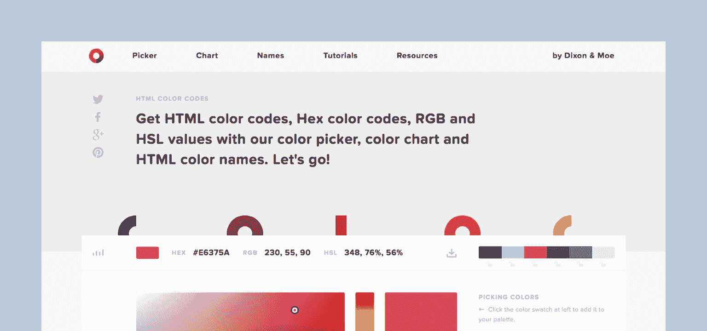
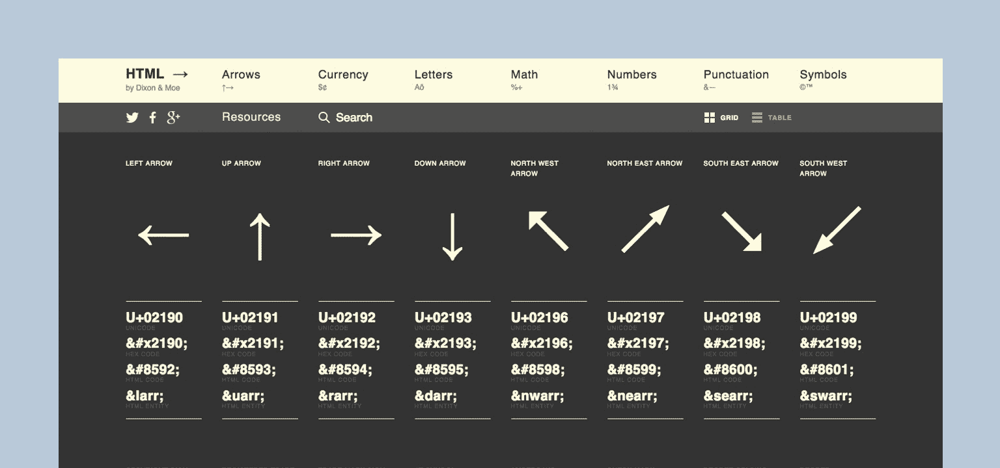
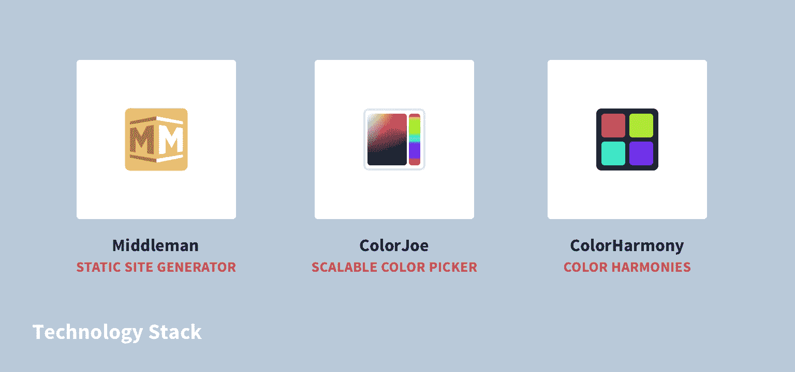
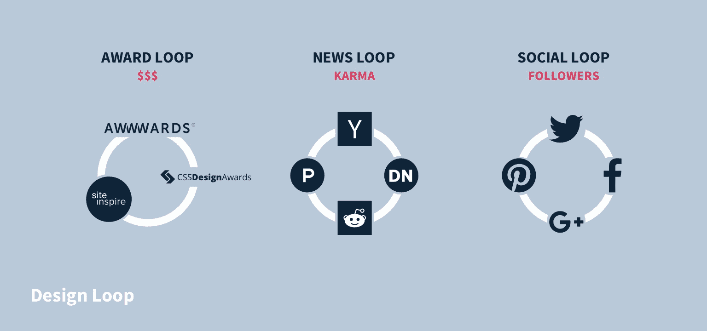
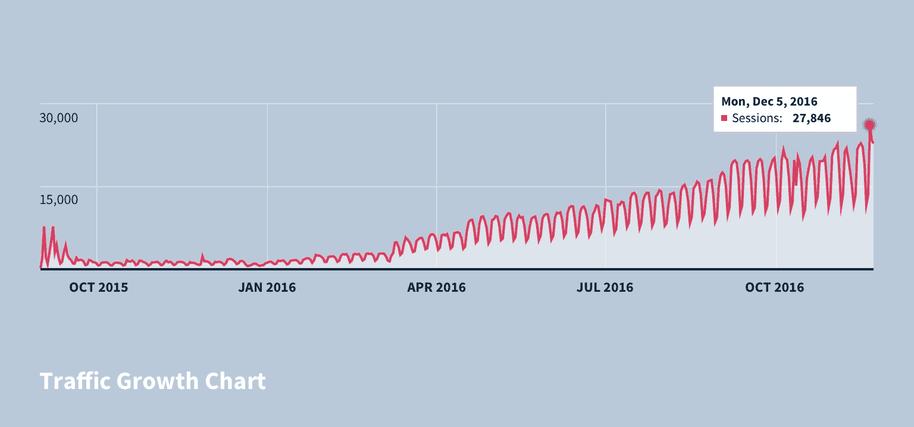
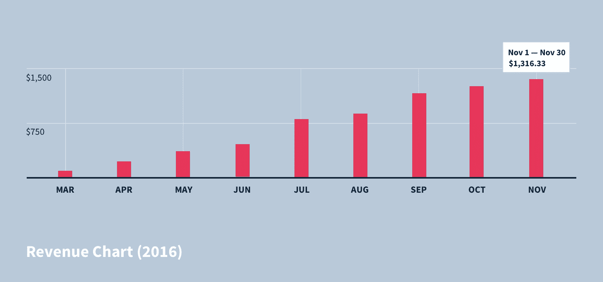
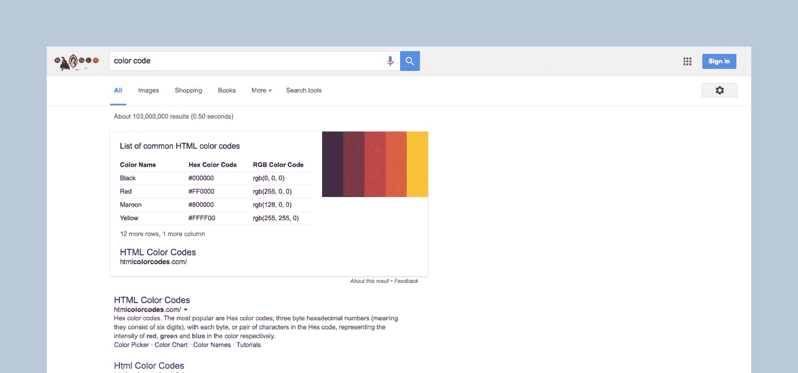

# 通过找到可靠的分销渠道，每月增长到 1，300 美元

> 原文：<https://www.indiehackers.com/interview/growing-to-1-300-mo-by-finding-solid-distribution-channels-85c0ec6141>

## 嘿伙计们！告诉我们关于你自己，以及你正在做什么。

我们的副业项目， [HTML 颜色代码](http://htmlcolorcodes.com)，是一个参考网站，可以使用颜色选择器或颜色图表(如材料设计)轻松找到 HTML 十六进制颜色代码。Color Codes 在技术上与其他网络工具非常相似，但是——这一点很重要——它的与众不同之处在于它非常注重设计。

 

但是回顾一下，我们是[迪克森&莫伊](https://dixonandmoe.com)，一对最好的朋友(现在是一个 4 人团队)，毕业于麻省理工学院，获得建筑学学位。尽管沉浸在漫长而痛苦的严格的建筑教育中(8 年，但是谁知道呢)，我们两个从很小的时候就通过构建 jQuery 和一些(我们敢说吗...)Flash 网站来展示我们的建筑作品。

受到网站建设速度和反馈的诱惑，以及创办自己公司的简单(但不可抗拒的)动机，我们开始在旧金山建立一家设计和开发机构。

## 你是如何开始你的事业的？

当我们开始制作《T4》的时候，我们确实没有太多的指导和资金。幸运的是，通过一点坚持和冰冷的电子邮件，我们能够获得一些自由职业项目来帮助我们支付账单。我们很快了解到以客户为中心的自由职业可以是怎样的(以及随之而来的起伏)，我们开始探索客户工作的替代方式，这一举措将我们带入了许多独立黑客采访之前提到的数字产品和影响者的兔子洞(37signals、Patio11、Wildbit、NeedWant)。

 

作为自由设计师/开发人员，我们倾向于在网络上使用大量的免费工具(我们仍然这样做)，其中一些设计糟糕，或者可以追溯到 90 年代后期。在客户工作的间歇，我们决定重建一个我们最常访问的网站，一个 HTML 符号代码资源，用于像这些☃☂.这样酷的东西我们花了两周的时间推出了 htmlarrows.com，通过一点营销努力，不到两个月后，它在谷歌上的搜索词“html arrows”排名第一。令人难以置信的是，设计是一个相关的度量标准，但对我们来说，实验已经被证明。是时候测试一个更大的想法了。

在研究 html 箭头的关键字时，我们遇到了另一个更有潜力的关键字:“HTML 颜色代码”作为设计师(他们使用 Sketch 和其他带有内置颜色工具的软件)，我们对该关键字的受欢迎程度感到有点吃惊，但每天有近 5000 次搜索，我们无法抗拒。

经过一些初步的研究，我们发现[htmlcolorcodes.com](http://htmlcolorcodes.com)是未使用的(多完美啊),并协商以仅 600 美元的价格从所有者手中购买该域名！对我们来说，这是一个巨大的分数，因为现任有 html-color-codes.info(真的吗？？).

这次我们花了两个月的时间推出[色码](http://htmlcolorcodes.com)，有很多很多 UI 评论和设计 charrettes 我们真的想创造一个应用程序级别的用户体验，并对网站进行高度优化，使其看起来更加强大和不可思议。开源社区为网站提供了很多技术基础，对此我们永远感激，并在网站的页脚公开表示感谢。

## 你是如何腾出两个月的时间来构建和启动这个项目的？它是完全由你的代理工作资助的吗？

作为一起工作的一对，我们中的一个人会通过从事自由职业项目来支付账单，而另一个人则全职确保产品尽可能高的质量。为了合作，我们每周都会对从字体选项到动画计时的所有事情进行评论，但大部分时间我们都是独立工作的。

因为自由职业在工作上有点像过山车，所以我们更少的是找到时间，更多的是确保我们能够有效地填补我们遇到的停顿。我们在客户项目之间的一段时间里开始了[色码](http://htmlcolorcodes.com)，一个人总共花了两个月的设计和开发时间，我们两个人还花了同样紧张的两周时间进行大规模的市场推广。

构建 web 工具的伟大之处在于大部分工作都是前期工作。虽然随着时间的推移，我们进行了调整和复制，但大部分项目是完全被动的。该网站的最后一次推送是在 6 个多月前的 2016 年 4 月。

我们还提前考虑了理想的技术堆栈，以及支持我们希望最少维护的项目的技术堆栈。对我们来说，显而易见的选择是静态站点生成器，作为 ruby 爱好者，我们坚持使用我们的赚钱工具[中间人](https://middlemanapp.com)。在主机方面，我们偏爱 AWS，所以我们选择了 S3 和 Cloudfront。在 Google Adsense 之外，这个网站发展非常快，这也确实有助于我们的排名。

但是我们也有责任承认我们正站在开源巨头的肩膀上。颜色代码的功能部分主要依赖 Juho vepslinen 的 [ColorJoe.js](https://bebraw.github.io/colorjoe) ，但也有使用 skratchdot 的 [ColorHarmony.js](https://github.com/skratchdot/color-harmony) 和 one.com 的 [One Color](https://github.com/One-com/one-color) 的功能。随后，我们能够为 Juho 提供设计支持，作为对他的开源工作的贡献，但我们知道还有更多事情要做。

## 你是如何培养色码的？

我们在构建颜色代码时面临的最大挑战之一是如何让它在谷歌中排名。谷歌的排名算法很大一部分取决于网站的反向链接，即链接回你网站的网站的声誉。有机流量是保持色码完全被动的关键，所以我们需要找出一种方法来建立网站的反向链接配置文件。

我们的方法是双重的，但依赖于拥有一个真正设计良好的产品。首先，通过一些跑腿工作，我们建立了一个我们称之为“设计圈”的东西，这是一个满足设计、网络工具和数码产品需求的长长的分销渠道列表，我们连续向这些渠道提交了颜色代码。很难给好的设计贴上价格标签，但在这种情况下，我们使用反向链接的数量作为我们的衡量标准，花在设计上的额外时间肯定是值得的。

我们策略的第二部分更加有机，但可以认为是我们产品的“粘性”。为我们的用户创造更好的体验让他们感到兴奋，通过在社交媒体、电子邮件上分享，或者只是一次又一次地回到网站，我们已经能够通过网络效应继续网站的增长，这在很大程度上归功于产品的设计。

就像我们之前提到的，有几十个甚至几百个其他网站，出于所有的意图和目的，做着和我们颜色代码完全一样的事情，除了我们设计了更好的体验。

## 你的营收背后有什么故事？

因为低维护是优先考虑的，我们决定——经过激烈的辩论——使用 Google Adsense。我们战略的一部分一直是建立、发展并盈利网站，甚至在项目的设计阶段，我们就考虑了有无广告的布局和用户体验。到目前为止，这是保持其成功的关键，因为广告不是简单的事后思考，而是从一开始就融入到设计中。

最初的回报相当低，但随着时间的推移，收入变得有点可观。我们现在完全被动地每月存入 1，300 美元；我们还不能退休，但这绝对是一个开始。我们知道有很多其他的货币化的可能性，但是，我们只是没有时间去做进一步的实验。

## 你未来的目标是什么？

尽管我们非常喜欢这种甜蜜的被动收入，但我们也在关注其他事情。我们一直在向那些知道如何利用一个月浏览量近百万的网站并将其适当货币化的人征集出售[色码](http://htmlcolorcodes.com)的报价。

我们新的一年的重点是回归我们的根本，发展我们的 SaaS 产品[专论](https://monograph.io)，专注于建筑行业(刚刚达到 350 美元/月)。如果我们找不到颜色代码的买家，我们很乐意保持被动收入列车运行，并使用资金来支持我们更多的时间建设专著。

## 如果你必须重新开始，你会做什么不同的事？

从[色码](http://htmlcolorcodes.com)开始，我们必须回答一个基本问题:我们是创建一个独特的品牌，还是走一条非常有针对性的路线，使用完全匹配的(或类似的)域名、名称和关键词。我们选择了后者，但是这种方法在网站的整个生命周期中一直是一个断断续续的话题。

如果我们再做一次，我们可能会问一个稍微不同的问题:我们是想建立一个品牌还是一个独立的产品？虽然并不相互排斥，但每个人的思考过程和顺序是不同的。在颜色代码的情况下，我们建立了一个独立的产品(第一)，有一个非常集中的应用程序和身份。虽然这对于我们最初的目标领域非常有效，但它也限制了我们将产品扩展到初始市场之外的能力(和愿望)。再做一次，我们可能会选择，例如，为网页设计师开发一套免费的原型工具，颜色代码是试点产品或功能，以及一个也属于该品牌的其他产品的路线图。现在看来,“颜色代码”是一个网络颜色工具——就名称、身份和功能而言，仅此而已。

我们应该实施的第二个实践(回想起来)是设定简单的时间表和每小时的“预算”我们没有注意到很多独立黑客的采访提到工作时间，但这是我们做了一个体面的工作跟踪。然而，我们应该已经计算出最终的回报是什么来抵消这些时间，也就是说，作为一个成本效益比较来寻找更多的客户。

最终，我们在这个项目上花了大约 9 周的时间，根据我们当时的自由职业者比率，这个项目的费用大约是 36，000 美元。按照我们目前每月 1，300 美元的利润，大约需要 28 个月才能收回成本。然而，请记住，我们也通过项目获得了客户的工作，所以这不是一种精确的 1:1 关系，而是一种评估我们努力的启发式方法。

## 哪些工具有助于将颜色代码转换到目前的位置？

在开发[色码](http://htmlcolorcodes.com)的过程中，我们使用了许多免费工具，其中许多工具对于跟踪 SEO 影响和关键词非常有用。[谷歌的关键字规划工具](https://adwords.google.com/KeywordPlanner)是首先发现“html 颜色代码”关键字的基础，并有助于建立我们也可以瞄准的后续和长尾关键字。这个工具确实需要信用卡(虽然他们不会向你收费),但是非常值得！

在这一点上，Google Analytics 可能是赌注，但是除了用户增长之外，我们发现跟踪我们将从其他网站获得的反向链接也很有用(通过收购>媒体选项卡)。Google 网站管理员工具是我们早期大量使用的另一个资源，用于跟踪我们排名的关键词，但可能会优化得更好。谷歌还有其他工具，比如用于验证 Schema.org 标记的[结构化数据测试工具](https://search.google.com/structured-data/testing-tool/u/0)(如果你还没有使用，你一定要开始使用)。

SEO 资源多如牛毛——有太多了。由于它本质上是 Moz 和 Backlinko 等网站为这些关键词排名的元游戏，你可以找到一些关于建立反向链接、内容和关键词策略的非常详细的帖子。

## 你对有抱负的独立黑客有什么建议？

从小处着手。

Amy Hoy 和 Jason Fried 已经详细描述了这一点，但是当你刚刚开始的时候，确保你已经取得了一些小的成功。如果你来自一个制造商的背景，建立势头和学习创造收入不一定是自然的，但是从一个简单的货币化项目开始会创造出产品习惯。我们真诚地希望在我们生命的早期就有这个建议，我们相信它会有所帮助...

创业并不适合所有人。

[色码](http://htmlcolorcodes.com)是我们第五次尝试数码产品，也是迄今为止最成功的一次。当然，其他 4 个项目的共同特点是我们“一路走来学到了很多”，我们希望我们在“创造人们想要的东西”上取得更多进展。也就是说，这总是很困难的。创业，尤其是刚开始的时候，是一件苦差事，制造产品与其说是一份工作，不如说是一种生活方式。但是如果你喜欢，伙计，这是一种很棒的生活方式！

以你的背景为基础(也就是说，这个世界需要更多的设计)。

这里有更多专门给设计黑客的建议，但是看看那些没有被谈论的和不太性感的行业和领域。有太多服务不足的市场迫切需要设计(开源项目、自举公司、免费资源网站)。当你发现一个领域可能需要一些帮助时，寻找那些已经有良好记录和需求的项目或产品，并尝试理解如何通过设计提供更好的体验。有 20 多个网站在做颜色代码所做的事情，但我们能够通过推动设计从噪音中脱颖而出。

## 我们可以去哪里了解更多？

如果你在海湾地区，请到我们的办公室来喝啤酒，聊聊天。此外，作为一家机构，我们喜欢与其他白手起家的创始人会面和合作——随时寻求设计反馈、SEO 建议或可靠的 IPA 推荐(收件箱始终开放: [【电子邮件保护】](/cdn-cgi/l/email-protection#c5a8aaa085a1acbdaaaba4aba1a8aaa0eba6aaa8) )

*   网页:【https://dixonandmoe.com 
*   推特:[@ dixonandoe](https://twitter.com/dixonandmoe)
*   专论: [https://monograph.io](https://monograph.io)

——[<picture id="ember5302450" class="user-avatar ember-view user-link__avatar"></picture>云谷](/moeamaya?id=pJI4IXAL3CP2tsMIKD3yZKpCQY73)

## 想像 HTML 色码一样建立自己的事业？

你应该加入独立黑客社区！🤗

我们是几千名创始人，互相帮助建立有利可图的业务和副业。来分享你正在做的事情，并从你的同事那里获得反馈。

还没准备好开始使用你的产品吗？没问题。这个社区是一个认识人、学习和实践的好地方。随意[随便浏览](/)！

—[<picture id="ember5302455" class="user-avatar ember-view user-link__avatar"></picture>考特兰艾伦](/csallen?id=ibTLPyjwVebnZjMGKvz6ztarnuV2)，独立黑客创始人

18votes