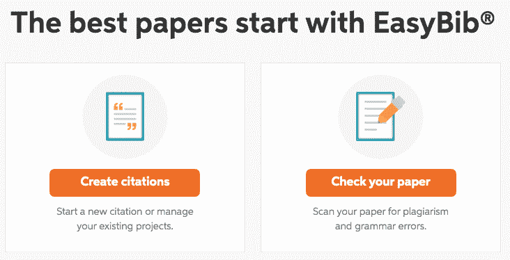
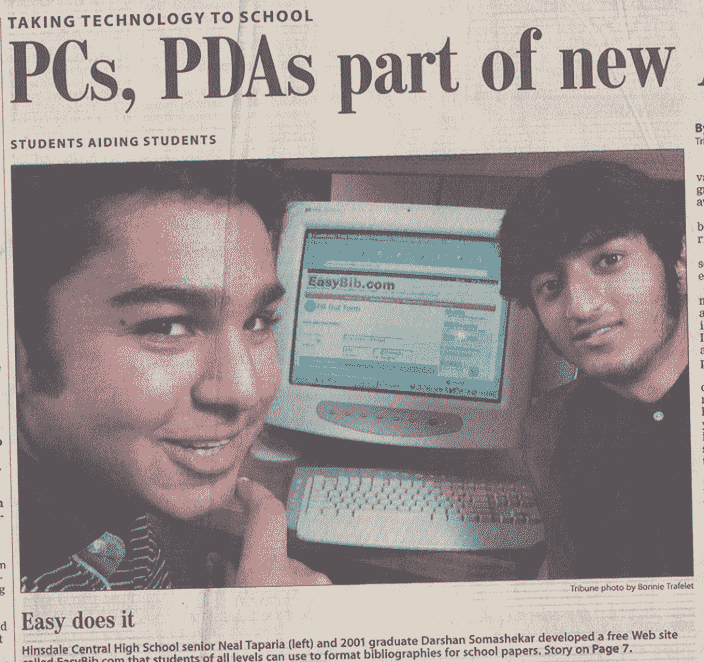

# 增长到 1000 万美元，卖掉我们在高中时创办的企业

> 原文：<https://www.indiehackers.com/interview/growing-to-10m-and-selling-the-business-we-launched-in-high-school-678a822100>

## 你好！你的背景是什么，你在做什么？

嗨！我叫尼尔·塔帕瑞亚。我是 EasyBib.com 的联合创始人。

我十几岁的时候在芝加哥开始学习如何建立网站，但这从来都不是我的强项。我最终学习了经济学和宗教(我父亲从来不明白我为什么选择宗教)，大学毕业后，我在雷曼兄弟(Lehman Brothers)短暂工作了一段时间，但在该公司倒闭前八个月离开了。

EasyBib 帮助学生创建引文。用户可以输入书名或网站网址，网站会自动生成并组织你的引用，为学生节省大量时间并避免意外抄袭。你也可以上传一篇论文来获得语法建议，看看你是否忘记了引用其他地方的文字。

当我们卖掉公司时，我们每年的学生人数超过 3000 万，收入超过 1000 万美元。

## 是什么促使你开始接触 EasyBib.com？

2001 年，我的朋友和联合创始人达尔山“达尔什”索马谢卡尔和我还是高中生。我们还学习了如何建立网站。Darsh 已经建立了一些网站，包括一个小工具评论网站和一个 HTML 教程网站。

【T2

我们有论文要写，我们都为冗长的书目格式规则和要花多少时间而苦恼。就在那时，我们灵光一现，创造了 EasyBib。

因为我们代表我们自己的核心客户，学生，我们知道我们需要建立什么。这是一种能减轻我们眼前痛苦的产品。我们调查了我们的朋友，看看他们是否会使用一个会自动生成引用的网站。大多数人的回答是，“当然，废话。”然而，也有反对者，他们只是说他们将继续手写书目。我们没有太相信他们的观点，因为我们离发布只有几天了。我们也认为他们疯了。

考虑到我们是高中生，我们竞争的重点是学校活动，SAT，以及取得让父母满意的成绩。不用说，我们没有像今天这样的成年人的责任。更重要的是，我们有一些空闲时间！

## 构建最初的产品需要什么？

连续两个月，达什和我会在放学后和周末在对方家里工作，构建出 EasyBib 的第一个版本。作为学生，我们知道我们想要什么样的产品，我们知道它必须是*简单*，因此得名:*简单*围兜。

我们一起勾画了网站的愿景。Darsh 有更好的技术专长，专注于编写第一个版本，而我专注于 QA 和学习 MLA 格式的所有规则。具有讽刺意味的是，我成了我最初不喜欢的事情的专家！

启动该网站并不需要太多投资。我们花了不到 50 美元来托管网站的第一个版本。除此之外，构建 EasyBib 的真正成本是我们的时间。正如你所想象的，几乎没有机会成本，这对我们来说是一个有趣的项目。

回想起来，我们遵循了最小可行产品方法的许多原则。我们只是想在那里得到一些东西，因为我们认为这将有助于学生，而不一定是要启动一项业务，这将成为我们生活的一大部分。我们专注于构建满足我们即时需求的产品和功能，因为我们自己就是最终客户，所以这种洞察力来得很容易。具体来说，这意味着引用书籍、网站和期刊等资源。我们没有关注商业模式和账户管理等细节，因为我们只想看看人们是否像我们一样喜欢我们的服务。换句话说，我们在不知不觉中测试产品/市场的适合度。

## 你的技术是什么？

最初我们的技术是 [ColdFusion](https://coldfusion.adobe.com/) 。Darshan 在那年早些时候学过 CF，认为这是一种很好的写作语言。但是随着时间的推移，我们意识到有些语言拥有更大的开发者社区。几年后我们迁移到 PHP，然后在 2008 年切换到一个名为 [Zend](https://framework.zend.com/) 的 PHP MVC 框架，以及一些基于 [Symfony](https://symfony.com/) 的 PHP 微服务。这让我们一直忙碌，直到一年前，我们将前端改为 reactjs，并开始从 PHP 升级我们的微服务。

随着时间的推移，你会积累大量的技术债务。

TweetShare

一路上，我们面临着大量的技术挑战。即使我们在 2018 年更新了代码，Darshan 在 2008 年编写的一些库仍在为网站的核心部分提供支持，即书目格式化服务。自然地，随着时间的推移，你会积累大量的技术债务。

我们首先尝试用端到端重构来解决这个问题。最初，我们认为这需要几个月的时间，但九个月后，我们最终重新思考了我们的方法。我们重新设计了网站，让我们能更快地在较小的组件上获胜，并逐渐过渡。

## 你是如何吸引用户和发展 EasyBib.com 的？

我们于 2001 年 2 月开始使用该网站。这对我们来说非常令人兴奋，但当然，我们需要获得用户。

我们尝试了所有能想到的方法。我们进入当时很流行的 AOL 聊天室，在相关的聊天室里张贴为什么 EasyBib 是很好的服务。我们在学校里到处张贴从图书馆印的广告。我记得我在浴室隔间里贴了 EasyBib 的传单，因为我想有人会看到的！=)

我们还会给老师发电子邮件，因为他们的电子邮件地址很容易在网上被发现。当我们收到感谢资源的回复时，我们知道这是一个值得加倍努力的策略。放学后我会回家给数百名老师发电子邮件。我不认为当时有很多学生这么做。

慢慢地，流量开始增加，但是当我们在 2001-2002 学年开始时给芝加哥论坛报发电子邮件时，我们有了一个大突破。我们解释说，我们创建 EasyBib 是为了帮助其他学生。几天后，一名摄影师出现在我家，给我和达什拍了照，又过了几天，我们上了《芝加哥论坛报》商业版的头版。一周之内，我们看到其他报纸，包括[【美国】](https://www.usatoday.com/story/college/2014/12/09/these-apps-are-going-to-help-you-survive-finals/37399051/) [【今日】](https://www.usatoday.com/story/tech/2015/07/20/back-school-best-study-apps/30299531/)，都报道了 EasyBib。

我们使用了 [awstats](https://awstats.sourceforge.io/) ，这是一个计算会话数的开源工具，我们会看到数字每天都在增加。第一天我们有 1000 名游客，非常兴奋，当人数达到 10000 时，我们欣喜若狂。

我们也很幸运。我们发现，人们推荐我们的产品是因为它可以节省他们写论文的时间，并帮助他们避免意外抄袭。在新闻报道之后，我们看到有机交通一直在增长。主要原因是因为我们专注于轻松和简单。EasyBib 是如此简单，它有一个“哇”的因素，你想告诉你的朋友。它告诉我们，我们需要创造直观和简单的产品，我们，最终用户，会想要我们自己，而不一定是我们的老师想要的。这也是我们公司名称的灵感来源:想象简单的解决方案。

回想起来，我们的天真是一笔财富。我们什么都试过了。我们没有多想，也没有犹豫。当有东西起作用时，我们加倍下注。这感觉像是常识，我们玩得很开心。

今天，我们有一个新的游戏倡议，将脑力游戏与经典游戏结合起来。我们刚刚推出了我们的第一款游戏， [Solitaired，这是一款免费的纸牌游戏](https://solitaired.com),顾名思义。尽管我们有这样的经历，但我们感觉自己又像个孩子，尽我们所能告诉每个人这个网站，并学习什么是有效的。但这一次，我们知道如何对增长计划进行优先排序，并且对如何衡量成功有明确的目标。我们以前没有这样的纪律。

## 你的商业模式是什么，你是如何增加收入的？

用户很快要求我们提供更多的引用方式。我们在 2004 年上大学时引入了 APA 格式。使用贝宝，我们把它放在订阅墙后面。果不其然，我们发现人们愿意为此付费。

当时，我们对转化率和留存率等 SaaS 指标知之甚少。人们愿意付钱给我们，我们很激动。多年来，我们学会了测试不同的计划和价格点，甚至做长期测试来了解不同定价计划的季节性。

计划让测试成为你成长计划的支柱...最终，数据，而不是直觉，会告诉你是对还是错。

TweetShare

我们发现终身计划的想法对我们的用户来说很棒。他们喜欢只付一次钱的想法。然而，这对于最大化公认会计准则的收益并没有什么好处。

后来，测试成为我们公司 DNA 的一部分。我们惊讶了无数次。例如，我们测试了一个 300 美元的终身计划，令我们惊讶的是，我们的一些用户买了它！在其他时候，我们认为是显而易见的改进根本没有移动指针。我建议每个人都计划让测试成为他们成长计划的支柱，因为最终数据，而不是直觉，会告诉你是对还是错。

2007 年，我们有了数百万的访客，我们的一个朋友，后来成为我们的广告副总裁，建议投放展示广告。在我们朋友的带领下，我们花了几年时间学习如何优化 CPMs(你从广告中获得的收入)。后来，我们建立了自己的分析师和工程师团队，致力于此，我们实现了远远超出行业标准的广告 CPM 率。

这最终成为我们的秘密武器。我们的竞争对手都没有像我们一样投资广告盈利。在七年的时间里，我们收购了该领域的所有竞争对手，利用我们的广告和订阅知识，实现了强劲的有机和无机增长。

到 2016 年，我们的核心业务收入远远超过 1000 万美元，利润率超过 50%，所有这些都没有融资。达什和我决定，如果我们出售我们的业务，它将实现我们在 2008 年投入业务时设定的目标。因此，在 2016 年，我们将业务出售给了一家名为 [Chegg](https://www.chegg.com/) 的上市公司，在那里我们继续以副总裁的身份进一步发展业务。

这些年来，我们做了很多决定，犯了很多错误。我们的成功实际上归结于一些关键的见解:专注于直观的产品，投资于货币化战略，学习 SEO，以及收购我们的竞争对手。这中间有太多的细节让我们担心，但事后看来，这些细节并不重要。我在今天帮助的许多企业家身上看到了这一点，他们看到的是树木而不是森林。专注于真正重要的事情(或者，就像我们说的，“BETM”)，这将开始给你带来结果。

我们从未想过我们的生意会变得这么大。在齐格网，我们的业务规模相当大。在那里，我们学会了胸怀大志，设定远大目标。我们 16 岁的自己永远不会相信这个故事。

## 你未来的目标是什么？

我们最近离开了我们热爱的 Chegg，在那里我们学会了如何成为强有力的经营者。我们又成了企业家。如上所述，我们正在探索经典游戏和大脑训练之间的联系。

我们管理团队已经有一段时间了，所以我们要像 16 岁时那样再次卷起袖子。我们刚刚起步，但我们的目标是通过测试各种营销策略和创造有趣的用户体验，在年底前实现 100，000 次访问。如果我们能做到这一点，我们就知道我们可以扩大规模。这并不容易，因为这个领域已经被大量的游戏商品化了，这也是我们愿意收购的原因。我们必须找出让我们与众不同的方法，我们认为与大脑训练的联系可能是答案。

## 有没有发现什么特别有帮助或者有优势的？

我很幸运，因为我和一个好朋友一起创业，而且我们刚好有互补的技能。达什更注重技术，我更注重商业，而我们都能够在战略上建立彼此的基础。此外，进行客观的辩论是相互信任的，当*有*分歧时，我们愿意赌一赌彼此的想法。拥有健康的共同创始人关系可以大有裨益。

我们的业务从来没有董事会，但在齐格网，我们有一个老板。这无疑是一个巨大的变化，但他让我们负起责任，并推动我们将业务发展到超出我们的想象。我希望我们早点有这样健康的责任感。

## 对于刚刚起步的独立黑客，你有什么建议？

我们从 2001 年到 2019 年发展了我们的业务。这需要时间和耐心。你听说过这些一夜成名的故事，但它们是制造新闻的耸人听闻的异类。胸怀大志，有决心和专注，你的企业就会成长。

同样，重申一下，关注那些重要的事情。BETM！我们的成功可以归结为几个关键的战略举措。什么才能真正激发增长，并具有可扩展性？什么才是真正的[信号与噪声](https://www.businessinsider.com/signal-vs-noise-2011-2)？这不一定是显而易见的，但通过练习哪些举措可能是最重要的。

最后，随着你变得越来越大，和优秀的人在一起。这是屡试不爽的。在齐格网的时候，我们有一个有才华的团队来思考执行。我们只是让我们的团队专注于大局。

## 我们可以去哪里了解更多？

我曾经把我的一些心得写在[福布斯](https://www.forbes.com/sites/nealtaparia/)上。我现在有一些空闲时间，所以我希望再次这样做。你也可以在推特上关注我 [@tapneal](https://twitter.com/tapneal) 。达尔山的推特是[@达尔山](https://twitter.com/darshan)。

我喜欢为企业家提供建议和帮助，所以请不要犹豫，在 linkedin 上与我联系

否则，如果你有任何问题，请在下面的评论中留下，我会回复你的！

——[<picture id="ember8100165" class="user-avatar ember-view user-link__avatar"></picture>泰普尼尔](/tapneal?id=3gxUX7m0i7hDWa0BykQjjqX4AZj1)，EasyBib.com 的创始人

## 想像 EasyBib.com 一样建立自己的事业吗？

你应该加入[独立黑客社区](/)！🤗

我们是几千名创始人，互相帮助建立有利可图的业务和副业。来分享你正在做的事情，并从你的同事那里获得反馈。

还没准备好开始使用你的产品吗？没问题。这个社区是一个认识人、学习和实践的好地方。随意[随便浏览](/)！

—[<picture id="ember8100170" class="user-avatar ember-view user-link__avatar"></picture>考特兰艾伦](/csallen?id=ibTLPyjwVebnZjMGKvz6ztarnuV2)，独立黑客创始人

28votes