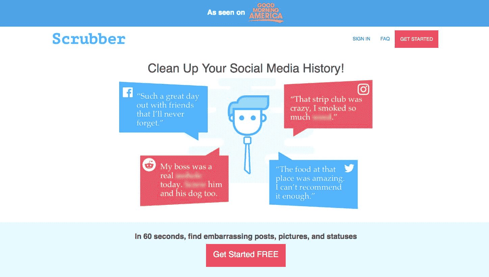
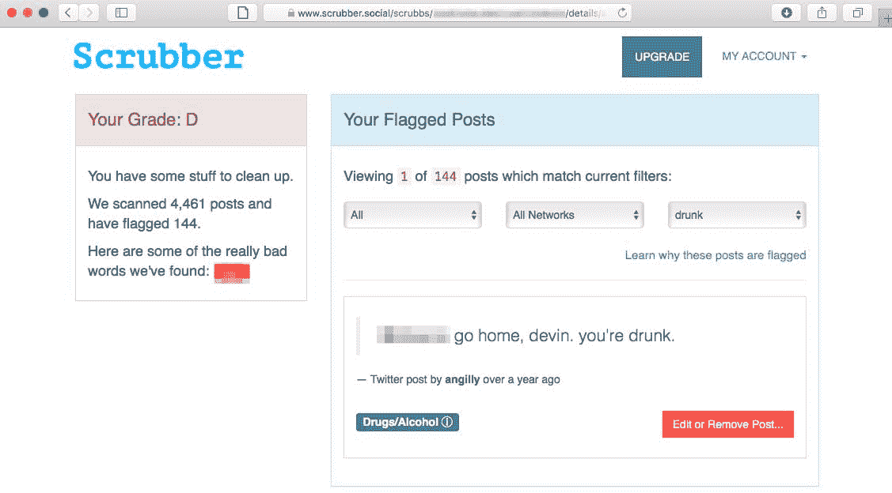
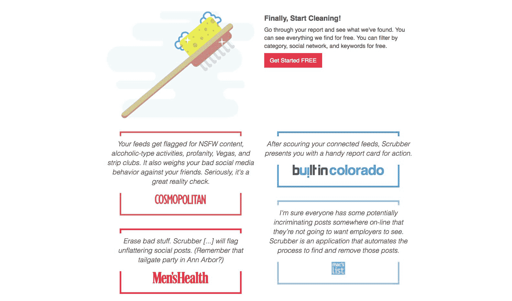

# 通过清除网上令人尴尬的内容，每月增长到 4，000 美元

> 原文：<https://www.indiehackers.com/interview/growing-to-4-000-mo-by-scrubbing-embarrassing-content-from-the-web-45ae6c643e>

## 你好！你的背景是什么，你在做什么？

我是瑞安·安吉利。我 35 岁，住在科罗拉多州的丹佛市，在我写这篇文章的时候，我的第一个孩子三周前刚刚出生！她叫安斯利，她很棒。我七岁开始编程——有人记得 3-2-1 接触杂志上的苹果基础游戏吗？！在获得计算机工程和电子工程学位后，我在 2007 年创办我的第一家公司之前，在 EMC 工作，构建数据存储系统的计算机模型。那家公司是语音信箱转录公司。这有点像谷歌语音，但更糟糕。它做得不太好，但它确实开启了我现在长达 10 年的软件事业。

[Scrubber](https://scrubber.social) 是一款扫描你的社交媒体历史，寻找潜在尴尬内容的产品。它会扫描你发表的帖子、你对其他人的帖子的评论、其他人对你的帖子的评论，以及(在适用的情况下，例如在脸书这样的网络上)对你被标记的帖子的评论。它扫描多个社交网络，如脸书、推特、Instagram 等。，并将标记包含亵渎、提及毒品或酒精、性和政治的帖子。它有一个自定义的关键字功能，所以它可以标记包含一个人的名字，工作或组织的职位。

大约一年半前，我开始把真正的工作放到[洗涤器](https://scrubber.social)中，之前我让它在后台呆了三年，没做多少事情。2017 年初，我与 Brita.com 达成了一笔高达五位数的白牌交易，今年早些时候在早安美国(Good Morning America)上亮相后，我在 4 月份创下了 3800 美元的历史新高。

 

## 是什么促使你开始使用 Scrubber？

在 2010 年末搬到科罗拉多州的博尔德后，我非常努力地投身于创业领域。几年来，我不断地想出一些点子。当一个名为 4 square and 7 years force(后来成为 [Timehop](http://timehop.com) )的应用程序出现时，我被数字历史的想法迷住了。

我开始意识到，在未来几十年里，管理数字历史将会变得多么复杂。我当时跟我女朋友说(现在是我老婆！)她拦住我的去路，说:“你应该建一个。”这些年来，我向金提出了许多想法，但她更喜欢这一个。她当时在法学院，给我讲述了她的同学们害怕一些愚蠢的推文或脸书的评论断章取义会伤害他们即将到来的法律职业的故事。

那个周末晚些时候，我在笔记本电脑上运行了一个原型，并把它展示给了几个朋友。反响不错，但是生活妨碍了我，在我最终把它发布到世界上之前，它又在我的笔记本电脑上放了一年左右。

## 你是如何吸引用户并发展洗涤器的？

我们从未正式发布过。在购买域名并将 Scrubber 投入使用后不到一周，一位来自《Cosmopolitan》杂志的作家不知何故找到了 Scrubber，并写下了相关内容。一天之内，我有 10，000 个用户访问这个网站，我们开始比赛。

从那以后，Scrubber 受益于惊人的口碑增长。《华尔街日报》和《早安美国》等其他热门媒体让我们在一段时间内成功驾驭了这股浪潮。

在用户无法完成任务或抱怨之前，最大的问题是分发。

TweetShare

此外，2017 年初，大学体育院系启动了一项试点计划，为学生运动员批量购买洗涤器。这有助于 Scrubber 在一些大学校园传播，并进一步增加流量。

我们很幸运，洗涤器作为一种产品，有助于通过口碑传播。然而，坦率地说，回答面试的这一部分对我来说是最难的，因为这说明了我们还可以做更多的事情。也许一年后我可以写第二部分，在那里我会谈到我们为增加流量所做的额外的事情，以及它是如何实现的！

## 你的商业模式是什么，你是如何增加收入的？

人们免费报名参加[擦洗器](https://scrubber.social)。他们向我们提供他们的电子邮件地址，通过 OAuth 连接他们的社交媒体帐户，运行扫描，并查看我们标记的所有帖子。如果他们想编辑或删除我们标记的帖子，他们有两个选择:他们可以自己去找帖子(在大多数社交网络上这不是一件容易的事情)，或者他们可以升级到我们的高级计划，这使他们只需点击一下就可以直接从 Scrubber 访问原始帖子。在高级计划中，初次扫描收费 19 美元。如果用户希望我们在升级我们的技术时不断为他们运行扫描，他们可以在头 30 天后每月支付 9 美元。然而，大多数用户一次性支付 19 美元，然后取消订阅。

 

除了通过增加流量来增加收入，我们还通过 Customer.io 使用了一系列智能动态电子邮件，让用户在注册后进行升级。Customer.io 提供了一些真正令人兴奋的灵活性和定制，允许我们发送电子邮件，使我们从免费用户到付费用户的转化率翻了一番。

## 你未来的目标是什么？

在接下来的 12 个月里，我们希望收入增长五倍。这将通过并行处理一系列工作来实现:

*   创建一个更正式的流程，联系中等教育职业服务机构和学生报纸，以获得博客提及
*   在脸书广告方面做得更好——我们在这方面取得了一些成功，但从未花足够的时间来学习如何将它推过难关，成为一个持续盈利的渠道。
*   增加我们的搜索引擎优化足迹
*   把更多的努力放在让我们的用户告诉他们的朋友关于洗涤器

此外，在接下来的一年中，我们将正式推出“团队擦洗器”产品，组织(学校、运动部门、运动队、企业)可以为其成员批量购买擦洗器。我们已经在西弗吉尼亚大学和佛罗里达州立大学进行了成功的试点。

## 有没有发现什么特别有帮助或者有优势的？

**工具&产品**

[完整故事](https://fullstory.com)对我们来说是一个游戏规则的改变者(他们不会付钱让我这么说的！).你把他们的 JavaScript 标签放到网站上，他们会提供用户在你的网站上走动时看到的几乎实时的记录。我们发现了一些非常大的错误，包括我们的升级付费墙在 iPhone 4 上不能正常滚动，所以人们甚至不能注册！

其他宝贵的工具:

*   [Customer.io](https://customer.io) 让人们在注册后升级
*   [Rollbar.com](https://rollbar.com)进行异常监控

**定制松紧网钩**

我大量利用定制的 Slack 集成来获得几个事件的通知，包括:

*   注册
*   提升
*   授权社交网络
*   撞上了付费墙

每一类事件都被传送到一个前缀为`activity-`的松散通道中。这让我对 Scrubber 的“心跳”有了更好的感觉，而不是提供离散的指标(我也在每天的电子邮件中收到这些指标)。当事件通过管道进入各种渠道时，根据事件的节奏，我可以很快地根据轶事判断出是否有问题。

**个人习惯**

我不是一个循规蹈矩的人。在过去的几年里，我试图做得更好的事情之一是围绕我如何经营我的企业建立更好的个人习惯。在任何一周，我都可以把 95%的时间花在其他业务上，所以过去几周不用花时间在 Scrubber 上是很容易的。大约一年前，我开始了一个新系统，当我看着我的电脑屏幕时，我在我的办公室里放了一块白板。它有三大部分:每日、每周和任务。

*   每日是指我每天都想做的重复性任务:服用维生素、锻炼等等。
*   每周是指每周重复的任务:打开收件箱，见一个我通常见不到的人，做一项我通常不做的活动，等等。
*   任务是为了那些我想尽快完成的非重复性的事情。

每次我做完一件事，我都会检查一下。每天早上，我擦掉所有的每日支票，每个星期一早上，我擦掉所有的每周支票。这帮助我建立了面对不断变化的时间表的习惯。

在过去的几年里，我试图做得更好的事情之一是围绕我如何经营我的企业建立更好的个人习惯。

TweetShare

有一段时间，我在一周内为 Scrubber 做的唯一一件事就是找一个人发邮件。可能是记者或者潜在的合作伙伴。然而，随着时间的推移，这些延伸会越积越多。

## 你面临的最大挑战和克服的障碍是什么？如果你必须重新开始，你会做什么不同的事？

最令人惊讶的是，人们经常认为洗涤器是一个骗局。

事实证明，如果你告诉某人他们用了一个不好的词，而他们认为他们或他们的任何朋友都不会用那个不好的词，他们会非常生气。他们给你发邮件，说一些可怕的事情，并威胁你。他们坚持认为你在诈骗他们，并威胁要把你告上最高法院(是的，这是真的)。

在使用 FullStory 和客户访谈进行了近一年的调整后，我们终于找到了一个似乎适合人们的工作流程。我们曾经给人们一份总结“成绩单”，然后只给他们看一页结果。我们已经取消了成绩单，现在我们向人们展示我们标记的每一条内容。

我早期没有做足够的真实用户测试。如果我必须重新开始，我会立刻在脸书上购买几百次点击，并使用 Fullstory 来确定应用程序中的问题区域。

 

## 对于刚刚起步的独立黑客，你有什么建议？

对于独立黑客来说，有一种与生俱来的、非常强烈的建设动力。您想要修复那个错误，或者您想要添加那个特性，或者您想要优化那个流程，或者您想要升级那个库。对我们来说，难以忽视的事实是，这些东西很少是指针移动器。当然，它们不能被忽视，而且从长远来看可能很重要，但是在用户无法完成任务或抱怨之前，首要问题是分发。有了交通一切都好办了。我过去常常发现自己坐在那里想“然后呢？我能怎么办？”这并不容易，但有一件事我一直在试图回答，那就是“我的用户现在在做什么？”答案包括:

*   他们在脸书上！(也许我会放一些广告。)
*   他们在推特上！(也许我会去搜索术语并@它们。)

—[<picture id="ember5274092" class="user-avatar ember-view user-link__avatar"></picture>瑞安安吉利](/ryan_angilly?id=oPv8UDSAu5XMvXjtfnup3glHArv2)【洗涤器创始人

## 想像洗涤器一样建立自己的事业？

你应该加入[独立黑客社区](/)！🤗

我们是几千名创始人，互相帮助建立有利可图的业务和副业。来分享你正在做的事情，并从你的同事那里获得反馈。

还没准备好开始使用你的产品吗？没问题。这个社区是一个认识人、学习和实践的好地方。随便去[随便浏览](/)！

——[<picture id="ember5274097" class="user-avatar ember-view user-link__avatar"></picture>考特兰艾伦](/csallen?id=ibTLPyjwVebnZjMGKvz6ztarnuV2)，独立黑客创始人

50votes