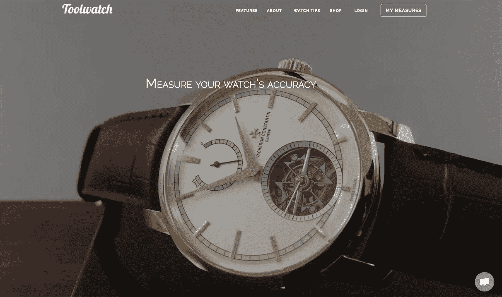
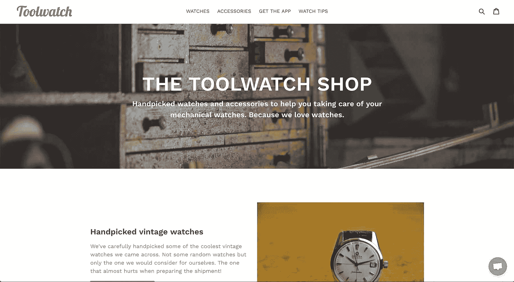

# 通过利用多种用户拓展方法，增长到每月 4，000 美元

> 原文：<https://www.indiehackers.com/interview/growing-to-4-000-mo-by-utilizing-several-user-outreach-methods-c4fb6d84f8>

## 你好！你的背景是什么，你在做什么？

你好科特兰和钱宁！我叫[马克·蒙塔涅](https://twitter.com/MarcAime)，我是 [Toolwatch.io](https://Toolwatch.io) 的创始人。我目前居住在瑞士日内瓦，这个机械表的国度，我在最古老的手表制造商江诗丹顿担任数字营销经理。

我在巴黎出生和长大，拥有工程和商业双学位。从我记事起，我就一直喜欢在我喜欢的所有领域(文学、科技、艺术、音乐等)创造和构建东西。)现在我的主要精力放在手表上。我是一个绝对的手表迷。

2015 年，我和两个朋友 [Mathieu Nayrolles](https://www.linkedin.com/in/mathieun/) 和 [Vincent Satiat](https://www.linkedin.com/in/vincentsatiat) 一起创建了 [Toolwatch.io](https://Toolwatch.io) ，帮助像我们这样的钟表爱好者测量和跟踪他们的机械表的精确度。我们还推出了 [iPhone](https://itunes.apple.com/fr/app/toolwatch-watch-accuracy-app/id1105636950?mt=8) 和 [Android](https://play.google.com/store/apps/details?id=toolwatch.toolwatch&hl=en) 应用，目前拥有超过 30，000 名用户，月增长率为 12%，月收入为 4，000 美元。

自从我们开始以来，Toolwatch 已经进行了超过 200，000 次测量。

 

## 是什么促使你开始使用 Toolwatch.io？

我从小就喜欢手表。长大后，我发现了机械表，并立即迷上了它！与石英表不同，机械表在精度上有一点漂移，因为它们是…机械的！我认为最好的手表是最精确的，所以我长期以来一直痴迷于精确。

我开始简单地用纸和笔来测量我的手表的精确度(很多很酷的东西通常也是这样开始的)！我会将我的手表与一个参考时钟同步，然后看看几天后我的手表会如何比较。

然后，我有了使用 Excel 电子表格来自动计算和简化整个过程的想法。这很方便，所以我开始与我的父亲和一些朋友分享这个电子表格。我意识到我并不是唯一一个疯狂追求手表精度的人！然后，与更多的人分享这个工具是有意义的，这意味着它必须在线可用。

尽管我很喜欢我的日常工作，但有时我会因为在一个大公司里把一个项目变成现实所花费的时间而感到沮丧。我需要做更多的事情——我不能只是呆在那里，等待事情发生。利用这种挫败感和我对手表的热情，我设法找到了与两个同样热爱手表的朋友一起制作工具手表的能量。

作为一名独立黑客，你的主要关注点应该是快速发布，并让尽可能多的用户看到它。

TweetShare

我们从一个网络应用开始，设法在发布日从一个专业博客发布了一篇很酷的博客文章，并在一个周末获得了 600 多名用户。反馈非常好，在我们进入手表行业的过程中，我们能够让了解手表的人测试和验证我们的应用程序。我们知道我们有东西。通过听取用户的意见，我们改进了网络应用，然后推出了 [iPhone](https://itunes.apple.com/fr/app/toolwatch-watch-accuracy-app/id1105636950?mt=8) 和 [Android](https://play.google.com/store/apps/details?id=toolwatch.toolwatch&hl=en) 应用，因为我们对这些应用有巨大的需求。

## 构建最初的产品需要什么？

我一有了 Toolwatch 的想法，就开始建立一个登陆页面，在那里我会收集未来对该产品感兴趣的用户的电子邮件地址。我创建了一个 Instagram 账户,在那里我每天发布一张手表照片，这会把人们带到我们的登陆页面。在我们创建 Toolwatch 的三个月里，我们得到了 131 条线索:没什么大不了的，但我看到一个手表博主订阅了，所以我给他发了电子邮件。这就是我们如何在发布日得到一篇很酷的博文的原因！

我们希望专注于 Toolwatch 的核心承诺(测量手表的精确度)，所以我们删除了所有其他潜在的功能，我开始使用 [Axure](https://www.axure.com/) 制作 web 应用的原型。我们的想法是，如果我们不能让任何人对我们的五屏 MVP 感兴趣，那么我们就不应该在剩下的部分浪费更多的时间和精力。

MVP 看起来是这样的:

1.  帐户创建
2.  添加手表
3.  手表优先同步(在秒针到达 12 点位置时点击按钮)
4.  使用这两个同步，Toolwatch 将能够判断精度是否有任何偏差。

当然，我们还增加了主页和联系页面。

在晚上和周末花了大约三个月的时间来构建 MVP，这里是我们使用的工具的分类。

*   PHP 框架: [CodeIgniter](https://codeigniter.com/)
*   电子邮件: [MailChimp](https://mailchimp.com/) 和 [Mandrill](https://mandrillapp.com)
*   实时聊天(针对客户支持):[清脆](https://crisp.chat/en/)
*   主持: [Heroku](https://www.heroku.com/)
*   SSL & CDN: [CloudFlare](https://www.cloudflare.com)

那时候，我们只有很少的 MailChimp 用户，所以我们基本上只花了不到 100 美元来建造它。

后来我们用 Wordpress 添加了一个博客，并且我们用 Shopify 开了一个在线精品店。

## 你们是如何吸引用户并壮大 Toolwatch.io 的？

吸引用户使用工具手表是我们的首要任务。最糟糕的感觉是花了无数个小时来建造一些东西，却没有人看到它。我们不想那样！

我们做的第一件事是阅读加布里埃尔·温伯格和贾斯汀·马雷斯的《T2 牵引》。这给了我们很多关于牵引渠道的想法，从那以后我们一直在增加新的渠道。这是我们尝试的全部列表。

**公关**

由于我们处于一个利基市场，很容易确定我们应该联系哪些博主，尤其是我们自己已经熟悉他们作为 watch 粉丝的工作。

获得媒体报道需要做很多工作，花费很多时间，但曝光率可能会很高，尤其是当你刚刚起步，还没有自己的声音的时候。

如果你的交流依赖于公关，那会很困难，因为在文章发表之前，你从来没有 100%的把握得到它，让一个博客作者/记者承诺发表日期可能是一场噩梦。此外，新闻稿的寿命非常短，48 小时后就结束了！

我会认为这是一个很好的额外奖励，并且总是试图得到，但这不应该是你的用户获取策略的核心。

我们很幸运在发布时有一篇好文章，所以我借此机会再次感谢 Robert-Jan 的支持！

**社交**

我们活跃在几个主要平台上。

[Twitter](https://twitter.com/ToolwatchApp) ，在这里我们使用 Sniply 转发了大量关于制表行业的材料，并嵌入了一个指向我们的应用程序的链接和用于调度的缓冲区。那里的结果并不令人印象深刻，但我们与用户有一些很好的互动，所以我们继续前进。

[Instagram](https://www.instagram.com/toolwatchapp/) ，我们每天都会发布一张新的腕表图片。在制表行业工作，我们经常会接触到一些不可思议的手表，能够分享它们总是很棒。Hashtagging 在平台上工作得很好，让我们被新用户发现。手表在 Instagram 上真的很大，到目前为止对我们来说效果很好。

我们在我们的[脸书页面](https://www.facebook.com/Toolwatch/)上发布所有与 [Toolwatch](https://Toolwatch.io) 相关的新闻，所以我们不能说我们在那里非常活跃。如果我有更多的时间，我可能会在脸书上投入更多。

LinkedIn 的有趣之处还在于其庞大的有机影响力。几天后，LinkedIn 上的帖子仍然可见。这是一个平台，即使你没有在上面投入太多时间，你也可以得到很好的结果。

最后，我们还在 Facebook Messenger 上建立了一个聊天机器人，但我想这只是我为了好玩和尝试新事物。

**论坛帖子**

作为一名手表爱好者，我花了很多时间在一些手表论坛上与其他爱好者交谈，我也允许自己在那里讨论 [Toolwatch](https://Toolwatch.io) 。我本可以在更多的论坛上这样做，但是即使一个帖子会产生数十或数百名新用户，也不应该一遍又一遍地复制粘贴相同的信息。

我想值得花些时间在更多的观察论坛上建立一个合法的存在，并在适当的时候介绍 Toolwatch。脸书集团也是如此。

**内容营销。**

这对我们来说意义重大。我们从我们自己的[博客](https://blog.toolwatch.io/watch-tips/)开始，在那里我们主要发布观察技巧。那些文章相当成功，也给了我们在社交渠道上分享食物。通过定期与我们的用户交流，我们可以了解他们在手表保养方面的需求。然后我发现了 Quora！

我知道 Quora，但我不知道他们有手表区。我不再在论坛上回答问题，而是在 Quora 上回答，几个月后，我的回答就有了近[300 万的浏览量，现在我是手表相关话题浏览量最高的作家](https://www.quora.com/profile/Marc-Montagne)[。不用说，这带来了源源不断的新用户和权威。](https://www.quora.com/topic/Watches/writers)

我们面临的最大挑战是时间。Toolwatch 是一个副业，我们都有非常忙碌的生活。

TweetShare

**邮件营销。**

我们使用大量的电子邮件来留住用户并吸引用户。我们用它们来传播我们的内容，然后这些内容被重新分享，给他们更多的可见性。

我们还包括准备分享按钮，供我们的用户分享这些电子邮件。虽然这不是最大的用户获取渠道，但它巩固了整个生态系统。

**信息图**

由于我们测量了这么多手表，我们有足够的数据来得出一些很酷的信息图。每当我们发布一个，这些就会变得非常流行。

作为一名独立黑客，这是一件很好的事情，因为你的数据非常独特，可以让你立即脱颖而出。

**内置病毒**

我们利用我们经历的两个关键时刻，试图让我们的用户传播消息。第一个是我们的欢迎电子邮件，其中包括一个 mailto 链接，带有一封预先填充的电子邮件，供我们的用户共享。在入职的那个阶段，我们还没有展示出任何价值，所以这是一个很酷的信息图，其中的数据在业内其他地方都找不到。

我们要求分享的第二个时刻是在测量之后，当用户对产品有了完整的体验并有信心分享时。

说到病毒式传播，没有人再分享脸书了。消息应用要成功得多。一定要包含这样的分享按钮！

**口碑**

口碑一直是一个很大的获取渠道，尽管它可能很难衡量和/或改善。我们发现每天都有人在博客上、论坛上、脸书小组上、 [YouTube 视频](http://www.youtube.com/watch?v=cjNLfy57Tv4&t=12m56s)上谈论 Toolwatch，等等。这当然很好，向你表明人们对你正在建造的东西有真正的兴趣。

当人们谈论你的时候，你应该试着倾听，然后和他们交流。在我们这边，我们正在使用[通知](https://notify.ly/)机器人，每当有人提到我们时，它就会在一个专用的空闲频道中通知我们。

**产品搜寻**

我们在首次发布 Toolwatch 时使用了[产品搜索](https://www.producthunt.com/posts/toolwatch)(再次感谢 [Jeremie Berrebi](https://twitter.com/jberrebi) 搜索我们！)以及后来我们推出手机应用的时候。虽然产品搜索的观众可能更喜欢苹果手表而不是机械表，但你会对拥有漂亮机械表的科技高管的数量感到惊讶。

除此之外，PH 是一个让你的项目立刻吸引眼球的好地方，最重要的是，它能给你很好的反馈。对于那些感兴趣的人，我写了一篇关于[什么是“正常”的产品搜索发布的文章](https://medium.com/toolwatch/what-does-a-normal-product-hunt-launch-looks-like-245077790213)。

**脸书集团**

有大量的脸书团体拥有手表粉丝。有些是针对某个品牌的，有些是针对某个国家的，但都有相当大的参与社区。至于论坛，我可以在我所属的群组上分享 [Toolwatch](https://Toolwatch.io) ,但不愿意仅仅为了谈论 Toolwatch 而加入群组。然而，当我在我的脸书订阅中看到有人在一个专门的小组中谈论 Toolwatch 时，我总是感觉很棒。

将来，我会努力找到一种方法，在脸书小组、观察论坛和 reddit 上真实地分享 Toolwatch，而不会感觉像垃圾邮件。这些是真正对手表感兴趣的大量观众，不应该被忽视。

此外，我会继续在内容制作上投入时间。当在正确的渠道传播时，这是最具成本效益的策略。

## 你的商业模式是什么，你是如何增加收入的？

我们有几种创收方式，过去几个月我们一直在测试每一种方式。

由于我们有许多用户向我们咨询他们应该买哪块手表或应该使用哪种配件，我们很容易就能建立代销商交易，主要是在亚马逊上。我们能够通过这种方式每月产生几百美元，肯定有一些改进的空间，因为我们只在这里和那里放置了一些链接。

有了关于我们用户的数据，我们可以更聪明地使用我们提出的链接，并实现一些转换得更好的东西。

我们也经常被寻求做广告的业内专业人士联系，所以我们在邮件中开启了赞助推送。规模化接触表主的方式并不多，而 [Toolwatch](https://Toolwatch.io) 就是其中之一。我们按每次展示的成本收费，根据数量，每月可以带来几千美元的收入。未来，我们将考虑推出更多创新的广告产品。

几个月前，我们还开了一家[网店](https://shop.toolwatch.io/)，销售我们精心挑选的二手手表和一些配件。我们用限量版配饰来开店，这是组织产品发布的好方法。

 

该商店目前仍相当保密，因为它尚未集成到移动应用程序中，但我们刚刚开始使用它，并计划逐步增加我们的库存。最终，这本身就可以成为一门生意。

最后，我们在[工具手表](https://Toolwatch.io)上添加了一个捐赠按钮。虽然它几乎是隐藏的，但我们经常看到一些用户做出贡献，这让我们非常高兴，因为这证明了人们正在享受 Toolwatch，并考虑为它付费，即使它是免费的。

在这个阶段，我们的收入仍然很不稳定，但前面有一些很好的机会。我们将继续测试新事物，然后在有意义的地方加倍努力。

## 你未来的目标是什么？

构建工具观察[的最大好处之一就是我们与用户之间的大量互动。能够与其他热情的人分享我们的激情是一种很棒的感觉。](https://Toolwatch.io)

我们的第一个目标是提高我们在所有平台上制作内容的速度。我们上面讨论的获取渠道已经显示出一些有希望的结果，我们还没有充分利用它们的潜力。

拥有这么多用户(相对而言)也带来了一些责任，我们现在有一个被大量请求的功能路线图，我们需要解决这个问题。另一个目标是改进我们向用户发布新功能的节奏。因为我们是[开源的](https://github.com/Toolwatchapp/)，让我们的用户也参与进来会很棒。

最后，虽然我们赚了不少钱，但我们仍在尝试我们的商业模式，需要确定什么最有效。

当然，我们希望继续扩大我们的用户群，但我们没有具体的目标，因为我们已经有机会实现一些不错的有机增长。如果事情继续运行良好，没有理由改变这一点。

## 你面临的最大挑战和克服的障碍是什么？

我们面临的最大挑战是时间。 [Toolwatch](https://Toolwatch.io) 是一个副业，我们都有非常忙碌的生活。也就是说，这里的好处是我们不断被迫关注什么将是最有效的。我们只是不能在无用的东西上花费时间。

时间也影响了我们的内容营销产品。定期发布内容真的很重要，但我们有时做不到。有条理和设定明确的生产目标对我们帮助很大。

我发现制作一份清单是很有用的，它列出了我们应该在内容发布后立即分享的每个地方。如果你做了一些很棒的事情，但是没有人看到，这是一件很遗憾的事情，因为你没有努力去恰当地分享它。

## 如果你必须重新开始，你会做什么不同的事？

如果我们不得不重新开始，我们会更快地推出我们的移动应用，因为它们受到了我们用户的大量请求，并使我们的用户获取率翻了一番以上。我没有把它们列为这样，但是[应用商店]((https://itunes.apple.com/fr/app/toolwatch-watch-accuracy-app/id1105636950?mt=8))和 [Google Play](https://play.google.com/store/apps/details?id=toolwatch.toolwatch&hl=en) 是我们使用的另外两个获取渠道。

最后，我们应该早点推出我们的商店，并从一开始就将其整合到移动应用程序中，因为它可以在创收的同时独立运营。

## 有没有发现什么特别有帮助或者有优势的？

有几本书我觉得很有帮助，我一定会推荐给你:

*   贾斯汀·马雷斯和加布里埃尔·温伯格的《牵引:获得客户的创业指南》
*   [刺拳，刺拳，刺拳，右勾拳](https://www.amazon.com/Jab-Right-Hook-Story-Social/dp/006227306X)加里·维纳查克

在我建立副业项目的行业工作也是一个很大的优势，因为它给了我们很多知识和额外的能力去接触我们可能需要的任何利益相关者。

因为我真的充满激情，我认为我在分享这种激情方面做得很好。我确实喜欢它。我每天都收到人们的信息，说他们买这块手表是因为我。所以我们只需要把所有的点连接起来，然后大规模地做这件事！

最后，尽管我们可能听说过数字化和“新”技术，但我从未见过人们对机械表如此感兴趣。这是在这个行业工作的大好时机！

## 对于刚刚起步的独立黑客，你有什么建议？

建造。一个常见的错误是花太多时间想做某事，结果却什么都没做。有了今天的工具，任何人都可以建造一些东西，即使只有很少的知识，也可以让全世界使用。作为一名独立黑客，你的主要关注点应该是快速发布，并让尽可能多的用户看到它。

简化。把你的概念简化一下。然后再简化一次。最后一次简化，然后构建。尝试移除功能，而不是添加功能。你不可能一开始就做所有的事情，所以专注于重要的事情。

我们的想法是，如果我们不能让任何人对我们的五屏 MVP 感兴趣，那么我们就不应该在剩下的部分浪费更多的时间和精力。

TweetShare

专注。在思考你的成长渠道时，把它们都列出来，给自己一些明确的目标，然后再思考你将如何到达那里。没有什么比在黑暗中做事更糟糕的了，因为你不知道最终目标或者你目前所处的位置。

生产内容。每个公司或个人都是媒体——也就是说，是信息的媒介。不生产内容就什么都不是。内容是你最大的资产之一，所以从头开始做。谈论你的产品，你的行业，你的旅程。记录一切。保持真诚，保持一致，为你的观众提供价值。你将会看到伟大的事情发生，而且你可能会想。

社区。你的用户有很多共同点:你的产品，他们的奋斗，共同的兴趣，等等。从中受益，围绕你的产品创建一个社区。这甚至可以在发射前完成，这有助于你看到是否有真正的兴趣。

## 我们可以去哪里了解更多？

如果你喜欢机械表，你一定要看看 [Toolwatch](https://Toolwatch.io) 。如果你对手表一无所知，那么 [Quora](https://www.quora.com/profile/Marc-Montagne) 可能是一个不错的起点！

Toolwatch 是开源的。这里是[我们的 GitHub 账号](https://github.com/Toolwatchapp/)，我们也在 Instagram 上分享偶尔的手腕照[！](https://www.instagram.com/toolwatchapp/)

您也可以在 [Twitter](https://twitter.com/MarcAime) 上关注我，并在[我的网站](http://marcmontagne.com/)上了解更多关于我的信息。

如果您对 Toolwatch 或手表有任何疑问，请随时给我发电子邮件，我也会在下面的评论中回答您的任何问题。

—[<picture id="ember8073268" class="user-avatar ember-view user-link__avatar"></picture>MarcM](/marcm?id=wusKXxijlVdMoLb3uYAy3PIcmgx2)，Toolwatch.io 的创建者

## 想像 Toolwatch.io 一样建立自己的事业？

你应该加入独立黑客社区！🤗

我们是几千名创始人，互相帮助建立有利可图的业务和副业。来分享你正在做的事情，并从你的同事那里获得反馈。

还没准备好开始使用你的产品吗？没问题。这个社区是一个认识人、学习和实践的好地方。随意[随便浏览](/)！

——[<picture id="ember8073273" class="user-avatar ember-view user-link__avatar"></picture>柯特兰艾伦](/csallen?id=ibTLPyjwVebnZjMGKvz6ztarnuV2)，独立黑客创始人

8votes