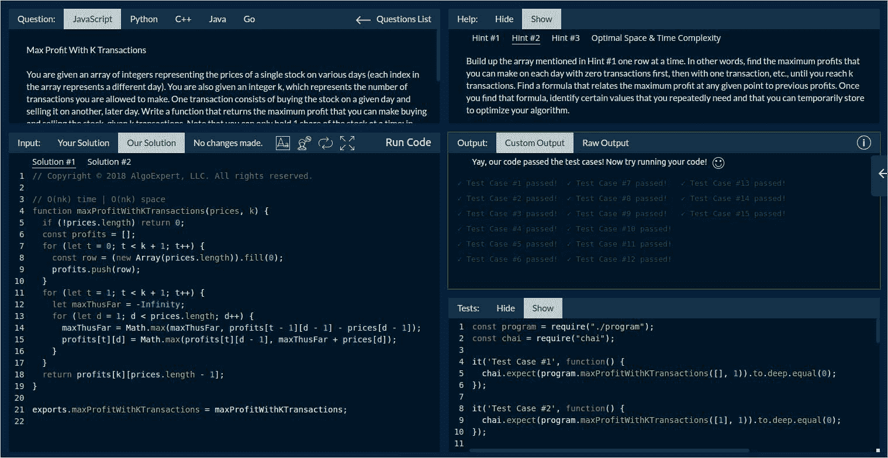
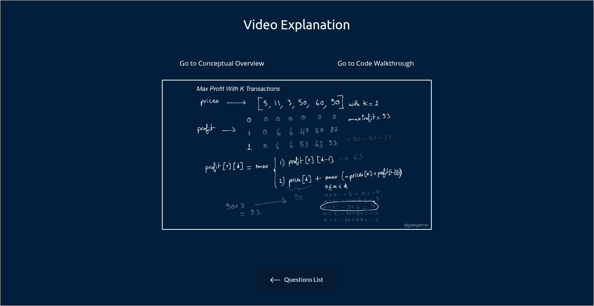
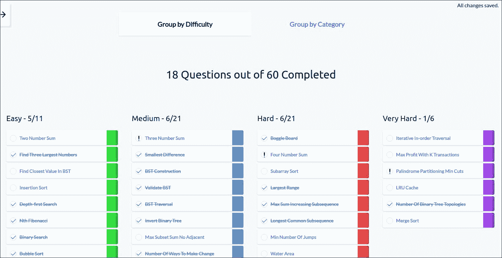
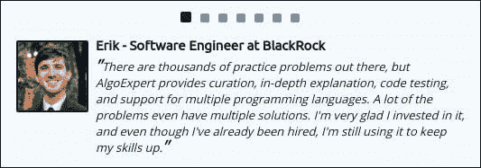
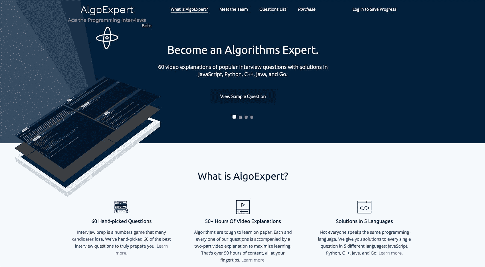

# 增长到每月 40，000 美元，帮助开发人员通过编程面试

> 原文：<https://www.indiehackers.com/interview/growing-to-40-000-mo-helping-developers-ace-programming-interviews-c18ea25116>

*最近更新时间:2019 年 4 月*

## 你好！你的背景是什么，你在做什么？

嗨！我叫克莱门特·米哈伊尔斯库。我是谷歌的软件工程师，也是[算法专家](https://www.algoexpert.io/product?src=ih)的联合创始人兼首席执行官。

AlgoExpert 是一个帮助未来软件工程师准备算法密集型编程面试的网站。该网站提供了 65 个精选的面试练习问题，并会定期添加更多的问题。每个问题都附有:

*   由两部分组成的深入视频解释，包括手头算法的概念性“白板”概述，涵盖其内部工作原理及其时空复杂性分析，以及解决方案的完整编码演练
*   用五种流行的编程语言(JavaScript、Python、C++、Java 和 Go)编写的解决方案
*   一个成熟的编码工作区，你可以在这里输入你的代码，运行它来测试预先准备好的测试用例，如果你需要帮助，可以查看提示

自 2017 年 9 月正式推出以来，我们的月总收入一直呈健康上升趋势，2018 年 4 月突破 2000 美元/月，2019 年 4 月突破 40000 美元/月。

 

## 是什么促使你开始使用 AlgoExpert？

从高中时代与朋友一起做小项目，到大学期间参加一系列创业管理课程，企业家精神一直是我的内在组成部分。事实上，创业的吸引力是我决定在大学毕业并获得数学学位后立即报名参加编码训练营的原因。我想要——我*需要*——实用的编程技能，将一个想法变成一个真实的、可工作的产品。

2017 年 2 月，我在准备自己的技术面试时，萌生了 AlgoExpert 的想法。

我刚从一个编码训练营毕业，意识到自己在算法领域准备不足。我开始一页一页地阅读密集的面试准备书籍，并在网上搜索 YouTube 视频，也许能为我遇到的算法问题的神秘文本解决方案提供一点线索。我梦想有一天，我可以打开浏览器，快速找到一个好的面试问题，用我喜欢的编程语言为它编写一个解决方案，如果我卡住了，就可以得到提示，对预先制作的测试案例运行我的代码，并观看解决方案的视频解释，以真正理解问题——所有这些都在一个地方完成。

那时我构思了 AlgoExpert。

几周后，在向我最好的朋友之一、现在的联合创始人 Antoine Pourchet 提出这个想法后，AlgoExpert 诞生了。Antoine pour chet 是优步大学的一名软件工程师，他在准备面试时也经历了同样的挣扎。

 

## 构建产品的过程是怎样的？

我们在 2017 年 2 月底开始开发 AlgoExpert，就在我开始在谷歌全职软件工程工作的两个月前。

2017 年 4 月，我们花了大约一个半月的时间马不停蹄地建立并推出了一个封闭的免费 Alpha 版本的网站。这个版本拥有当前网站的核心功能，大约有一半的问题，减去 C++和 Java 支持，移动响应，以及一些其他非必要的功能。

从那以后，我们就一直在全职工作和算法专家的职责之间周旋，挤出每一个可能的机会投入时间，通常每周工作 100 小时。我工作日的通勤时间都用来研究 AlgoExpert。我早上和晚上 40 分钟的火车旅程通常都是在我的笔记本电脑上开发新功能，我通常会在早上和晚上 15 分钟的地铁旅程中用我的手机给合作伙伴和客户发送电子邮件。我工作日的晚上和晚上也是在 AlgoExpert 上工作。我的周末——你猜对了——很大程度上也是在 AlgoExpert 上度过的。构建这一平台需要大量的精力和奉献，我们认为这是值得的。

如果你真的想创业，你必须全身心地投入，这需要大量艰苦、持续的工作。

TweetShare

该网站是一个运行在[谷歌 Kubernetes 引擎](https://cloud.google.com/kubernetes-engine/)和[谷歌云数据库](https://cloud.google.com/datastore/)上的 [React](https://reactjs.org/) 应用程序，与 [Go](https://golang.org/) 后端相对。我们已经构建了自己的代码执行引擎，针对速度进行了优化，以降低成本，并且我们依靠 [Docker](https://www.docker.com/) 容器进行网络和资源隔离。我们的指标跟踪、监控和警报工作由 [Stackdriver](https://cloud.google.com/stackdriver/) 和 [Slack](https://slack.com/) 机器人驱动。

在资金方面，我们决定自己出资，每个人一次性投资 2500 美元，这涵盖了我们最初的固定成本，留给我们几个月的时间。启动费用包括用于视频“白板”部分的 iPad Pro、强制性有限责任公司成立费、托管费等。自那以后，AlgoExpert 就一直自给自足。

 

## 你是如何吸引用户和培养算法专家的？

当我们在 2017 年 4 月推出我们的 Alpha 时，我们有一个适度的零用户。从那以后，我们非常自然地发展到超过 3000 名用户，这在很大程度上要归功于我与 [Fullstack Academy](https://www.fullstackacademy.com/) (FSA)的联系，这是我在 2016 年 9 月至 12 月期间参加的编码训练营。

在我们创业的最初几个月，我们将该产品免费发放给了 FSA 的学生，他们联系我，询问我训练营结束后的旅程。我们从那些早期用户和测试人员那里得到了很好的反馈，这有助于验证产品。最终，我开始教授一门算法课，并在金融服务管理局每六周举行一次编程方面的晚间讲座——面试准备，并在此过程中宣传算法专家。我也在一个朋友的[播客](https://www.impostor-syndrome.org/)上做过关于这些话题的[采访](https://www.impostor-syndrome.org/episodes/23-technical-interview-prep-with-clement-mihailescu)。

慢慢地，但肯定地，人们开始购买产品，享受它，并传播这个词。

2017 年 9 月，我们实际销售产品的第一个月，我们完成了三笔销售。接下来的一个月，我们做了大约 15 个，从那以后我们的月销售额持续增长。2018 年 4 月，借助我们在 [Quora](https://www.quora.com/business) 上投放的广告，我们超过了 40/月，以补充我们的其他营销努力。2018 年 8 月，我们与 FSA 达成协议，他们将为他们所有项目的每个学生购买一份 AlgoExpert。

从那以后，我们一直专注于积极的社交媒体营销:在编码博客上发表客座博文，脸书/谷歌/LinkedIn/Reddit/Quora 广告活动，以及在软件工程领域与 YouTubers 合作赞助视频。我们从 2018 年 11 月开始通过 YouTubers 投放广告，迄今为止取得了最好的效果。

| 月 | 客户 |
| --- | --- |
| 17 年 9 月 | 3 |
| 17 年 10 月 | 18 |
| 17 年 11 月 | 12 |
| 2017 年 12 月 | 16 |
| 2018 年 1 月 | 15 |
| 2018 年 2 月 | 21 |
| 18 年 3 月 | 26 |
| 2018 年 4 月 | 41 |
| 2018 年 5 月 | 55 |
| 2018 年 6 月 | 37 |
| 2018 年 7 月 | 31 |
| 2018 年 8 月 | 272 |
| 18 年 9 月 | 143 |
| 18 年 10 月 | 14 |
| 18 年 11 月 | 176 |
| 2018 年 12 月 | 369 |
| 19 年 1 月 | 339 |
| 2019 年 2 月 | 366 |
| 19 年 3 月 | 708 |
| 2019 年 4 月 | 809 |

## 你的商业模式是什么？

我们的产品非常简单，故意缩小了目标范围。我们出售对我们平台的访问(问题、视频、编码工作区等)。)一次性收费 70 美元或每月 25 美元。

我们的一些目标客户通过特殊的促销代码获得折扣。事实上，如果你正在阅读这篇文章，并且想要购买 AlgoExpert，请使用我们的[购买页面](https://www.algoexpert.io/purchase?src=ih)上的促销代码 **indiehackers** 来获得折扣！

从第一天起，我们的目标就是尽可能保持网站的简洁和专注。我们为用户提供了一个方便实用的工具，帮助他们学习如何在编程面试的范围内解决算法问题。我们只做那一件事，但我们做得很好。

 

## 你的竞争优势是什么？

AlgoExpert 与该领域的其他产品相比有三大竞争优势:

1.  我们全面的解释视频——没有其他产品具备这一点，我们一次又一次地从客户那里听到我们的视频是多么的无价。我们的视频让我们与众不同。
2.  我们平台的一体化方面——我们为您提供了 70 个精选的问题，您可以在网站上用 5 种流行的编程语言中的任何一种进行编码，并在同一位置提供您可以切换的提示、您可以运行代码的测试案例以及您可以参考的书面解决方案。你不需要用 YouTube 来补充你的研究，也不需要写你自己的测试案例，努力找出你的解决方案是否正确。
3.  我们的价格——一个问题一美元，对于我们提供的内容来说，我们的价格是无与伦比的。

 

## 你的财务状况怎么样？

作为一家在线软件公司，我们很幸运地拥有相当低的费用。我们目前的月支出如下:

*   [谷歌云平台](https://cloud.google.com/)——600 美元/月
*   广告——10，000 美元/月
*   杂( [Adobe 创意云](https://www.adobe.com/creativecloud.html)、 [Vimeo Premium](https://vimeo.com/upgrade) 等。)——每月 115 美元
*   [Stripe](https://stripe.com/)——500 美元/月(注意，Stripe 更像是一种税收，因为它的成本与我们的收入成正比)

我们预计，随着时间的推移，唯一会显著增加的两项成本是广告成本，当然还有条纹成本。

我们只做那一件事，但我们做得很好。

TweetShare

当我们开发产品时，我们针对简单性和成本最小化进行了优化。简单意味着外包某些复杂的功能，比如我们的支付处理和认证服务。对于前者，我们使用 Stripe，对于后者，我们使用 Google OAuth、脸书登录和 Github OAuth。成本最小化意味着实现我们自己版本的特性，如果这样做在财务上有意义的话。例如，我们构建了自己的代码执行和内部持续集成工具，因为我们拥有必要的专业知识，并且它为我们节省了——并将继续节省——大量资金。

我们的月总收入自然也随着我们的销售额增长，2019 年 4 月是我们迄今为止最好的一个月，每月 40，000 美元。请注意，我们在几个月中对价格进行了一些试验，这解释了一些可能令人困惑的数字。

| 月 | 收入 |
| --- | --- |
| 17 年 9 月 | 200 |
| 17 年 10 月 | 950 |
| 17 年 11 月 | 600 |
| 2017 年 12 月 | 1000 |
| 2018 年 1 月 | 750 |
| 2018 年 2 月 | 1000 |
| 18 年 3 月 | 1100 |
| 2018 年 4 月 | 2000 |
| 5 月 18 日 | 3052 |
| 2018 年 6 月 | 1996 |
| 2018 年 7 月 | 1780 |
| 2018 年 8 月 | 11340 |
| 18 年 9 月 | 6022 |
| 18 年 10 月 | 746 |
| 18 年 11 月 | 7465 |
| 2018 年 12 月 | 15511 |
| 19 年 1 月 | 14435 |
| 2019 年 2 月 | 15081 |
| 19 年 3 月 | 31323 |
| 2019 年 4 月 | 40052 |

## 你未来的目标是什么？

我们前进的主要目标是继续扩大我们的用户群。

我们正在考虑的一个途径是与各种编码训练营合作，那里的学生缺乏技术面试所需的算法和数据结构准备和知识。理想情况下，我们希望将 AlgoExpert 融入他们的课程中。我们也在探索与流行的编程-面试-准备书籍和其他在线平台的创作者合作的可能性。

最后，如上所述，我们前进的主要目标和挑战是同一个:扩大我们的市场，让我们的产品到达成千上万的用户手中。

 

## 你学到了什么？

在过去的一年里，构建 AlgoExpert 的工作收获颇丰，也给我们上了宝贵的一课。对我来说最突出的两个是:

**1。贵公司的创始团队非常重要。**

*   你需要建立基于信任和开放交流的牢固关系(如果这听起来像是婚姻建议，那是因为创始团队非常像婚姻)。我和我的联合创始人 Antoine 非常幸运地拥有如此牢固的关系，这使我们能够完全远程地(我在纽约市，而他在硅谷)构建 AlgoExpert，几乎没有任何问题或摩擦。如果没有信任和沟通，我们将会经历一段极其艰难的时期。
*   你需要有互补的技能组合。我的前端技能和产品管理倾向与 Antoine 在开发健壮的 API 和可伸缩基础设施方面的专业知识完美结合。如果我们的技能重叠太多，我们可能无法创造我们业务的每一部分。

**2。你必须投入工作。**

很容易想出很酷的想法，幻想它们可能是什么样子，并告诉人们，但永远不会实现它们，尤其是当你有一份全职工作的时候。如果你真的想创业，你必须全身心地投入，这需要大量艰苦、持续的工作。

## 怎样才能学到更多？

不用说，看看[算法专家](https://www.algoexpert.io/product?src=ih)！如果您对产品有任何疑问，请通过我们的[联系表](https://www.algoexpert.io/contact?src=ih)询问我们。如果你想和我联系，请联系 LinkedIn。

——[<picture id="ember8234576" class="user-avatar ember-view user-link__avatar"></picture>克莱门特·米哈列斯库](/clementmihailescu?id=7nHHkEDctldH3GcK5vsaqnAA7uw2)，AlgoExpert 创始人

## 想像 AlgoExpert 一样建立自己的事业？

你应该加入独立黑客社区！🤗

我们是几千名创始人，互相帮助建立有利可图的业务和副业。来分享你正在做的事情，并从你的同事那里获得反馈。

还没准备好开始使用你的产品吗？没问题。这个社区是一个认识人、学习和实践的好地方。随意[随便浏览](/)！

——[<picture id="ember8234581" class="user-avatar ember-view user-link__avatar"></picture>柯特兰艾伦](/csallen?id=ibTLPyjwVebnZjMGKvz6ztarnuV2)，独立黑客创始人

57votes