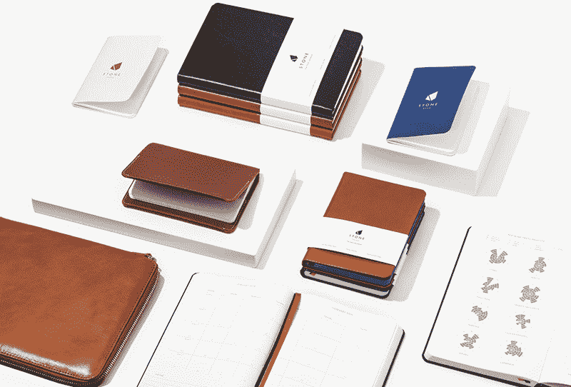
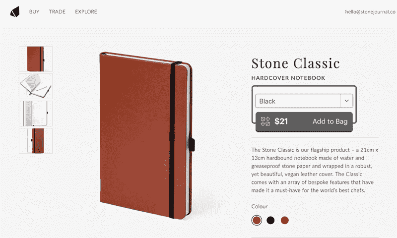
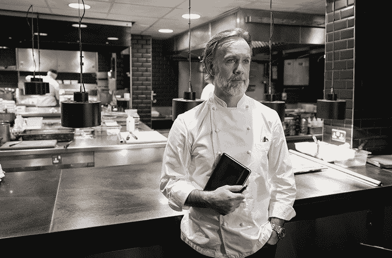

# 通过正确的方式进行影响者营销，增长到 4 万美元的 MRR

> 原文：<https://www.indiehackers.com/interview/growing-to-40k-mrr-by-doing-influencer-marketing-the-right-way-56cd88ef71>

## 你好！你的背景是什么，你在做什么？

我是斯特凡·约翰逊，32 岁，在伦敦出生和长大。我在大学学过纪实摄影，但很快就被自由职业的机会阻碍了。因此，我成立了自己的设计机构，并与非营利组织和社会企业合作开发 UX 和数字战略。但当有机会与一位客户合作成为创意总监时，我抓住了机会。

与 [Bookblock](https://business.bookblock.com) 合作，我共同创立了 [Stone](https://www.stonejournal.co/) :一个为食品和饮料行业创造创新新产品的贸易和生活方式品牌。我们使我们的产品尽可能实用和美观，以满足一个最无情的行业的需求。

我们现在平均每月销售 45，000 多种产品，收入约为 40，000 美元。

 

## 是什么促使你开始接触 Stone？

斯通出生时正为我的委托人艾略特工作。我们在米其林星级厨师迈克尔·凯恩的厨房里工作，他用假肢做饭。我们注意到，当记下食谱和想法时，他的笔记本会滑过金属表面。我想到在封面上放一块磁铁，我们很快意识到这不仅能帮助迈克尔，还能帮助各地的厨师。

在回家的火车上，艾略特和我头脑风暴了一个厨师的完美笔记本:它会是什么样子？我做了多年的美食摄影师，我们俩一起参观了世界上无数的厨房。利用我们对厨师工作条件的第一手知识，我们想出了十几个可以改变他们记笔记过程的独特功能:平面设计、集成转换图表和石头纸制成的防水页面。

石头纸是一种相对较新的材料，只有几家工厂生产。找到一些样品后，我们带着草图和材料去了伦敦附近的一家第四代书籍装帧店。在我们两个团队之间，我们能够快速地制造出不同批次的原型。然后，我们将它们发送给来自世界各地的大约 80 位备受尊敬的厨师，以便 A/B 测试这些功能。反馈非常有帮助，让我们可以缩小到七个特征；这也为我们的营销策略奠定了基础。

 

## 构建最初的产品需要什么？

设计本身是雄心勃勃的。将七个功能整合到一台笔记本中是很难的，但我们确信每个功能都是必要的。我们本来可以满足于一两个，但我们已经看到了厨师的笔记本会变得多么破旧，我们希望我们的产品能够完全应对工作厨房的压力。

使 [Bookblock](https://business.bookblock.com/) 与众不同的是，他们能够为非常低的最低订单量定制消费者标准产品。如果 Bookblock 不存在，我们唯一经济上可行的选择就是把生产转移到中国；但即便如此，订单数量也必须大幅增加，质量也无法保证，运输时间也会导致项目延期。

一旦原型被调整，我们有一个 1000 个单位的初始运行创建。

由于我的另一家公司 Bookblock 正处于成长阶段，这个项目几乎没有可用的财政资源。我还在担任 Bookblock 的创意总监，所以时间也是一个问题。如果我有更多的时间和金钱，我会把重点放在开发品牌和营销上。但是因为这个项目从第一天起就必须自给自足，所以我需要立即实施我们的销售策略。

当你没有资金支持库存时，这是非常棘手的，尤其是当我们作为消费者有这种第二天亚马逊的心态时。因此，我们必须明智地提供和履行。我们没有直接面向消费者，而是开始将它作为一种可定制的产品提供，其最低起订量为 25。我们主要针对餐馆以及食品和饮料品牌，将它作为一种可以贴牌的礼品进行推广。有了一个月的周转期，我们能够一次批量订购 200 个，以保持有效，销售在生产之前就开始了。

注重质量第一。

TweetShare

## 你是如何吸引用户并种植石头的？

我们在早期取得了很多成功，其中很大一部分成功来自厨师的认可。厨师是很有影响力的人；他们训练有素，诚实，当他们喜欢某样东西时，他们倾向于谈论它而不追求回报。因为我们来自他们行业的一个职位，我们联系的厨师很乐意加入。

我们赠予的前 80 名厨师非常慷慨地给予他们“影响力”真正有帮助的是，他们觉得自己是其中的一部分——事实也的确如此。当他们在社交媒体上分享产品图片时，他们的赞美是真诚的。我们通过这种方式获得了惊人的关注，我想我们在头两周内从零关注者增加到了 3000 关注者。

 

这些社交活动让我们获得了一小部分定制订单，但我们也获得了个人的巨大兴趣。他们主要是年轻的厨师，食品和饮料行业的其他人，以及“职业消费者”Prosumers 是我最近接触到的一个术语，我发现它非常准确。它指的是渴望从事某一行业的大量且不断增长的消费者；在这种情况下，烹饪。他们的知识介于消费者和专业人士之间。渴望成为米其林级别厨师的职业消费者受到他们追随的厨师的影响，所以当这些厨师开始认可一种新的行业工具(不需要花费 300 美元，比如碳刀)时，他们不可避免地会敲门。

一些最初让我们担心的事情最终成为我们在营销方面最大的优势。当我们发出原型的时候，我们并没有预料到产品会有如此大的曝光率。我们没有网站，没有全新的社交平台，也没有什么营销资产。但是这种品牌的“缺席”使得产品变得神秘，更加令人向往。我们开始听到厨师们询问其他厨师如何获得我们的产品。

我们建立了一个简单的单页网站，只有一个电子邮件注册表格。然后，我们向另外 200 名厨师发送了免费的石头笔记本。窃窃私语声越来越大，在六周内，我们收集了 2500 个电子邮件地址和一个强大的客户数据库。

 

## 你的商业模式是什么，你是如何增加收入的？

斯通通过精心扩大产品范围来增加收入。到目前为止，我们已经推出了 6 种新产品，还有 12 种正在开发中。我们还推出了业务的编辑部分。缓慢但肯定的是，我们正在扩展到食品和饮料领域的其他角落，从调酒师到咖啡师都是我们的目标。

我们的模式依赖于三个关键市场——食品和饮料专业人士、食品和消费品牌以及有抱负的消费者。早期，我们创建了一个流程图，说明我们计划如何以及何时瞄准这三个群体。我们早期的成功表明，一切都应该从专业人员开始，因为他们毕竟是有影响力的人。

我们联系专业人士是最传统的策略。我们通过电话或电子邮件直接联系他们，把产品发给他们，并在个人层面上与他们互动。我们利用我们所有的网络接触尽可能多的顶级专业人士。

然后，我们开始制作针对这些厨师的照片和视频活动，请他们自由谈论该产品及其在厨房中的用途。这些是通过社会支出有机分享的。这就是我们接触品牌和消费者的方式。

B2B 销售的好处在于，我们的许多客户将产品赠送给专业人士。世界最大的巧克力商 Valrhona 购买了 4000 块联名款巧克力，然后赠送给糕点师傅。这件事的美妙之处在于，它实际上是免费营销，并再次启动了这个循环。

由于与[企业客户](https://www.stonejournal.co/trade/)的密切关系和积极的零售试验，我们希望在 2019 年达到 50 万美元的营业额。我们计划将我们的产品系列引入英国、美国和欧洲的更多商店，将我们的 SKU 数量增加两倍，并以我们的企业产品为基础，我们希望到 2020 年营业额翻一番。

但我们的重点一直是质量。通过创造实用、美观的工具、配件和服装，我们可以将价格定得比一些竞争对手高。我们将石材打造为行业标准；因此，对于普通消费者来说，我们的产品代表了一种价格合理的高端设备。我的建议是首先关注质量。不要指望出售半生不熟的东西。

我真的认为最重要的是真诚对待你所做的事情。如果你不相信你的产品，没有人会相信。

TweetShare

## 你未来的目标是什么？

展望未来，我们希望改善我们的配送和履行网络。目前，一些国家的消费者不得不支付更多的运费，因此我们正在寻找最有效的方式将我们的产品送到世界各地的客户手中。这将是一项艰巨的任务，但满足不断增长的产品需求取决于我们。

我真正感兴趣的项目是《石头》杂志。我们的希望是在专业美食作家、编辑和摄影师的帮助下，创建一份年度全球杂志。但它不会只是一份普通的食品出版物。它将由业内最聪明、最有魅力的人讲述发人深省的故事。这只是我们想巩固斯通作为权威的真实声音的一种方式，另外这也是我再次回到镜头后面的一个借口。

随着我们推出[皮革系列](https://business.bookblock.com/leather-products/)和消费者[礼品网站](http://bookblock.com)，Bookblock 也处于一个非常有趣的阶段。

## 你面临的最大挑战和克服的障碍是什么？如果你必须重新开始，你会做什么不同的事？

我们使用非常特殊的材料，因此我们在采购和生产成本方面遇到了挫折。正如我提到的，世界上只有少数几家工厂生产石头纸。当我们在 Kickstarter 活动后不得不创建超过 10，000 个单元时，我们发现自己正在耗尽所有分销商的库存。除了管理客户的期望，我们对此无能为力。

我面临着同样紧张的挑战，既要成为历史上最成功的食品众筹者之一，又要在短短几个月内成为一名父亲。向全球运送 4000 多份定制订单对我们的小团队来说是一个巨大的挑战，不眠之夜和肮脏的尿布也于事无补。

我想也许我们应该从一开始就设定更明确的目标。我喜欢斯通一直在成长和变化的事实，但有时有一两个短期目标可以阻止你迷失在大环境中。

## 对于刚刚起步的独立黑客，你有什么建议？

我真的认为最重要的是真诚对待你所做的事情。如果你不相信你的产品，没有人会相信。但是如果你全力以赴，这将会让整个过程变得更加容易。

还要确保它是人们想要的产品。我认为很容易带着你的想法逃跑，并在未来迷失方向。你不能忽视这个最基本的问题。你可以有最好的品牌，最好的营销，所有的运营都到位，但如果你不能超越这种硬推销，最终你会筋疲力尽。

有时候有一两个短期目标可以让你不至于迷失在大局中。

TweetShare

## 我们可以去哪里了解更多？

网址:【https://www.stonejournal.co T3

博客:【https://www.stonejournal.co/explore/ 

https://www.facebook.com/StoneNotebook/:[脸书](https://www.facebook.com/StoneNotebook/)

insta gram:[https://www.instagram.com/stonenotebook/](https://www.instagram.com/stonenotebook/)

书挡:[https://business.bookblock.com/](https://business.bookblock.com/)

更多关于我们所做的事情，请在下面的评论中给我们留下问题。

——[<picture id="ember8069346" class="user-avatar ember-view user-link__avatar"></picture>斯蒂芬·约翰逊](/StoneJournal?id=z946KmsPywO2r9rvbbujWfQQ9Zi1)，石头的创始人

## 想像石头一样建立自己的事业？

你应该加入[独立黑客社区](/)！🤗

我们是几千名创始人，互相帮助建立有利可图的业务和副业。来分享你正在做的事情，并从你的同事那里获得反馈。

还没准备好开始使用你的产品吗？没问题。这个社区是一个认识人、学习和实践的好地方。随意[随便浏览](/)！

——[<picture id="ember8069351" class="user-avatar ember-view user-link__avatar"></picture>考特兰艾伦](/csallen?id=ibTLPyjwVebnZjMGKvz6ztarnuV2)，独立黑客创始人

11votes