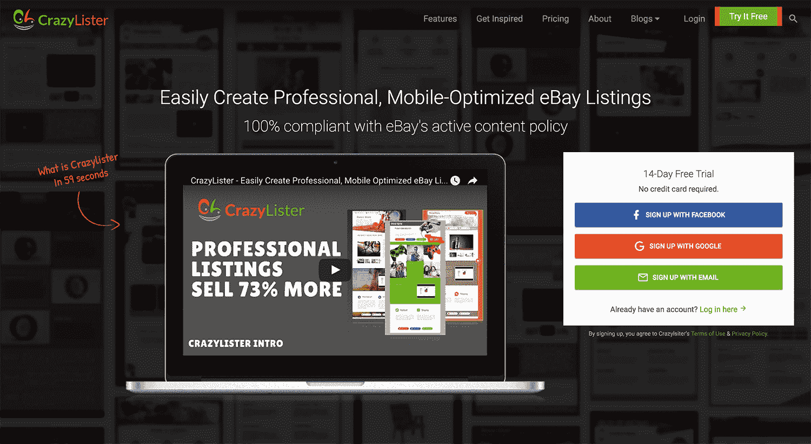

# 通过为易贝上市带来出色的设计，每月增长到 5 万美元

> 原文：<https://www.indiehackers.com/interview/growing-to-50k-mo-by-bringing-great-design-to-ebay-listings-47453761eb>

## 你好！告诉我们你在做什么。什么是 CrazyLister？

大家好，我是 Maxim，我是 CrazyLister 的创始人之一，这个工具可以帮助你轻松创建专业的、针对移动设备优化的易贝房源。CrazyLister 取代昂贵的平面设计师，以节省您的时间和金钱，同时提供令人惊叹的设计。

多名研究人员已经表明[专业设计提高转化率](https://crazylister.com/blog/actionable-insights-to-increase-sales-analyzing-ebay-listings)，所以 CrazyLister 不仅是关于令人敬畏的设计，更重要的是它也是关于增加你的销售。

如今，45，000 名易贝卖家使用 [CrazyLister](https://crazylister.com) 为超过 800 万个易贝卖家提供服务。

## 是什么促使你开始使用 CrazyLister？你最初的目标是什么？你是怎么想出这个主意的？

在创办 [CrazyLister](https://crazylister.com) 之前，Victor(我的联合创始人和首席执行官)和我都是易贝卖家。我们在没有任何经验的情况下开始在易贝销售，3 年内我们的销售额达到了 450 万美元。作为易贝卖家，我们的绝大部分成功来自于非常高的转化率，这要感谢我们对专业设计的重视。

在因最高转换率获得了几次易贝奖后，我们开始收到许多公司的请求，他们希望我们为他们做我们为自己做的事情。我们将此视为拓展业务的机会，并开始为这些公司提供咨询服务。

然而，在与几十个客户合作后，我们意识到这不是我们想要发展的业务类型。我们不想成为另一家咨询公司，因为在我们看来这是不可扩展的。我们需要的是提供我们这些年积累的所有知识，让尽可能多的卖家受益，而不必一对一地咨询他们。

我们非常清楚，易贝卖家最大的痛苦之一是上市设计创作过程，说得委婉一点，这不是一个非常积极的体验。此外，易贝没有提供一个好的解决方案——如果你需要一个专业的列表设计，你必须向图形设计师支付一大笔钱，除非你非常精通计算机，并且知道 HTML 和设计原则。

我们将所有关于 ebay 销售转化优化的知识都倾注到一个超级易用的解决方案中，这就是 [CrazyLister](https://crazylister.com) 的诞生。我们雇佣了一个开发者，第一行代码是在 2013 年写的。

## 你们俩都不是开发商。构建初始产品的过程是怎样的？你投入了多少时间和金钱？

当我们开始创建 crazy lister 时，Victor 和我已经非常熟悉易贝以及它给新手卖家带来的所有挑战。毕竟，我们在 5 年内经历了从一无所知的初学者到知名的易贝专家的旅程，这些专家咨询了一些最大的以色列公司。

为了创建 Crazylister 的 MVP，我们雇佣了两名开发人员，他们在 MVP 上工作了大约 6 个月。后来，他们又继续开发了一年，之后我们聘请了第三位联合创始人担任我们的首席技术官:Poran，一位经验丰富的软件工程师，在英特尔和 IBM 领导团队长达 16 年。

到那时，我们已经投入了大约 25 万美元的自有资金(我说的“自有资金”主要是指从银行疯狂贷款)来启动这个产品。然后，我们从一家风险投资公司获得了 60 万美元的种子资金。作为一个非技术型的创始人，我强烈建议和一个愿意无偿工作并设定产品开发里程碑的技术型联合创始人一起开始这样的项目。

就方向而言，如果我们作为易贝·塞勒斯的工作需要这样一个工具，我们就按照我们希望的方式构建了 [CrazyLister](https://crazylister.com) 。我们想让没有时间和金钱花在昂贵的平面设计师身上，但仍然需要快速获得专业结果的人，尽可能容易地创建专业的易贝列表设计。

## 你用过哪些营销策略？你是如何吸引用户并成长为 CrazyLister 的？

2014 年，我们推出了 [CrazyLister 的](https://crazylister.com)测试版，并开始获得一些初步的关注。我们没有钱花在付费营销上，所以我们开始写内容，希望通过我们的内容产生足够的价值，说服人们尝试 CrazyLister。这种策略非常有效，尽管这个软件勉强称得上是 MVP(最小可行产品)，但用户似乎发现它非常有用。

我们的博客[易贝卖家每月 10 万美元的旅程](https://crazylister.com/blog)可能是我们最初增长的最大贡献者。直到今天，我们还在继续每周发布一篇博客文章，这篇文章总是由我或 Victor 撰写。我们很少允许在我们的博客上发表客座博文，当我们这样做时，它必须是最高质量的，并且充满对我们用户的相关见解。

我们最初增长的另一个重要因素是专注于征服以色列的一个非常非常小的市场，以色列只有不超过 600-800 名专业易贝卖家。由于以色列很小，而我们在易贝社区已经相当知名，一旦我们推出 [CrazyLister](https://crazylister.com) 并向以色列社区宣传，它就很快被大多数卖家采用。

我们采用了一种现有的技术(拖放编辑器，类似于 Wix ),并在一个从未见过这种东西的行业中实现了它，这足以让相当多的易贝卖家伙伴兴奋不已。在两个月内，我们的注册用户超过了 1000 人，并开始获得惊人的反馈，帮助我们构建产品未来的路线图。

 

当我们的用户达到 15000 人时，我们加入了欧洲领先的加速器项目 [Startupbootcamp](https://www.startupbootcamp.org) ，我们在阿姆斯特丹呆了 4 个月。与此同时，我们获得了 60 万美元的种子资金，这让我们能够招募到研发和营销领域经验丰富的团队成员，从而真正推动了我们的增长。我们开始尝试付费营销，并增加了验证实验的费用。

有机 SEO 是我们花时间的另一个重要渠道。它主要是通过在各种渠道上写高价值的内容，并用元标签、相关焦点关键词等来改进我们已经写好的内容。

我们最近还在 YouTube 上推出了一个名为[易贝医生](https://www.youtube.com/channel/UCLYT6D81SlfFNA8AeCvIMtg)的频道，在那里我们向易贝卖家传授在易贝销售的最佳实践。它的浏览量已经超过了 1 万次，这反过来又增加了流量。

## CrazyLister 的商业模式是如何运作的？你收入背后的故事是什么？

CrazyLister 是一个 SaaS 解决方案，我们的商业模式是基于订阅的。我们迎合任何人，从刚刚起步的非常小的易贝卖家到想要替换昂贵的设计师并让他们的钱获得更大价值的大企业。

我们一开始是一项免费增值服务，你为 CrazyLister 支付的费用取决于你应用 CrazyLister 设计的易贝列表的数量。我们每月收费低至 7 美元，并提供 14 天的试用期，这基本上允许每个易贝卖家免费试用 CrazyLister，然后决定他们是否会继续使用它。这种模式也使企业能够只为他们需要的东西付费。

我们使用 [PayPal](https://www.paypal.com) 接受付款。在我们的历史上，我们的收入每月增长 15%，2016 年我们的整体 MRR 增长率为 547%。我们在 2016 年还增加了 30，000 多名用户，并在这一年结束时每月产生超过 50，000 美元的收入。

我们最近推出了年度计划，结果非常受用户欢迎，超过 25%的用户选择了年度计划。到目前为止，我们的用户大多是小商家(产品列表少于 500 个的卖家)，他们约占我们用户的 90%。2017 年，我们将为大型商家推出新功能——批量功能允许在几秒钟内为数千种产品创建设计——并将追求那些需要设计满足其所有电子商务需求的大型品牌。

今天, [CrazyLister](https://crazylister.com) 和它早期的 MVP 时代完全不同。我们非常关注开发，并且每月都在推出新功能。我们专注于创新功能，例如我们几个月前推出的全球首款也是唯一一款移动易贝房源编辑器。改进产品直接有助于收入增长。

《T2》杂志的《T3》团队大部分由开发者组成。我们认为 CrazyLister 还远未完成，并在不断改进它。一年后，CrazyLister 将变得更加智能，对用户来说也更有价值。

 

## 你未来的目标是什么？你认为未来会有什么大的挑战吗？

在易贝上市仅仅是《T4》的开始。任何认真做生意的网上商家都在多个平台上销售，比如阿里巴巴、他们自己的网上商店，以及脸书和 Pinterest 等社交媒体渠道。所有这些平台都需要专业的设计来增加一个人的销售机会，现在你需要为你想要销售的每个渠道使用不同的设计工具。这在您的业务流程中造成了极大的低效。

在 CrazyLister 有了一个集中的设计中心，您可以通过创建一个设计并在与您的业务相关的所有不同销售渠道中使用它来节省工作时间。随着我们向新市场和销售渠道的扩张，我们希望能够吸引大约 2000 万需要专业设计的在线商家。

随着更多用户的加入，CrazyLister 也将变得更加智能。我们收集设计阶段几乎每一个动作的数据点(例如添加图片、编辑文本、调整页面大小等)。).我们跟踪大约 80 个不同的事件，每月收集超过 100 万个数据点。我们现在已经收集了足够的数据点，可以开始分析它们并寻找联系。要分析的最有意思的效果是具体动作和清单转化率之间的联系。这类似于 A/B 测试，但规模更复杂。目标是达到一个设计创造自己的水平，类似于网格项目。

今天的电子商务对在线卖家来说太难了。比方说，你在易贝销售，你想扩展到其他市场，如 Etsy。您需要重新创建您的产品页面，并且您需要为您想要发布产品的每个其他市场和社交媒体渠道重新创建一个设计。太难了，也不应该这样。我们认为电子商务的未来是无摩擦的，通过建立一个人工智能驱动的设计解决方案，我们将消除创建专业设计并将它们分发到多个销售渠道的摩擦。

## 到目前为止，你学到的最大的教训是什么？如果你必须重新开始，你会做什么不同的事？

**第一课:**
创业是一件苦差事。很难达到你开始看到一些投资回报的点(无论是时间还是金钱)。你会遇到挫折，你会失败。这是一个学习和提高的绝佳机会。如果你有勇气学习并坚持下去，早期失败可能是发生在你身上最好的事情。

**第二课:**
从第一天开始记录你的收入和支出。当你开始创业时，有许多费用你应该考虑在内。一开始你可能没有，但一旦你开始成长，它们就会开始增加，如果你不跟踪，你就不能及时意识到你在亏钱，等到你意识到的时候就太晚了。

**第三课:**
我们对客户反馈近乎虔诚的关注是我们开发团队的动力。即使在今天，担任首席执行官的 Victor 实际上也是独自完成大部分客户支持工作。这就是我们认为客户支持的重要性。

开发一个没人想用的产品是没有意义的。如果你继续倾听你的客户，并根据最频繁的反馈采取行动，那么你将提高一些最重要的指标，如客户流失率和 LTV。

**第四课:**
保持真实专注。激光聚焦。坚持做一件事，直到你做得很棒。当你是一家小型创业公司时，你不可能把注意力分散到很多事情上。你必须确保你非常出色地解决了一个问题。

刚开始融资的时候，我们在跟投资人谈两个产品。回过头来看，这绝对是可笑的。一个既没有营收又没有资金的小创业公司如何同时开发两款产品？一个典型的例子是，当史蒂夫·乔布斯回到苹果时，他关闭了 70%的产品线，这些产品线是他们已经工作了多年的。原因很简单:他明白苹果迷失了方向，需要重新聚焦以提振公司，他做到了。

**第五课:**
当你是一家资源有限的小型初创公司时，你做出的每一个财务决策都至关重要。工资通常是年轻的 SaaS 初创公司旅程中最大的支出。每一个员工对整体进展都至关重要。你必须相信你的员工会完成他们的工作，而不是一直看着他们。如果我和我所有的员工在一个房间里，我觉得自己是房间里最笨的人，那么我会充满喜悦，因为我知道我做出了正确的招聘决定。

## 在你的旅途中，什么对你最有帮助？你认为你最大的优点是什么？

我相信我们以前的商业经验是很有帮助的。我们从第一笔生意中犯的错误中学到了很多。但是也有很多我们在第一次创业中从未遇到过的情况，所以我们所做的就是*大量阅读*！

我阅读与我的工作相关的文章，特别是 SaaS 和营销相关的文章。我最喜欢的 SaaS 读物有 [Christoph Janz](http://christophjanz.blogspot.com) (天使 VC 博客作者，知名早期投资人；他投资了几家与我的公司相关的初创公司)，以及[杰森·莱姆金](http://amzn.to/2i9vuBo)(SaaS 的杰出人物之一，作为创始人有 3 次退出)。

我建议挑选 1-2 个你喜欢的博客/出版物，并确保坚持阅读。不要试图关注所有有趣的博客，因为你根本没有时间，最终可能不会持续阅读它们。

## 我们可以去哪里了解更多？

*   网址:[https://crazylister.com](https://crazylister.com)
*   推特: [@CrazyLister_com](https://twitter.com/CrazyLister_com)
*   博客:[易贝卖家月薪 10 万美元之旅](https://crazylister.com/blog)
*   YouTube 频道:[易趣医生](https://www.youtube.com/channel/UCLYT6D81SlfFNA8AeCvIMtg)

——[<picture id="ember5235606" class="user-avatar ember-view user-link__avatar"></picture>马克西姆·戈丁](/CrazyMax?id=Jd0SynPjuZa185HJxlXDebuid3Y2)【crazy lister】创始人

## 想像 CrazyLister 一样建立自己的事业吗？

你应该加入独立黑客社区！🤗

我们是几千名创始人，互相帮助建立有利可图的业务和副业。来分享你正在做的事情，并从你的同事那里获得反馈。

还没准备好开始使用你的产品吗？没问题。这个社区是一个认识人、学习和实践的好地方。随意[随便浏览](/)！

——[<picture id="ember5235611" class="user-avatar ember-view user-link__avatar"></picture>柯特兰艾伦](/csallen?id=ibTLPyjwVebnZjMGKvz6ztarnuV2)，独立黑客创始人

6votes