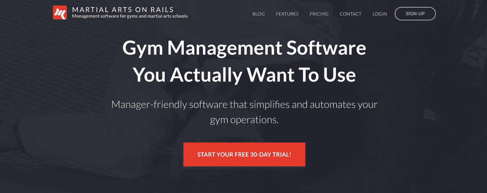
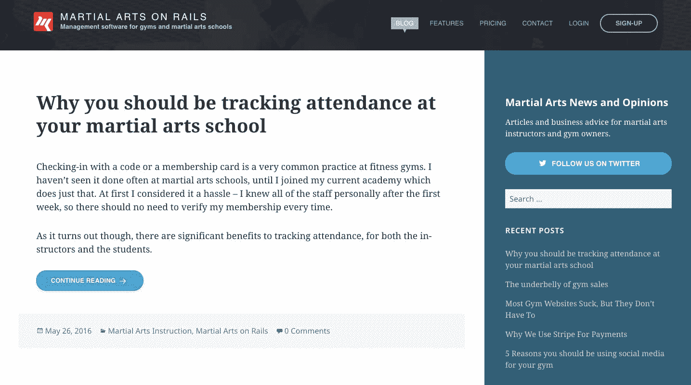
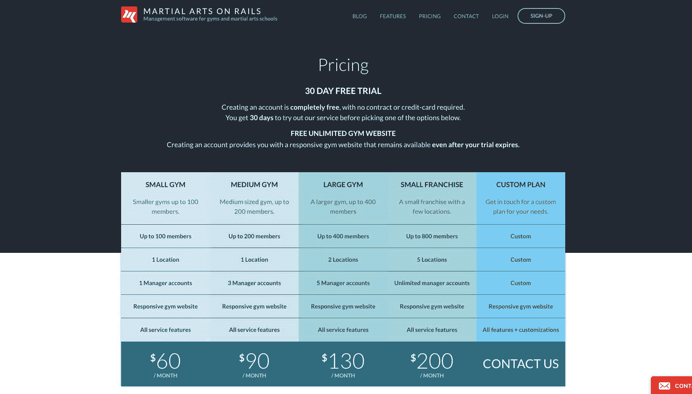

# 通过填补健身行业的技术空白，增长到 5000 美元/月

> 原文：<https://www.indiehackers.com/interview/growing-to-5k-mo-by-filling-a-technology-gap-in-the-fitness-industry-18e3b54250>

## 你好！你的背景是什么，你在做什么？

我是 Eran Galperin，一名软件开发人员和技术企业家。我开发 web 应用程序已经超过 14 年了。早在 2004 年我攻读物理学位时就开始在这个行业工作。

在大学期间，我共同创立了一个专注于 SaaS 开发的网络开发商店。在积累了经验和一些资本后，我和我的一位联合创始人创办了一个开源代码市场。在 Binpress 工作期间，我们经历了 500 个创业公司加速器项目，并筹集了一轮机构种子资金。

我们最终在 2015 年底卖掉了我们的公司，主要是为了回报投资者(在这里阅读一篇全面的事后分析[)。之后，我创办了](http://techfounder.net/2016/02/11/binpress-postmortem/)[武术在线](https://www.maonrails.com)，为健身房和武术学校提供在线管理。它现在每月产生近 5000 美元的经常性收入。

 

## 是什么促使你开始学习武术？

我已经训练巴西柔术将近十年了。卖掉我以前的公司后，我在为我的下一个项目寻找想法，我知道我想把我对柔术的热情和我在 SaaS 的专业知识结合起来。

我开始采访管理我训练的健身房的人，并确定了他们使用的软件的一个痛点——它通常臃肿过时，感觉像 Windows 3.1 软件。凭借我在软件开发和用户体验设计方面的背景，我认为我可以做得更好，并开始着手一个早期的原型。为了获得更多的数据点，我还试着在 reddit 上提问——总体来说，反应是积极的，尽管有些人认为我有些过头了。

在你非常熟悉的市场中创业，以增加你成功的机会。

TweetShare

我有很多构建 SaaS 产品的经验，所以我知道我可以在几个月的时间内自己建立并运行一些东西。我有一个设计师朋友提出了基本的概念和风格，并以此为基础创建了应用程序中的所有流程。在开发过程中，我不断向该地区的健身房经理展示我的工作进展，以确保我走在正确的道路上。

在此期间，我没有工作，也没有创造其他收入，只是靠积蓄过着节俭的生活。我没有太多的广告或营销预算，所以一切都是我自己做。我们的目标是在不需要外部资金的情况下将这个项目推向盈利。

## 构建最初的产品需要什么？

从概念到推出的整个开发过程大约是三个月。在那段时间里，我每周与不同的健身房经理开会，讨论他们目前使用的软件，并讨论他们的痛点。然后，我会回去开始头脑风暴如何解决这些棘手的问题，并将我的想法构建到原型中。当它在 2016 年 2 月推出时，它拥有我在与健身房经理的讨论中想到的所有基本功能，尽管我今天拥有的产品已经发生了重大变化。

尽管名字如此，MAonRails 实际上是建立在 LEMP 堆栈(Linux，Nginx，MySQL，PHP)上的，而不是 Ruby on Rails。后端构建在一个大量扩展的 Zend Framework 安装之上，这是我多年来通过做其他项目构建的。前端使用带有大量 jQuery 的基本 web 技术。所有流程都针对移动和平板电脑进行了全面优化。

## 你是如何吸引用户并在 Rails 上发展武术的？

由于我没有主要的营销预算，我最初的重点是有机和社会渠道。我试图为发布会制造一些媒体，但这很困难。我确实在[产品搜索](https://www.producthunt.com/posts/martial-arts-on-rails)上看到了它，尽管它并不完全是目标受众。

我在公司博客上创建了针对健身房经理的内容，专注于经营健身房的数字方面——如何进行营销，为健身房做本地 SEO，创造吸引健身房会员的渠道，运行推荐计划等等。我联系了许多健身和武术垂直领域的在线出版物，并写了一些客座博客来增加流量和链接。

与此同时，我有一个非常活跃的 Twitter 账户，分享与健身和武术相关的内容。为了了解这个账户，我使用了一个 Twitter 自动化工具，由于 Twitter API 的变化，这个工具不再可用。我还在许多健身房老板和经理参与的几个子街道上非常活跃(特别是 [/r/bjj](https://www.reddit.com/r/bjj/) )，并在这里和那里进行了不太积极的软销售。我已经是这个社区的一员很长时间了，所以我知道正确的方法去接近它，而不会让别人不高兴。现在，每当有人在那里发布关于健身房管理软件的帖子，人们通常会向我推荐他们。

 

我联系了所有和我一起开发初始软件的健身房老板，让他们试用这个软件来替代他们现有的软件。那些是我第一批真正的顾客。这是一个非常紧密的社区，所以随着时间的推移，他们向我推荐其他人。令人惊讶的是，商家账户卖家也是一个推荐来源。在通过我的一个客户与一个客户联系后，我们开始了交叉推荐合作，随着时间的推移，他们向我推荐了相当多的新客户。

我用很少的预算尝试了一会儿 AdWords，但没有得到好的结果，因为它需要对竞争关键词有深入的了解。几个月后，我开始在商业软件搜索引擎 Capterra 上投放广告，现在我在“武术健身软件”搜索中排名第一。这已经成为我最大的转化来源。我最初在 Capterra 上每月花费约 180 美元，现在接近每月 400 美元。目前，Capterra 和有机搜索结果是我的业务的主要收购来源。

| 月 | 客户 |
| --- | --- |
| 2016 年 1 月 | 10 |
| 2016 年 6 月 | 70 |
| 16 年 10 月 | 194 |
| 2017 年 2 月 | 293 |
| 2017 年 6 月 | 393 |
| 17 年 10 月 | 504 |
| 2018 年 2 月 | 643 |

## 你的商业模式是什么，你是如何增加收入的？

这项服务是基于 SaaS 的免费增值订阅。付费用户要么按照五种不同的定价方案中的一种按月收费，要么按照定制方案收费。我提供 30 天的免费试用，包括所有的功能，之后，如果帐户没有升级，它会被降级为有限的免费版本。

帮助增长的主要事情之一是在网站上建立在线聊天(我使用 [Olark](https://www.olark.com/) )。通过每天与潜在客户交谈，我能够学到很多关于如何让他们参与进来的知识。我还为新注册用户建立了一个电子邮件滴注活动，从一封个人欢迎电子邮件开始，然后发送几封后续邮件，试图吸引用户以避免流失。其中一封邮件是在试用期结束前 10 天发出的，询问用户是否愿意延长试用期——许多用户对此做出了回应，这比其他任何功能都有助于留住更多用户。

始终与你的客户交谈——这是真正了解人们如何与你的产品互动的唯一方法。

TweetShare

一开始，注册用户向付费用户的转化率在 5%左右。上线四个月后，我有了第一批两个付费客户。他们是我私下认识的几个健身房经理，但我还是花了几个月才让他们转到付费计划。现在转换率超过了 8%，我认为这一进步主要归功于解决一些常见用例的功能增加，以及上面提到的电子邮件循环。

作为一名职业软件开发人员，我在客户服务方面做得不多，因为通常我会让联合创始人或员工来处理大部分客户互动。然而，作为一项独立的业务，很快就发现擅长提供客户服务是至关重要的。与客户交谈确实让我看到了应用程序的所有弱点——用户体验问题、缺少文档、令人困惑的特性等等。这种对客户服务的关注帮助我与许多付费客户建立了个人关系。随着时间的推移，他们中的许多人推荐了更多的付费用户，不仅仅是因为产品的质量，还因为他们对我提供的客户服务非常满意。

最主要的一点是始终与你的客户交谈——这是真正理解人们如何与你的产品互动的唯一方法。

| 月 | 收入 |
| --- | --- |
| 2016 年 1 月 | 0 |
| 2016 年 6 月 | 180 |
| 2016 年 10 月 | 1050 |
| 2017 年 2 月 | 1630 |
| 2017 年 6 月 | 2110 |
| 2017 年 10 月 | 3240 |
| 2018 年 2 月 | 4280 |

## 你未来的目标是什么？

2017 年主要是听取客户反馈，逐步改进产品。我现在觉得该产品是一个开始增加营销力度和支出的好地方，尽管我目前正在不进行任何额外营销的情况下实现收入翻番。我 2018 年的总体目标是收入翻两番。

随着收入的增加，我希望将更多的收入投入到增长中。我 2018 年的一些目标包括:

*   建立一个投资回报率积极的 AdWords 活动，并慢慢增加支出
*   雇用对外销售人员
*   与商家账户经销商建立更多的交叉推荐合作
*   开始一个联盟计划来激励用户推荐我们

 

最大的挑战将是启动对外销售工作。雇佣销售人员的主要问题是，他们通常擅长在面试中推销自己，在我找到合适的人之前，可能要尝试几次。

## 你面临的最大挑战和克服的障碍是什么？如果你必须重新开始，你会做什么不同的事？

最初很难把消息传出去。我不得不做大量的跑腿工作，仅仅是为了发表几篇文章，有几个月我毫无进展，这有点令人沮丧。如果我想更积极地发展，尽早开展对外销售业务可能是个好主意。

除此之外，这个过程正如我之前创办多家类似公司时所预料的那样进行。

## 有没有发现什么特别有帮助或者有优势的？

在一个我以消费者身份涉足多年的行业创业，确实帮助我了解了市场，并据此打造了产品。我也有现成的关系，可以用来获得反馈和早期客户。

我看到许多企业家试图进入他们不太了解的有利可图的市场，因为他们看到了机会。虽然这可能行得通，但我建议你在你非常熟悉的市场创业，以增加你成功的机会。

变得善于提供客户服务是最重要的。

TweetShare

在更具可操作性的方面，我推荐几件事:

*   设置实时聊天 Olark 或对讲机
*   建立一个电子邮件滴运动。我使用 Mailgun 的 API 构建了自己的系统，但是 Mailchimp 和其他人有您可以使用的预构建系统。另外，请查看 Patrick McKenzie 关于滴滴运动的课程
*   如果你有一个 B2B 产品，考虑 Capterra 来运行广告
*   让你的客户每天都参与进来。与他们交谈，了解他们如何使用你的产品，他们的痛点是什么。与那些淘汰或选择竞争对手的人交谈——了解他们缺少什么。

## 对于刚刚起步的独立黑客，你有什么建议？

如果你不具备独自开发、推出和营销一个产品所需的所有技能，强烈考虑找一个联合创始人和你一起做这件事。第一次很难把所有事情都做好，分担责任会有很大帮助。

我再重复一遍:和你的顾客交谈。我遇到的许多技术创始人将他们所有的决策建立在分析和技术指标的基础上。这也是有价值的(我跟踪了一堆参数)，但是真正的理解只能来自于和你的目标受众的实际交流。让他们参与聊天，给他们发邮件，打电话，亲自见他们——尽你所能更好地理解他们。

——[<picture id="ember8041832" class="user-avatar ember-view user-link__avatar"></picture>艾兰·加尔佩林](/erangalp?id=lPZvRiWjpeZ9Bs3hn6zcjzmo9B73)《铁轨上的武术》的创作者

## 想像武侠一样建立自己的事业吗？

你应该加入独立黑客社区！🤗

我们是几千名创始人，互相帮助建立有利可图的业务和副业。来分享你正在做的事情，并从你的同事那里获得反馈。

还没准备好开始使用你的产品吗？没问题。这个社区是一个认识人、学习和实践的好地方。随意[随便浏览](/)！

—[<picture id="ember8041837" class="user-avatar ember-view user-link__avatar"></picture>考特兰艾伦](/csallen?id=ibTLPyjwVebnZjMGKvz6ztarnuV2)，独立黑客创始人

44votes