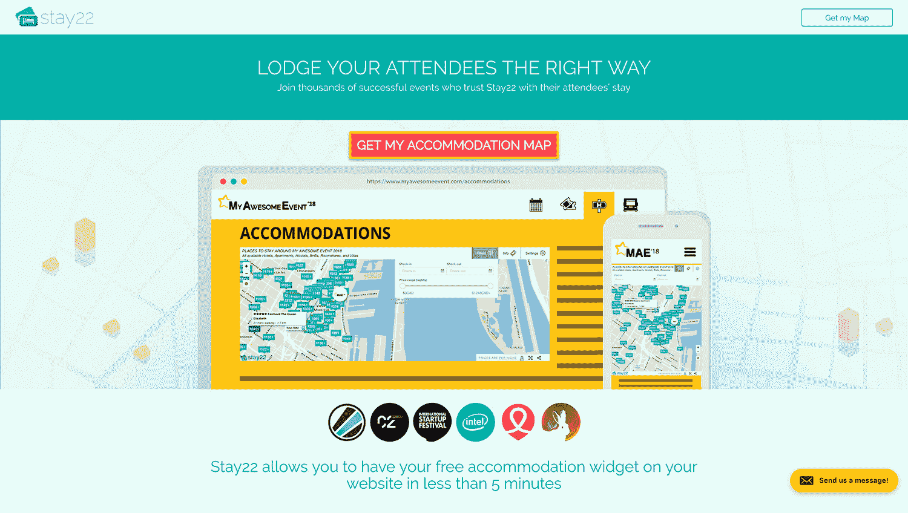

# 通过巧妙的营销和验证增长到 5000 美元/月

> 原文：<https://www.indiehackers.com/interview/growing-to-5k-mo-through-clever-marketing-and-validation-674be7d9d2>

## 你好！你的背景是什么，你在做什么？

大家好。Hamed 在这里，从 [Stay22](https://www.stay22.com/) 。我是加拿大人，但我的血统一半是伊拉克人，一半是波斯人。自从 24 年前出生以来，我一直住在蒙特利尔。

像大多数人一样，我一直对电子游戏着迷，这让我很早就迷上了电脑。我想给我的朋友留下我擅长某个游戏的印象，比如 [Dota](http://www.dota2.com/play/) ，所以我用地图黑客之类的工具作弊并获胜。(原谅我:我那时还是个孩子。Dota 将推出新的补丁来阻止作弊，地图黑客的开发者将开始要求资金来开发新版本。我当时 16 岁，没有钱，所以我决定自己学习编程和创建黑客。

这不是我最自豪的话，但这开启了我的编程生涯。从那以后我就一直自学，几年后在一家创业公司打工换取食物的时候，我爱上了网络。我用 PHP 和 HTML/CSS/JS 编写代码。我人生中最棒的一步。我不知道自己在做什么，也不知道自己在学什么。大量的谷歌搜索和[stack overflow](https://stackoverflow.com/)。:)

我去大学学习计算机科学。鉴于我以前的编码知识，我认为这将是一件轻而易举的事情，但是我错了。在我被开除前的一年半里，我学了很多东西。

我如何被学校开除的故事很长，但简而言之，我注意到我们学校的学生门户网站正在使用过时的技术，并发现了一种访问每个学生数据的方法，可以追溯到 1998 年(大约一百万个条目)。像信用卡信息、账单信息、储物柜密码、SSN (SIN)、数码照片等数据。学校不喜欢有人窥探他们的系统(这是理所当然的)，所以你可以想象当我告诉管理部门这件事时的反应。

我去大学学习计算机科学…我在头一年半里学了一大堆，直到我被开除。

TweetShare

[媒体](https://techcrunch.com/2013/01/25/this-is-whats-wrong-with-college-student-expelled-for-exposing-networks-privacy-flaws/) [挑](http://nationalpost.com/news/canada/youth-expelled-from-montreal-college-after-finding-sloppy-coding-that-compromised-security-of-250000-students-personal-data/wcm/351bf95f-9f55-44b2-b3ef-659480eb2ceb) [起](http://boingboing.net/2013/01/21/montreal-comp-sci-student-repo.html)[故事](http://www.huffingtonpost.ca/entry/hamed-al-khabaz-expelled_n_2526074)后不久，关注解锁了一个高调的专业人士和投资者的网络。2013 年，我与人合作创办了我的第一家初创公司，名为 [Zilyo](https://twitter.com/zilyotravel) ，这是一家旅游初创公司，做度假租赁元搜索。我们筹集了一些资金，壮大了团队，最终还是失败了。犯了很多错误。

Stay22 是我第二次尝试。在 Stay22，我们让活动组织者和票务平台能够轻松地为他们的参与者提供睡觉的地方。

*   [演示事件](http://en.esl-one.com/csgo/newyork-2017/visitors/#stay22-widget)
*   [演示平台](https://www.everfest.com/e/osheaga-music-and-arts-festival-montreal-qc)

2017 年 7 月，我们的小工具被观看了 5，436，120 次，并产生了 108，880.06 美元的酒店销售额。

## 是什么促使你开始使用 Stay22？

我一直在努力为我的下一次活动寻找最好的酒店。我会用 KAYAK、Airbnb 和谷歌地图等产品花无数时间搜索。基本上，我会在它们之间来来回回，看看价格是否值这个距离。没有一个酒店元搜索产品能为活动爱好者提供特定的用户体验。

这很疯狂，因为市场研究表明，每年 2950 亿美元的酒店和短期租赁总支出中，超过一半来自会议、音乐会、节日和体育赛事的活动住宿。这是一个难以置信的服务不足的市场。

市场是巨大的，我知道如何解决它。

那时，我不想因为之前创业的失败而再次涉足旅行。然而，这个想法一直困扰着我，而且有一个即将到来的活动我真的很想去，所以我的想法是，“我想在这里和那里有点 HTML 和 jQuery 不会有什么坏处。”编码几天后，一个新的 web 应用程序诞生了:[stay22.com](https://www.stay22.com/)。

 

## 构建最初的产品需要什么？离你准备发射还有多长时间？

T21 的产品是一把双刃剑。使用和理解非常简单，但如果有人想在这个市场起航，也很容易复制。他们所需要的只是一个简单的 Node.js 服务器和前端的谷歌地图。

我知道如果这是一家初创公司，价值不在于技术。作为一名产品/技术创始人，这一点最初很难把握。

我很幸运在开始 22 岁的时候和父母住在一起。当你还年轻，在一个没有风险的环境中，有父母的支持，没有比这更好的创业时机了。我总是告诉我的好朋友，几年后当你的创业失败，急需用钱时，你可以找一份年薪 10 万美元的工作。

当我们开始[Stay22.com](https://www.stay22.com/)的时候，它只是一个网页，用户可以在上面输入他们的活动名称并找到附近的酒店。最初的战略是推出，获得媒体，在我们的主页上获得用户，并从口碑中增长。

正如你可能会怀疑的那样，事情并没有那样发展。这对一些创业公司有效，但不适用于旅游。众所周知，运营旅游初创公司既困难又昂贵，主要原因之一是:你从网站和媒体上获得的用户不一定准备好去购买酒店和机票。为了在未来两周内获得想要购买某样东西的客户，你需要对谷歌广告进行竞价。哦，天啊，没有一家旅游初创公司有足够的资金来与价格和 Expedias 竞争。

但是我需要一种快速、不可扩展的方法来验证解决方案。对我来说幸运的是，我玩的另一个游戏[反恐精英](http://blog.counter-strike.net/index.php/about/)即将举行[兰](https://en.wikipedia.org/wiki/Local_area_network)锦标赛。作为一个狂热的 redditor，我知道会有许多旅行者潜伏在 [/r/globaloffensive](https://www.reddit.com/r/GlobalOffensive/) 中。因此，我通过面向活动的 UX 发布并成功验证了该产品，仅一个帖子就实现了 23，000 美元的酒店销售额。

(注:我试了几次，直到获得 663 张赞成票。前几个帖子要么被标记为垃圾邮件，要么没有足够的吸引力放在 subreddit 首页。Reddit 很狡猾——继续尝试，直到你得到它。你可以使用类似 [Fiverr](https://www.fiverr.com/) 或诸如此类的服务来获得虚假的支持票，但如果你试图验证这个想法，我建议你不要这么做。)

## 你用了哪些营销策略来吸引用户入住 Stay22？

在社区讨厌你之前，你只能给 reddit 发很多次垃圾邮件。我需要一个更好的收购策略——便宜且可扩展的策略。活动领域的联合创始人也不会有什么坏处。

我坚信几乎任何技能都是可以教授的——你不必神奇地与生俱来。

TweetShare

我的选择有限。把用户带到 Stay22 的主页，让他们选择搜索活动或场地是不可能的:这太他妈贵了。Reddit 的 post 成功涉及免费营销，但不可扩展。

我需要确定与会者去过的其他地方，并在那里直接向他们推销。将战略从把人们带到 Stay22 转变为把 Stay22 带给人们是我们的第一个突破。

你可以猜到剩下的部分是如何展开的。我们知道，如果与会者想要购买门票或获得更多关于活动的信息，他们必须通过主活动网站。这就是我们决定嵌入解决方案的地方。

我最终测试了这个理论，与一个和我有联系的当地活动组织者合作，结果比我预期的要好。事实证明，与会者很欣赏在购买机票后住宿就出现在他们面前的便利。转化率超过了顶级在线旅行社(Booking.com、Hotels.com 等)的平均水平。)，从销售线索到预订，增长了至少四倍(2.3%至 9.1%)。我们的解决方案不仅更便宜，而且效果更好。

此时，我所要做的就是让更多的组织者使用我们的解决方案。很简单，对吧？没那么快！我本质上是一名程序员，我们内向的人被教导要回避销售。

俗话说，“你要么生来就是销售人员，要么就不是。”然而，对于企业家来说，这句话应该是扯淡。我坚信几乎任何技能都是可以教授的——你不必神奇地与生俱来。在网上搜索并阅读了大量的“问 HNs”之后，我发现了一本由 Max Altschuler 写的名为[销售黑客](https://www.amazon.ca/Hacking-Sales-Playbook-Building-High-Velocity/dp/1119281644/ref=pd_cp_14_1)的合适的书。

所以我戴上销售帽开始工作。

## 你的商业模式是如何运作的？你的营收背后有什么故事？

目前，T2 酒店只有一种赚钱方式:酒店销售。我们的产品是免费使用的，如果这还不够，我们有时甚至与组织者分享我们的收入，作为嵌入我们的额外激励。

活动策划人通常将与会者住宿视为非创收活动，并花费无数时间(和金钱)来预订房间，而回报却是 0 美元。我们立即将此转化为我们合作伙伴的新的、通常是巨大的收入来源。

去年，我们成功创造了超过 100 万美元的酒店销售额，同时保持了 0%的流失率。这绝非易事。只有当你没有失去客户时，你的收入才会增加，所以可以肯定地说，我们正在解决这些组织者和参与者的真正痛点。

但真正的诀窍在于提供适当的客户支持。及时回复电子邮件，甚至偶尔定制工作(只要符合愿景)是客户成功的关键。当然，当你和越来越多的合作伙伴一起工作时，会变得越来越难，但这就是你继续招聘的原因。

虽然对于我们的公司规模来说，我们的数字可能看起来令人印象深刻，但我们只能保留其中的 7%。收入分成很多部分，从实际的酒店、API 提供商、旅行社、交易费等开始。

大约六个月前，我找到了一位出色的联合创始人，他接管了销售工作，筹集了一些资金，帮助我们成长为一个九人团队，并准备继续发展:

## 你未来的目标是什么，你打算如何实现它们？

我们的长期使命是改变活动游客为他们的下一个活动预订旅行相关物品的方式。每一个大的愿景都必须从小的地方开始，所以目前住宿只是 [Stay22](https://www.stay22.com/) 的故事的一部分，我们将长期专注于此，直到我们认为我们是第一。

一旦我们取得了一般的成功，竞争对手就会突然出现，这将是一场赛跑。这些可能是刚刚起步的新公司，也可能是拥有数百万资金的老牌公司。关键是要专注，尽可能提供最好的客户体验。

我知道如果这是一家初创公司，价值不在于技术…这一点最初很难理解。

TweetShare

## 如果你必须重新开始，你会做什么不同的事？

很难重新开始你的生活并到达同一个目的地。从你十几岁开始的每件事都会导致一些小事，从而导致更大范围内的另一件事。对我来说，错误是会犯的，但如果没有错误，我就不会在公司后来更关键的阶段学会避免错误。拥抱失败，从中吸取教训，然后继续前进。

我经常发现自己犯的一个错误是，我总是试图做出完美的决定，结果却浪费了我们很多时间。时间和成长一样，是初创公司生命的本质。你筹集资金要么是为了购买时间，要么是为了购买增长。学会在一个好的决定和“正确的”决定之间取得平衡是关键，我的建议是永远跟着你的直觉走，执行一个听起来足够好的计划——任何计划。只要确保尽快完成，因为结果是*知道*你是否做对的唯一途径。

(关于第一轮的，有一篇很棒的[文章。)](http://firstround.com/review/speed-as-a-habit/)

## 你最大的优势是什么？有什么特别有用的吗？

实际上有几个，但最重要的是我从解决自己的问题开始，这让我洞察到消费者的观点。最重要的是，我的联合创始人从活动组织者的角度看问题，所以反馈循环是即时的——我们本质上是创造者和顾客。

也有一些里程碑给了 Stay22 不公平的优势。其中一人加入了 Travelport 在科罗拉多州的加速器。如果你正在创业，Travelport Labs[是一个很好的项目，它打开了一个投资者和旅游导师的网络，否则我们永远无法与之联系。](https://www.f6s.com/travelportlabsincubator)

## 对于刚刚起步的独立黑客，你有什么建议？

从你已经有经验的事情开始，解决你(或你亲近的人)熟悉的问题。这会让你比别人有不公平的优势，让你观察到别人观察不到的东西。

如果你听说过虚拟现实是狗屎，但你没有技术来实现这一飞跃，那么就抽出时间来学习它。免费帮助他人，建立你的人际网络。

## 我们可以去哪里了解更多？

访问我们在[https://www.stay22.com/](https://www.stay22.com/)的网站，在 Twitter 上关注我们: [@getstay22](https://twitter.com/getstay22) 。

如果您打算参加一个没有安装我们技术的活动，请告诉我，我会联系他们！

任何时候，如果你想了解更多关于企业家或初创公司的知识，请不要犹豫，给我发电子邮件至 [【电子邮件保护】](/cdn-cgi/l/email-protection#cea6afa3abaa8ebdbaafb7fcfce0ada1a3) ，或者在下面的部分给我留言。

—[<picture id="ember8042987" class="user-avatar ember-view user-link__avatar"></picture>哈克](/hak?id=bNJXDs7fJsPyhtclBcwNN0yZiRI3)，Stay22 的创建者

## 想像 Stay22 一样建立自己的事业？

你应该加入独立黑客社区！🤗

我们是几千名创始人，互相帮助建立有利可图的业务和副业。来分享你正在做的事情，并从你的同事那里获得反馈。

还没准备好开始使用你的产品吗？没问题。这个社区是一个认识人、学习和实践的好地方。随意[随便浏览](/)！

—[<picture id="ember8042992" class="user-avatar ember-view user-link__avatar"></picture>考特兰艾伦](/csallen?id=ibTLPyjwVebnZjMGKvz6ztarnuV2)，独立黑客创始人

5votes