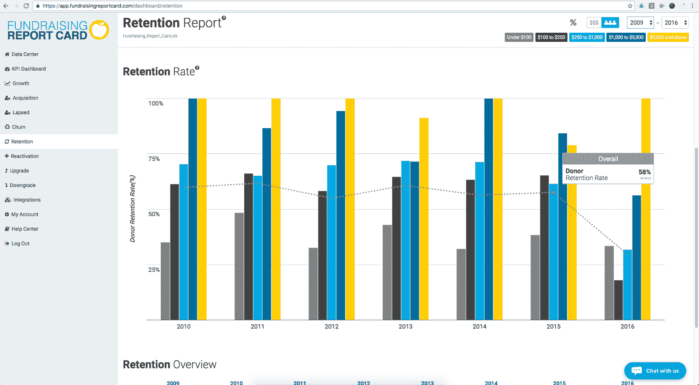
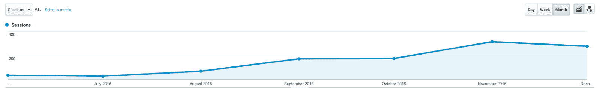
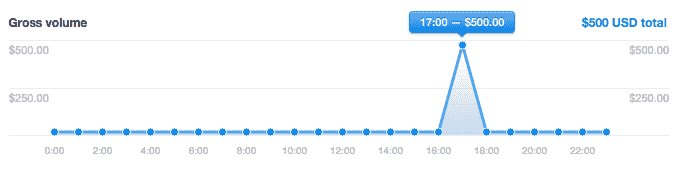
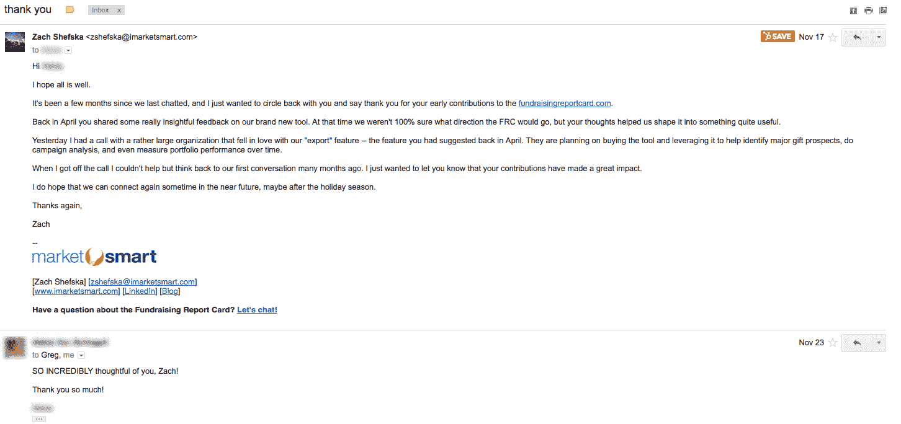

# 通过 LinkedIn 与客户交流，每月增长到 7500 美元

> 原文：<https://www.indiehackers.com/interview/growing-to-7500-mo-by-talking-to-customers-via-linkedin-bb23072564>

## 你好！介绍你自己，让我们知道你在做什么。

嗨，我叫扎克·舍夫斯卡。我创建了[筹款报告卡](https://fundraisingreportcard.com)——一个简单的分析工具，帮助各种规模的非营利组织理解他们的捐助者数据，并优化他们的筹款工作。

在全职专注于筹款成绩单之前，我在 MarketSmart 做前端开发。 [MarketSmart](https://imarketsmart.com/) 为非营利组织创造营销和软件解决方案。我有幸为人权观察、加州大学洛杉矶分校、希望之城和许多其他伟大的组织帮助开发遗产捐赠和主要礼物网站和活动。

在 MarketSmart 之前，我就读于匹兹堡大学。然而，在我大二的时候，在我妈妈被诊断出肺癌四期后，我辞职了。出于显而易见的原因，我搬回了马里兰州安纳波利斯的家。

而且，在匹兹堡大学之前，我已经自学了如何使用 Adobe Illustrator 和一起黑掉 WordPress 网站。这些技能足以让你在 2014 年的 MarketSmart 获得一个入门级职位。

最终，MarketSmart 提供了跳板(资金支持和资源)来创建和发布[筹款成绩单](https://fundraisingreportcard.com)。

 

## 是什么激励你开始做筹款成绩单？你最初的目标是什么？你是怎么想出这个主意的？

我真的很幸运有一个伟大的导师。当我第一次受雇于 MarketSmart 时，我向创始人兼首席执行官格雷格·华纳(Greg Warner)明确表示，我具有企业家精神。这种情绪肯定引起了他的共鸣，因为在 MarketSmart 前端开发部门工作大约一年后，Greg 找到我，提出了在公司内部设立一个新部门的想法。那个新部门最终变成了[筹款成绩单](https://fundraisingreportcard.com)。

格雷格找到我的时候，MarketSmart 有大约 100 个不同的客户。我们从这些客户那里听到的一个经常性的抱怨是在理解他们的数据时缺乏清晰度。这些筹资者想要关于关键绩效指标(增长、保留、流失等)的报告。)但除了成为一名 Excel 高手或聘请一名昂贵的顾问之外别无选择。

正是这种痛苦激发了格雷格挖掘我的创业精神。

最初，我们认为筹款报告卡只是一个内部工具，用来帮助我们的客户更好地理解他们的捐赠数据。然而，当我们测试该产品的一个粗略的早期版本时，我们得到了压倒性的积极反馈。最终，我们决定投入时间、金钱和资源来创建一个独立的产品和部门。

## 构建最初的产品需要什么？离你准备发射还有多长时间？

嚄...一开始我并没有意识到，但是建造东西是很艰难的。从复杂的意义上来说并不困难，但从在一行代码可以(或者至少应该)被编写之前需要大量的计划、组织和审查的意义上来说是困难的。

我很早就采用了这种思维模式，即我们需要创造一些难以置信的“最小”东西，来简单地衡量人们对我们正在做的事情的兴趣。这意味着在认真考虑这个想法的几周内，我们创建了一个加载了 jQuery 和 Google Charts API 的 HTML 页面。

我们向一个客户(一个一直在努力分析他们的筹款指标的客户)询问了一些他们的捐款人数据(只有捐款人的 ID 号、捐款日期和捐款金额)。然后，我们通过一个简单的 Python 脚本来计算他们按捐赠者捐赠能力(100 美元和 100-250 美元以下的捐赠者)细分的年同比捐赠者增长。之后，我们使用 Google Charts API 将数据硬编码到 HTML 页面上，并创建了一个超级简单的可视化报告来与客户共享。

他们很喜欢。

我在不同的组织中这样做了大约十次，这就是我们如何获得最初的反馈和方向。

在此期间，我仍然全职为 MarketSmart 客户开发网站。几个月来，我每周工作 60 多个小时，专注于[筹款报告卡](https://fundraisingreportcard.com)的开发，并在晚上和周末消化反馈。

幸运的是，在这个过程中，我处于一个独特的位置，可以利用 MarketSmart 现有的关系和资源。这有所帮助，但也带来了自身的问题。我最初接触的一些人分享了非常积极的评论和观点，但这仅仅是因为他们对 MarketSmart 的喜爱。它们是“假阳性”，最终是昂贵的干扰。

但我们克服了这一点，并于 7 月在 MarketSmart 的博客上发布了一篇博文，名为 [SmartIdeas](https://imarketsmart.com/measuring-the-right-performance-metrics/) 。那是格雷格最初接触我的五个月之后，也是我们创建谷歌图表页面的两个月之后。

## 你用过哪些营销策略？你是如何吸引用户和增长筹款成绩单的？

[筹款报告单](https://fundraisingreportcard.com)有免费版和专业版(经典免费增值)。我们的免费工具是有机增长的主要驱动力。

我们的“发布”与其说是一个发布，不如说是“亲爱的朋友和家人，这是我们建造的。”MarketSmart 的博客帖子有助于一些初步的牵引力，但我们的第一次升级/销售最终来自我在 LinkedIn 上找到的一个人的一对一推广。

LinkedIn 是流量和注册的主要驱动力。(我说的专业是指它产生了 5-10 个免费用户，这在一开始是很多的。)我加入了我能加入的每一个筹款行业团体，每天我都会搜索帖子，寻找与我们团队所建立的东西相关的东西。当我找到它们时，我会发表评论并链接回 FundraisingReportCard.com。

与此同时，我开始撰写关于筹款分析和指标的内容。我只是简单地写下了我所学到的东西——例如，如何计算捐赠者的保留率。我不喜欢认为我是幸运的，但是我写的那些文章中的一篇被转发到了一个行业组织的“十佳”名单上，这导致了一个巨大的流量高峰。我立即登录了我使用的电子邮件营销自动化程序(Drip ),并创建了一个简单的行动号召小部件，将一些流量转化为博客订户。

集客营销工作无疑是首要重点。博客文章很棒，但信息图、备忘单、网络研讨会、视频、播客等也很棒。筹款指标和分析是一个相对较新的市场，尤其是对较小的组织。这意味着我们的大量营销工作都花在了教育上——在占领市场之前，我们需要帮助开发市场。专注于集客营销有助于实现这一目标。

我们已经看到了有机搜索流量的稳步增长，这总是好的！

也就是说，我使用了各种其他渠道来推动活动。最近，我用 AWS SES 和[熊智娟](https://sendy.co/)发出了几千封冷冰冰的电子邮件。这些工作。我已经建立了 Adwords 活动来重新定位那些不会立即转化的网站访问者。这似乎也行得通。

最后但并非最不重要的一点是，我联系了捐赠 CRM 软件的公司，请他们将他们的软件与我们集成。这是活动的最大驱动力。三家较大的 CRM 公司(这三家公司约有 7500 名付费客户)同意整合筹款报告卡。这在过去和现在都是巨大的。我们现在有一个很好的节奏，每个月推出一个 CRM，产生几百个高质量的线索。

## 你的商业模式是如何运作的？你的营收背后有什么故事？

[筹款成绩单](https://fundraisingreportcard.com)是你经典的免费增值产品。对于免费增值，你必须依赖几个假设，最重要的一个假设是，有一个足够大的潜在市场。

仅在美国，就有超过一百万个非营利组织。我们认为，这足以让我们试一试。

尽管免费增值提供了很多好处，但它也有不好的一面……支持所有这些免费用户是有成本的。幸运的是，我们约有 10%的参与用户升级到专业版。

至于定价，这是一个早期的赌博。我们根据组织分析的数据量为 Pro 工具提供分级定价。这是按年计费的。

我从一开始就收到电子邮件，人们嘲笑包括数万美元级别的定价。直到最近，我们才真正对我们的定价感到满意。

在我与考虑升级到专业版的免费用户的每次通话中，我都会向他们展示我们的定价页面。每次我问他们同样的问题，“这些数字合你的胃口吗？”我不知道这句话从何而来，但它确实有用。人们要么说，“是的，这是合理的，”或者不经常说，“哦，但我愿意支付 xxx 美元。”问这个问题真的很有见地。

我们的第一次升级是在发布后几周。我联系了加拿大的一名顾问，他在 LinkedIn 上发布了一篇有趣的博客。我们通了电话，我为他演示了筹款报告卡(此时我不知道自己在做什么)，之后他创建了一个免费账户。

一周后，我们接到了第二个电话。他说他想升级到专业版，我告诉他需要 1000 美元——按照加拿大到美国的兑换率，他需要 1200 美元的投资。我最后做了一个条纹优惠券代码，把价格降到了 500 美元。

那个周末，我收到了 Stripe 发来的一封电子邮件，说已经收取了 500 美元。太棒了，太激动人心了！有趣的是，在用户付费后，我们实际上并没有内置“升级”用户的能力！

## 你未来的目标是什么？你认为未来会有什么大的挑战吗？

我们为 2017 年制定了几个大目标，其中最重要的两个与收入和教育有关:

*   就收入而言，我们希望 2017 年的营业额达到 50 万美元。
*   在教育方面，我们希望成为筹款分析教育和培训领域的行业领导者。

我们面临一些潜在的挑战，这些挑战可能会严重影响我们做这两件事的能力。首先也是最重要的是，一个现任者(非盈利技术领域的主要成员是 BlackBaud)可以过来建立和我们一样的东西。第二，我们可能时机不对。

但是，幸运的是，从我与用户和潜在用户的所有对话来看，时机似乎是正确的。有一些书正在出版，其中一本名为[数据驱动非营利组织](http://amzn.to/2iBaSU8)。越来越多的人对用数据优化他们的筹款感兴趣。

至于一个在任者来压垮我们，我不认为会发生，至少明年不会。此外，该领域的一个主要参与者 BlackBaud 有收购他们认为能让用户受益的小公司的历史。我们会看到会发生什么。

## 到目前为止，你学到的最大的教训是什么？如果你必须重新开始，你会做什么不同的事？

现在知道还为时过早。对于这个问题，我大概会在明年这个时候有一个很好的答案。但是，如果我不得不尝试一下，我会说，我们应该以不同方式做的最重要的事情应该是更早地让更多的“思想领袖”参与进来。

我认为我们在测试和了解用户需求方面做得很好，但我认为我们可以更快更有效地做到这一点。

有本书叫[突破是如何发生的](http://amzn.to/2j2qUoU)。作者安德鲁·哈格顿指出，你需要把各种各样的人聚集在一起，并内化他们的想法、评论、反馈等。来真正创造创新的东西。我认为我们在早期采用这种思维方式可以做得更好。

## 在你的旅途中，什么对你最有帮助？你认为你最大的优点是什么？

阅读 [Groove 博客](https://www.groovehq.com/blog)。那东西是座金矿。我从亚历克斯和他的团队所写的东西中学到了很多。

和我上面的评论一样，和很多人交谈，准备好听到你不想听到的事情。

我接到了一个电话，当时我们还在和一个非常优秀的顾问对产品进行 beta 测试。她把我撕成碎片。她用的缩写词和术语让我摸不着头脑。她花了一个小时和我通电话，只是教我基本的筹款分析概念。她很善良，但是很无情。近 6 个月后，我最近有幸给她发了这封邮件。

这样的经历是最有帮助的，也是最大的启发。

## 你对有抱负的独立黑客有什么建议？

打电话。打电话给别人。LinkedIn 消息人。评论博客。与你感兴趣领域的相关人士交谈。

一个伟大的产品会在市场上找到它的位置。一旦你有了这些，一切都是策略和执行。但是把第一部分做好——打造一个伟大的产品——无疑是困难的。你周围有越多对你的工作感兴趣的人，你就能越快达到目标。

## 我们可以去哪里了解更多？

尽管你可能不在非营利组织工作，但你可能认识这样的人。如果你认为他们可能会从免费的分析中得到一些用处，tool 给他们发这个链接:【FundraisingReportCard.com。

想了解更多关于筹款分析的信息，请浏览我们的博客。

如果你有兴趣更多地了解我，看看我的网站，[shefska.com](https://shefska.com/)或者在 Twitter 上关注我: [@shefska](https://twitter.com/shefska) 。

—[<picture id="ember8121110" class="user-avatar ember-view user-link__avatar"></picture>扎克舍夫斯基](/zachshefska?id=m2poqpIOLhRW2iy2fYhaUQtWHVv2)，筹款报告单的创建者

## 想像筹款成绩单一样建立自己的事业？

你应该加入独立黑客社区！🤗

我们是几千名创始人，互相帮助建立有利可图的业务和副业。来分享你正在做的事情，并从你的同事那里获得反馈。

还没准备好开始使用你的产品吗？没问题。这个社区是一个认识人、学习和实践的好地方。随意[随便浏览](/)！

——[<picture id="ember8121115" class="user-avatar ember-view user-link__avatar"></picture>柯特兰艾伦](/csallen?id=ibTLPyjwVebnZjMGKvz6ztarnuV2)，独立黑客创始人

9votes