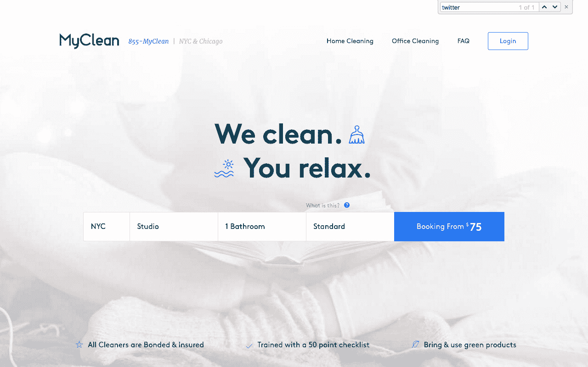
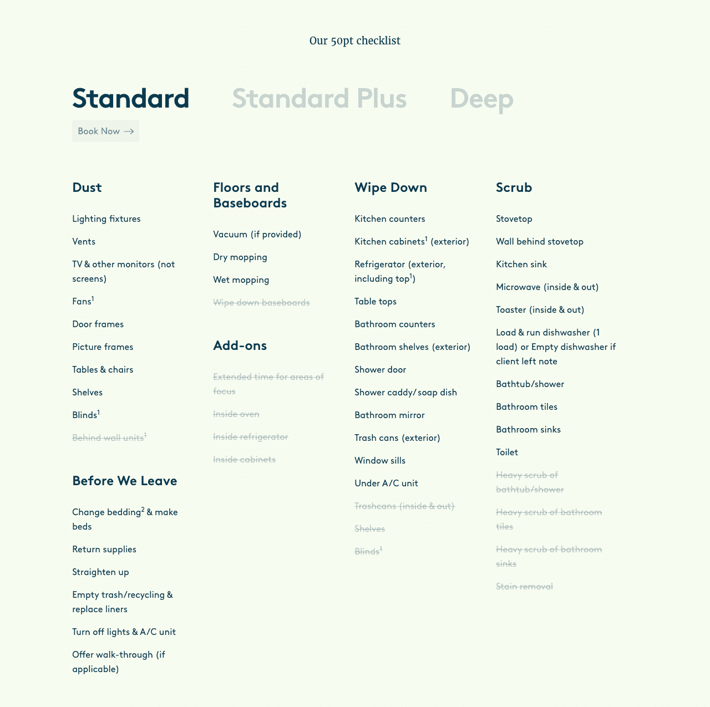

# 无视风险投资要求快速增长的压力，增长到每月 75 万美元

> 原文：<https://www.indiehackers.com/interview/growing-to-750k-mo-by-ignoring-vc-pressure-to-grow-rapidly-7f3290ac55>

## 你好！你的背景是什么，你在做什么？

大家好，我是 Michael Scharf，MyClean，Inc .的首席执行官。我的背景是金融，特别是结构化衍生品销售。在这样做了几年后，我意识到我想以企业家的身份加入现实世界，而不仅仅是向金融人士出售复杂的金融产品。

MyClean 在纽约和芝加哥提供顶级的住宅和商业清洁服务，同时为我们的团队提供可持续的职业发展。一些人(包括许多曾经和我一起工作的人)质疑我在 2009 年的职业转变。从那时起，我们证明了怀疑者是错误的。

MyClean 现在在两个城市每年创造 900 万美元的收入，雇佣了 200 名员工，其中许多人在我们找到他们之前就已经失业了！

## 你是怎么想出我的清洁的主意的？

想法很简单:我想把我的公寓打扫干净，而不需要找到一个“有人”的朋友，不需要把现金放在壁炉架上，不需要担心损坏或被盗，并且能够提供反馈。

当我们开始的时候，那根本不存在。我是目标客户！一位年轻的中上收入职业人士，想要一次清洁，但不知道去哪里找。我们带着这个想法出发了。

选择一个你知道有需求的市场。

TweetShare

## 最初的产品是如何构建的，从那以后发生了怎样的变化？

当我做出这一转变时，世界仍在努力摆脱 2008-2009 年的金融危机，这场危机主要集中在债券证券上。幸运的是，我一直在努力存钱以备不时之需，这给了我拍这张照片的灵活性。

我们做出的一个关键决定是外包我们网站的开发，这样我们就可以将精力集中在营销和客户维系上。起初，我们的网站非常简单。你可以在网上预定一个清洁时间，我们会派一个清洁工过去。它花了大约 20，000 美元和 9 个月的时间建立和运行。请记住，这是 2009 年，我们不知道我们在做什么😊

 

最初，我们找了分包商来做清洁工作。然而，两年后我们意识到我们的客户流失太快了，我发现质量是问题所在。我们很快了解到，为了确保质量和一致性，我们需要雇佣和培训自己的员工。

就在那时，我遇到了肯尼·舒尔茨，我们的首席运营官。他对雇佣、培训和跟踪我们的清洁人员有一个愿景。五年后，我们是 200 名清洁工和两个城市的强者。

## 你用了什么策略来吸引用户和发展 MyClean？

拥有多种获取客户的方式总是明智的。在 [MyClean](https://www.myclean.com) 的时候，我们有四个。我们的产品主管 Derrick Shich 帮助确保我们通过每个渠道获得可盈利的客户，并确保他们向我们的潜在客户提供有凝聚力的信息。换句话说，我们希望人们无论走到哪里，都能听到同样精彩和准确的东西。

最初，我们的客户是通过谷歌等网站的有机搜索来的。我们没有做太多广告。

一旦我们获得了清洁权(大约在 2011 年)，是时候做一些付费广告了。我们在这方面学到的一个教训是，获得客户很容易，但获得你*想要的客户*就有点棘手了。

扔出一个谷歌广告，提供 49 美元的清洁服务，就会有顾客上门。然而，我们很快了解到，在最初的诱惑之后，这些客户通常不愿意为常规服务支付我们的价格(仍然是折扣价格)。

现在，我们的付费广告集中在重新定位(之前找到我们的客户)和像 Yelp 这样的公共评论网站上。这些客户表现出明确的购买意向，质量对他们来说很重要。那是我们的最佳位置。如果客户不在乎工作做得是否正确，我们可能不会为他们服务。

我们也依靠有机的公共评论网站来推动流量。这需要积极管理我们的在线声誉。首先要做好工作，并及时、专业地解决所有问题。在 MyClean，我们要么做对，要么做对！这种风气在我们的公开评论中熠熠生辉(目前在 Yelp 上是 4.5 星)。

最后还是靠口碑。我们做得很好，人们告诉他们的朋友！我们通过“推荐给朋友”项目鼓励这种做法，为每个推荐人提供 50 美元。人们总是在寻找好的清洁工，口口相传是获得大客户的一种廉价而有效的方式。困难的部分(正如我们多年前就知道的)是*赢得*口碑！

## 你的商业模式是如何运作的？

我们的商业模式非常简单。我们在网上获得客户，然后做得很好，这样我们的利润就超过了获得的成本。然后，我们希望将我们的客户与一家正规的清洁公司配对，以获得他们的订阅。

正如我上面提到的，我们以“优步清洁”模式开始，但外包我们的清洁工来满足我们客户的需求很快被证明是失败的，导致 Yelp 上的一系列一星评论和一系列不可扩展的业务问题。当我们进行转型时，我们将清洁工从外包的 1099 名合同工转变为全职员工。

记住你的核心愿景，但是不要害怕根据你的客户告诉你的来改变。

TweetShare

我们的清洁工现在都接受了全面的培训，能够实现 MyClean 的 50 点清单，并获得一系列福利，如健康保险、带薪病假、工人补偿和 401(k)选项。通过善待我们的员工，我们最终也是在为我们的客户服务——即使这意味着我们的价格比我们的竞争对手高出 10%-20%。

[

客户可以选择标准清洁、标准增强清洁或深度清洁。](https://www.myclean.com/home-cleaning#checklist) 

未来，我们计划发展和扩大我们在纽约和芝加哥的业务，扩展到其他市场，最终实现收入来源的多元化。我们目前在产品开发阶段有很多想法。

## 你面临的最大挑战和克服的障碍是什么？

我们最大的挑战是学习如何从营销和运营的角度来扩展业务。对于营销来说，它是关于你如何相对于你的 CAC(获得一个客户的成本)获得尽可能多的可盈利的 LTV(终身价值)客户。对于运营来说，这是如何培养一个对 [MyClean](https://www.myclean.com) 标准负责的员工。

## 你从中吸取了什么教训，对刚刚起步的有志独立黑客有什么建议？

**选择一个你知道有需求的市场。**在推出 [MyClean](https://www.myclean.com) 之前，我们团队中的一些成员已经让同一个清洁女工每周来一次，持续了 6 年。虽然给一把钥匙的复印件，把钱放在桌子上，由于语言障碍而无法真正交流在当时是可以的，但我们知道必须有更好、更有效的方式。

记住你的核心愿景，但不要害怕根据你的客户告诉你的来改变。我们最初的设想是，一家科技公司开发一个引擎，让客户可以在线预订、支付和交流。然而，我们的客户告诉我们，虽然他们喜欢能够在线预订的便利，但整体服务没有达到标准。因此，我们知道我们必须转型，成为一家雇佣、培训和管理清洁工的清洁服务公司。

当涉及外部资本和其他重大商业决策时，相信你的直觉。从 2012 年开始，我们看到了“X 的优步”公司的崛起，家庭服务领域成为一个“热门领域”未来三年，我们将看到两个竞争对手分别筹集到 6400 万美元和 1.1 亿美元的风投资金，还有少数其他竞争对手筹集到了 2M 的 1000 万至 1000 万美元不等的资金。有一段时间，我们几乎每天都收到一家新风险投资基金的咨询。他们都想用“曲棍球棒增长”来“投资”和“扩大”我的业务。然而，我们知道由于我们早期经历的质量控制问题,“X 的优步”模式在清洁领域并不适用。我们也知道，那些希望在五到七年内获得 10 倍投资回报的风险投资家对“规模”的理解与我们不同。因此，我们从来没有也可能永远不会接受风险资本。

**以人为本。**这听起来很简单，但许多商业领袖在寻求全球统治地位的过程中忽略了这一点。我们在 MyClean 的核心目标是:为我们的客户创造并保持幸福的家庭，同时为我们的团队建立可持续的职业生涯。唯一可行的方法是将我们员工和客户的最佳利益放在每个决策的核心位置。

## 我们可以去哪里了解更多？

查看我们在 myclean.com[的网站，或者在下面留下评论。我在独立黑客论坛上的用户名是](https://www.myclean.com) [MyCleanMike](/user/MyCleanMike) 。

—[<picture id="ember5302271" class="user-avatar ember-view user-link__avatar"></picture>MyCleanMike](/MyCleanMike?id=wvVbAcWWMQUvxk6MG1tFBYKpHy82)，MyClean 的创建者

## 想像 MyClean 一样建立自己的事业吗？

你应该加入独立黑客社区！🤗

我们是几千名创始人，互相帮助建立有利可图的业务和副业。来分享你正在做的事情，并从你的同事那里获得反馈。

还没准备好开始使用你的产品吗？没问题。这个社区是一个认识人、学习和实践的好地方。随意[随便浏览](/)！

——[<picture id="ember5302276" class="user-avatar ember-view user-link__avatar"></picture>考特兰艾伦](/csallen?id=ibTLPyjwVebnZjMGKvz6ztarnuV2)，独立黑客创始人

14votes