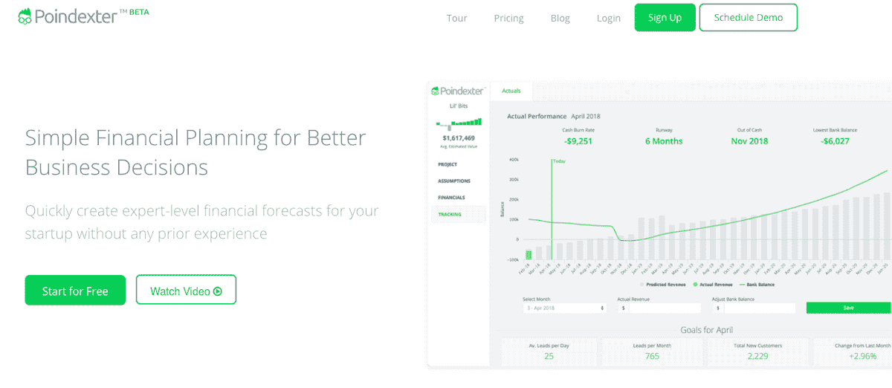
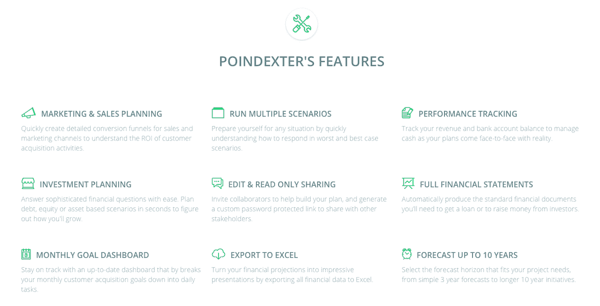

# 一次濒临破产的经历如何成为我开发一个应用程序的灵感

> 原文：<https://www.indiehackers.com/interview/how-a-close-call-with-bankruptcy-became-my-inspiration-for-an-app-54dea274de>

## 你好！你的背景是什么，你在做什么？

嘿，黑客们！我叫 Brandon Crossley，我是一个简单的财务计划应用程序的创始人，这个程序可以帮助企业家做出更明智的商业决策。

我的旅程始于为一家初创公司做业务方面的工作，当时这家公司还很大，正在开发一款脸书游戏。不幸的是，这个产品从来没有“足够好”，所以发布被不断推迟，我很快就发现自己失业了。早点学的好课。；)

之后，我在管理咨询公司工作了一段时间，但我不断发现自己在寻找更具创业精神的东西。很快，我偶然发现了一个绝佳的机会。我父亲的生意失败了，他需要帮助。和他一起工作，我们侥幸躲过了破产，正是这段经历给了我创建 Poindexter 的灵感。我意识到现有的金融工具过于被动，我想帮助小企业更好地掌握他们的财务状况，而无需聘请昂贵的顾问，所以我们建立了 Poindexter。

我们已经在市场上两年半了，目前每月服务 1000 个活动，同时每月产生 1106 美元的经常性收入。这个月也标志着我们与美国一所主要大学的第一份许可协议，这份协议已经酝酿了很长时间。

 

## 是什么促使你开始使用 Poindexter？

时机是个奇怪的东西。在和我父亲的经历接近尾声时，我一直在学习 UX 设计，并在一个荒谬的应用程序上练习我的技能，我以为我想构建这个应用程序。然后朋友们开始让我帮助他们的想法，很快我就有了相当稳定的合同工作，设计和制作应用程序原型。有一段时间很有趣，但我知道我想要属于自己的东西。直到后来，我才把指向波因德克斯特的线索联系起来。一旦我这么做了，我就知道这是我想要建造的东西。

为了避免我之前目睹的一些错误，我首先发布了一个简单的登录页面，除了对我想要构建的内容的文本描述之外什么都没有。然后我在谷歌上做了一个广告，看看是否有人愿意注册，令我惊讶的是，有将近 15%的人注册了。这就是我需要的全部动力。

当时，我攒了大约 3 万美元，还兼职做了一些设计工作，所以我想我可以用足够的跑道来启动 Poindexter，看看它是否可行。肯定不是最详细的计划。

## 构建最初的产品需要什么？

由于预算限制，我知道最初的功能必须是最小的。然而，不要认为这一秒钟阻止了我加入太多的特性。我对 MVP 的想法当然被兴奋扭曲了。

我立即开始构建一个财务建模框架，它可以适用于我遇到的每一个商业模型。只有当它完成后，我才去掉任何“不重要”的功能，这很难做到，因为它们都非常重要！这个过程总共花了大约三个星期，因为我有几个付费项目要处理。

一旦建模完成，我开始以类似的方式设计线框。三个星期后，我带着完美的原型从黑暗的地下碉堡深处走了出来，这是盲目的造物之神赐予人类的。

随着原型阶段接近尾声，我通过一个大学朋友认识了一个自由开发者，他同意如果我们使用 Ruby，用我 15000 美元的预算来开发这个应用。成交。

经过四个月的开发和一个月的测试，我们于 2016 年 5 月初在 BetaList 上首次亮相后，正式推出了这款应用。

 

## 你是如何吸引用户并发展 Poindexter 的？

最初，我的发射策略是缺乏的。我的基本想法是首先将 Poindexter 提交给 beta list——一个寻找新创业公司的早期采用者平台——并从那里找出答案。

当时，BetaList 只接受希望扩大候选名单的预启动初创公司。为了充分利用任何吸引力，我一直等到我们有了成品，并建立了一个临时的登录页面来满足他们的指导方针。在我们的首次亮相中，我们获得了 300 多个注册，接下来的周一我给我们的名单发了一封电子邮件，宣布我们的 live 产品“启动”。人们的兴趣仍然很高，因此有 215 人访问了该网站，其中 73 人立即注册，有一人甚至升级为付费计划！不是最好的转化率，但这是一个开始。

在接下来的几个月里，付费客户从口口相传而来，但我们其余的市场推广仍在成形。总的来说，我们的努力分为三大类:利用现有受众，联系一对多组织，在正确的时间出现在正确的地方。

**利用现有受众:**

作为一个完全的新手，我开始专注于我认为会有快速投资回报的活动。比如接触科技记者、博客和有影响力的人，参与垃圾社交媒体活动，以及其他经常被错误地称为增长黑客的策略。我必须承认，这是我的低谷。它散发着绝望的气息，并没有正面地代表我的品牌。如果你是第一次创业，请不要这样做。通过关心人们的目标和提供价值而不期望任何回报来发展与他们的关系要好得多。这种方法花费的时间要长得多，但事情以我从未预见到的方式发生了变化。

通过关心他人的目标和提供价值而不期望任何回报来发展与他人的关系。

TweetShare

**一对多组织:**

我们的产品是为有特殊痛苦的特定受众设计的，他们倾向于寻求其他组织的支持以获得财务帮助(如加速器、孵化器、会计师等)。).我开始通过冰冷的电子邮件联系这些组织，目的是更多地了解他们如何与初创公司和小企业合作，看看是否有机会提供一些价值。这种策略并不奏效，因为增加一个中介通常意味着解决中间人的需求，而不是我们的客户。

**天时地利人和:**

潜在客户已经在网上搜索我们解决问题的解决方案。我知道在这些搜索中出现需要一个好的策略和大量的时间和精力——一开始我并不准备接受这个想法。最终，这种方法是 Poindexter 仍然存在的主要原因。一旦我们专注于为目标关键词创建高质量的内容，我们就开始看到成效。我学到的最大的一课就是奔向工作。这是值得的，因为其他人倾向于避免它。这个焦点让我们从每天 20 个左右的访客增加到今天的 100 多个。

## 你的商业模式是什么，你是如何增加收入的？

我们最初推出免费增值模式是为了弄清楚人们是否会付费。在没有收入的情况下，我没有足够的资金维持它很长时间。我们按照类似的解决方案对产品进行了定价，并获得了我们需要的验证，但是在进行了一些研究和客户反馈之后，我们改为了免费试用的三级订阅。价格上涨了 250%，因为我们保持了相同的转化率，这有助于将月收入从 2018 年 2 月的 623 美元增长到 6 月在 MRR 的 1，056 美元。

| 月 | 收入 |
| --- | --- |
| 2018 年 2 月 | 623 |
| 18 年 3 月 | 688 |
| 2018 年 4 月 | 938 |
| 2018 年 5 月 | 953 |

选择正确的商业模式有点困难。我们的产品满足的需求对许多客户来说只是暂时的，所以客户流失率比我希望的要高。订阅不是满足短期需求的最佳选择，但我们有一个长期解决这个问题的计划，所以我们会坚持到底。 [Brian Balfour](https://brianbalfour.com/) 写了一个很棒的系列，帮助我更好地理解这种平衡。我们仍在研究他图表中的市场/产品部分。

## 你未来的目标是什么？

我们当前的重点是修复商业模式。在过去的几年里，我们已经收集了大量的用户反馈，并且在如何使产品更贴近用户方面有了一些很好的见解。然而，这样做有一些风险，因为我们必须优先考虑更具战略意义的功能，而不是那些为短期目标用户增加价值的功能。

实现我们的目标将具有挑战性，因为我们的团队目前是有限的。我正在兼职 Poindexter，最近我不得不与我的联合创始人兼首席技术官分道扬镳，但我们正在赚足够的钱，在一些自由职业者的帮助下推动业务向前发展，所以我相信我们会克服这些障碍。

## 你面临的最大挑战和克服的障碍是什么？如果你必须重新开始，你会做什么不同的事？

老实说，这是一个很难回答的问题。由于我在创办公司时的无知战略，很多经历都感觉像是一场艰苦的战斗。除了缺乏产品验证、考虑不周的收购计划、投资者和加速器的拒绝以及破碎的商业模式，我不得不说我所面临的最大挑战是选择了错误的首席技术官。

如果在这个行业的某个领域你感到无助，尽可能多的学习，并在这个领域发展技能。

TweetShare

作为一名“非技术型”的创始人，我很容易解释清楚自己的担忧，因为有人拥有我极度缺乏的技能。联合创始人之间的关系很难维系，这也是创业失败的主要原因之一。仅仅因为方便而选择一个人，不是明智之举。如果在这个行业的某个领域你感到无助，尽可能多的学习，并在这个领域发展技能。你将会建立自信，并且在评估某人是否是合适的伴侣时处于更有利的位置。

## 有没有发现什么特别有帮助或者有优势的？

我的答案并不性感，但它驱动了我们的大部分增长，这是积极关注学习的结果。我甚至不知道这是如何发生的。它不仅仅是学习新的技能和想法，还反映了我如何从基础层面处理业务。

这在我们的业务中如何体现的一个例子是我们的客户服务理念。我们积极地试图了解我们让用户失望的地方，然后采取措施解决常见的投诉。对客户反馈的响应带来了更高的忠诚度和推荐率，这是我们最初的主要渠道，今天仍然发挥着重要作用。

对我个人来说，专注于学习帮助我克服了很多挑战。它给了我信心，让我在最黑暗的时候继续前进，让我学会了新的技能，让我在工作中以及与团队合作时更有效率。我试图通过专注于当前面临的挑战来优先考虑学习，但我最近读过的一些好书包括:

*   查尔斯·杜希格的《习惯的力量》
*   [超级预测:预测的艺术和科学](http://a.co/d/aojGahX)菲利普·泰特洛克和丹·加德纳著
*   [原著:不墨守成规者如何改变世界](http://a.co/d/6EblYzI)亚当·格兰特著
*   renée maoborgne 和 W. Chan Kim 的《蓝海战略》
*   [如何赢得朋友并影响他人](http://a.co/d/ekUpCxx)戴尔·卡耐基著
*   [黑客成长](http://a.co/d/gp8aokp)作者肖恩·埃利斯和摩根·布朗

## 对于刚刚起步的独立黑客，你有什么建议？

我的建议不是你从来没听过的，但这是我们做生意的唯一原因。很简单，从为特定客户解决问题开始。把你的信念放在问题上，而不是解决方案上，可以帮助你度过几个月的停滞、拒绝、联合创始人的退出以及创业带给你的任何事情。你甚至可以做一些愚蠢的事情，比如在没有任何外界反馈的情况下从头到尾构建一个产品，但仍然能让人们愿意为此付费。

我学到的最大的一课就是奔向工作。

TweetShare

除此之外，就开始吧。如果你以这种方式开始，你可以在前进的过程中发现它，并通过参与市场学习转向更好的解决方案。我们通过这种方式学到了很多东西，我们的经验就是为什么我相信波因德克斯特最好的日子就在我们面前。

## 我们可以去哪里了解更多？

如果你正在为你的新企业筹集资金，或者只是想知道你的商业战略在财务上是否可行，请到 getpoindexter.com 查看 Poindexter。我也会时不时地在我们的[博客](https://getpoindexter.com/blog)和 [YouTube 频道](https://www.youtube.com/channel/UC1HARInLtoK_vpsGMXCpgtA)上发布商业和金融话题。

如果你有任何问题或想继续对话，请在下面留下评论，我很乐意回应！

——[<picture id="ember8118018" class="user-avatar ember-view user-link__avatar"></picture>布兰登·克罗斯利](/brandonc?id=9mkbXxXwtHUZzdVrhtCAu6sbEaF3)，Poindexter 创始人

## 想像 Poindexter 一样建立自己的事业？

你应该加入[独立黑客社区](/)！🤗

我们是几千名创始人，互相帮助建立有利可图的业务和副业。来分享你正在做的事情，并从你的同事那里获得反馈。

还没准备好开始使用你的产品吗？没问题。这个社区是一个认识人、学习和实践的好地方。随意[随便浏览](/)！

——[<picture id="ember8118023" class="user-avatar ember-view user-link__avatar"></picture>考特兰艾伦](/csallen?id=ibTLPyjwVebnZjMGKvz6ztarnuV2)，独立黑客创始人

24votes