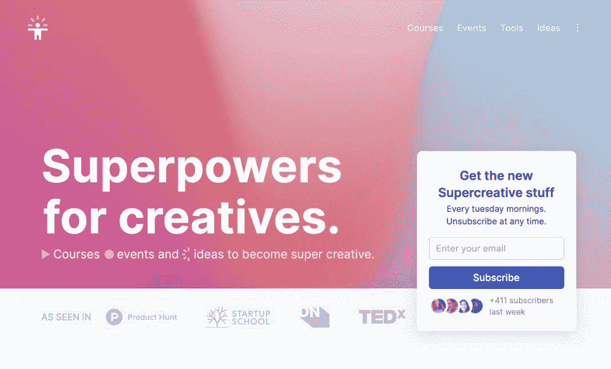
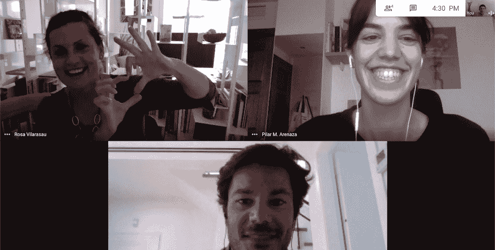
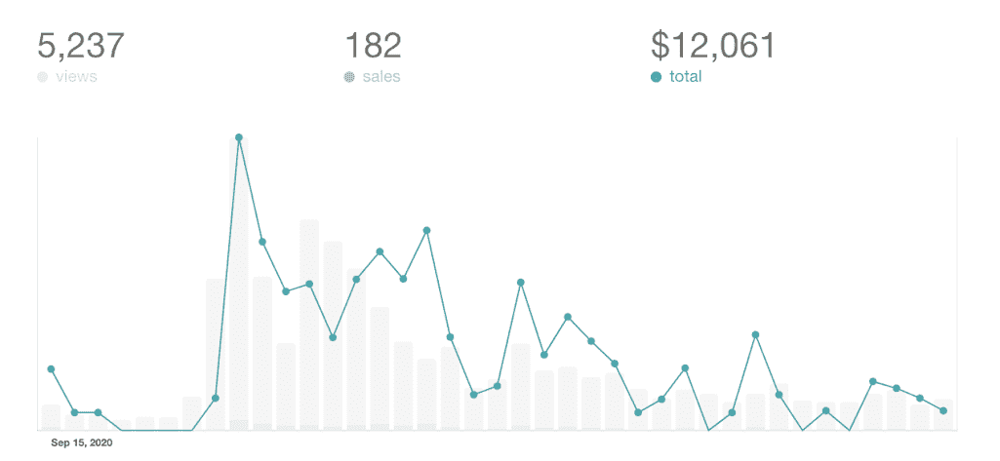
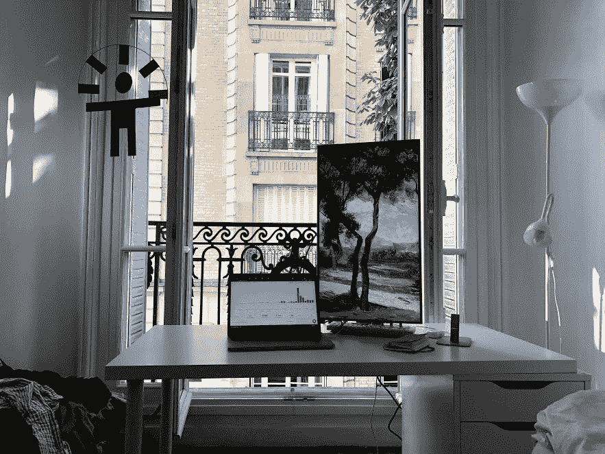
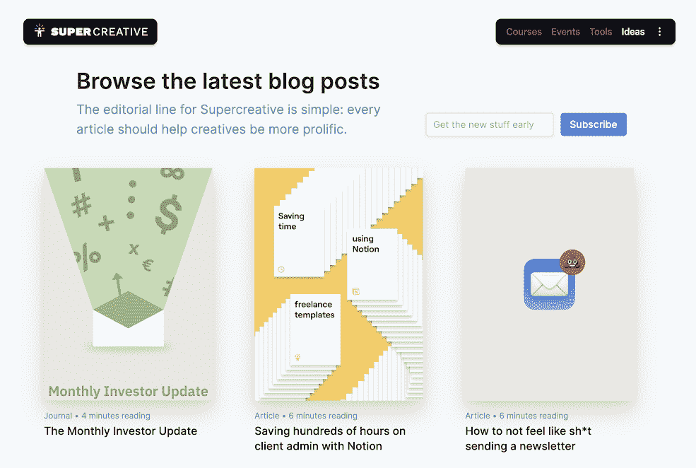

# 新冠肺炎一级防范禁闭如何激励我开始创业，并发展壮大

> 原文：<https://www.indiehackers.com/interview/how-a-covid-19-lockdown-inspired-me-to-start-my-business-and-grow-it-22027589ad>

## 你好！你的背景是什么，你在做什么？

你好，我叫本·伊森曼。我是一名法裔美国设计师和企业家。

2020 年，当我从商学院毕业时，我推出了[超级创意](https://www.supercreative.design/)。Supercreative 是一个为有创造力的自由职业者提供模板、课程和文章的网站，让他们变得更加多产。

截至 2020 年 10 月，该网站创造了近 10，000 美元的收入。

【T2

我正在我的卧室里建造超级创造力。我几乎没有成本，可以接触到数百万人。很难把握这些数字有多大。我知道我永远不会有足够的时间或精力来充分利用网络。但是我可以试试。我可以做假设。我可以学习。即使我只接触到 0.1%的在线创意人员，我相信我也能建立一个非常成功的创意企业。

## 是什么促使你开始使用 Supercreative？

我 16 岁的时候开了一家设计公司，为《我的世界》的 YouTubers 制作商标和动画。我妈妈是自由设计师，我爸爸是企业家。我在一个崇尚创造力和商业的环境中长大。

考虑到我职业生涯的开始，我意识到创办公司是快速提升和学习的最佳方式。这就像一个作弊代码。所以我只知道我将开始一个设计创业。

全球封锁是我所需要的巨大冲击；它激活了我的完全自省模式。

TweetShare

在最初的六个月里，我们和两个朋友一起，考虑建立一个市场来雇佣优秀的设计师。但只有在封锁期间，我才真正明白我应该把超级创造力集中在在线教育和资源上。它更符合我的理想。

## 构建最初的产品需要什么？

2020 年 5 月，我给自己 30 天时间来创建和销售一门在线课程。如果我成功了，我会继续做下去。于是我设置了[一个登陆页面](https://www.supercreative.design/course/learn-webflow)并准备了一个教授 Webflow 的课程大纲。该课程将侧重于实践指导，持续一个月。

我把自己锁在卧室里。我用 LinkedIn 视频宣布了这个课程，解释说我在 Webflow 工作，用它建立了数百个网站，现在正在教授这个工具。一周内我有 10 名学生报名。它赚了 4000 美元，我认识并帮助了优秀的设计师和企业家。

在这一点上，我明白了这会变得多么强大。我也可以出售模板、副产品、书籍等等。但更重要的是，这是我人生中第一次对商业模式感到由衷的高兴。通过教别人东西赚 100 美元的感觉比从客户工作中收取 100 美元要好 10 倍。再也回不来了。

## 所以这是一个为期 30 天的项目。如果你失败了，你有什么赌注吗？

我其实也没有过多考虑如果课程不行会怎么样。

也许我会选择一条更传统的道路:去读硕士学位，做一名自由设计师，找一份工作...我不知道，但这些选择现在在我看来很可怕！

## 你的技术是什么？

我用 [Webflow](https://webflow.com/) 、 [Figma](https://www.figma.com/) 、[观念](https://www.notion.so/)走得非常、*非常*快，思考在纸上。

我的筹码很少。在我的生活中，我花了太多时间纠结于无关紧要的技术特性或学习新的框架。重要的是营销，设计，心理，情怀。

我是不断抽象软件栈的快乐副产品。

## 你是如何吸引用户并变得极具创造力的？

因为我在创造我希望自己拥有的东西，所以我瞄准像我这样的人。如果我足够自省，这使得营销变得容易。所以我在我常去的地方推广新的超级创意内容。

首先:推特。Twitter 是验证新想法的好方法。几个小时内我就知道什么值得创造。使用 Twitter 作为验证机器并不常见，但这是我需要的变通方法，因为我是唯一一个在 Supercreative 上工作的人。

然后我会创建一个微小的 MVP。这可以只是一个脸书小组的帖子，写一篇文章或建立一个独立的登陆页面。在这一点上，我收集了更多的反馈，做了更多的研究，如果这个想法继续存在，我会去找 HN，哲学博士，糖尿病肾病，IH。

又名黑客新闻，产品搜索，设计师新闻和独立黑客。当这些帖子受到关注时，我就可以与有影响力的人和媒体交流，以获得更大的影响力。这是我唯一做外展的时刻(我不喜欢)。

如你所见，我有一个发布驱动的营销策略。我还开始在 YouTube 上制作一个全新的频道。对此非常兴奋。

## 你的商业模式是什么，你是如何增加收入的？

正如我在[超级自由职业者](https://www.supercreative.design/blog/hyper-freelance)模型中所说的，我通过同时结合三项活动来运行 Supercreative:咨询、教育和产品。咨询是高度不稳定的；它的报酬最高，但它消耗能量。教育是周期性的，报酬很高，给我很多能量。产品是最稳定的，报酬体面，但需要零持续努力。我找到了同时做这些事情的平衡。

现在，我收入的 30%来自客户工作，30%来自在线课程，40%来自产品。与客户直接打交道让我直接了解公司和其他人面临的问题。这给了我一些想法，让我可以在之后构建合适的课程和产品。

目前，Supercreative 每月有大约 15，000 名访客，简讯每月增长 100%。在过去的三个月里，超过 2000 人购买或下载了 Supercreative 资源。

每个月，我需要支付大约 100 美元的 [Webflow](https://webflow.com/) 、 [ConvertKit](https://convertkit.com/) 和 [Circle](https://www.circle.com/en/) 。即使我们考虑到我的电脑的折旧和我在一个共同工作空间工作的日子，这仍然是低支出。

我用 gum road[收集产品付款，用 Webflow 电子商务收集在线课程付款，用 Stripe checkout 收集发票咨询客户付款。我计划在未来几周内将一切转移到 Webflow 电子商务。我实际上是 Webflow 的第一个实习生，也是 2016 年第一批从事电子商务功能的人之一，所以我很高兴现在能使用它！:)](https://gumroad.com/)

## 你未来的目标是什么？

到 2021 年 9 月 30 日，Supercreative 将拥有三到五门创意课程，每月接待大约 30 名学生，平均支付 500€。

为了达到这个目标，我将写 50 篇文章，分享 30 个将被下载 1000 次的免费资源，建立一个 YouTube 频道，并出版一本书。我会和我钦佩的人分享这段旅程，他们会成为我一生的朋友，记住我的话。

## 如果你必须重新开始，你会做什么不同的事？

我损失了几个月的工作，从零开始创造 Supercreative 的原始产品(伟大的设计师匹配服务)。但是我过度优化了一个未经严格验证的想法。更糟糕的是，我的一个想法，如果我推断得足够远，将成为一家我实际上不想工作的公司。

我应该早点和我的两个朋友讨论股权问题。我也应该避免申请孵化器，避免陷入 FOMO 创业公司。

重要的是*创造每一天*。我的观众将决定什么是好的或不好的。

TweetShare

全球封锁是我所需要的巨大冲击；它激活了我的完全自省模式。从这场危机中走出来后，我开心多了。一次成功的转折。现在，我是世界上唯一一个能让 Supercreative 成功的人，因为我已经把它变成了一家完全由我喜欢做的事情和我唯一擅长的事情交集而成的公司。

## 独立黑客的哪一部分让你觉得最鲜活？

执行速度、独立性和基于互联网的企业的无限增长。

从事零再生产成本、零销售成本和零维护成本的产品是一件令人着迷的事情。从历史上看，这种情况从未发生过。如果你善于营销，那就真的没有限制。我想没有多少人意识到这一点。

## 如果明天有人提出要买你的公司，你会卖吗？为什么或为什么不？

我为自己建立了一个系统，在那里我(几乎)完全自由。我可以做任何我想做的事情，在任何我想做的地方，任何我想做的事情。我还认为 Supercreative 将在未来几年变得更大、更成功。因此，现在向外部公司出售任何东西都是没有意义的:我才刚刚开始，我很满足。我不想停下来。

我更感兴趣的是找到一种模式，如果 Supercreative 变得很大，早期粉丝就会得到奖励。他们现在对我投入的注意力、时间和善意的话语有一定的风险。作为早期的信徒，他们应该得到某种补偿。

也许有一天，通过加密令牌或创造者基金，这将成为可能。我对未来充满期待！

## 有没有发现什么特别有帮助或者有优势的？

按照随机顺序，以下是我所做的投资时间回报非常高的事情:

*   在时事通讯中分享我学到的一切
*   使用 Twitter 作为验证机器
*   记日记
*   强迫自己在创建和分享内容上花费相同的时间
*   在纸上确定项目范围
*   做一个乐观主义者
*   给自己设定智能目标

一些在网上对我有帮助的个人特质，随机排列如下:

*   说英语
*   做一个体面的设计师
*   喜欢接触新的人
*   行为有点古怪，有点强迫症
*   正年轻

重要的是*创造每一天*。我的观众将决定什么是好的或不好的。我相信我的未来，只要我每天都在创造和分享。

## 创意人员以混乱的工作空间而闻名，你说你是在卧室里开始的，那么你的工作空间是什么样的呢？

我的工作空间井然有序。我的想法不是。我无法在物质上处理混乱*和理智上处理*。

有一张干净的桌子，一个好看的屏幕，一个可以写字的笔记本，就是很惬意。自然光线和附近的自然景观加分。我希望我的工作场所更加社会化，我可以和更多的人互动。好的想法也来自好的对话。

## 对于刚刚起步的独立黑客，你有什么建议？

最大的问题是没有完成我们已经开始的事情。我们的思想是我们最大的敌人。我们自我破坏，我们寻找闪亮的新事物，我们失去兴趣，我们创造不必要的复杂性，我们拖延。我们的直觉甚至没有那么好，所以我们认为会成功的事情很可能不会成功。

我们的大脑欺骗我们，所以我主张把我们的大脑骗回来。给自己设定精确的目标，让责任与经济利益挂钩，让自己只做 Y 才做 X，无情地删除或委派任务，对会议说不，对几乎所有事情说不，休假，冥想，打破习惯，写日记。你听说过所有这些事情。它们是反击的常见方式。

但是方向和意义第一，优化第二。

## 我们可以去哪里了解更多？

去 Supercreative [网站](http://supercreative.design/)下载免费模板，获得新想法或者参加我的创意课程。

当我在推特[上测试想法](https://twitter.com/creative_ben)时，请关注我，加入我的每周[灵感简讯](https://www.supercreative.design/newsletter)或查看我即将推出的 [YouTube 频道](https://www.youtube.com/channel/UCdftNB66O9aqNcO-j8N4R5Q)。

我很乐意在下面的评论中回答你的问题。干杯！

——[<picture id="ember8040243" class="user-avatar ember-view user-link__avatar"></picture>本伊森](/Ben?id=G4aheDZ11pgmvX38b1lBGDdD7D43)，超级创造的创始人

## 想像 Supercreative 一样建立自己的事业？

你应该加入[独立黑客社区](/)！🤗

我们是几千名创始人，互相帮助建立有利可图的业务和副业。来分享你正在做的事情，并从你的同事那里获得反馈。

还没准备好开始使用你的产品吗？没问题。这个社区是一个认识人、学习和实践的好地方。随便去[随便浏览](/)！

——[<picture id="ember8040248" class="user-avatar ember-view user-link__avatar"></picture>考特兰艾伦](/csallen?id=ibTLPyjwVebnZjMGKvz6ztarnuV2)，独立黑客创始人

39votes