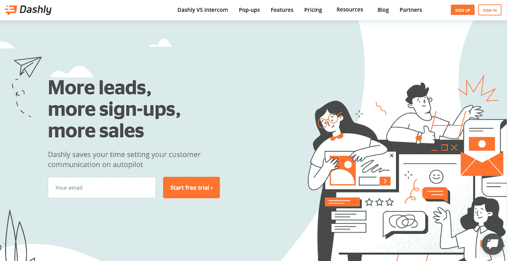
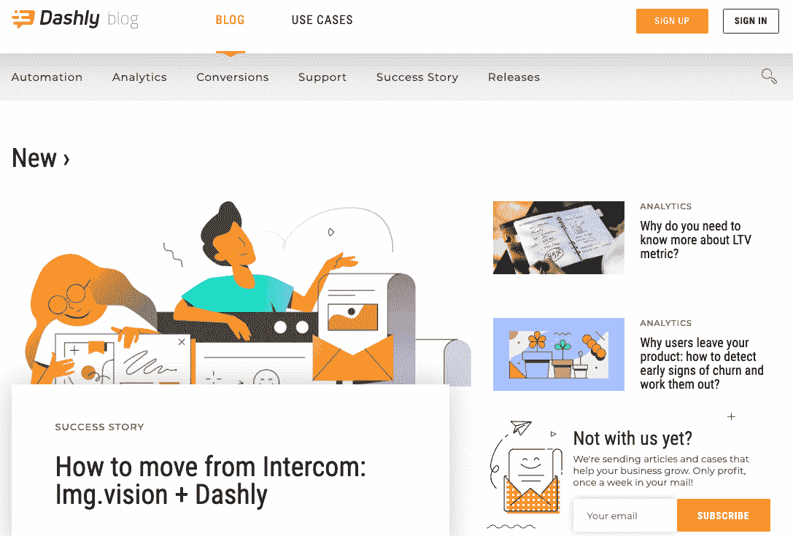
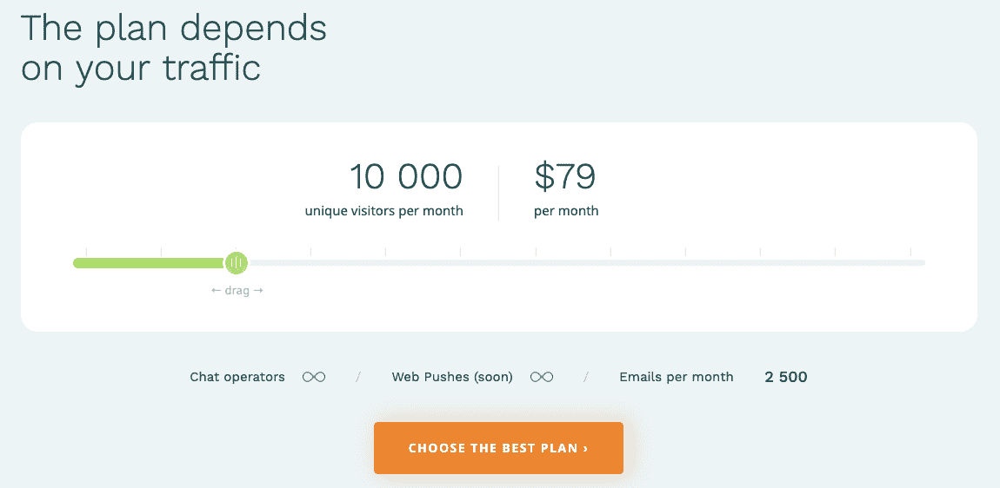
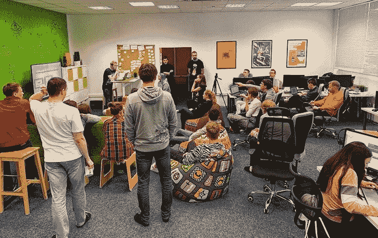

# 几个错误的转折如何让我们的产品达到每月 1000 美元

> 原文：<https://www.indiehackers.com/interview/how-a-few-wrong-turns-led-our-product-to-1-000-month-57f19774db>

## 你好！你的背景是什么，你在做什么？

我是 Dmitrii， [Dashly](https://dashly.io/panel/register?utm_source=IndieHackers&utm_campaign=Interview) 的首席执行官，这是一个客户对话和营销平台。该产品解决了 SaaS 公司的销售线索获取、管理和沟通问题。我有一个 45 人的数字代理机构，但大约两年半前，我决定和另外三个很酷的人一起在 SaaS 世界投下自己的一票。该机构的四名成员全职工作，其他团队成员在我们需要的时间和地点提供帮助。

我们共同致力于 Dashly，帮助企业节省时间、改进指标并赚更多的钱。实时聊天允许我们的客户提供完美的支持，弹出窗口构建器允许企业创建收集销售线索的弹出窗口。公司可以创建触发式消息链，并通过自动化而不是手动完成来节省接洽、入职和返回销售线索的时间。

Dashly 每月赚 1000 美元，客户遍布世界各地。

 

## 是什么促使你开始使用 Dashly？

在我们的数字机构工作时，我们感受到了做更长期、更吸引人的工作的吸引力。创建网站可以是小规模和孤立的，我们认为创建一个产品会给我们机会做一些密集的，潜在的无限的，有价值的事情。我们也想建立长久的关系。考虑到这一点，我们决定开发一款端到端分析产品。我们的专业知识和直觉告诉我们，在所有领域，SaaS 企业都有找到业务流程中的漏斗、瓶颈和薄弱环节的基本需求，我们有信心能够打造出满足这一需求的产品。

我们有几次走错了路，但这给了我们宝贵的经验，使我们作为人和企业不断成长和发展。

TweetShare

我们创建了一个模型和一个演示文稿(没有真正建立 MVP ),参加了会议，会见了企业的利益相关者，我们有朋友向他们推销我们的想法。你知道吗？我们发现没有人想要或需要我们销售的产品。人们不寻求识别他们的瓶颈——他们知道它们是什么——他们寻求修复它们并改进他们的指标。企业希望改善与访问者和用户的沟通，并试图解决一些扰乱流程的更常见的问题，他们希望有一个工具来帮助他们跟踪他们是如何实现这一目标的。达什利就是这样出生的。

反馈的好坏取决于你用它做了什么。

TweetShare

## 构建最初的产品需要什么？

我们四个人都在我们的数字代理公司全职工作，所以我们利用晚上、周末和任何其他空闲时间来开发产品。我们两个是开发人员，一个是产品设计师，我担任首席执行官和营销主管——这一点，加上我们在数字代理公司的经验，是我们必须合作的内容。我们没有寻求任何外部资金或投资。

一旦我们明白端到端分析是不够的，人们希望真正解决问题，我们就全力以赴构建一个原型，它包含了我们在最初推介时听说的所有功能。因为我们有过将我们的想法传递给潜在用户并收到非常关键和及时的反馈的经验，所以我们知道在开发这种新产品时，我们工具箱中最重要的“资源”是我们目标人群的意见。接受反馈，获得建议，理解用户的需求是创造一个成功产品的关键。

所以我们重新开始了这个过程。我们创建了模型和演示，并由我们认为可能对产品感兴趣的人来运行，如果我们感觉到人们对他们所看到的不感兴趣，这允许我们快速轻松地进行调整。通过这种方式——一步一步，一个音高一个音高——我们验证了我们的想法，并能够开始开发我们知道会畅销的产品。

我们花了大约一年的时间来构建 MVP，完成了一个相当不吸引人的界面，我们必须为我们的第一批用户做许多手动操作，没有计费功能，等等。它有很大的改进空间，但它是可行的。

 

## 你是如何吸引用户并快速成长的？

我们的前 10 个客户买了那个 MVP，和我们今天的产品差不多都认不出来了。那些首批客户是来自我们网络的人，他们给了我们很多反馈，参与了产品开发，并在它还处于丑小鸭阶段时就看到了它的价值。

当我们开始营销工作时，我们专注于内容而不是付费广告。我们想在走付费广告路线之前找到一个完美的市场契合点，因为我们正在投资个人资本，并希望确保我们能最大限度地利用现有资金。此外，我们已经从在我们的数字机构工作中获得了大量的经验，并参加了大量的活动，从业内其他人那里收集了智慧和建议，因此了解集客营销是有意义的。

如果人们喜欢你的产品，他们会付钱的。就这么简单。

TweetShare

我们找到了一个内容营销人员，他开始在我们的博客上工作，围绕该产品开发了一批社交追随者，并向全世界介绍了 Dashly。BetaList 和产品搜索带来了大量的流量和下一批客户。我们仍然从这些平台获得客户，当然转化率不同。现在，我们已经开始根据测试转移我们的重点，看看什么能产生最好的转化率，什么需要更多的工作或不值得。

我们开始通过在每个可能的平台上分享我们的专业知识和谈论 Dashly 来建立我们的品牌意识——脸书、Quora、Reddit、Product Hunt、LinkedIn 等。流量的质量不如定向营销，但我们认为获得一些领域的权威和品牌知名度从长远来看是值得的。

## 你的商业模式是什么？

我们提供基于每月独立访客数量的分层月费。在早期阶段，我们非常专注于让我们的产品尽可能有价值，并确保这种价值对所有潜在用户都是显而易见的。如果人们喜欢你的产品，他们会付钱的。就这么简单。

因为我们太专注于产品和营销，所以我们从来没有真正着手建立一个支付流程。第一波用户仍然通过贝宝支付。当这对我们的团队和不断增长的客户数量来说变得太复杂时，我们连接了 Stripe，使其可以通过 Visa 和 Mastercard 支付，并继续看到我们的数量增长。

 

## 你未来的目标是什么？

Grrrow！😊

我们在团队发展上投入了大量资金——为我们的企业图书馆提供书籍，参加产品和营销活动——因为一个优秀的团队可以成就或毁掉一家企业。我们希望继续增加 Dashly 团队，并在那里看到增长。

当然，我们也计划种植我们的 MRR。去年，我们建立了第一套目标和关键结果，即 MRR 翻三倍，客户终身价值翻一番。我们失败了。我们对市场还没有足够好的把握，所以我们的目标和指标是不切实际的，完全是武断的。我们目前正在利用过去一年获得的经验制定新的目标和关键成果。每个部门都有自己的目标，关键结果将作为帮助他们实现目标的检查点。

我们的总体目标是找到一个适合市场的产品，让我们从竞争对手中脱颖而出，让 Dashly 大放异彩，不断成长。

## 你面临的最大挑战和克服的障碍是什么？如果你必须重新开始，你会做什么不同的事？

我对我们所拥有的很满意，并且认为所有我们犯下的错误让我们走到了现在。当然，我们有几次走错了路，但这给了我们宝贵的经验，使我们作为人和企业不断成长和发展。

我们最初没有考虑到的一点是 GDPR 法规遵从性，即使我们知道它即将到来，我们也没有做太多的事情，直到我们绝对必须这样做，这是相当最后一分钟。我们最终疯狂地添加了所有的 GDPR 兼容特性，这在一两个月的时间里停止了许多其他版本的发布，总体来说压力很大。我们有一些 GDPR 内部的笑话，我们带着这些笑话直到今天，作为战争的伤疤。😊

## 有没有发现什么特别有帮助或者有优势的？

我们有一些从一开始就有的仪式，这些仪式对我们很有帮助。

当只有我们四个人的时候，我们开始举行周六会议。这是谈论策略的最佳时机，否则我们在正常工作日就没有时间谈论了。但那天是周六，所以我们要让它变得有趣。我们会玩游戏机，吃零食，只是闲逛。我们现在已经把这种做法推广到整个机构，称为“创始人星期六”，但是是和团队领导一起。

周六我们一起度过的时间令人惊讶地富有成效——所有的关键问题都解决了，我们可以在周一回到团队的其他成员身边，与他们分享我们的想法。在每个星期的开始，我们在一天的开始有一个演示。在大约 15 分钟的时间里，我们回顾了周六以来的所有新进展和想法，以及所有新发布的内容。

我们还在每周四下班后做一些事情，其中一名团队成员(来自任何团队)将分享他们的成功、失败、见解和经验教训。它不超过一个小时，也不意味着是一份正式的报告或演示，而是让整个公司都有相同的波长，并与其他人正在做的事情和取得的成就保持联系。

这些仪式真的帮助我们集中精力，专注于我们的工作，并且是建立凝聚力和友情的好方法。

 

## 对于刚刚起步的独立黑客，你有什么建议？

总是询问你公司以外的人他们需要什么，他们对你的产品有什么想法。为了解决问题，你必须了解问题。通常，获得产品反馈的最佳方式就是简单地询问。反馈不应该是你害怕的东西——它是一个伟大而必要的工具，你应该尽可能多地利用它。当然，所有的反馈都取决于你用它做了什么。😉

## 我们可以去哪里了解更多？

你可以在 [Dashly.io](https://dashly.io/panel/register?utm_source=IndieHackers&utm_campaign=Interview) 用 14 天免费试用来测试 Dashly。如果你想了解更多，可以看看我们的[博客](https://dashly.io/blog?utm_source=IndieHackers&utm_campaign=Interview)。如果你不喜欢阅读，你也可以在 [YouTube](https://www.youtube.com/channel/UC9LOVChogPErluDXDbq9UpA) 上找到我们。

如果你愿意的话，我们也很乐意在 Linkedin、T2、推特和脸书上进行交流！

—[<picture id="ember5263303" class="user-avatar ember-view user-link__avatar"></picture>Dmitrii](/Dmitrii?id=s8fhCJuNnCNXzt6u34uHbqNwKM13)【达什利创始人

## 想像达什利一样建立自己的事业吗？

你应该加入[独立黑客社区](/)！🤗

我们是几千名创始人，互相帮助建立有利可图的业务和副业。来分享你正在做的事情，并从你的同事那里获得反馈。

还没准备好开始使用你的产品吗？没问题。这个社区是一个认识人、学习和实践的好地方。随意[随便浏览](/)！

——[<picture id="ember5263308" class="user-avatar ember-view user-link__avatar"></picture>考特兰艾伦](/csallen?id=ibTLPyjwVebnZjMGKvz6ztarnuV2)，独立黑客创始人

10votes