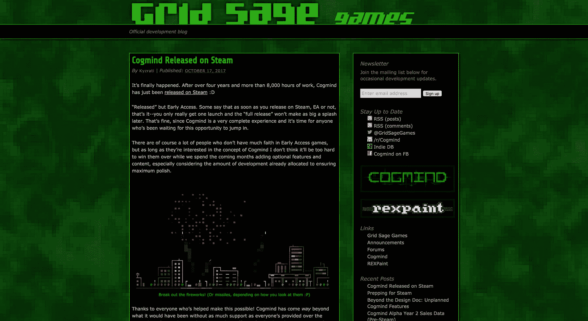
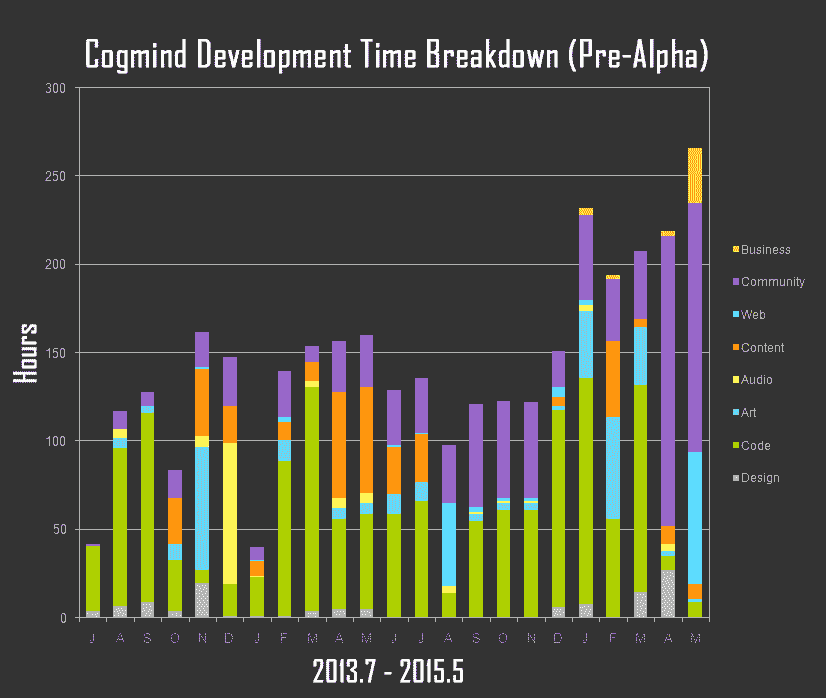
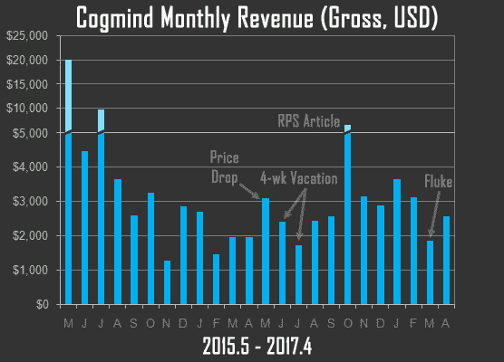

# 一个业余游戏开发者如何推出一款每月收入 2，500 美元的游戏

> 原文：<https://www.indiehackers.com/interview/how-a-hobbyist-game-developer-launched-a-game-that-generates-2-500-mo-bb30c827ef>

## 你好！你的背景是什么，你在做什么？

大家好，我是乔希·葛，科幻小说《天才少年》的创作者。

十多年来，我纯粹作为业余爱好和其他自由职业者一起开发游戏，但近五年来，在玩家和粉丝的支持下，我一直全职从事这项工作。

我没有任何编程的专业背景，只是为了将世界带入生活而自学的技能，但现在我自己做所有的编程、设计、声音设计和大部分艺术。我一直通过[我的博客](http://www.gridsagegames.com/blog/)分享整个旅程，我还主持 [r/roguelikedev](https://www.reddit.com/r/roguelikedev/) ，这是网络上最大的类似开发者团体，我们在那里分享我们的技术和方法，几乎涉及游戏开发的所有方面。

Cogmind 因其在一个旧游戏类型上的众多创新而广受好评，否则这些创新通常不会利用现代设计原则。尽管价格相对较高，但在不久前在流行的游戏分发平台 [Steam](http://store.steampowered.com/) 上发布之前，Cogmind 已经拥有超过 4000 名玩家，这个数字在出色的评论支持下迅速上升。

 

## 是什么促使你开始使用 Cogmind？

Cogmind 纯粹是一个激情项目。必须如此，因为老实说，游戏开发风险极大，而且有太多更好的谋生方式。

我热爱游戏开发，我的想法是依靠储蓄来完成我心目中的核心游戏，因为我从以前项目的经验中知道，我可以在一年左右的时间里完成它。但没过多久，粉丝群就足够大了，显然有足够的商业价值让它比最初的计划还要大。所以为什么不呢！

写开发过程非常棒——不仅仅是从营销的角度。

TweetShare

在设计方面，早在 2011 年，我就爱上了这种我从未听说过的风格(“roguelikes？？?")，但在玩的过程中，我注意到有很多方法可以改善体验，并很快发现自己在绘图板上。关于 Cogmind 是如何产生的，以及我为什么这么做的更多背景，请查看我在 2016 年旧金山 Roguelike 庆典上做的[演示。](https://www.youtube.com/watch?v=9yJflbg0V38)

## 构建 Cogmind 最初版本的过程是怎样的？

Cogmind 真正的第一个版本甚至没有被设想为一个销售产品。相反，这是一个为 7 天的罗格式比赛在一周内建立的游戏果酱项目。

我花了一个月的时间来计划它，但是编码只用了一个星期就完成了，这是我回去做其他项目时游戏发布的状态。这是一个迫使自己从概念到乐趣再到完成一个游戏的很好的方法，后来它证明了这个概念的可行性，因为我看到玩家们喜欢它。

从技术上来说，“真正的”(即商业)初始版本花了两年多的时间，建立在这个原型的基础上，直到 2015 年 5 月[才发布。它花了 3331 个小时将原型带到第一个公开的阿尔法状态。](http://www.gridsagegames.com/blog/2015/05/cogmind-alpha-access-launched/)

 

在发布之前，Cogmind 没有带来任何收入，我也不确定它是否真的能工作，所以有一段时间我偶尔会兼职做自由职业者，随着发布日期的临近，我的工作时间越来越长。

又过了两年，我终于在 2017 年 10 月发布了第一个 [Steam](http://store.steampowered.com/) 版本。那时我已经工作了 8000 多个小时。

从技术上来说，Cogmind 基本上是完整的，但是还可以添加更多的可选功能。如果这个项目的目标是赚钱，我现在会停下来转到另一个游戏，但我更愿意继续工作，因为有很多支持和更多可以实现的想法。

终于在 2017 年 10 月发布了第一个 Steam 版本。那时我已经工作了 8000 多个小时。

TweetShare

多年来，我自己的工具一直是最大的帮助，我从一开始就使用它，而且几乎每天都用。我实际上已经免费发布了它，现在许多其他开发人员和艺术家都依赖它: [REXPaint](http://www.gridsagegames.com/rexpaint/) 。我用它做模型、地图设计和艺术。

## 你是如何吸引用户和培养 Cogmind 的？

Cogmind 在其历史上已经达到了几个重要的里程碑，所有这些我都在详细的回顾中提到过。这包括 2015 年的[第一个 alpha 版本](https://www.gamasutra.com/blogs/JoshGe/20150707/247901/Releasing_a_Commercial_ASCII_Roguelike_a_PostMortem.php)，次年的[一周年](https://www.gamasutra.com/blogs/JoshGe/20160519/272832/Cogmind_Year_1_Sales_and_Dev_Time_Data_EA.php)我降低价格扩大受众，2017 年的[前 Steam Beta](https://www.gamasutra.com/blogs/JoshGe/20170620/300297/Selling_ASCII_PreSteam_Sales_Data_for_a_Traditional_Roguelike.php) 版本我降低到最终基础价格。

虽然这些都有助于增加兴趣，但核心受众在我从事业余爱好项目并偶尔写博客的几年前就已经形成了。有了这个粉丝群作为种子，在 Cogmind 的 pre-alpha 阶段，我从几个推广渠道开始，随着时间的推移，逐渐发展到更多渠道。

*   起初，我的主要渠道是 [dev blog](http://www.gridsagegames.com/blog/) ，它既是进步的总结，也随着时间的推移变得越来越有用，作为一个热门文章的集合，每当有人(新老)有问题时，我都可以指向它。(这样省了那么多时间！)最近，我的博客被 Feedspot 评为网络 50 大 gamedev 博客之一，所以这几年它肯定得到了很多关注。
*   [Twitter](https://twitter.com/GridSageGames) 是我开始使用的第一种社交媒体，多年来，当追随者转发我的作品时，无论是展示最新功能的文章还是 gif，它无疑是接触到*新受众的最有效方式。*
*   在早期，我还开始将我的博客内容和其他进展更新镜像到一些有相关受众的论坛，即未来玩家可能会去的地方。向 gama sutra 复制可能是最好的一般兴趣博客文章也引起了很多关注——我的一篇文章是去年网站上排名前 30 位的文章之一，所以为现有材料寻找合适的额外渠道是值得的。当然，许多在其他地方阅读我的文章的人不一定会继续购买我的游戏，但 1)他们中的一些人会，2)增加的名称识别从长远来看有助于建立声誉。

我花了大约三分之一的时间在我所谓的“社区拓展”努力上——没有广告，只有人们想读的好的老式写作内容，总体上是一个平易近人的人，并与每个想搭讪的人互动。

不管什么渠道，重要的一点是保持半定期的更新！消失很长一段时间(特别是没有一个解释！)丢掉了很多最初建立观众群的辛苦工作。人们失去信任，兴趣减退。我见过很多很多(很多！)devs 把这部分搞砸了。

*(老实说，我可以写一本关于这个主题的书，因为我曾经在公关部门工作过，而且做的比这多得多，但这些都是基本的。我之前在这里写过一篇更长更具体的摘要[。)](https://www.reddit.com/r/roguelikedev/comments/5x73ec/faq_friday_59_community/defrvqf/)*

## 你的商业模式是什么，你是如何增加收入的？

我唯一的收入来自游戏销售，平均每月约 2500 美元，并一直与成本保持一致，因为我能够保持相当低的支出。在这里，能够自己做大多数事情是有帮助的，生活在一个相对便宜的国家也是如此。

 

我的计划是直到很久以后才考虑收入的增长，而是把我的精力集中在建立核心社区和创造一个好游戏上。现在，它已经达到了一个更完整的状态，我最近才把 Cogmind 放到 Steam 上，因此未来的收入肯定会更高。

这些年来，我已经几次改变价格，开始价格很高，每年下降 15%左右。我在这篇文章中解释了我有些不寻常的定价决定的基本原理，我可以说它们进行得相当好。正如在[这篇最近的事后分析](https://www.gamasutra.com/blogs/JoshGe/20170620/300297/Selling_ASCII_PreSteam_Sales_Data_for_a_Traditional_Roguelike.php)中所详述的，与预期一致，每次我降低价格，转化率都会上升。

如果你有令人信服的理由，不要害怕违反规范！我的很多选择都违背了我的意愿，当然有些人会说我的方法很愚蠢，行不通，但是现在我们来了...

## 你未来的目标是什么？

因为收入稳定且充足，所以我打算继续开发额外的功能一段时间，因为总是有大量潜在玩家的未开发受众，他们甚至从未听说过 Cogmind，并且当一个项目正在积极开发时，消息更容易传播。

我没有任何具体的长期目标，除了在时机成熟时继续另一个游戏项目——可能是续集。我的目标从来不是(也永远不会是)利润最大化，所以这方面的业务永远不会被计算在内。当然，这里的优势是，显然由激情而非金钱驱动的独立项目也往往会赢得更强大的追随者。

## 你面临的最大挑战和克服的障碍是什么？

从我的角度来看，这是一个相当“安全”的项目，因为我知道我已经具备了完成它所需的所有技能。但是，虽然我没有遇到任何重大障碍，但从技术角度来看，如果我在非 Windows 平台方面有更多经验，那么我也可以支持这些平台，那就太好了。

Cogmind 真正的第一个版本甚至没有被设想为一个销售产品。

TweetShare

另一个令人头疼的问题是处理商业方面的事情(法律、税收、银行)，因为我对这些都不感兴趣——我想把游戏作为一种创造性的发泄方式。也就是说，我不确定事后会有什么不同的做法。我已经用我所拥有的时间和经验尽了最大努力。

## 如果你必须重新开始，你会做什么不同的事情吗？

总的来说，我不会做什么不同的事情，主要原因是*计划*。

我花大量时间组织我的计划，并确保我已经并将继续以最有效的方式完成任务。

## 有没有发现什么特别有帮助或者有优势的？

一般来说，两件事:

1.  写开发过程的几乎每一个方面都很棒——不仅仅是从营销的角度。它还提供了一个媒介，通过它来帮助组织我的想法，反过来，一旦我与他人分享内容，他们自己的反应往往会激发更多有趣的想法。
2.  虽然多年来我一直在创作游戏，但我从未涉足商业领域，甚至营销和社区领域，尽管这些对商业发展非常重要。经常阅读 r/gamedev 上的对话教会了我很多 T2 的东西，所有的趣闻和事后分析都有助于我理解我将要面对的是什么以及需要做什么。

## 对于刚刚起步的独立黑客，你有什么建议？

继续我之前的回答:无论你在做什么，找到在那个领域有经验的人，并向他们学习。如今互联网让这变得如此容易，所以好好利用它吧！从长远来看，彻底的研究是节省时间的好方法。

从原型开始！如果可以用一种更紧凑、更容易实现的形式来表达，不要立即开始构建完整的想法。首先尝试一下，看看什么可行，什么不可行，因为可能需要一个基本的重新设计，而这不是你想在一个项目中花几个月或几年去做的事情！

有一个可靠的收入来源(即使是来自无关的副业)，或者为你的项目准备一个万无一失的预算和资金来源，因为耗尽资金是一个可怕的办法。在处理资金问题时被迫暂停或放慢进度意味着失去动力，这将对营销和个人动力产生负面影响。由于不可预见的情况，大多数项目都会超出预算，所以最好有一些填充在那里！

我看到有些人没有做到以上任何一点，是的，很少会有好结果...

## 我们可以去哪里了解更多？

我在[我的博客](http://www.gridsagegames.com/blog/)和 [r/roguelikedev FAQs](https://www.reddit.com/r/roguelikedev/wiki/faq_friday) 上有数百篇文章，我还会定期在 Twitter 的 [@GridSageGames](https://twitter.com/GridSageGames) 上发布更新和有趣的信息。

Cogmind 现在是 Steam 上的[，但是我也已经从我的网站](http://store.steampowered.com/app/722730/cogmind/)直接销售超过两年了。

感谢邀请我分享独立黑客，我完全支持帮助别人，所以任何人有问题都可以在下面的评论中自由提问。

—[<picture id="ember8062954" class="user-avatar ember-view user-link__avatar"></picture>葛](/Kyzrati?id=zrqVQVLyiBfFICsuH9bXe96lfGI3)【格贤者游戏的创造者

## 想像格子贤者游戏一样建立自己的事业？

你应该加入独立黑客社区！🤗

我们是几千名创始人，互相帮助建立有利可图的业务和副业。来分享你正在做的事情，并从你的同事那里获得反馈。

还没准备好开始使用你的产品吗？没问题。这个社区是一个认识人、学习和实践的好地方。随意[随便浏览](/)！

——[<picture id="ember8062959" class="user-avatar ember-view user-link__avatar"></picture>柯特兰艾伦](/csallen?id=ibTLPyjwVebnZjMGKvz6ztarnuV2)，独立黑客创始人

16votes