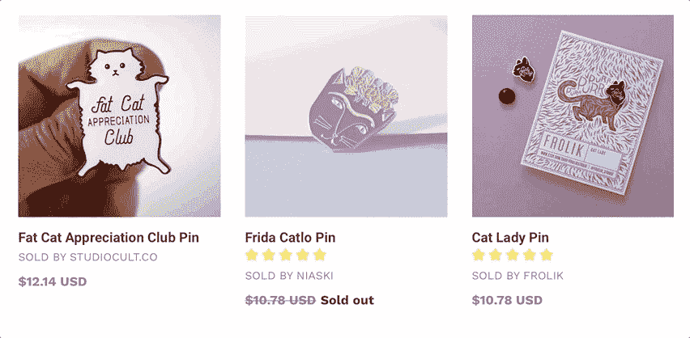
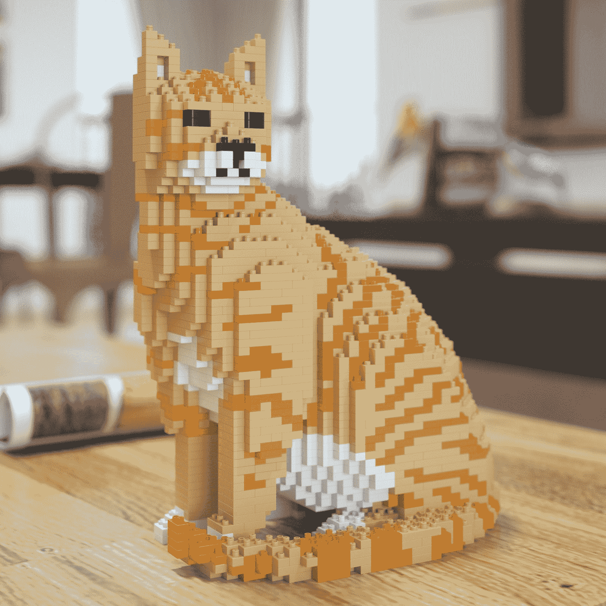

# 一个好玩的 Instagram 账户如何激励我们创业

> 原文：<https://www.indiehackers.com/interview/how-a-just-for-fun-instagram-account-inspired-us-to-build-a-business-b8f40a1dd3>

## 你好！你的背景是什么，你在做什么？

嗨！我叫 Bregt，是一名数码产品经理，目前正在开发一款认识新朋友的应用程序。我也在经营 [Katt。](https://katt.co)这是我和我的搭档阿莱杭德娜在比利时布鲁日家中的一个附带项目。

[卡特。](https://katt.co)是一个电子商务平台，展示来自设计师和插画师的灵感来自猫的物品，诞生于我们对所有猫的共同热爱。我们向客户介绍一些最相关的独立艺术家和创意人员的独家合作，展示他们的作品并支持他们背后的艺术家。凯特。在今年万圣节的[产品搜索](https://www.producthunt.com/posts/katt)中出现。

 

除了打理生意，Kiki 和我还亲切地管理我们新融合的八口之家:两个女孩，两个男孩，两只猫。

我们在 2017 年 10 月开始了我们的副业项目，迄今为止已经获得了 1000 多家客户。我们现在每月收入约为 3000 美元。

## 是什么促使你开始接触 Katt？？

凯特。不是做电商起家的。我们想表达我们对猫和植物的钦佩，并创建了一个专门的 Instagram 帐户。反响非常热烈，我们很快就聚集了一批忠实的追随者。我们的 Instagram 现在有超过 1 万名粉丝，并且还在快速增长。

在网上销售的想法一直潜伏在我的脑海里。随着我们的 Instagram 越来越受欢迎，我看到了一个真正开始自己的电子商务业务的机会。

## 构建最初的产品需要什么？

阿莱杭德娜和我都有我们热爱的日常工作，不想离开，所以我们知道时间不在我们这边，我们必须有创造性才能把事情做好。当我们创造凯特的时候。我们做出了一个战略决策，要把它建成一个连接设计师和顾客的平台，而不是把自己定位成卖家。我们从一些精心挑选的产品和设计师开始，每一个都直接销售给爱猫的目标群体。艺术家负责运输和处理，并直接运送给客户。

通过这种方式，我们都能够做我们擅长的事情——也只有这样——因为我们不必担心经营国际电子商务业务带来的物流问题。阿莱杭德娜寻找有潜力的设计师和制造商，我开始创建一个吸引人的商店来展示他们。由于我不是开发人员，也没有很多资金，我转向了 Shopify，这使我们能够快速而轻松地创建一个在线商店。我们只是采用了预装的默认主题，注册了一个域名，不到一天我们就上线运行了。

## 你们是如何吸引用户，壮大 Katt 的。？

我们在 Instagram 账户上取得了领先，因为它已经获得了一些关注。Instagram 是一个令人难以置信的工具，可以让产品面对目标受众，但从张贴猫和植物的照片到展示我们的猫主题产品的转变并不顺利。尽管每个帖子的点赞数量直线下降，增长速度放缓，但我们知道我们必须坚持下去。

Instagram 是让产品面对目标受众的一个不可思议的工具。

TweetShare

当产品搜索社区团队的 [Abadesi](https://www.producthunt.com/@abadesi) 发现我们的 Instagram 账户并问我们是否接受 Katt 时，我们的运气出现了转机。出现在他们的平台上。她想在产品搜索上展示制造商的多样性，并认为我们是完美的组合。我们开始有点犹豫，因为我们的产品只有几个星期，但我们同意了。凯特。我也是一个名为[制造商的故事](https://blog.producthunt.com/building-a-business-on-the-internets-love-of-cats-the-maker-of-katt-shares-his-story-23c27154e363)的新系列产品搜索的一部分，突出了来自世界各地的独特产品及其背后的人。我们还非常自豪地将 Product Hunt 的创始人瑞安·胡佛(Ryan Hoover)作为我们的客户之一，他购买了我们的一件[乐高启发的猫雕塑](https://katt.co/collections/jekca-lego-cats)。

 

从那以后，我们一直保持着良好的发展势头，并不断壮大。关于凯特的消息。在我们创建了自己的博客系列(名为[见见制造者](https://katt.co/blogs/meet-the-makers))之后，这一消息会进一步传播开来。设计师将他们的采访发布在自己的社交媒体账户上，这将他们的观众介绍给网站上的其他设计师和产品。这确实有助于明确界定卡特彼勒和设计爱好者的目标受众，因为每次采访都有助于促进其他设计师的销售。

当然，在我们的电子邮件中加入猫咪 gif 和偶尔的猫咪双关语也有助于提高我们的交易类电子邮件和时事通讯的点击率:)。

## 你的商业模式是什么，你是如何增加收入的？

从税收和物流的角度来看，在国际网上销售有许多障碍需要克服。你必须了解适用于你销售和运送的每个国家的当地规则。当我和我的会计师 Michael Vandenhende 讨论这个问题时，我强烈推荐他(如果你要在比利时创业的话)，我们知道我们必须有创意，以便能够在预算紧张的情况下在全球范围内发货，并且仍然能够在需要时快速扩展。

这就是为什么我们制定了商业计划，让艺术家直接销售，而不是我们自己充当销售者。每次有人通过 Katt 下单。，他们直接从艺术家那里购买，然后艺术家收到订单并使用定制的 Katt 履行订单。他们打印品牌装箱单，并添加到他们发出的包裹中。这让我们避免了许多复杂的国际税收和航运物流，并使我们能够专注于业务的其他方面。

 

对于每笔销售，我们收取 30%的佣金。作为回报，我们负责将艺术家产品添加到平台上，进行营销，并做好客户服务。这是双赢的局面。我们投入大量资金帮助艺术家通过多渠道的方式销售他们的产品。我们通过以下方式推广产品和销售:

*   与设计行业的不同出版商合作，撰写 Katt 上的产品。
*   为我们的顾客打折促销(折扣来自我们的利润)
*   通过谷歌广告词和不同的社交媒体渠道，如脸书和 Instagram，进行在线广告
*   通过活跃的社交媒体提高参与度
*   时事通讯营销

最近，我们为 iOS 和 Android 手机分别开发了应用程序。而凯特。是一个非常小众的商店——不像 Etsy，例如——我仍然相信拥有一个专用的应用程序有一些主要的优势。我们现在能够通过推送通知这一非常强大的营销工具来联系我们的客户。它还提供了在应用评论网站上发布我们的应用、创建新闻稿以及开展更多应用相关营销活动的机会。

月收入数据点:

| 月 | 收入 |
| --- | --- |
| 2017 年 10 月 | 1056 |
| 2017 年 11 月 | 2946 |
| 2017 年 12 月 | 3273 |
| 2018 年 1 月 | 1410 |
| 2018 年 2 月 | 3297 |
| 2018 年 3 月 | 5454 |

注:3 月收入只计入 1 日至 21 日。

## 你未来的目标是什么？

这听起来可能没什么野心，但卡特的目标是。从商业的角度来看，就是把它作为一个不耗费大量时间的附带项目，同时使它真正具有可伸缩性。阿莱杭德娜和我都非常喜欢我们的工作，更喜欢做这样的事情，而不是晚上看网飞。

有一个明确定义的目标受众真的很有帮助，因为每个特色设计师访谈都有助于促进其他设计师的销售。

TweetShare

这个想法是尽可能自动化，从在社交媒体上发布到下订单。所有投入 Katt 的钱。要么提高过程的效率，要么推销产品。在不久的将来，我们希望能够在没有任何人工干预的情况下，将订单发送给艺术家，包括装箱单和所有其他信息。这样我们就可以专注于真正重要的事情:展示独立制作人的作品，支持他们背后的艺术家。

## 我们可以去哪里了解更多？

我们希望得到你对我们的副业的反馈。请在下面留下您的评论，我们会与您联系。我们也很乐意帮助那些从我们的项目中受到启发的人！

在这里找到我们:

*   网址:[https://katt.co](https://katt.co)
*   insta gram:【https://instagram.com/katt_co 
*   https://facebook.com/kattcompany[脸书](https://facebook.com/kattcompany)
*   推特:[https://twitter.com/katt_co](https://twitter.com/katt_co)
*   iOS 应用:[https://itunes.apple.com/app/katt/id1356536995](https://itunes.apple.com/app/katt/id1356536995)
*   安卓应用:[https://play.google.com/store/apps/details?id=co.katt.app](https://play.google.com/store/apps/details?id=co.katt.app)

——[<picture id="ember5336211" class="user-avatar ember-view user-link__avatar"></picture>Bregt colpa ert](/bregt?id=sYP9ZTXEOPSocJ0VmaOUAldGomC3)，Katt 创始人。

## 想像 Katt 一样建立自己的事业。？

你应该加入[独立黑客社区](/)！🤗

我们是几千名创始人，互相帮助建立有利可图的业务和副业。来分享你正在做的事情，并从你的同事那里获得反馈。

还没准备好开始使用你的产品吗？没问题。这个社区是一个认识人、学习和实践的好地方。随意[随便浏览](/)！

—[<picture id="ember5336216" class="user-avatar ember-view user-link__avatar"></picture>考特兰艾伦](/csallen?id=ibTLPyjwVebnZjMGKvz6ztarnuV2)，独立黑客创始人

24votes