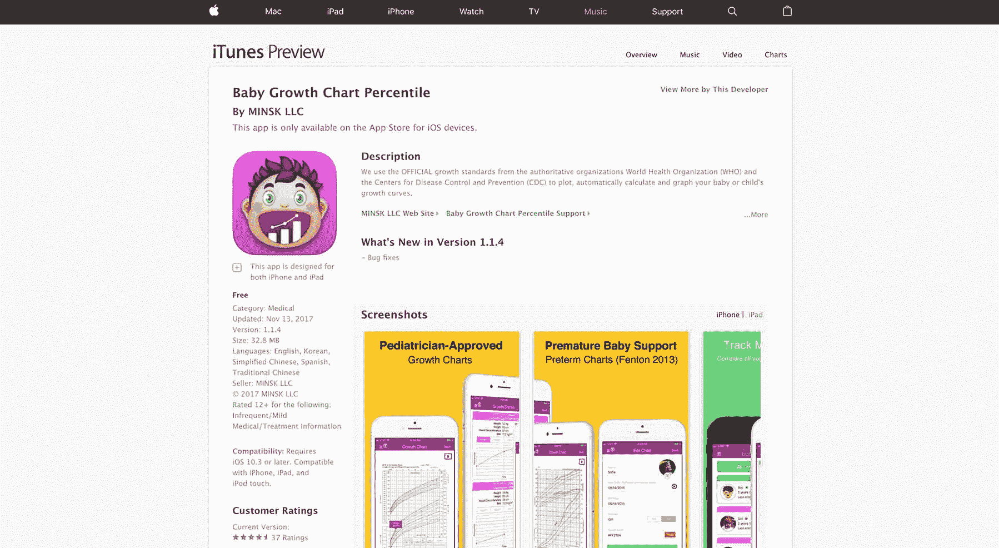
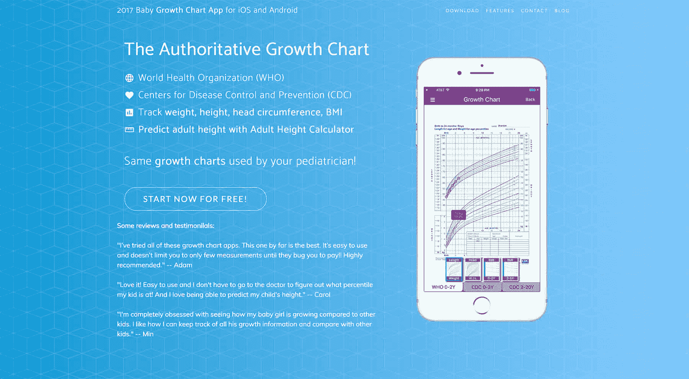

# 初为人父者如何为其他初为人父者打造 iOS 应用

> 原文：<https://www.indiehackers.com/interview/how-a-new-father-built-an-ios-app-for-other-new-parents-99f398f80e>

## 你好！你的背景是什么，你在做什么？

我叫闵权。我是一名软件工程师，从 2008 年开始开发手机应用。白天，我在华盛顿 DC 大都市区的一家移动安全初创公司工作，管理着一个工程师团队。晚上，我会开发一些应用程序作为消遣。

我在过去的一款名为[拯救他们所有人](http://www.gamepeons.com)的游戏中取得了一些成功，这款游戏早在 2012 年就登上了排行榜榜首(游戏中排名第 70 位，总排名第 120 位)。不幸的是，团队内爆，所以它不再在应用程序商店。但我打算重新发行。

我最近推出了 iOS 版的[婴儿成长百分位图](https://itunes.apple.com/us/app/baby-growth-chart-tracker/id1278595136?mt=8)。它通过自动计算百分位数并将其绘制在世界卫生组织(世卫组织)和疾病控制和预防中心(CDC)的官方生长图表上，帮助父母跟踪孩子的生长(如身高、体重、头围和身体质量指数)。

在写这篇文章的时候，我预计每月大约 200 美元。我能够让这款应用在医疗类排行榜上排名第 26 位(有那么一小会儿！)所以我希望这能在下个月转化成一个更大的数字。

 

## 是什么促使你开始使用婴儿成长图表百分位？

我是两个小孩的父母。当你刚为人父母时，医生会做的第一件事就是用那些百分位数来吓唬你。当医生告诉你，你的新生婴儿低于平均水平时，你开始害怕了！谁愿意听到他们的孩子还不到一天就“低于平均水平”呢！

我环顾四周，尝试了市场上大多数现有的应用程序来跟踪我孩子的增长百分位数，但没有一个满足我的需求。我发现百分点不准确，用户界面难以导航，和/或他们缺乏我想要的功能。所以我决定推出我自己的。

在这一点上，我的目标不是从我的日常工作中获得完全的经济独立——只是减少对它的依赖。

TweetShare

几年前，我偶然在一个分析母乳(毒素、宏量和微量营养素)的项目上帮助了一位哈佛教授。作为该项目的一部分，我还研究了世卫组织增长标准，所以我已经对数学有所了解。

不过，对于婴儿生长图表的百分位数，我决定同时采用世卫组织、疾病预防控制中心和芬顿(针对早产儿)的标准，因为医生建议两岁以下的儿童使用世卫组织标准，两岁以上的儿童使用疾病预防控制中心标准。因为这个应用程序已经获得了孩子的生长数据，我还添加了一个身高计算器，它使用一种叫做[哈米斯-罗氏方法](https://www.ncbi.nlm.nih.gov/pubmed/7936860)的东西来预测身高，我听说这种方法在预测孩子最终成年身高方面的准确率约为 90%。

但这不是我唯一的动力。我的第一个孩子今年进了幼儿园，我的妻子决定辞去工作，通过志愿活动、加入家庭教师协会等方式，更专注于他的学业。这里的生活成本相当高，所以从双收入下降到单收入很痛苦！我实际上不再买有机水果了——不是开玩笑！:)

我还注意到了另外一件事。朋友和熟人都在抱怨工作没有加薪。人们对获得额外的 5000 美元加薪感到紧张，这在税后还不算多。我没有为加薪而紧张，而是决定尝试做些兼职来补充收入，并开始为自己建立资产净值。

## 构建最初的产品需要什么？

我在三个月的时间里开发了[婴儿成长图表百分位](https://itunes.apple.com/us/app/baby-growth-chart-tracker/id1278595136?mt=8)。我没有太多时间做全职工作和照顾两个活泼好动的孩子。我还在处理几个主要的健康问题，所以这进一步拖慢了我的速度。

幸运的是，我已经解决了大部分的数学问题。一旦我把这些都解决了，下一个挑战就是在官方图表上绘制这些数据点，并确保它们被准确地绘制出来。

这三个月并不都是发展。我花了一些时间 A/B 测试各种东西，比如图标、本地化(非常烦人)、创建一个[博客](https://www.growthchart.us/blog/)，以及研究营销(有趣！).

 

我最初对这个应用有一个更大的愿景。我想跟踪所有与婴儿相关的事情，比如换尿布、喂食时间、接种疫苗等等。但我最终决定只关注增长图表。我认为这是一个正确的决定，因为我可以轻松地在这上面再花三个月，而半年对我来说太长了。也就是说，我确实有用户要求这些额外的功能。

该应用程序由 Objective-C 和 Swift 共同开发。(我利用这个机会最终自学了 Swift——我讨厌那些[选项](https://developer.apple.com/documentation/swift/optional)！)

## 你们是如何吸引用户和成长宝宝成长图表百分位的？

我在[产品搜索](https://www.producthunt.com/posts/baby-growth-chart-tracker)上获得了一些牵引力，但它并没有真正转化为太多的下载。我平均每天下载 20-50 次。我尝试和学到的一些东西:

*   中国的下载量超过美国两倍以上。
*   在中国和美国以外，人们不会花钱升级。
*   用他们 50 美元的免费信用尝试了 LinkedIn 广告。
*   尝试了脸书广告来 A/B 测试图标，引导用户到我们的[登陆页面](https://www.growthchart.us)，这样我们就可以收集电子邮件。
*   尝试用脸书广告来推动应用安装。
*   尝试 Google Adwords 来增加登陆页面的流量。
*   用他们 100 美元的免费信用测试苹果搜索广告。
*   最终起作用并推动该应用程序在排行榜上排名第 26 位的是应用程序免费页面上的[应用建议](https://appadvice.com/apps-gone-free)。

我学到的最重要的一课是中国对下载量的重要性。所以一定要为中国本地化。

我意识到，如果我想获得某种成功，我需要成为一名精通技术的营销人员，而不是一名涉足营销的技术人员。

TweetShare

就付费广告而言，投资回报不值得。以下是我对广告的一些想法:

*   苹果搜索广告确实增加了下载量，但投资回报率不足以证明持续投入资金的合理性，所以我停止了。关于搜索广告的一个提示——确保尽快申请他们的 100 美元促销信用，因为他们不会追溯性地给你信用。我被这个咬了。
*   LinkedIn 广告听起来是个好主意，目标是儿科医生，但是哇，它们很贵吗？两天之内，我已经花掉了大部分的钱。平均每次点击费用超过 7 美元。
*   在脸书广告上总共花了 40 美元，只收到了大约 20 封邮件。尽管它在性价比方面比 Google Adwords 要好。
*   脸书广告瞄准特定人群的能力真的很棒。但是我们的脸书应用安装活动毫无价值。浪费金钱。

最后，关于整个 B2C 的事情。消费者…

我相信你以前听过。把消费者转化成付费客户真的很难。我试过从 4.99 美元一直到 0.99 美元的各种价位，但差别不大。

消费者可能会很残忍，尤其是在有免费应用的情况下。在付费到免费的促销活动中，一些用户因为无法下载应用内购买的内容而留下了负面评论。他认为我故意弄坏它来欺骗人们下载这个应用程序。

另一个用户留下了一个随机的负面评论，说:“它看起来不错。但我没有测试过。”大家都知道正面评价有多重要，这些空洞的负面评价真的会拉低平均水平。

我在这个应用上花了三个月的空闲时间，阅读一些用户的反馈，他们抱怨不得不为应用的升级版本付费，因为他们说他们可以从医生的办公室免费获得图表，这令人恼火。相反，我在考虑下一步可以在目标业务上做些什么。

## 你的商业模式是什么，你是如何增加收入的？

我有一个免费版的[婴儿成长图表百分位数](https://itunes.apple.com/us/app/baby-growth-chart-tracker/id1278595136?mt=8)，可以通过应用内购买解锁所有功能，还有一个高级版的应用内购买已经解锁。

免费版本最初包括广告。我尝试过横幅广告、原生广告和插播广告。我尝试过与 [Mopub](https://www.mopub.com) (AdMob，脸书，Mopub 的市场)进行协调。我也试过 [Appodeal](https://appodeal.com) 。不管怎样，带来最多收入的是最合适的。

我最终删除了所有的广告，因为看起来我每个月的收入不到 2 美元。一些用户也在抱怨这些广告，这也是删除它们的另一个原因。

对于我的应用程序，参与度和会话持续时间都不是很高。父母只需输入数据，检查百分位数，也许打印出官方图表，然后直到孩子下次去看医生才回来。所以我认为它不适合做广告。

我从免费版本中删除了广告，并简单地将允许的增长条目限制在孩子生命的第一年。某些功能也被锁定，如成人身高计算器，身体质量指数百分位，以及跟踪多个孩子。

大部分销售额来自应用内购买。优质 verison 每天销售约 1-2 份。

## 你未来的目标是什么？

我眼前的功课就是绞尽脑汁如何提高转化率。我也收到了一些用户反馈，所以我会继续改进这款应用，以提供更多价值。希望这将转化为更多的销售。

我单独发布了[婴儿成长图表百分位](https://itunes.apple.com/us/app/baby-growth-chart-tracker/id1278595136?mt=8)，但实际上在过去 10 年左右的时间里，我一直在与大约 10 名开发人员合作各种附带项目，例如这个名为 [GogoPlay](https://www.gogoplay.org/info/index.html) 的项目，它使父母可以轻松地出售和交易二手儿童用品。我们最近又聚在一起，一直在谈论一起解决一些项目。现在，我们的问题是我们有太多的想法。因此，我们致力于专注于一个，验证它，然后解决它。

而我依然没有放弃游戏。我将重新发布已经在我的 git 库中积满灰尘的游戏，我也有计划发布其他游戏。就获得广告收入而言，我认为游戏是最重要的。

最后，我是一名排名靠前的亚马逊评论者(上次我查看了大约前 2500 名)，我正在想办法利用这一点带来更多的额外收入。虽然我还不知道是什么或者怎么做。(如果有人有什么想法，我很想听听！)

所有这一切的最大障碍是时间。

 

## 你面临的最大挑战和克服的障碍是什么？

[婴儿成长图表百分位](https://itunes.apple.com/us/app/baby-growth-chart-tracker/id1278595136?mt=8)项目实际上是从一个三人小组开始的。我负责 iOS，另一个负责 Android，还有一个负责营销的人。目前只发布了 iOS 版本。我负责所有的营销工作。我们有一些“戏剧哟妈妈”的时刻，我认为可以用不同的方式处理。但是后知后觉是 20/20…事情就是这样。

我真正想要的应用程序功能之一是云同步。很自然的，我选择了 iCloud。我看到其他应用程序没有 iCloud sync，所以我花了大量的时间和精力来实现这个功能。

当然，我是在发布日偶然看到苹果网站上的一个页面说 iCloud 不能用来存储健康数据。所以所有的努力都白费了。如果你在健康空间，关注 [HIPAA](https://en.wikipedia.org/wiki/Health_Insurance_Portability_and_Accountability_Act) 。

## 有没有发现什么特别有帮助或者有优势的？

我反对我上面所说的，但是有一个伙伴非常有帮助。虽然我们不再合作，但在我们合作的那段时间里，我依靠他，依赖他的支持。我仍然认为他是一个好朋友，我希望我们的私人关系能够经受住这个小小的颠簸。我希望他尽快发布安卓版的[婴儿成长图表百分位](https://itunes.apple.com/us/app/baby-growth-chart-tracker/id1278595136?mt=8)，因为他为此付出了努力。

我也发现在这里和其他地方阅读其他关于独立黑客的采访非常有激励性，有时甚至有治疗作用。你意识到你并不孤单，其他人也在挣扎。同病相怜！:)

我没有为加薪而紧张，而是决定尝试做些兼职来补充收入，并开始为自己建立资产净值。

TweetShare

哇，有些印度人真的很成功。这给了我希望，有一天我能加入他们的行列。在这一点上，我的目标不是从我的日常工作中获得完全的经济独立——只是减少对它的依赖。

我也推荐看看罗布·沃林的书[从小处着手，小处着手。](http://www.startupbook.net)。虽然过时了，但仍然很有意义，很有帮助。

## 对于刚刚起步的独立黑客，你有什么建议？

我需要思维模式的转变。我需要摆脱我的工程师心态。我意识到，如果我想获得某种成功，我需要成为一名精通技术的营销人员，而不是一名涉足营销的技术人员。

听起来很明显，但我直到最近才明白。在我面前有一个无形的障碍，阻止我跨越这个鸿沟，阻止我参与游戏的营销。

我认识很多可以合作的开发人员。但是找到一个优秀的营销人员(和图形人员)是最困难的事情。我终于意识到，如果我想要它，我自己需要成为销售专家。前面的路还很长，我还有很多要学，但我很高兴我终于意识到了这一点。

我不记得在哪里听到过这句话，所以我不知道这是谁说的，但我一直记着:

*“懂营销的开发者是不可阻挡的。”*

## 我们可以去哪里了解更多？

*   iOS 应用:[itunes . apple . com/us/App/baby-growth-chart-tracker/id 1278595136？mt=8](https://itunes.apple.com/us/app/baby-growth-chart-tracker/id1278595136?mt=8)
*   登陆页面: [www.growthchart.us](https://www.growthchart.us)
*   博客:[www.growthchart.us/blog](https://www.growthchart.us/blog)
*   我的 LinkedIn:[www.linkedin.com/in/minkwon/](https://www.linkedin.com/in/minkwon/)

请随时通过 LinkedIn 或博客的[联系我们](https://www.growthchart.us/blog/index.php/contact-us/)页面联系我！

—[<picture id="ember5248855" class="user-avatar ember-view user-link__avatar"></picture>敏权](/MinKwon?id=baby-growth-chart-percentile-owner)，宝宝成长图表百分位创造者

## 想建立自己的企业像婴儿成长图表百分位？

你应该加入[独立黑客社区](/)！🤗

我们是几千名创始人，互相帮助建立有利可图的业务和副业。来分享你正在做的事情，并从你的同事那里获得反馈。

还没准备好开始使用你的产品吗？没问题。这个社区是一个认识人、学习和实践的好地方。随意[随便浏览](/)！

—[<picture id="ember5248860" class="user-avatar ember-view user-link__avatar"></picture>考特兰艾伦](/csallen?id=ibTLPyjwVebnZjMGKvz6ztarnuV2)，独立黑客创始人

6votes