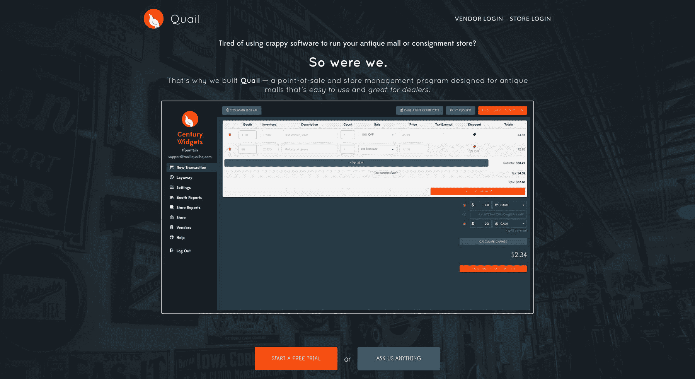
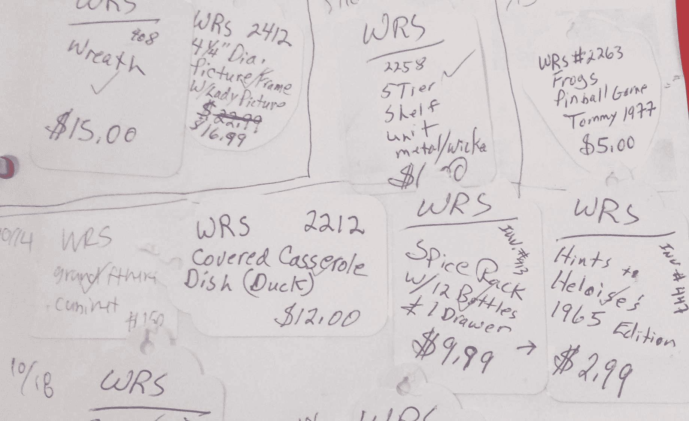

# SaaS 的销售点企业如何每月赚 900 美元

> 原文：<https://www.indiehackers.com/interview/how-a-point-of-sale-saas-business-makes-900-mo-fc20295e84>

## 你好！你的背景是什么，你在做什么？

我叫 Trevor Fountain，是一名全栈开发和设计人员。自 2016 年 12 月以来，我一直在研究[鹌鹑](https://quailhq.com)——一种用于古董店和供应商商场的销售点和商店管理工具。

如果你从未遇到过供应商购物中心，它们是零售 SMB，店主租下一个大的空场地(通常被购物中心主持人或大型零售商放弃)，设置收银机，并将场地出租给一群提供库存的“经销商”。

商业模式变化很大:一些商店收取寄售费(占总销售额的%)，一些商店收取固定租金(X / ft^2)，大多数商店两者兼而有之。一些出售昂贵的古董，一些出售收藏品，一些基本上只是永久的，美化的车库销售——但它们都有一些独特的怪异之处，使它们很难适应标准的销售点系统。

截至 2017 年 10 月，我有 21 家店铺使用鹌鹑，每月从订阅中获得 965 美元的收入；上个月，这些商店使用鹌鹑处理了超过 20 万美元(主要是现金)的交易。

 

## 是什么促使你开始研究鹌鹑？

2016 年 12 月，我在德克萨斯州乡下的家里过圣诞节。我家的一些人最近在当地的一家古董商场租了一个摊位，这家商场是由他们的一些朋友经营的。一天下午，我去商店闲逛，当我在那里时，那里的一名工作人员让我帮忙解决他们使用的销售点软件的一个问题。

我去看了一下，它的糟糕和混乱让*大吃一惊。我肯定嘀咕过类似的话，因为我正在帮助的职员(他知道我的日常工作是“用电脑做些事情”)开玩笑说，我可能在一个周末就能把它们变成一个更好的程序。店主一本正经地插话说:“哦！哦，你能吗？那就太神奇了！”*

 

当然，就像每个工程师向非软件人员提出想法一样，我的回答是，“对不起，我不会，编程很难，*等等等等*，”接下来的一个小时里，当他们抱怨他们的软件糟糕透顶时，我拼命地让自己解脱出来。他们向我抛出一个又一个对他们有帮助的想法，而我只是完全忽略了我正在进行的令人惊讶的用户采访，因为我试图逃避这场对话并离开。

当时我住在东京；在回家的长途飞行中，我打开笔记本电脑，为了打发时间，开始根据他们谈论的事情设计一个小的网络应用程序。当我到达的时候，我意识到我可以在下个周末之前为他们建立一个更好的程序，所以我打电话给他们，为我的粗鲁道歉，然后我们从那里开始。

## 构建最初的产品需要什么？

花了大约一个月的晚上和周末时间为鹌鹑们制作了 MVP。(我的全职工作是远程开发。)到目前为止，最困难的事情是控制我在第一家商店里共事的人的期望。

我当时还在日本，所以第一批用户(商店里的店员、经理和经销商)的每个迭代周期至少需要一天。每天早上醒来，我都会收到他们发来的电子邮件，里面充满了*如此……如此多的……想法*，关于这个程序可以做的事情，仅仅是识别出好的想法并让他们的期望保持合理就是一个持续的过程(尽管超级有趣！)工作。

对于不知道软件是如何构建的人来说，软件是神奇的。

TweetShare

他们想做的一些事情非常困难(“我能给一件物品拍照，让系统识别它吗？”)，还有一些非常简单(“我可以在家登录吗？”).从事技术工作的人有时会忘记，从外表上很难区分哪个是哪个！对于不知道软件是如何构建的人来说，软件是*神奇的*。

MVP 可能有三个屏幕:一个用于登录，一个用于记录销售，一个用于管理经销商的简单表格。我手动完成了所有其他工作(用户管理、计费、生成销售报告)，只需敲打 SQL 或通过 Stripe 仪表板。(创业第四课:“做不可扩展的事情。”)

整个事情非常简单，几乎不起作用，但是他们喜欢它。就在我们上线之前，我组装了一个快捷的应用程序，经销商可以用电子邮件地址登录，查看他们自己的销售情况。我真的对此没有太多期望，但这似乎是一个很好的实验，在他们改变之前这是完全不可能的。

 

## 你是如何吸引用户并种植鹌鹑的？

让经销商登录并检查他们自己的销售结果证明是 MVP 的最好部分，因为我合作的第一家商店的一些经销商也在附近的其他商店租用摊位。

在我们上线几个星期后，他们开始缠着那些商店的老板切换到新的程序，这样他们就可以在一个地方检查所有的销售情况。这实际上是我最好的增长载体:快乐的经销商(他们可以免费访问！)走进其他他们出租场地的商店，推动那些店主来检查我们。

自从发布以来，我已经加倍关注这些用户，增加了一些有用的功能来帮助他们经营他们的摊位。快乐的经销商是一个有机的增长渠道，此外，他们是我能想象到的防止流失的最好的护城河——如果一家商店切换到不同的销售点系统，他们将丢失所有的报告和分类商品，替代[鹌鹑](https://quailhq.com)的方法通常是亲自开车去商店拿打印的报告。

就像每个工程师向非软件人员提出想法一样，我的回答是，“对不起，我不会，编程很难，诸如此类。”

TweetShare

除了有机增长，我实际上有令人惊讶的(至少对我来说！)批量直邮成功。三月份，我向两个我没有涉足的州的 100 家古董店发了传单，在大约一个月的时间里，我根本没有看到任何结果，但从那以后，我看到一些商店注册了，他们证实了他们是通过这种方式发现鹌鹑的。

尽管我在搜索引擎优化和网络广告方面做了很多努力，但迄今为止，一份老式的*传单*是我最成功的营销推广。我想这个教训就是要更加批判性地思考你的客户在哪里；在我的情况下，他们通常根本不在互联网上*。*

这是…艰难的。

## 你的商业模式是什么，你是如何增加收入的？

我根据经销商的数量向商店收取分级订阅费:30/60/无限经销商每月 35/60/120 美元。当然，支持这些额外经销商的边际成本是 0 美元，但这些商店的经营方式几乎总是意味着经销商越多，商店的可支配收入就越多。

大型商店的支持负担确实稍重一些——他们经常有多名店员同时给销售打电话，而且在出现停机或故障时往往不太宽容。

我 80%的鹌鹑顾客都选择了最小套餐，如果商店在边界附近，我会非常宽容。我肯定会把钱留在桌子上，但折扣和优惠券代码是我管理与客户关系的最佳胡萝卜(大声喊出[条纹](https://stripe.com/)，这使得*非常容易*做到)。

我正在帮助的职员(他知道我白天的工作是“用电脑做些事情”)开玩笑说，我可能在一个周末就能把它们变成一个更好的程序。

TweetShare

如果我看到一家商店有一个月销售疲软，或者他们刚刚越过 30-31 家经销商之间的边界，我通常会先发一封电子邮件给他们，上面有折扣代码，并快速回复:“嘿，希望这能帮助你度过下个月；希望我能帮上更多的忙！”

作为在下个月的订阅上放弃几美元的交换，我得到了对他们的销售点软件绝对满意的客户(创业课程#8:“做人”)，因此如果我们有意想不到的停机时间或者我花了几天时间来回复一个问题或修复一个错误，他们会更加宽容。

对我来说，这是一个很好的交易，有助于防止不断增长的副业蚕食我的生活。(我还有一份全职的日间工作。)这也是获得用户反馈的一个很好的接触点:他们得到一次性的折扣，我可以问几个有针对性的问题。

我的月支出低得令人厌恶:

*   托管费([Linode](https://www.linode.com)):40 美元/月
*   入站邮件([谷歌 G 套件](https://gsuite.google.com)):每月 10 美元
*   出站电子邮件([Mailgun](https://www.mailgun.com)):0 美元/月
*   订阅处理([条纹](https://stripe.com/)):约 35 美元/月

| 月 | 收入 |
| --- | --- |
| 一月 | 120 |
| 二月（February 的缩写） | 190 |
| 瑕疵 | 225 |
| 四月 | 405 |
| 五月 | 640 |
| 六月 | 720 |
| 七月 | 755 |
| 八月 | 755 |
| 九月 | 825 |
| 十月 | 965 |

## 你未来的目标是什么？

我 2018 年的主要目标是增长门店数量。这是一个个人成长目标，因为达到这个目标意味着我必须在销售和营销方面比现在做得更好。

我还想花些时间探索附加产品的想法，我可以用[鹌鹑](https://quailhq.com)卖给经销商。目前，这些用户提供了防御护城河和一些有机增长，但没有直接收入。

就像他们所在的商店一样，这些也是*也是*用小本经营(非常)小生意的人，没有太多的计划或预先考虑。(“会计？是啊，我听说过。”)我还不确定这看起来会是什么样子，但我在与他们交谈的过程中，一直保持着对想法的警惕。

## 你面临的最大挑战和克服的障碍是什么？

我经常在独立黑客上读到针对软件工程师(如 WakaTime)或其他初创公司(如 Baremetrics)的 B2B 初创公司，我想拥有精通技术的用户该有多好。

例证:当一家商店注册时，我总是提议从他们现有的系统中手动导入他们的销售和经销商数据(启动课程#31:“提供令人震惊的良好支持”)。通常这意味着他们会给我发一个 Excel 或 MS Access 文件，里面有几个表格，但有一次令人难忘的是，一位店主接受了我的提议，给我寄了一本真正的剪贴簿，里面有她过去两年卖出的每件商品的价格标签。

 

谈论“做不成规模的事情。”

(顺便说一句，她仍然是一个快乐的顾客。完全值得。)

## 有没有发现什么特别有帮助或者有优势的？

其他人在我之前已经说过了，但是利用你的体型作为优势。在全国范围内，我正在与 Intuit 或 Square 这样的巨头竞争——但我可以走得更快，做一些对印第安纳州一家 5 人旧货店的老板来说有点神奇的事情。

需要稍微不同的报告吗？有一个看不懂英语并且不断犯错的职员吗？太好了，我会添加该功能或本地化该按钮，并让您知道它已被修复。

这有双重好处，迫使你与你的用户交谈(启动课程#112:“与你的用户交谈”)，这从来不是一件坏事。

## 对于刚刚起步的独立黑客，你有什么建议？

如果你是一名工程师，抵制使用令人兴奋的技术的诱惑。 [Quail](https://quailhq.com) 是用 boring 技术(服务器上的 Java + Postgres，客户端的 Angular 1.x)构建的 boring 软件(销售点和销售报告)，这让我可以腾出时间专注于建立业务。它还有一个副作用，就是难以置信地易于扩展和维护。

尽管我在搜索引擎优化和网络广告方面做了很多努力，但迄今为止，老式传单是我最成功的营销手段。

TweetShare

如果你创业是因为你想尝试性感的新堆栈，你最好从事开源项目；创建一家初创公司是为了建立业务，而不是开发软件。把 GraphQL 支持的、无服务器的、Vue.js-in-Clojurescript 废话留给你的日常工作吧。

另外，因为问题总是出现*:如果你不能得到`.com`域名，不要紧张。这显然无法量化，但我怀疑我没有因为没有`quail.com`而错过一单销售。*

* 

## 我们可以去哪里了解更多？

你可以在 quailhq.com 的[了解更多关于鹌鹑的信息。我也是独立黑客的活跃分子，所以请在这里的评论中向我提问，我会尽我所能回答！“令人震惊的好支持”和“与你的用户交谈”等等。](https://quailhq.com)

谢谢你邀请我，科特兰！

—[<picture id="ember5308030" class="user-avatar ember-view user-link__avatar"></picture>特雷弗喷泉](/Quail?id=kf2Z1RzaXJQx2JegIp26dEPJeEe2)，鹌鹑的创造者

## 想像鹌鹑一样建立自己的事业？

你应该加入[独立黑客社区](/)！🤗

我们是几千名创始人，互相帮助建立有利可图的业务和副业。来分享你正在做的事情，并从你的同事那里获得反馈。

还没准备好开始使用你的产品吗？没问题。这个社区是一个认识人、学习和实践的好地方。随意[随便浏览](/)！

—[<picture id="ember5308035" class="user-avatar ember-view user-link__avatar"></picture>考特兰艾伦](/csallen?id=ibTLPyjwVebnZjMGKvz6ztarnuV2)，独立黑客创始人

10votes*