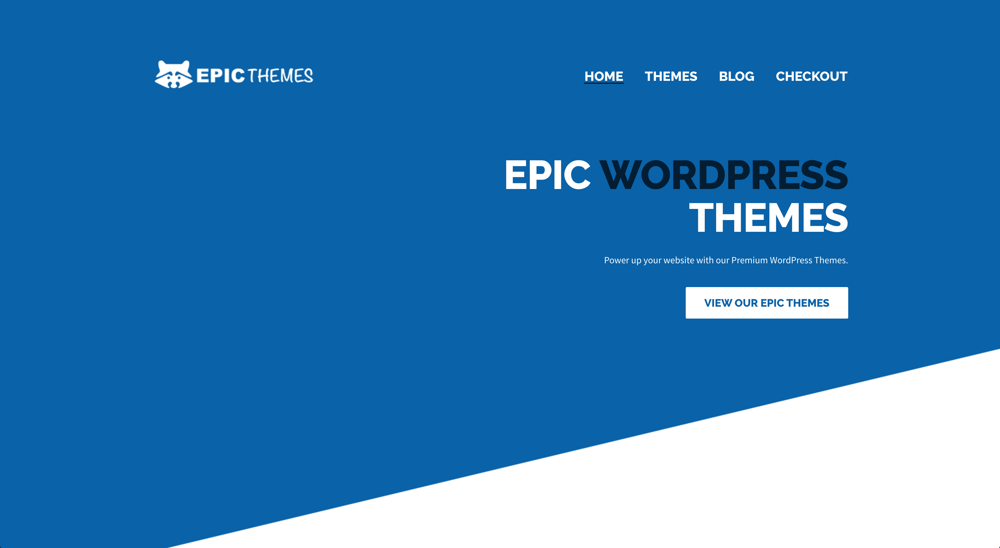
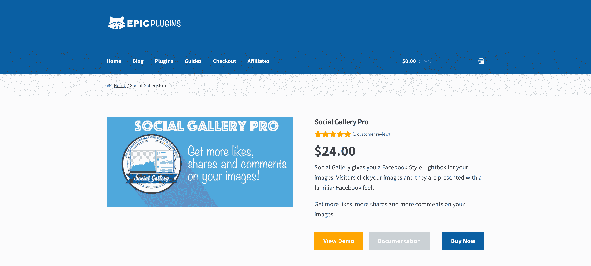
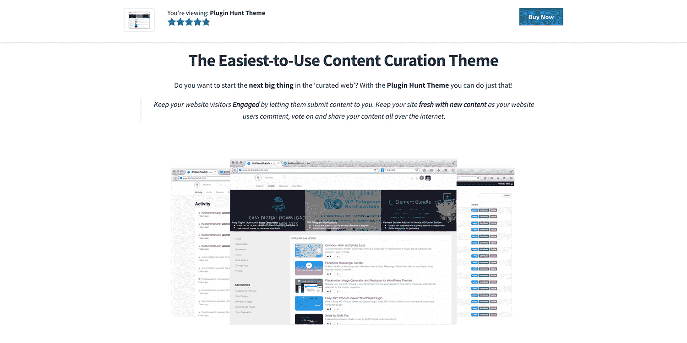

# 以前的失败如何帮助我建立了 5000 美元/月的业务

> 原文：<https://www.indiehackers.com/interview/how-a-previous-failure-helped-me-build-a-5k-mo-business-7cde911282>

## 你好！你的背景是什么，你在做什么？

我是迈克，史诗插件和史诗主题的首席执行官和创始人。通过这些网站，我出售优质的 WordPress 插件和主题。

Epic Plugins 是为那些想在网站上添加额外功能的用户准备的。它有十几个插件，比如[社交图库图片浏览器](https://epicplugins.com/product/social-gallery-pro/)，允许网站所有者将他们的图片“社交化”(比如，点击图片时，图片会在脸书风格的灯箱中打开，可以在其他社交网络上被评论、点赞和分享)。

另一方面，Epic Themes 是为那些希望通过一个新的 Wordpress 主题为他们的网站进行全新设计的人准备的。我们目前销售的主题相当小众，专注于内容监管和内容排名(类似于 Reddit 如何对主页进行排名，或者 Product Hunt 如何对他们提交的产品进行排名)。

事实上，两个最受欢迎的 WordPress 主题旨在允许任何人快速使用 WordPress 创建一个网站，就像产品搜索或 Reddit 一样。虽然不是直接的“克隆”，但它们被客户用来提供具有类似功能的利基网站。(例如，最热门的酒店或最高生产率提示。)

 

我不是从 WordPress 开始的。我开始自学 PHP、jQuery 和 mySQL(通过 WordPress Codex)。

在把这作为一个爱好开始之后，我已经能够单枪匹马地把我的网上销售额从每月 0 美元增长到大约 5000 美元。

## 是什么促使你开始使用 Epic 插件和主题？

我一直对计算机编程感兴趣。在我获得硕士学位的研究生项目中，我使用高性能计算和数学算法来帮助解码使用电流的管道内的“物体”。所以我一直对软件感兴趣，但在我开始自己的副业之前，我从未涉足 web 应用程序开发。

我上手[史诗外挂](https://epicplugins.com)和[史诗题材](https://epicthemes.com)纯属偶然。这实际上是一个附带项目的副产品，考虑到它现在是我在线收入的主要来源，这是相当疯狂的。

边做边做。储存足够的现金储备，趁早放手一搏。

TweetShare

我最初的“副产品”是我在 WordPress 上运营的一个社交电子书商店。我花了很长时间建立了一个双边市场，让作者注册他们的电子书，并试图反过来吸引读者不仅注册和购买他们的书，还与作者联系并与他们讨论他们的书。(想象一下和斯蒂芬·金在群聊里聊他最新的恐怖小说吧！)

通过建立这个网站，我学到了很多关于用 LAMP 栈(Linux、Apache、MySQL 和 PHP)为 WordPress 编码的知识。这让我可以相对容易地建立并运行一个会员网站。我在朝九晚五之后的晚上和周末都在做这个项目。

电子书商店失败了——顾客不买。对他们来说，很难知道如何把从我的网站上买的书放到他们的 Kindles 上。但是在失败的背后，我用我所学到的进入了一个我甚至不知道存在的市场:WordPress 插件销售。

## 构建最初的“史诗级产品”需要什么？

我所做的关于插件网站的范围和特性的决定，直接与书店签约作者的顾客反馈联系在一起。我一直在用血汗资本进行这项工作，没有得到外部资助。其中一个功能要求是能够上传图书封面图库，并让社区喜欢、分享和评论他们最喜欢的封面。

这就是我如何创建社交画廊照片浏览器，我前面提到的插件。(我在 2012 年推出，通过 CodeCanyon 销售。)

 

我建立了社会画廊作为一个功能的要求，并作为一个“插件”到我的网站。我还开发了“BooksMash”，这是一个流行的封面排名游戏，它使用 Elo 算法让社区对书籍封面进行投票(灵感来自马克·扎克伯格在哈佛开发的应用程序“Facemash”)。

人们喜欢它，所以它变成了一系列的 WordPress 插件，我在 CodeCanyon 上卖了它们，叫做 PicsMash，VideoMash 和 SoundMash。

所以当我在建立我的社交电子书商店的时候，我也在一边建立 WordPress 插件，并在 CodeCanyon 上营销和销售它们。那是生意开始起飞的时候。

在技术方面，这需要对 WordPress Codex 不断增长的理解(以插件的形式构建功能)和在插件市场 CodeCanyon 上销售产品的能力。

## 你是如何吸引用户并开发出史诗般的插件和主题的？

我花了很长时间构建新的 WordPress 插件并把它们发布到 CodeCanyon 的生态系统中，从而将史诗插件发展到今天的水平。

我面临的一个重要问题是，随着每一笔新的销售，我不再接收由 CodeCanyon 保存的客户信息。只有当客户寻求支持时，我才能获得更新。

此外，我缺乏收入多样性。所以我在一个周末建立了一个主题(“wped dit”——WordPress 的 Reddit)，我最初试图通过 ThemeForest 销售这个主题。主题对他们来说“太小众”了，无法接受，所以我直接销售，并开始通过主题直销获得第一批客户。

在 WPeddit 发布后，我开始获得新的 WordPress 主题客户。以下是发布过程中的一些工作:

*   我回答了任何询问 WordPress 主题是否存在的 Reddit 帖子
*   我回答了任何 Quora 上询问是否有 Reddit 主题的问题
*   我写了(并通过 CodeCanyon 出售)一个插件，为 WordPress 主题添加了向上/向下投票
*   我使用 WPeddit 主题作为投票插件的演示
*   我以折扣价向插件客户提供 WPeddit

这带来了一些销售收入，开始了我的 WordPress 主题业务。

那时，我通过 WordPress 插件比直接销售主题做得好得多。社交画廊 WordPress 照片浏览器在巅峰时期每天能卖出 5 份，每份 20 美元(一个月大约 2000 到 3000 美元)。

这使它在 CodeCanyon 上排名前百分之几的插件，并帮助我达到“精英作者”的地位。这反过来给了我更多的权限，我通过使用一个给定的主题来演示一个插件，将潜在客户从我的 CodeCanyon 页面引导到我的主题页面。

## 介意多谈谈你是如何发展史诗主题业务的吗？

当然可以。WordPress 主题的 Reddit 实际上早在 2013 年就被用作[growthhackers.com](https://growthhackers.com/)的主题，但它在前端用[引导](getbootstrap.com/)进行了大量定制。他们保留了我编写的相同的底层功能和脚本。

有人发现了增长黑客使用的主题，并问我他们如何定制主题“像增长黑客一样”

这不是一个简单的修改，所以我同意以自由职业者的折扣价为他们建造它，并保留转卖权。这成了我的第二个主题。我用了和 WPeddit 一样的营销策略，它从那里开始销售拷贝。

最后，我销售的最受欢迎的主题是“WordPress 的产品搜索”，这是我根据大量客户的请求和一个迷你黑客马拉松周末创建的，我在那里创建了第一个版本。我花了同样的时间在 Quora 和 Reddit 上发帖，并开始获得销售。

我用它从 CodeCanyon 中“搜索”插件(使用他们的 API)，我把它命名为插件搜索主题。

 

然后我在 PremiumWP 上对它进行了报道，这有助于在主题发布前后将主题销售额提高到每月约 8000 美元。

这种情况持续了几个月，直到 2015 年，这个主题今天仍然继续畅销。巅峰时期，该书每月售出约 50 本。我定期更新，现在每个月能卖出 10 到 20 本。

## 你的商业模式是什么，你是如何增加收入的？

我的支付系统主要是 PayPal，但最近我转移到了 Stripe，因为我将支付模式改为每年更新订阅，以获得未来的主题更新和支持。我在 2016 年 10 月做了这个改变。

从那时起，插件搜索主题已经超过了 100 个活跃订阅(每年 79 美元自动循环)，当前的数据表明，大约 70%的客户保持他们的订阅活跃。

我发现，在转向定期支付模式后，我收到的退款申请实际上更少了。

TweetShare

因此，如果你的企业允许的话，转向定期支付模式。我一直担心这样做会打消人们的购买欲望，但只要向他们解释清楚这种模式(例如，“即使你取消了，你仍然可以使用这个主题”)，人们通常还是会购买。

我发现，在转向定期支付模式后，我收到的退款申请实际上比一次性购买时要少。人们更清楚他们在购买什么(支持，未来发展的资金)，所以他们似乎对他们的购买更放心。

我很幸运，在 WordPress 插件和主题的世界里，销售的边际成本很低，初始开发成本很高(我的时间)。只要我准备将汗水投入到产品开发中，我目前产生的唯一费用就是交易费用以及域名和托管费用(我通过云托管运行)。这些费用目前每月不到 100 美元。(你可以点击查看我的财务透明度报告[。)](https://epicplugins.com/category/transparency/)

## 你未来的目标是什么？

正如我之前提到的，我在 2012 年开始了[史诗插件](https://epicplugins.com)和[史诗主题](https://epicthemes.com)，作为一个个人网站项目的辅助项目。我仍然在一家保险公司朝九晚五地工作，但在接下来的几年里，这份工作变得要求越来越高，留给我开发新产品并帮助支持它们的时间越来越少。因此，2016 年 5 月，我辞去了工作，专注于运营我的 WordPress 业务。

我父母不同意这个决定。他们不知道我是如何在网上赚钱的，因此担心我是否有能力支付账单。为什么我没有在工厂里工作 16 个小时，以确保家人有饭吃？

我辞去了工作，因为我知道我的在线业务可以给我以下机会:

*   只要有互联网连接，就可以在任何地方工作
*   向全球客户群销售我的产品(理论上，无限销售)
*   在 9-5 的情况下，我有潜力做出更多的成绩

这是在将我自己的生意与其他主题卖家和 SaaS 的相比之后。当时，那些家伙一个月挣 8 万美元。

在朝九晚五的时候这么做，对我来说永远不会发生。所以我未来的最终目标是能够养家糊口，不用担心经济状况。事实上，只要我在开发人们喜欢使用的酷产品(并且我能支付账单)，现在就足够了。

## 你面临的最大挑战和克服的障碍是什么？

支持产品是最大的挑战。它分散了我对产品开发(以及随后进一步发展业务)的注意力。我仍然是一个人的军队，但我过去曾试图外包支持。

棘手的是，任何“技术性”的支持最终都需要我，因为很少有支持请求不需要至少一些插件知识。这是我一直试图通过多种方式克服的问题:

*   收到问题时更新产品文档
*   让人们更容易找到文档
*   修复可能导致支持问题的错误
*   添加常用功能

我的另一个大挑战是营销——谈论我做的事情，接受采访，宣传我的旅程。我曾经担心别人会试图复制我的方法或窃取我的概念，所以我羞于谈论事情。我希望通过更加开放来越过这个障碍。

这就是独立黑客吸引我的地方，也是你在这个网站上做的事情。阅读其他企业家的故事和他们正在做的事情是很棒的。这很鼓舞人心，它让你确信，你不必成为一家 SaaS 企业，就能自己挣到足够的钱。

我目前每个月挣 2000 到 8000 美元(平均大约 5000 美元)。我看到像 [ThemeIsle](https://www.indiehackers.com/businesses/themeisle) 这样的大玩家赚了 10 倍，但实际上我是一个人的军队，甚至[伊努特](https://www.indiehackers.com/user/hackinglife7)对我说，“嘿，不要羡慕我们。我们有一个 15 人的团队。”

## 如果你必须重新开始，你会做什么不同的事？

我想做的主要不同的事情是从第一天开始使用 CRM 系统。当我开始增加客户时，我只是简单地增加了一个电子邮件列表(我当时认为这是一回事)。我不仅错过了很多线索，而且:

*   从我这里购买过产品(使用 PayPal)但没有注册我的电子邮件列表的人
*   给我发电子邮件并在我的谷歌联系人列表中的人(但不在我的列表中或没有购买)
*   通过电子邮件向我的服务台咨询售前问题但尚未购买的人

自从运行我自己的 CRM(事实上，自从*与一个朋友合资建立*我自己的 CRM——Zero BS CRM)以来，我已经能够填补空白。我不敢去想有多少线索因为我从第一天起就没有这样做而没有了。

## 有没有发现什么特别有帮助或者有优势的？

我试着时不时地读一本新书，我试着把它们和“自我帮助”联系起来。我读过很多这方面的书，但我想说几乎每个人都应该至少读一读蒂姆·费里斯的《每周 4 小时工作制》。

我有很强的个人专注力。我能够专注于手头的任务，即使遇到困难也能保持这种专注。

## 对于刚刚起步的独立黑客，你有什么建议？

我最大的建议是*走出去做*。

很多朋友问我如何从任何地方去工作，以及为什么我会经常度假，因为我经常旅行。这些朋友经常有很棒的想法，或者想在网上做自己的事情(即使是*只是*成为自由职业者)。

但是他们不这样做。他们不给它启动所需的时间。创办新企业并不容易(否则每个人都会这么做)。如果你不冒险，你就别指望收获回报。对于朝九晚五的人来说，即使是自由职业也是一种风险。

失败之后，我用我所学到的知识进入了一个我甚至不知道存在的市场。

TweetShare

我在这里的建议是边做边做。储存足够的现金储备，趁早放手一搏。如果失败了，最坏的结果会是什么？你回去试着再找一个 9-5。

简历上的差距？我敢肯定，任何潜在雇主都愿意雇佣一个已经花了几年时间建立自己企业的人。(相信我，一路走来你会学到很多，即使你失败了。)

我在我的第一本名为[成长](https://epicplugins.com/growth/)的官方电子书中详细讲述了我的故事，书中详细讲述了我一路走来面临的所有起起落落(比我在这次采访中可能涵盖的要多得多)。

## 我们可以去哪里了解更多？

您可以通过访问我的网站或在 Twitter (@mikemayhem3030)上关注我来了解更多关于我的信息。

*   [史诗题材](https://epicthemes.com)
*   [史诗外挂](https://epicplugins.com)
*   [推特](https://twitter.com/mikemayhem3030)

如果你对我的故事有任何想法或评论，请留下评论，我很乐意回复。

—[<picture id="ember5248501" class="user-avatar ember-view user-link__avatar"></picture>mikemayhem 3030](/mikemayhem3030?id=ztvTMVysHdQ1qMJxuNPxAVEjZ4M2)，史诗插件和主题的创作者

## 想像史诗外挂和主题一样建立自己的事业？

你应该加入[独立黑客社区](/)！🤗

我们是几千名创始人，互相帮助建立有利可图的业务和副业。来分享你正在做的事情，并从你的同事那里获得反馈。

还没准备好开始使用你的产品吗？没问题。这个社区是一个认识人、学习和实践的好地方。随意[随便浏览](/)！

——[<picture id="ember5248506" class="user-avatar ember-view user-link__avatar"></picture>考特兰艾伦](/csallen?id=ibTLPyjwVebnZjMGKvz6ztarnuV2)，独立黑客创始人

5votes