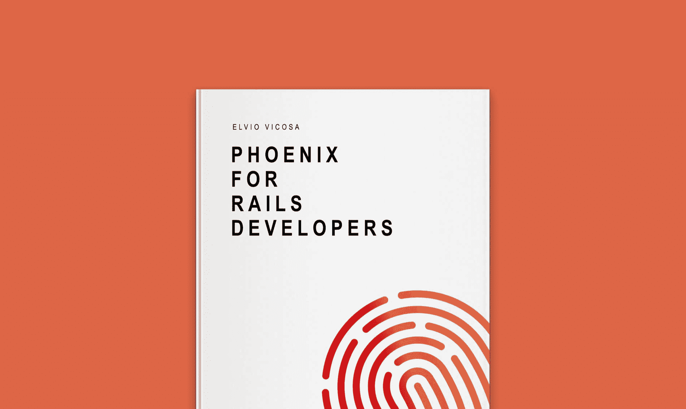
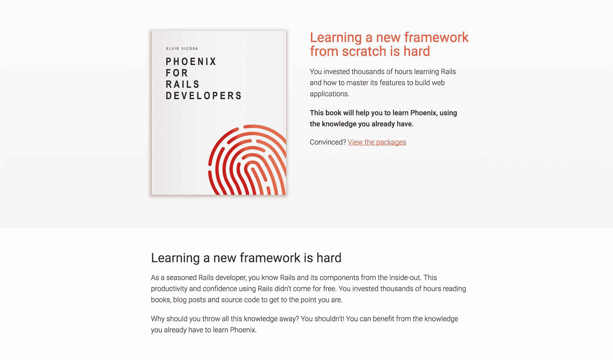
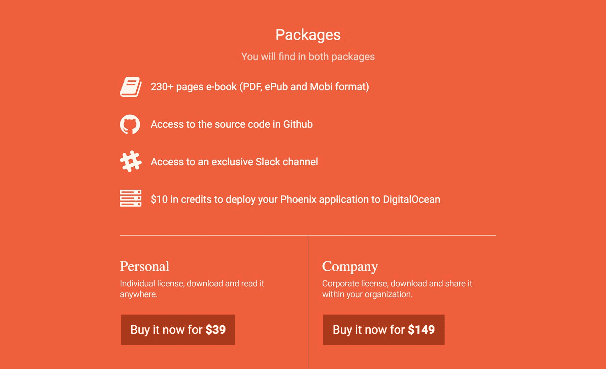

# 一本 Rails 编程书籍如何创造数千美元的收入

> 原文：<https://www.indiehackers.com/interview/how-a-rails-programming-book-generated-thousands-in-revenue-828b019a47>

## 你好！你的背景是什么，你在做什么？

嗨！我是埃尔维奥·维科萨，是《面向 Rails 开发人员的凤凰城》一书的作者，这本书是为有经验的 T2 Rails 开发人员编写的，他们想利用他们现有的知识来学习 T4 凤凰城。

我在几周前(2017 年 12 月 13 日)推出了这本书，到目前为止，它已经取得了 6159.00 美元的销售额。

 

## Rails 开发者为什么要学 Phoenix？

Rails 是一个很好的工具，但是事情变化很快。Web 应用程序需要并发和分布式特性，Rails 显然不适合这一点。

Phoenix 是用 [Elixir](http://elixir-lang.github.io/) 编写的框架，这是一种内置了对并发和分布支持的语言。由于其与 Rails 的相似性，Phoenix 是想要一个完整的 web 框架，而又不牺牲速度和可维护性的开发人员的自然选择。

## 是什么促使你为 Rails 开发者编写 Phoenix？

我从事 Rails 工作已经将近十年了，在此期间，我有机会构建各种各样的项目。两年前，在评估替代现有 Rails 项目的技术时，我偶然发现了 Phoenix。我对这个框架非常感兴趣，因为它和 Rails 非常相似。

我第一次开始从事 Phoenix 项目时，我花了相当多的时间试图理解如何做我在 Rails 中习惯做的事情。

[Phoenix for Rails Developers](http://www.phoenixforrailsdevelopers.com)是我希望在第一次使用 Phoenix 之前阅读的书，它将帮助 Rails 开发人员快速提高使用 Phoenix 的效率。

## 写这本书的过程是怎样的？

总的来说，我花了大约六个月的时间写这本书——第一步是开发这本书作为例子的 web 应用程序。我花了几周的时间构建和简化它，直到我认为它足够简单，可以作为 Phoenix 的介绍，同时仍然是一个完整的、功能齐全的 web 应用程序。

最耗时的部分是写书本身。虽然我发表博客已经有几年了，但写书是一种完全不同的体验。

我的写作计划很简单:从周一到周五，每天两个小时。由于我有一份全职工作，我通常在早上(早上 6 点到 8 点)写书，由于安静和没有干扰，这被证明是非常好的。

帮助我克服写这本书的孤独感的一件事是公开分享写作的过程。

TweetShare

我用 Markdown 写了整本书。我用 [Jekyll](https://jekyllrb.com) 生成一个包含这本书所有页面的 HTML 文件，然后用这个 HTML 文件创建 PDF 和 [MOBI](https://en.wikipedia.org/wiki/Mobipocket) 版本用于出版。我用[无头 Chrome](https://developers.google.com/web/updates/2017/04/headless-chrome) 创建 PDF 格式，用 [kindlegen](https://www.amazon.com/gp/feature.html?docId=1000765211) 创建 MOBI 版本。然后我使用 [calibre](https://calibre-ebook.com) 从 MOBI 文件创建了一个 [EPUB](https://en.wikipedia.org/wiki/EPUB) 版本。

## 对于 Rails 开发者来说，你们是如何吸引用户并成长为凤凰的？

在出版这本书之前，我放了一个登陆页面，向读者解释这本书的想法以及将从中受益的人。在三个月的时间里，这个登陆页面为这本书带来了大约 500 名电子邮件订阅者。

当我为 Rails 开发者发布[Phoenix](http://www.phoenixforrailsdevelopers.com)时，我通过电子邮件向订阅者发布了一份公告，并提供了一个独家的 25%折扣代码。这种方法非常有效——第一笔销售在 10 分钟内就完成了。

 

发布后，我的注意力主要集中在合作伙伴关系上。我很高兴创造了《长生不老药》的 Plataformatec 公司帮助我宣传这本书。

以下是我考虑推广这本书的一些想法:

*   创建类似[这篇文章](https://medium.com/@elviovicosa/5-reasons-you-should-use-phoenix-instead-of-rails-in-your-next-project-504b4d83c48e)的内容，讲述为什么你应该在你的下一个项目中使用 Phoenix 而不是 Rails，这篇文章出现在 Hacker News 的首页，吸引了相当多的观众
*   提供加盟计划
*   创建涵盖类似主题的免费在线课程
*   参加聚会和会议
*   更好地利用社交媒体

到目前为止，在我为推广这本书所做的所有事情中，我确信最重要的一件事是邮件列表。如果我能回到过去，我一定会投入更多的时间来建造它。

## 你未来的目标是什么？

写书是一次很棒的经历，我真的很喜欢。2018 年，我的计划是多学学营销，文案，把书推广出去。

Phoenix 是一项相对较新的技术，这将使[Phoenix for Rails Developers](http://www.phoenixforrailsdevelopers.com)在相当长的一段时间内成为一本相关的书籍。

除了图书推广，我已经在计划开发我的下一个副业项目:一个我将与 Phoenix 一起开发的 SaaS 应用程序。

## 你面临的最大挑战和克服的障碍是什么？

我认为最大的挑战是让自己在整个过程中保持动力。写书很难——比我想象的要难多了。这是一个孤独的过程，有时会让我考虑放弃。

帮助我克服这种孤独感的一件事是公开分享写这本书的过程。每天我都能看到新的订户加入名单，这种兴趣让我保持动力。

 

随着上市日期的临近，我对冒名顶替综合症的感觉也越来越强烈。像“有人会为这本书付钱吗？”还有，“如果人们开始在网上抱怨呢？”经常是我思考的一部分。直到我从买过这本书的真正读者那里得到了很好的反馈，这些感觉才开始消失。

## 如果你必须重新开始，你会做什么不同的事？

我会做一些不同的事情:

*   我会花更多的时间为这本书建立邮件列表
*   我不会太担心我会使用哪些技术或工具来制作这本书。相反，我会关注内容本身。

## 有没有发现什么特别有帮助或者有优势的？

对我来说，最重要的资源之一是内森·巴里的书《权威》(他是独立黑客就 ConvertKit 采访过的 T2)。我用 Nathan 的过程为 Rails 开发者编写、推广和销售[Phoenix](http://www.phoenixforrailsdevelopers.com)。

我的写作计划很简单:从周一到周五，每天两个小时。因为我有一份全职工作，所以我通常在早上(早上 6 点到 8 点)写书。

TweetShare

能够使用经过测试的过程是一种解脱，因为我不必花时间测试不同的方法。这使我免于犯许多错误。

## 对于考虑写书的独立黑客，你有什么建议？

作为一名软件开发人员，很容易被所有可用来写书的工具和技术分散注意力。避免所有的花费，只专注于写内容。

## 我们可以去哪里了解更多？

你可以在我的[网站](http://www.elviovicosa.com)或[推特页面](https://www.twitter.com/elviovicosa)找到更多信息。

如果你想了解更多关于这本书或我写这本书的过程，请在评论区提问！

—[<picture id="ember8043819" class="user-avatar ember-view user-link__avatar"></picture>埃尔维奥·维科萨](/elvio?id=h2y8P5X0ItRw6SmWaWYMso0rSAB3)【凤凰】的创造者，为 Rails 开发者

## 想像凤凰一样为 Rails 开发者打造自己的事业？

你应该加入独立黑客社区！🤗

我们是几千名创始人，互相帮助建立有利可图的业务和副业。来分享你正在做的事情，并从你的同事那里获得反馈。

还没准备好开始使用你的产品吗？没问题。这个社区是一个认识人、学习和实践的好地方。随意[随便浏览](/)！

——[<picture id="ember8043824" class="user-avatar ember-view user-link__avatar"></picture>柯特兰艾伦](/csallen?id=ibTLPyjwVebnZjMGKvz6ztarnuV2)，独立黑客创始人

13votes