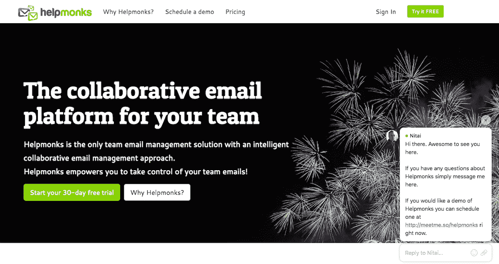
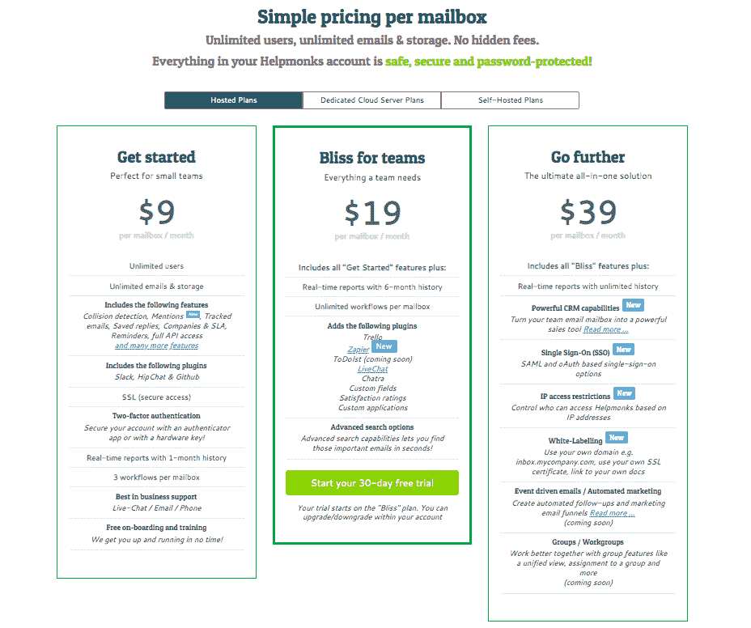

# 一个连续创业者如何将一个问题变成一个有利可图的生意

> 原文：<https://www.indiehackers.com/interview/how-a-serial-entrepreneur-turned-a-problem-into-a-profitable-business-2e22a7c837>

## 你好！你的背景是什么，你在做什么？

你好，我是泰尼。我最初来自欧洲，但最近几年一直住在美国。我一生都在打造产品和公司，可能是人们所说的连续创业者。我目前正在运行[帮助僧侣](https://helpmonks.com/)和[拉祖纳](http://www.razuna.org/)。Razuna 是我的第五家公司，是一个开源的数字资产管理系统，每年下载量超过 100，000 次，拥有成千上万的客户。

我和妻子一起创建了 Helpmonks，这是我的第六家公司。Helpmonks 旨在帮助您的团队管理电子邮件工作负载。许多人把 Helpmonks 这样的工具称为帮助台或共享收件箱解决方案，然而我更多地把它看作一个协作平台。Helpmonks 不仅可以用于客户支持，还可以用于销售和营销。

 

Helpmonks 完全靠自己创业，目前在没有任何实质性营销的情况下，平均每月赚 5 万美元。

## 是什么促使你开始使用 Helpmonks？

运行 Razuna 时，Helpmonks 出于组织我们工作量的需要而出现。因为 Razuna 的团队分布在美国、欧洲和亚洲的许多不同时区，我们经常会回复同一封电子邮件两次或更多次，不知道何时跟进或谁会跟进，而其他电子邮件从未收到回复。显然，这并没有给人留下最好的印象，也给我们的客户提供了不必要的支持。此外，我们有许多签订了[服务级别协议(SLA)](https://en.wikipedia.org/wiki/Service-level_agreement) 的客户，因此需要一种方式让团队中的每个人都知道某些传入的消息需要在特定的时间范围内得到回复。

经过六个月的市场搜索和各种工具的尝试(Trello，吉拉，电子邮件组，和其他一些邮件相关的应用程序)，我决定自己建立它。作为一个总是围绕一个想法(既是诅咒也是祝福)开发产品的人，从一开始我就很清楚，Helpmonks 不会是一个只在 Razuna 使用的工具，它将成为一个产品。所以从一开始，它就是以一个产品为目标的。

## 构建最初的产品需要什么？

鉴于我对 Helpmonks 这样的产品有明确的需求，缩小关注范围很容易。最初，我天真地认为该工具只需捕获电子邮件，选择将其分配给某人，为 SLA 客户提供业务流程，并可能做一些其他事情，如外观和行为像电子邮件客户端，平稳地集成到客户的现有基础架构中，并提供一些团队绩效报告。

事实证明，处理电子邮件比我想象的要困难得多。因为电子邮件在我们的日常生活中根深蒂固，Gmail 等工具已经发展到让一切都变得无缝和直观，很难想象建立所有后台流程来创建平滑和动态的界面是多么复杂和具有挑战性。我可以就电子邮件发送、电子邮件解析和分类，或者处理不同的邮件服务器等主题写整篇文章。

我想这就是作为一名企业家有时会有的幸福无知的美妙之处。你回头看你做的这件事，意识到如果你知道要花多少时间、压力和精力，你就不会开始做了！

归根结底，你要和合适的人在一起。

TweetShare

说到时间和精力——help monks 是我妻子和我全职在 Razuna 工作时，利用业余时间建造的。在一年多的时间里，我们利用晚上和周末的时间制作后端、前端、网站和支付网关，然后测试、重构和做任何其他事情，直到我们准备好发布一个更简单的 Helpmonks 版本。

我感到很幸运，找到了一个和我有同样热情的伴侣。虽然我更像是企业家类型的人——也就是说，开发产品、与人交流、编写代码——但她更注重细节、系统架构师和后端程序员。这本身就是一个伟大的组合，但也有其挑战。

Helpmonks 完全由 Nodejs 和 MongoDB 构建，一些可选功能也利用了其他开源技术，如 ElasticSearch。

## 你是如何吸引用户和培养帮助僧侣的？

我非常相信活在当下，这种感觉就是一切。我的意思是，你可以随时随地与潜在客户互动，即使这可能会打断你的一天，或者给你带来不便。

例如，我知道许多初创公司的创始人不喜欢使用实时聊天。因此出现了所有的实时聊天机器人。然而，对我们来说，参与实时聊天是我们的核心价值观之一，有利于我们与客户直接接触，让我们了解他们在想什么，他们想从产品中得到什么。我们甚至还多雇了两个人，他们的唯一工作就是出现在聊天室，这样我们的客户几乎总能找到可以聊天的人。

我知道这种方法并不适合所有人，但就我而言，它是我们的头号增长工具。我在我们所有的网站和所有的应用程序中部署了实时聊天工具。我收到人们的聊天记录，询问这是不是真的，他们是否真的在和首席执行官和创始人交谈。当他们意识到真的是我时，他们会觉得自己真的是一个有价值的顾客。如果你对某个产品或应用有问题，并且意识到你是在直接和公司里最有影响力的人交谈，你会感觉很棒吗？老实说，随着我们用户数量的持续增长，我不确定我还能坚持多久，但我会确保阅读我们每个人与客户的每一次互动。

 

吸引用户的另一部分是电子邮件。虽然这听起来很奇怪，但电子邮件对我来说是一个完美的营销工具。我说的不是电子邮件营销或时事通讯，而是你提供给潜在和现有客户的速度和回应。

也就是说，当我们觉得 Helpmonks 已经准备好了，我们开始邀请用户加入早期访问计划。我们对大约 500 名用户进行了长达 9 个月的测试。有了上面概述的两个工具，我们能够收集有价值的反馈，然后发布一个更全面的 Helpmonks 版本。

除了必不可少的 ProductHunt 条目，我们还使用 Betalist、Startups List 和其他一些渠道让人们了解 Helpmonks。如今，人们大多通过搜索或我们的博客文章找到我们。我知道我们有更多的潜力，目前我正在尝试一些其他的“成长秘诀”。

## 你的商业模式是什么，你是如何增加收入的？

我认为我们在 Helpmonks 方面处于独特的地位，因为我们不仅提供 Helpmonks 作为 SaaS 产品，还提供专用的云服务器和本地版本。事实上，我们是唯一一家提供电子邮件协作平台作为内部解决方案的公司。尽管我们生活在 SaaS 世界，但许多公司都要求在本地托管应用程序，尤其是为了保证安全性和隐私性。

根据我所说的在场和可用，我们与客户密切合作，并提供与他们协作构建一些功能。我称之为“产品赞助”,我们为构建符合客户需求的定制功能和作为产品的系统提供大量折扣。客户喜欢它，因为他们得到的正是他们想要的，我们也喜欢这样做。这是双赢的局面。

尽管许多供应商倾向于根据特定公司的用户数量来定价，但我们的商业模式略有不同。由于用户数量往往会随着员工的来去而波动，我们认为基于用户的定价是一种过时的模式，而是基于组织内更稳定的东西来定价。在我们的例子中，这是邮箱，所以我们根据邮箱的数量来定价，并允许无限的用户。

 

此外，我们为所有非营利组织提供 50%的折扣，并为开源项目免费提供 Helpmonks。我们认为帮助和支持那些努力让世界变得更美好的人是很重要的，这是我们的方式。

就像其他人一样，我们还没有完全确定价格。一开始，我们只有一个价格:每月 9 美元。一旦我们开始与其他工具建立更多的集成(例如，从一封电子邮件中创建一张 Trello 卡，从 Github 中的这封电子邮件创建一张票，等等。)，我们不得不重新考虑我们的定价。我们最终转向了套餐模式，目前提供每月 9 美元的“开始”计划、每月 19 美元的“幸福”计划和每月 39 美元的“继续”计划。

自从引入新计划以来，我们确实看到了增长。虽然在开始的时候，我们只是通过每月 9 美元的产品进入市场，但我们正在慢慢地提供工具，让我们的用户更好地管理他们的客户，例如内置的客户关系管理(CRM)，目前对所有客户都是测试版，以及我们计划很快发布的后续电子邮件漏斗系统。这些附加功能保证了不同的价格，我们正在试验我们可以收取多少费用。

## 你未来的目标是什么？

如上所述，我们正在添加一些令人兴奋的功能，将增强与电子邮件的工作。我们认为您的电子邮件中已经有大量数据，因此我们帮助您改进这些数据，并提供一些工具来自动执行一些步骤。例如，我们的 CRM 虽然不是一个成熟的 CRM 解决方案，但它是为已经在 Helpmonks 上花费了大量时间的客户量身定制的。

沿着这些思路，并且因为我们自己需要它，我们正在努力提供一个工具来自动化后续电子邮件，并帮助您创建任何类型的渠道。例如，假设您需要在客户刚刚注册的 14 天试用期内发送 7 封电子邮件。如果你已经使用 Helpmonks 来回复销售和支持邮件，为什么不在 14 天的试用期间也使用它来自动跟进呢？

当然，添加功能只能到此为止。我目前正在尝试不同的方法来增加流量，并联系了一些专门从事增长的公司，看看我们可以一起做些什么。我仍在努力寻找我们用户群的增长和我必须雇用更多人的速度之间的完美比例(有时被称为“黄金路径”)。作为一个习惯于自举的人，我觉得这很有挑战性。

## 你面临的最大挑战和克服的障碍是什么？如果你必须重新开始，你会做什么不同的事

我不认为我是唯一这样说的人，但我认为，作为一家企业，你最终面临的许多问题都取决于你团队中的人。不是每个人都是企业家，或者对某个特定领域都像你一样有激情。作为一名企业家，在创业初期，你需要身兼数职，并经常承担大部分工作。如果有什么事情需要做，你可能就是那个去做的人。一旦你开始雇人，即使是第一个雇员或合伙人，你意识到你必须在他们的专业领域给他们自由。这听起来可能很明显，因为你需要他们具备这种特殊的技能，但当你习惯于一直做所有的事情时，你的授权肌肉会很快萎缩。可能你对事情应该如何做有强烈的看法，并且很难后退一步把过程交给别人。这绝对是我一直在纠结的事情。

一旦你开始雇人，甚至是第一个雇员或合伙人，你必须在他们的专业领域给他们自由。

TweetShare

就个人而言，我觉得变老对我的精力水平产生了影响。在我 20 多岁的时候，我可以整天整夜地写代码和与人见面。现在，这不是我能做的事情，甚至不是我想做的事情。它需要更多的时间和努力来获得动力，我有不同的优先事项。简而言之，随着年龄的增长，我对如何度过自己的时间变得更有选择性，我认为对大多数人来说都是如此。

年轻的时候，我更愿意忍受一个要求很高的客户，尽管我心里知道这个客户不适合我的公司。缺乏经验(和金钱)会让你处理一些你最好回避的事情。随着年龄的增长，我逐渐意识到你不可能满足所有人，任何一家公司和产品都不适合所有人。现在，如果顾客想要的不是我能提供的，我会直接告诉他们。它节省了我们的时间和精力。

这些经历也让我成为一名更好的销售人员，因为我不再做“销售”了，而是向他们展示我们的产品，让他们自己决定是否喜欢他们看到的产品。

我特意没有在这里列出任何技术问题，因为我认为如果需要的话，这些问题可以在以后的道路上改变。然而，有些事情是无法改变的(或者至少不太容易改变),那就是你对他人做出的决定。对我来说，这一切都归结为与正确的人在一起。一旦你知道如何找到合适的人并建立牢固持久的关系，你就能征服世界。

## 有没有发现什么特别有帮助或者有优势的？对于刚刚起步的独立黑客，你有什么建议？

我读过很多关于市场营销、领导力等方面的书。，那个我不记得了。这并不是说它们是错的或者不包含有价值的信息，只是它们对我个人来说没什么用。我唯一能推荐的书是那些让你思考自己的书。史蒂芬·柯维的书直接和我对话，尤其是高效人士的七个习惯和 T2 的首要任务。

除此之外，坚韧是一种巨大的财富。客户会告诉你不，你的朋友和合作伙伴会说不，会有你觉得整个世界都在告诉你不的日子。但如果你下定决心，相信你所做的，你就能克服黑暗的日子。我知道这不容易，但当事情变得艰难时，这是有帮助的。

你不可能让所有人都满意，也没有哪家公司或产品适合所有人。

TweetShare

我也远离外部影响和干扰，这意味着我会退订几乎所有现存的邮件列表。我不听新闻，也不看电视或听广播。我想如果有什么重要的事情，我会以某种方式听到的。

同样的事情也适用于我们的竞争对手。我不研究他们的战术，当然也不会说他们的坏话。我从我们的几个客户那里听说，他们接到我们的一个竞争对手的电话，告诉他们我们无法维持我们的价格模式之类的事情。我不理解这种做法，也不参与其中。我认为这让你看起来软弱和不专业，让你无法把产品做到最好。

我也在努力严格控制自己的时间。我喜欢去健身房，所以我每天都挤出时间去健身房。我尽量在早上这么做，因为这有助于我专注于新的一天，并且通过鞭策自己开始新的一天感觉很棒。我的日常工作通常是工作一个小时，处理所有的电子邮件，组织我的一天。然后我去健身房锻炼一个小时，之后吃点东西，淋浴，穿衣服，然后开始我一天的工作。这通常是上午 10-11 点左右。然后我工作到晚上七八点。

我坚信你可以在六个小时内完成所有的事情。如果你需要工作的时间超过这个时间，那么你的时间和精力就有问题了。

TweetShare

很多年前，我停止了每天工作 18 个小时，并开始专注于将我的精力引导到 6-8 个小时。我坚信你可以在六个小时内完成所有的事情。如果你需要工作的时间超过这个时间，那么你的时间和精力就有问题了。当然，也有失败的时候，尽管知道不会有什么好结果，我还是继续钻研一个话题。

我正在试验神经/生物黑客技术。我喜欢充分利用我的身体和头脑的想法。我也不能无所事事(除了编码的时候)，我的大脑一直在响，所以我喜欢任何能让我身心投入的事情。

## 我们可以去哪里了解更多？

你可以在 http://helpmonks.com 找到更多关于帮助僧侣的信息。我活跃在推特 [@thenitai](https://twitter.com/thenitai) 。如果你想和我谈谈，你可以直接通过 [【邮件保护】](/cdn-cgi/l/email-protection#aec0c7dacfc7eec6cbc2dec3c1c0c5dd80cdc1c3) 联系我。

我希望这次采访能让你对我的创业公司有所了解。欢迎在评论区问我任何问题，或者直接联系我。我很想听听你的意见，真的。

——[<picture id="ember5265072" class="user-avatar ember-view user-link__avatar"></picture>【泰尼】](/Nitai?id=f2ozcJY6jcbKggZKSXllgJBZHF22)【济世僧】的创始人

## 想像 Helpmonks 一样建立自己的事业吗？

你应该加入独立黑客社区！🤗

我们是几千名创始人，互相帮助建立有利可图的业务和副业。来分享你正在做的事情，并从你的同事那里获得反馈。

还没准备好开始使用你的产品吗？没问题。这个社区是一个认识人、学习和实践的好地方。随意[随便浏览](/)！

—[<picture id="ember5265077" class="user-avatar ember-view user-link__avatar"></picture>考特兰艾伦](/csallen?id=ibTLPyjwVebnZjMGKvz6ztarnuV2)，独立黑客创始人

38votes