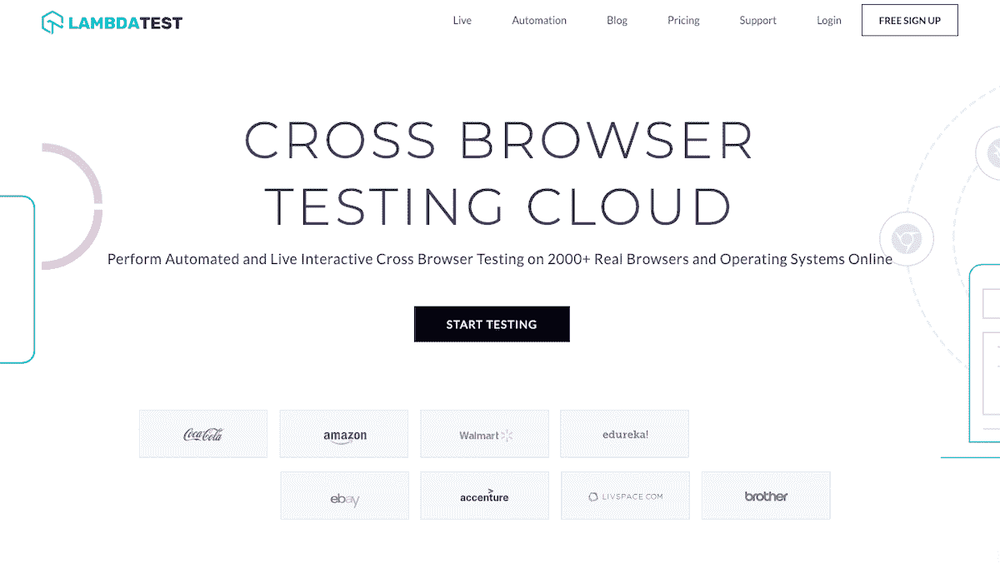
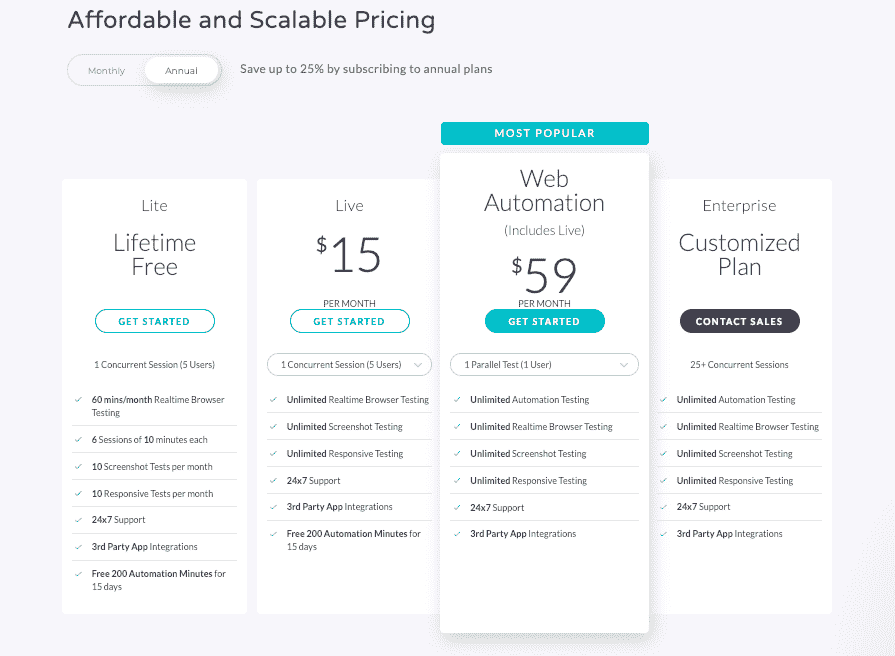
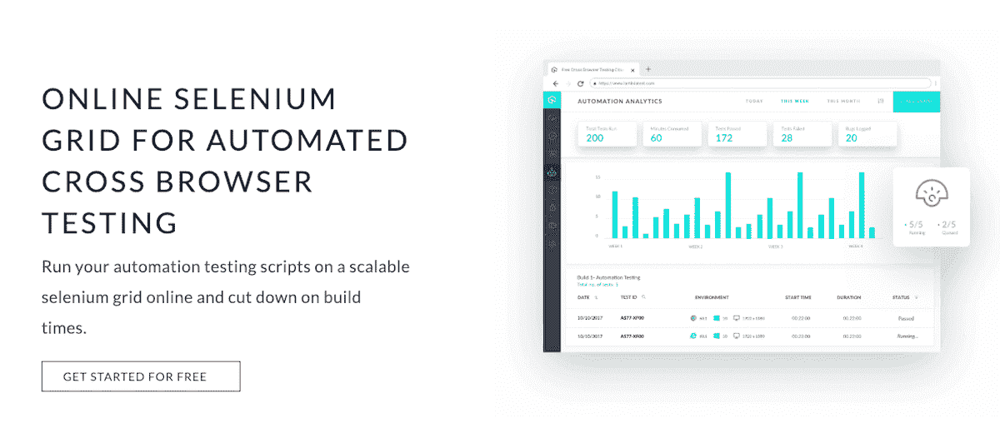

# 一个软件测试问题如何让我每月增长 26%

> 原文：<https://www.indiehackers.com/interview/how-a-software-testing-problem-led-me-to-26-monthly-growth-bc868672a5>

## 你好！你的背景是什么，你在做什么？

你好，独立黑客，我的名字是阿萨德汗，我是 [LambdaTest](https://www.lambdatest.com/) 的联合创始人。在创办 LambdaTest 之前，我还参与创立了 [360Logica Testing Services](https://www.360logica.com/) ，该公司后来被 Saksoft 收购。在我的整个职业生涯中，我参与了软件开发的所有方面。然而，我在准备端到端软件测试的解决方案方面有几十年的经验。

现在我正在做一个新项目，LambdaTest，目的是将整个测试生态系统带到一个基于云的平台上。首先，我们推出了一个跨浏览器兼容性测试平台，您可以利用它来运行实时交互式手动测试和 Selenium 自动化测试。

该平台的目标是设计师、开发人员、测试人员、产品经理和所有者，他们坚持追求完美，并且理解无缝用户体验的重要性。我们的工具旨在为软件测试人员和开发人员提供一个平台，让他们能够加快上市速度，从而简化他们的工作。使用该平台，他们可以使自己的网站兼容最新和传统的操作系统和浏览器。

到目前为止，我们已经在我们的路线图上勾选了两个框，未来我们希望勾选更多的框，以便在云上提供一个完整的测试生态系统，这样用户就不必为了各种测试而在不同的平台之间跳跃。

LambdaTest 平台已经上线一年多了，我们有超过 45，000 名活跃的开发人员和测试人员，他们来自全球 130 多个国家，都在使用这个平台。我们看到了每月 20-30%的稳定增长，有一些起伏，但我们已经看到了该产品的积极反馈。:)

 

## 是什么促使你开始使用 LambdaTest？

观察 Adobe 通过将其所有设计工具集中在一个保护伞下为设计师社区所做的事情是非常有趣的。这个概念在我脑海中挥之不去，作为一名测试人员，我专注于为我的开发人员和测试人员社区提供类似的东西。那时我第一次有了 LambdaTest 的想法。

我在 360Logica 工作了十年，与全球各种类型的测试团队一起工作，发现所有团队都有一个固有的问题:没有一个集成的平台来执行和管理所有类型的测试。牢记这一问题陈述，我组建了一个团队，并于 2017 年初开始致力于 LambdaTest 平台，目的是创建一个平台，帮助用户在云中执行自动和手动跨浏览器测试。

作为社区的一员，我知道该产品的范围可能会非常广泛，如果投入使用，它肯定会减轻 web 测试的繁琐任务。为了验证这个想法，我拿出了我的名片夹(是的，我还保留着那个东西),开始给我职业生涯中的所有联系人打电话。反响非常好，我们获得了许多如何使平台更加有用的新想法。大约花了两到三个月的时间来完成作为 MVP 上线的第一组功能。

## 构建最初的产品需要什么？

在开始创业之前，一个主要的关注点是找到对这个想法同样感兴趣和投入的合适的人。大概花了几个月的时间才找到合适的团队，然后我们就准备出发了。

正如你在独立黑客网站上注意到的，大多数产品都是从兼职项目或周末爱好开始的。另一方面，LambdaTest 的编码一开始是一个全职项目。尽管我有这个想法已经酝酿了几年，但直到团队组建完毕，编码才开始。

在踏上创业之旅之前，你需要问自己这个问题一百次:‘我确定吗？’

TweetShare

我们也看到了科技股的大起大落。我们曾经不得不改变产品的整个架构，因为我们没有获得预期的性能，并且我们知道如果我们不能提供比目前类似解决方案更好的性能，我们将无法竞争。这是当时的主要障碍之一，我们中的一些人担心这会使整个项目陷入困境。但是我们成功了。2017 年 11 月，经过近四到五个月的夜以继日工作，我们终于推出了该产品的第一个版本。

整个平台基于多服务架构，方便我们切换或升级模块。前端是使用 AngularJS 构建的，但我们也在探索切换到 ReactJS。由于多服务架构，我们在后端使用了多种语言和框架，包括 ELK stack、Kafka、Kubernetes、VMWare、SaltStack、Selenium 等。

我们从一个基于 VNC 的流媒体解决方案开始。然而，对于双向流，它的性能并不像我们希望的那样好，所以我们转向了基于 WebRTC 的解决方案。我们收集了所有最新和传统的操作系统，以及所有新老浏览器和浏览器版本。我们创建了浏览器版本的组合，将使用这些组合的机器放在一起，并创建了一个智能平台，可以根据用户需求自动扩展和缩小这些机器。我们能够在云平台上整合 2000 多种浏览器和操作系统来执行测试。

当创建一个这样的产品时，你必须做出一些艰难的决定，比如哪些特性应该包含在最初的展示中，哪些应该搁置到将来的迭代中。我们的第一个版本中包含的一些功能有:

*   与项目管理工具的集成——我们提供了与大多数流行的问题跟踪器和项目管理平台的轻松集成，如 JIRA、Asana、Trello、PaymoApp、GitHub 等。用户可以利用这些集成将在 LambdaTest 平台上测试期间发现的问题直接推送到他们选择的项目管理平台。这是我们创建集成测试平台的梦想中最重要的特性之一。
*   截屏测试—通过该功能，您可以在不同的浏览器和操作系统上一次点击拍摄多达 25 个网站或 web 应用程序的截屏。
*   响应测试—使用此功能，用户可以在一系列移动设备上检查其网站的响应性。
*   智能测试——通过此功能，您可以对两幅图像进行逐像素比较。例如，您可以将设计师创建的设计与开发人员编码的网站截图进行比较，以找出任何视觉差异。

自 2017 年 11 月推出以来，我们现在有大约 16 个集成，一个 Slack 应用程序，一个 WordPress 插件和一个非常成功的 Chrome 扩展。

## 你们是如何吸引用户，壮大 LambdaTest 的？

验证用例的过程实际上给了我们第一个客户。我给开发人员和测试人员打了很多电话，以找出他们的痛点，其中一人是我们产品的早期大使之一。这次发射没有太大的声势。那时我们的营销预算很少，所以没有花哨的广告或有影响力的人的付费支持。

然而，有经验的团队的一个好处是，每个团队成员在他们的邮件列表中都有很多联系人。我们从那里开始。然后，我们在社交媒体上寻求帮助，从好心人那里获得帮助，并通过 Quora、Hacker News 和 Reddit 等社区获得支持。我在这篇文章中看到许多产品负责人通过黑客新闻获得了大量的初始流量，但这对我们来说并不顺利。我们是这个平台的新手，完全不知道这个社区是如何运作的。

只需要几分钟一对一、人与人之间的互动，反馈电话就能变成首次销售。

TweetShare

另一方面，我们的产品搜索发布会更成功一些。虽然我们没有获得最佳产品奖，但我们在一天之内获得了 800 多张投票和大约 1000 名用户。

这种最初的推动和积极的产品反馈再次验证了产品理念，我们开始在推广和营销方面投入更多。我们现在更加关注网站，通过在线博客([尼尔·帕特尔](https://neilpatel.com/)是老板)了解 SEO，实施它，并开始对一些开始给我们带来有机流量的精选关键词进行排名。

下一个推动力来自用户的口口相传。我们有一个非常强大的支持和反馈周期，我们重视与每个注册的人进行个人联系。这种级别的个性化支持是用户在这个行业中从未见过的，正因为如此，关于 LambdaTest 的消息开始传开。

## 你的商业模式是什么，你是如何增加收入的？

我们的核心产品围绕着对可靠、无需维护且价格合理的可扩展按需基础设施的需求。每个网站所有者/开发者都明白跨浏览器兼容性测试和响应测试的重要性。他们还明白，在建设和维护设备实验室方面投入的投资和精力是一个非常大的难题。

LambdaTest 当前的业务模式围绕着在基于云的按需设置中构建和维护这一基础设施。我们的计划围绕并发会话的数量，即您的团队在一个时刻可以使用的机器数量。并发会话越多，收费越多。

正如我前面所说，第一批付费客户是我们在构建产品之前调查过的客户。下一批用户是通过口头推荐、给我们的联系人列表发电子邮件以及积极参与 Quora、Reddit 和 LinkedIn 等社区获得的。那时，我们已经开始产生有机搜索流量，这仍然是给我们带来大部分流量(和业务)的渠道。

收入方面，我们每月平均增长 26%。

我给刚起步的人的建议是，从所有可能的收入和推广渠道开始，然后扩大表现最好的渠道。这很费时间，而且需要一些很好的经验。但是这种方法最有可能扩大规模。

 

## 你未来的目标是什么？

我们的目标从一开始就是将整个测试生态系统带到云上。在我们的路线图中，我们正在为增长和产品开发筹集 A 轮资金。我们看不到前进道路上的任何障碍，因为我们拥有实现最终目标所需的合适团队、资金和资源。

## 你面临的最大挑战和克服的障碍是什么？如果你必须重新开始，你会做什么不同的事？

我们学到的最重要的经验教训与分析相关。例如，我们使用 Stripe 作为我们的支付网关，但它不是为诸如终身价值和销售预测等分析而构建的。这就是 CRM 的作用。类似地，像 Salesforce 这样的大型 CRM 有很棒的分析功能，可以用来分析平台使用情况，但它们有与数据存储和 API 命中相关的限制，需要您支付大量资金才能获得。因此，如果你计划开发一款面向大量受众的产品，并且需要节约使用工具，你就必须使用一些免费/开源平台，并进行一些内部整合。

因此，事先建立一个可靠的 CRM 和分析平台非常重要。之后，你将永远找不到时间在公司内部做这件事。考虑工具现在的价格和升级的价格也很重要。

我们也看到人们过于依赖在线交流，认为实际的一对一交流过时或无效。调查你的客户现在意味着发送打字表格或调查邮件，通过反馈表格获得反馈。根据我们的经验，没有什么比一个电话更重要的了，至少在你的产品还没有成熟到足以证明自己的时候。只需要几分钟一对一、人与人之间的互动，反馈电话就会变成首次销售，客户就会成为你的产品和业务的忠实大使和崇拜者。

 

## 有没有发现什么特别有帮助或者有优势的？

我个人比较喜欢布莱克·马斯特斯和彼得·泰尔的《从零到一》(T0)这本书，也推荐克莱顿·M·克里斯坦森的《T2 创新者的困境》(T3)。

## 对于刚刚起步的独立黑客，你有什么建议？

对任何阅读这篇采访的人来说，第一个也是最重要的建议是*一定要*。在开始你的创业之旅之前，你需要问自己这个问题一百次:“我确定吗？”你确定你已经记下了确切的痛点吗？你确定你的技术和产品足够可扩展吗？你确定你在和正确的团队合作吗？你确定你的产品有最好的用户体验吗？

我要提供的第二条建议是*保持动力*。成功和失败都将不可避免地成为你旅程的一部分。你的成功将取决于你对创业的积极性。这一个品质将告诉你在未来几年你将把你的创业带到哪里。

## 我们可以去哪里了解更多？

独立黑客们，我希望你们喜欢这篇采访。请在评论区随意提问，我很乐意回答。

在[https://www.lambdatest.com/](https://www.lambdatest.com/)参观 LambdaTest。您也可以在 [LinkedIn](https://www.linkedin.com/in/asad0801) 上找到并联系我。

——[<picture id="ember5286508" class="user-avatar ember-view user-link__avatar"></picture>阿萨德可汗](/asad0801?id=jXMirMuUl9eXG7glCKWPGoIGwOF2)，LambdaTest 的创始人

## 想像 LambdaTest 一样建立自己的事业？

你应该加入[独立黑客社区](/)！🤗

我们是几千名创始人，互相帮助建立有利可图的业务和副业。来分享你正在做的事情，并从你的同事那里获得反馈。

还没准备好开始使用你的产品吗？没问题。这个社区是一个认识人、学习和实践的好地方。随意[随便浏览](/)！

——[<picture id="ember5286513" class="user-avatar ember-view user-link__avatar"></picture>考特兰艾伦](/csallen?id=ibTLPyjwVebnZjMGKvz6ztarnuV2)，独立黑客创始人

30votes