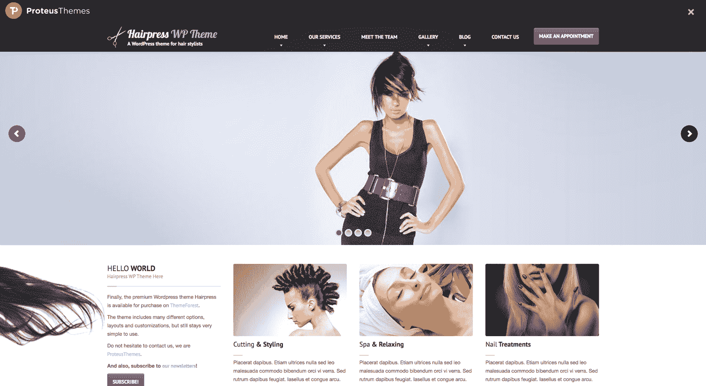
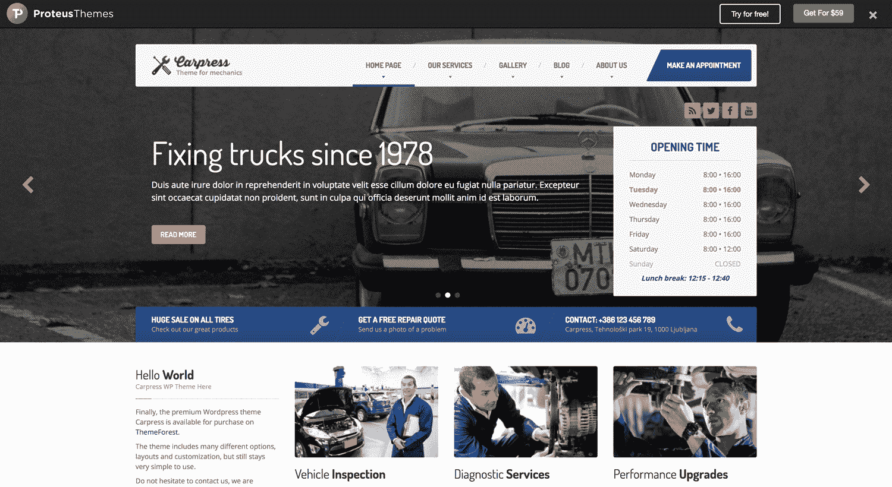
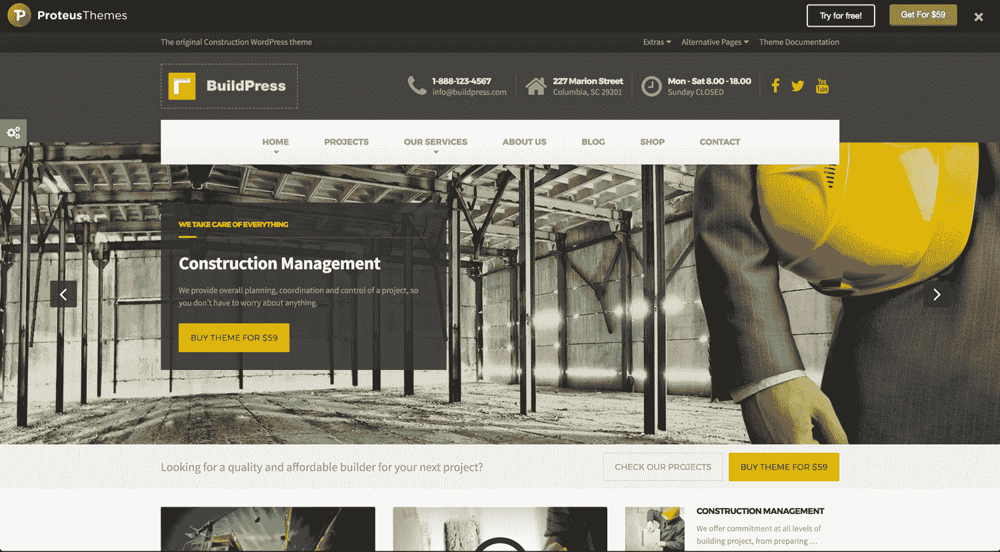
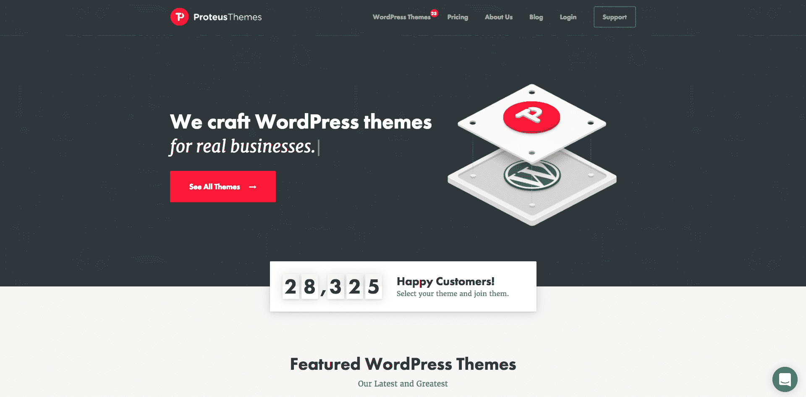
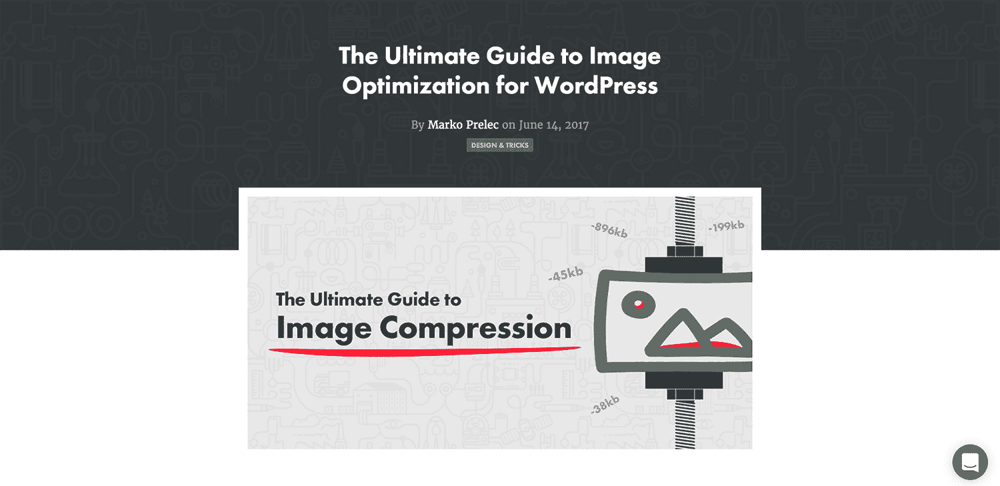
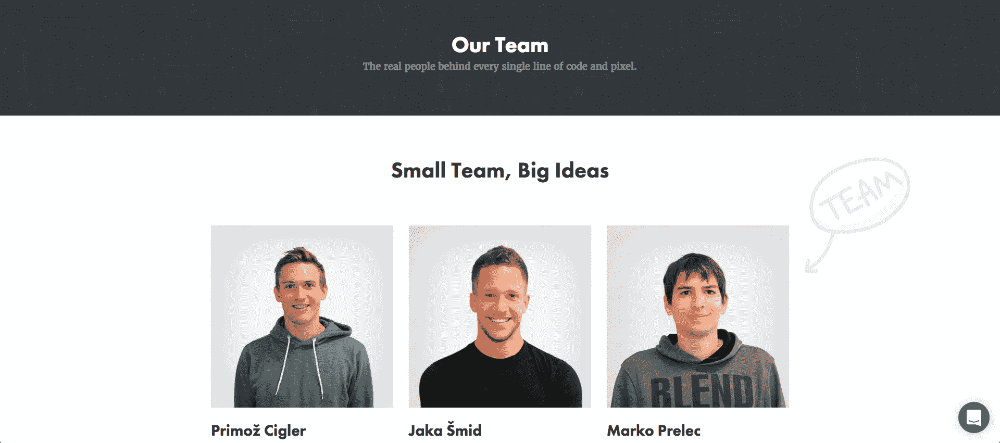

# 变得太受欢迎如何危及我的 WordPress 业务

> 原文：<https://www.indiehackers.com/interview/how-becoming-too-popular-endangered-my-wordpress-business-37afcdfec4>

## 你好！你的背景是什么，你在做什么？

嗨，我叫普利莫茨格勒。

我和我的联合创始人 Jaka mid 经营着一家主题商店[proteuthemes](https://www.proteusthemes.com/)，销售利基、本地商业 WordPress 主题。我们的客户是为中小型企业建立和维护基于 WordPress 的网站的人。

如今，ProteusThemes 每月收入约为 16，000 美元，但在过去的 4 年里，它一直处于混乱的过山车状态。早在 2013 年，我们就达到了每月 40，000 美元以上，但行业的变化将我们推回到今天的水平。

然而，现在的基础比我们经历这些收入高峰时更坚实。

到 2016 年底，我们不再盈利。幸运的是，我提前做了计划，并且还有些积蓄。

TweetShare

## 是什么促使你开始使用 ProteusThemes？

[proteuthemes](https://www.proteusthemes.com/)追溯到 2012 年 8 月。我正准备进入天体物理学研究的最后一年，所以我有一些空闲时间，我准备开始一个新的副业项目。

我一直是一个比设计师更好的工程师，所以我给 Jaka(我在当地的一个网站管理员论坛上认识的)发了一封电子邮件，请求我们联手创建一个 WordPress 主题，并作为一个数字产品出售。他很感兴趣。我仍然偶尔会带着喜悦和怀旧的心情看那封邮件。我们是学生，有一些额外的时间来进行侧推，我们没有什么可失去的。

尽管我们很天真，但我们没有做任何适当的市场调查。我们知道[主题森林](https://themeforest.net/)，看着在那里销售的 WordPress 主题，我们确信我们可以创造出更好的东西。在那个时候，主题在 ThemeForest 上被接受的门槛很高。他们在寻找独特的设计和面向商业的 WordPress 主题。

在我们的合作中，我有一个开发的角色，所以我让 Jaka 决定我们将创建哪种类型的主题。他选择了发廊的位置，因为他当时住的大楼里有三家发廊。“所有这些沙龙都需要网站，全世界肯定有数百万个网站，”这是他的推理。

当时 ThemeForest 上也很少有美发沙龙 WordPress 主题，现有的都很难看，很难使用。最初的计划是创建一个利基商业主题，以获得 ThemeForest 的认可，然后发展到更多的多功能主题，这可以开始获得牵引力(以及，通过扩展，销售)。

## 构建最初的产品需要什么？

我们一共花了六个月的时间为[proteuthemes](https://www.proteusthemes.com/)创作第一个主题，代号为 [HairPress](https://www.proteusthemes.com/wordpress-themes/hairpress/) 。我们签了一份有最后期限的合同。我们大部分时间都在周末或深夜工作——很多时候直到日出。

我在圣诞节假期完成了主题的 HTML 模板，一月份我们把它上传到了 ThemeForest。大约一周后，也就是 1 月 16 日，它获得了批准。

 

发行后不久就有了第一笔销售。我们第一天做了两笔生意，第二天做了五笔。我记得我是如何每 5 分钟刷新一次页面来检查活动的。到一月底，我们已经获得了 314 美元的收入。我无法描述收到最初几美元被动收入的感觉。

我们的 HTML 模板只是最终产品 WordPress 主题的中间步骤。当新学期开始时，我决定专注于我的学习和考试，并将 PHP 开发推迟到三月份。然而，人们[开始问我们](https://themeforest.net/item/hairpress-html-template-for-hair-salons/3803346/comments?page=1&filter=all#comment_3165260)什么时候我们计划发布一个基于我们模板的 WordPress 主题。这对我是一种极大的激励，以至于我晚上花时间编写代码并为早期客户提供支持，而白天则学习并通过考试。

2 月 20 日，我们发布了完成的 [HairPress WordPress 主题](https://themeforest.net/item/hairpress-wordpress-theme-for-hair-salons/4099496)，第一天就开始销售。按照现代的标准，这是一个非常基本的主题。我用边栏和小部件制作了首页，今天依然如此。我们从未将遗留代码库迁移到更便于用户编辑的地方。

令我惊讶的是，HairPress 及其分支 [CarPress](https://www.proteusthemes.com/wordpress-themes/carpress/) (其代码库我们从 HairPress 中分离出来并重新设计)仍然得到了许多积极的反馈和五星评价。这是一个完美的例子，说明购买者对任何能让他们完成工作的东西都很满意。我不得不不断提醒自己:我不是买家！HairPress 今天仍然可以销售，我们给了它足够的维护，使它保持最新，并与最新的插件和 WordPress 核心更新兼容。

 

我们花了整整 5 个月零 20 天发布了我们的第一个 WordPress 主题。但这并不是因为它太复杂，而是因为我们从来没有把它作为我们的第一要务，也没有对它抱太大的期望。一旦 HTML 模板获得了牵引力，我们就找到了动力，并很快推出了 WordPress 主题。

## 你是如何吸引用户和培养保护者的？

将近四年的时间里，我们只在 ThemeForest 上销售我们的主题，这有很多好处和坏处。

像 ThemeForest 这样受欢迎的市场最大的好处就是你可以即时曝光。你创造了一个伟大的产品，把它放在那里，然后*砰！人们出现并开始购买。我们的发布仅仅包括将我们的主题列在那里。当时我们连网站都没有。我们又要花整整一年的时间来运输最基本的原始版本[proteuthemes](https://www.proteusthemes.com/)。*

我确保我们所有的早期客户如果有任何问题都能得到及时的回复。通过与他们交谈，我也获得了有用的见解。我会问他们是如何找到主题的，它缺少什么功能，等等，这样我们就知道应该实现哪些功能来改进主题。

甚至当我和女朋友去加勒比海背包旅行两个月的时候，我每天至少工作两个小时——修复 bug、回复支持请求等等。

好看的主题和顶级的代码质量帮助我们从竞争中脱颖而出，但我们也要归功于我们早期建立的专用支持平台 [Zendesk](https://www.zendesk.com/) 。我一直喜欢为让我的生活更轻松的好软件付费，尤其是如果我不需要自己托管它的话。

以下是我们 2013 年的销售情况:

| 月 | 收入 |
| --- | --- |
| 一月 | 314 |
| 二月（February 的缩写） | 702.50 |
| 瑕疵 | 3806 |
| 四月 | 4564.58 |
| 五月 | 4024.74 |
| 六月 | 4559.15 |
| 七月 | 3744.43 |
| 八月 | 4899.94 |
| 九月 | 4698.62 |
| 十月 | 6023.07 |
| 十一月 | 5651.68 |
| 十二月 | 4494.30 |

总计:47 483.01 美元

在发布第二个主题后，我们开始考虑将一部分资金投资回公司做广告。我们在项目页面上放了一些横幅，并开始获得第一批简讯注册。

我们尝试了相关博客上的横幅广告，我们尝试了 [PPC](https://en.wikipedia.org/wiki/Pay-per-click) ，我们尝试了付费博客帖子。这些都不起作用。因此，我们坚持使用 ThemeForest 已经建立的现有联盟网络，这个网络在我们这边没有任何努力的情况下推广了我们的主题。

唯一有正投资回报的活动是新主题的发布。随着每一个新版本的发布，我们的收入都在增加。

2013 年末，我完成了我的研究，并和 Jaka 一起决定加倍研究 ProteusThemes，看看兔子洞有多深。但是，尽管我最终搬出了学生宿舍的“办公室”,在我们的共同工作空间里工作，我还是觉得我们进展得不够快。(花在客户支持上的时间已经开始占用我的开发时间。)

所以我开始寻求帮助。12 月，我们雇佣了第一名员工 Marko，2014 年，我们的加速发展导致了新的[商业 WordPress 主题](https://themeforest.net/user/proteusthemes/portfolio)的发布。收入随之增加。

| 月 | 收入 |
| --- | --- |
| 一月 | 8260.70 |
| 二月（February 的缩写） | 8990.10 |
| 瑕疵 | 17821.30 |
| 四月 | 21158.90 |
| 五月 | 19987.10 |
| 六月 | 17347.40 |
| 七月 | 17334.10 |
| 八月 | 18375.70 |
| 九月 | 21049.00 |
| 十月 | 19079.90 |
| 十一月 | 41225.80 |
| 十二月 | 39923.10 |

总计:250 553.10 美元

2014 年 11 月，我们发布了我们的 [BuildPress 构建主题](https://demo.proteusthemes.com/buildpress-landing-page/)。销售额一夜之间翻了一番，当月我们的收入飙升至 41，000 美元。建筑是一个尚未开发的主题利基，有巨大的需求，但没有供应。我们在完美的时间拥有了完美的产品。

然而，在接下来的几个月里，在市场上销售的劣势开始变得更加明显。我们开始登上每周和每月畅销书排行榜的榜首，所有的目光都集中在我们身上。建筑主题相当简单，没有非常特别的功能。这意味着它很容易复制。

2015 年初，BuildPress 副本开始出现。他们中的一些人做得很好，但是销售却很糟糕。我们再次尝试将资金投入到广告和营销中，但投资回报率正好为 0。这次我们和当地的一家广告公司一起去，但是我有一种感觉，甚至他们也不知道他们在做什么。他们用于大型本地消费品牌的一般策略在全球数字市场上并不奏效。

每天我们都会听到成功的创业公司和企业家。但是我们听不到通往成功的道路。

TweetShare

此外，对市场控制的限制开始激怒我。在市场上，我们不知道我们的用户是谁(你不会收到他们的电子邮件)，我们没有任何可用的营销工具，甚至流量分析也非常有限。所有这些在团队内部引发了一场关于在我们自己的网站上销售的对话——那时我们有五个人。

看到模仿者“偷走”我们的销售，我很难过，但有一件事让我一直保持动力:*如果他们模仿你，你就做对了！BuildPress 仍然是 ThemeForest 上最畅销的建筑主题(很可能是整个 WordPress 主题市场)。*

 

回顾过去，我发现这一成功源于高质量产品的神奇配方和时机的把握。但这种感觉太好了，不能持久，我当时就知道了。

## 那是你最终与森林达成共识的时候吗？

差不多了。在 BuildPress 取得成功后，我们试图对产品进行逆向工程，并用新的主题复制它。在某种程度上，我们成功了，但是正如我之前提到的，现在所有的眼睛都在看着我们。

我们发布的每一个新主题都服务于一个尚未开发的利基市场，并在一个月内激发了模仿者的发布。尽管我们在营销和广告方面尽了最大努力，但没有任何效果——即使有效果，我们也无法恰当地衡量它。

到 2016 年初，我们的总销售额超过了 100 万美元，在市场上赢得了“权力精英”的地位，但我对我们的财务轨迹不满意，因为它正在下降。从一开始，ThemeForest 就是我们唯一的收入来源，随着我们的员工(我们现在有六名员工)的增加，依靠单一的收入来源开始变得可怕。

所以在 2016 年 2 月，我们合作决定开设我们自己的 WordPress 主题商店。我们花了将近一年的时间最终到达那里，但在 2016 年 11 月，[我们开了我们的店](https://www.proteusthemes.com/blog/our-shop-is-open/)。

 

## 建立和营销自己的商店是什么感觉？

在 WordPress 中从头开始重新设计和开发我们的网站比我们预期的更复杂，所以我们的支出(现在有 7 名员工)开始超过我们的收入。到 2016 年底，我们不再盈利。幸运的是，我提前做了计划，并且还有些积蓄。

随着我们自己的商店的发布，简单的部分已经完成。我们有一个主题商店，没人知道它的存在，所以最困难的部分是把消息传出去。

我们将来自 Zendesk 的所有 4500 封电子邮件导入到我们的 [MailChimp](https://mailchimp.com/) 邮件列表中，并发送了几份关于我们发布的新闻稿。我们也在我们的[社交](https://www.facebook.com/ProteusThemes/) [媒体](https://twitter.com/proteusthemes)渠道上宣布了我们的发布，但是我们没有庞大的追随者。我们从有机搜索中获得了一些流量，但大多数访问者都是我们的 ThemeForest 客户，他们在寻找[支持和主题文档](https://www.proteusthemes.com/help/)。

以下是我们今年迄今为止的销售额:

| 月 | 收入 |
| --- | --- |
| 一月 | 16403.75 |
| 二月（February 的缩写） | 20593.39 |
| 瑕疵 | 23549.10 |
| 四月 | 17071.70 |
| 五月 | 16296.18 |
| 六月 | 13089.79 |

每天我们都会听到成功的创业公司和企业家。但是我们听不到通往成功的道路。从来都不是一条直线，更多的时候是情感的过山车。

2016 年的最后两个月和 2017 年的第一个月对我来说特别难熬。在很长一段时间里，我甚至没有意识到自己患有严重的抑郁症。有许多个夜晚我无法入睡，因为我不知道我们是否能成功，或者我是否会被迫关闭 ProteusThemes。

我最担心的是我的团队——那些让我每天早上带着微笑去办公室的不可思议的人。但不知何故，在我女朋友和一些朋友的帮助下，我设法摆脱了这种自我厌恶的模式，并开始再次寻找解决方案。

我开始在脸书小组上询问我们面临的问题——也就是说，我们有很棒的产品，但流量很低，转化率很低。答案开始以各种不同的形式出现，但潜在的信息是相同的:我应该改变我的角色。

如果说在过去的 5 年里，有一件事是我不得不做的最难的，那就是:我有意识地决定停止发展，将 100%的注意力放在营销和业务发展上。但是尽管很难，我越坚持，它就变得越容易。

作为这一努力的一部分，我也开始写一个专业博客[，在那里我分享我从开发人员到营销人员的经历，以及我在这个过程中所学到的教训。许多有趣的事情都出自这个博客，比如我最近出现在 Mastermind.fm 播客上。](https://primoz.blog/)

现在，7 个月过去了，我已经适应了我的新角色，而且我很享受。更重要的是，我知道转变是正确的。尽管我仍然偶尔帮助开发，但团队在这个新角色中更需要我。事情已经开始步入正轨，我对未来充满信心。

这不是我们今天赚的钱，而是我在未来看到的目标、愿景和潜力。就收入而言，我们目前大约有 16，000 美元，但我们正在几个领域投入大量精力，投资回报率将在未来几个月内可见。

例如，我们为内容营销制定了明确的战略，团队中的每个人都为我们的博客做出贡献，我们专注于高质量和难以竞争的内容。这类内容的第一个例子——一个针对 WordPress 用户的[图像优化指南](https://www.proteusthemes.com/blog/ultimate-guide-image-optimization-wordpress/)——导致了*相关*流量的巨大峰值。

 

## 你未来的目标是什么？

在写这篇文章的时候，我已经在我们的博客上宣布，我们将把所有现有的服务转换为基于订阅的计划。订阅模式在软件行业是一种规范，但是对于 WordPress 产品制造商和购买者来说都是陌生的。然而，到这篇文章发表的时候，我会知道这是否是一个明智的举动。最初的反馈非常积极，我认为这是我们前进的唯一合理的下一步。

我在 2017 年最大的目标是让它更具长期可持续性。重复订阅在这里扮演着重要的角色。老实说，我已经厌倦了在过去的 5 年里卖 zip 文件。如今，WordPress 上的网站有太多的问题。

我们的中期计划包括开发一个新平台，简化建立流程，更重要的是，维护小型企业网站。我们已经在与潜在的合作伙伴商谈，他们将加入我们的行列，帮助弥补缺失的部分。

这是我的愿景:SaaS 平台，非常专注于特定的利基市场(正如我们这些年来在我们的主题上所做的那样)，并提供他们在网上取得成功所需的所有工具。

WordPress 将继续作为其背后的 CMS，但在更大的范围内，它的作用将会减弱。你需要做的就是提供你的电子邮件和支付方式，然后开始用你选择的主题创建你的网站。不再有繁琐的 WordPress 安装，寻找正确的主机选项，域名，插件和主题，不再有任何东西连接在一起，找出下一个随机更新破坏你的网站。这个过程目前中断了，我打算修复它。

在这一点上，最大的未知是我们将向谁营销。我们现有的客户，知道如何建立一个网站的人？还是应该直接去找企业主，向他们推销？市场调查和大量采访将解开这个谜。

幸运的是，我比一年前更有信心做好这两件事。

## 你犯过的最大的错误是什么？

专注于产品太久，没有学会如何做适当的市场调查。与我们的客户进行 Skype 通话是我今年做的最好的事情之一。听他们说话，学习他们使用的词汇和他们面临的问题，听他们说你做得很好，会让你敞开心扉。

依赖单一的收入来源也是不好的，不好的，不好的，现在我正在尽一切努力使我们的收入来源多样化。自从开了自己的店，我们还加入了新的市场，现在我们正在进入新的合作伙伴关系。我不得不提到的一件事是我离开了小岛。

## 有没有发现什么特别有帮助或者有优势的？

Jaka 和我从一开始就有一份很好的合同，我们写下了谁负责什么，最后期限是什么，以及未能交付的费用是多少。如果没有它，我怀疑我们可能永远不会实现我们的想法。

为了加快我作为营销人员的学习，我已经从在车里听音乐转向听播客。我跟上了[市场营销学校](http://marketingschool.io/)、[网上营销变得容易](http://www.amyporterfield.com/amy-porterfield-podcast/)，还有一个[斯洛文尼亚企业家的本地商业播客](http://www.zakulisje.com)。

早期，Jason Fried 用他的书 [ReWork](https://37signals.com/rework) 启发了我。这就是为什么[proteuthemes](https://www.proteusthemes.com/)建立在远程优先的理念上，它允许我每年在世界任何地方旅行和工作 2-3 个月。通常，你会在地球上最大风的冲浪地点找到我。:)

我喜欢把我的商务旅行和娱乐结合起来。今年 4 月，我在美国参加了一个商务会议，并将其延长至一次为期两周的旅行，行程包括从驾车穿越亚利桑那州沙漠，到在洛杉矶的圣莫尼卡冲浪，再到参加旧金山的商务会议。

## 对于刚刚起步的独立黑客，你有什么建议？

工作更少，但更聪明。我很快对自己喜欢做的事情上瘾。ProteusThemes 开始是一个副业项目，我一直很喜欢它。但我倾向于强迫自己进入朝九晚五的工作日程。这实际上意味着我白天工作 8 小时，然后晚上和周末加班。精疲力竭是不可避免的。

意识到这一点后，如果天气预报说天气好，我就不再为在工作周中间离开半天去享受帆板运动而感到难过。

市场可以是一个很好的开始，尤其是如果你更多的是一个产品人，不想从一开始就在营销上投入太多。它让你能够验证你的想法并迅速获利，但请记住，它不会让你以可持续的方式成长。这使得依赖它成为一种危险的服务。

你的团队是你最大的资产。好好对待他们。找联合创始人的时候，不要找什么都和你一致的人。找一个与你互补并向你挑战的人来论证你想法的正确性。

 

也不要太早放弃。我知道你以前从比我更有能力的人那里听说过，但这是真的。

## 我们可以去哪里了解更多？

我是推特上的 [@primozcigler](https://twitter.com/primozcigler) 。[我写博客](https://primoz.blog/)，当你在[proteuthemes](https://www.proteusthemes.com/)上开始实时聊天时，我很有可能会在另一边。；)

就角色的转换而言，我特别有兴趣与任何与我处于类似位置的人交谈。我知道这对我有多大的挑战，也知道有益的建议有多大的影响。

感谢您花时间通读！

—[<picture id="ember8059965" class="user-avatar ember-view user-link__avatar"></picture>primozcigler](/primozcigler?id=gZVM1a7teGUbwHBmeeqEqoDmRJJ3)【Proteus hemes】的创建者

## 想像 ProteusThemes 一样建立自己的事业吗？

你应该加入[独立黑客社区](/)！🤗

我们是几千名创始人，互相帮助建立有利可图的业务和副业。来分享你正在做的事情，并从你的同事那里获得反馈。

还没准备好开始使用你的产品吗？没问题。这个社区是一个认识人、学习和实践的好地方。随意[随便浏览](/)！

—[<picture id="ember8059970" class="user-avatar ember-view user-link__avatar"></picture>考特兰艾伦](/csallen?id=ibTLPyjwVebnZjMGKvz6ztarnuV2)，独立黑客创始人

10votes