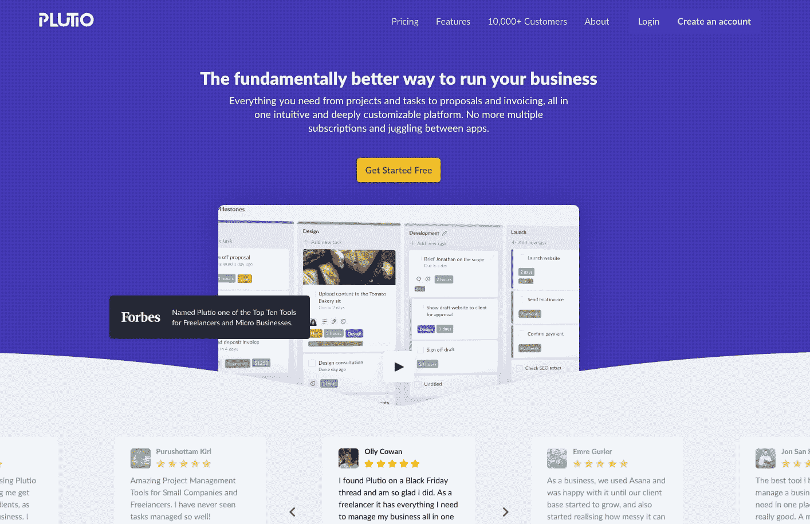
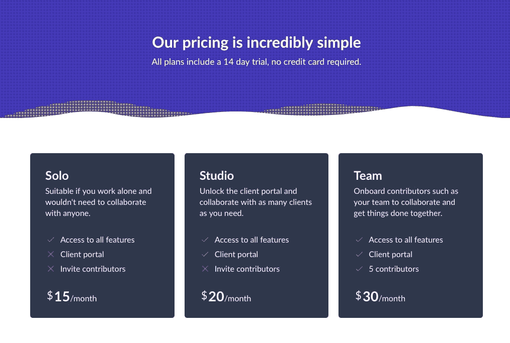

# 构建社区如何帮助我们发展到 10，000 名用户

> 原文：<https://www.indiehackers.com/interview/how-building-a-community-helped-us-grow-to-10-000-users-3ae5863ff7>

## 你好！你的背景是什么，你在做什么？

👋🏻利奥出生在约旦，在迪拜长大，18 岁时移居英国。

我正在建立一个为自由职业者和小企业设计的一体化商业管理平台，名为 [Plutio](https://www.plutio.com/) 。从项目和任务到时间跟踪和开具发票，您需要的一切都在一个直观且可深度定制的平台中。

Plutio 在尝试发展我的第一笔业务时遇到了挫折，并在 2017 年 11 月的试运行期间，在一周内实现了超过 25 万美元的销售额。

 

## 是什么促使你开始使用 Plutio？

这一切都始于我 15 岁的时候。我想要一只狗，但我的父母不让我养，所以放学后我经常去我们附近的宠物店，在那里我喂养一些动物。有一天，我决定尝试做更多的事情:我有一个为每一只无家可归的动物提供庇护的愿景。

我开始为宠物主人建立一个网站，他们可以在那里联系兽医寻求医疗建议。该网站后来有了更多的功能，如每日宠物，提示和画廊。

构建网站并不太难，因为我使用了一个名为 [Wix](https://www.wix.com/) 的拖放式网站构建器，它让我无需编码就能创建一个外观很棒的网站。当时，我无法获得学习如何编码的资源，所以 Wix 非常方便。

大约在那个时候，Wix 推出了一个设计师目录，我被邀请成为第一批加入的人之一。从这个目录中，我收到了我的第一个付费客户，是迪拜国际机场的一个内部项目。在花了一些时间玩了一会儿并建立了几个不同的网站后，我确信我可以以此为生。不知不觉中，我又接了几个项目，并经营着自己的设计公司 Loai Design Studio。

我的第一个网站被证明是一个非常好的学习经历，对我现在正在构建的所有东西都是如此。这给了我极大的信心。

在大学期间，我试图通过提供托管、电子邮件和其他基于预聘的服务来拓展被动收入，但我被大量的行政工作拉了回来。大多数生产力和管理应用程序都是为团队和企业设计的，这并没有什么帮助。我找不到任何专门针对自由职业者需求的东西。

就在那时，我决定建立 Plutio，以支持并成为世界各地服务不足的自由职业者和小企业社区的得力助手为使命。

## 构建最初的产品需要什么？

因为我不知道如何编码，所以我无法通过构建软件来启动项目。相反，我利用我已经拥有的设计技能来构建原型。虽然构建原型有助于具体化我的抽象想法，但没有编程技能，我无法进一步深入。

就在那时，我推动自己学习如何编码，从 HTML 和 CSS 等基本编程语言开始，这帮助我将我的愿景变成了功能原型。一旦我有了 Plutio 的实际框架，我就需要后端开发来让它真正“工作”

被困在那个阶段非常令人沮丧，我越来越绝望，这促使我转向投资者。我和燃料公司的马克·皮尔森开了一个简短的会议，在会上我展示了我的原型和构想。尽管马克对我的工作表示赞赏，但我们的会议还是以“你对我们来说还处于初级阶段，但让我们保持联系”结束

这是我第一次也是最后一次尝试筹集投资。不是因为我被拒绝了，而是因为我明白了在这么早的阶段筹集资金意味着在我的公司起步之前就要损失一大笔钱。至少要持续寻找四到六个月才能结束一轮种子期。

因此，我没有走投资者这条路，我知道我不会喜欢这条路，而是挑战自己启动 Plutio。但是我知道我不能自己做所有的事情，特别是学习后端编程会花费我很长时间，冒着项目延迟的风险。

要建立一个成功的企业，你首先需要建立一个相信你和你的愿景的团队。

TweetShare

我的下一步是找到一个联合创始人，一个可以补充我的技能的人。创业就像生孩子，找一个联合创始人就像找一个合作伙伴来帮你抚养孩子并把他们送到这个世界。必须是你认识和信任的人，无论是好是坏，是富有还是贫穷，是生病还是健康，你都可以依赖他…你知道规矩。

我给了自己一个月的时间来寻找联合创始人，但不幸的是，我当时的情况对我不利。我住在英格兰北部的一个小镇上，这让我很难参加活动和拓展人脉。而我当时的人脉主要是设计师和创意。

我从最初的狩猎中学到了非常重要的一课:人类更喜欢被自己的相似物包围。这本身没什么错，但如果你在经营一家企业，你需要让你周围的人能够补充你的技能和经验。如果你没有努力拓展业务，这些人通常不会在你的自然网络中。

由于我找不到联合创始人，我决定用我的积蓄雇佣一个本地团队来开发 MVP。然而，我开始意识到我雇佣的团队并不真正相信我或我的愿景，这使得工作变得复杂。长话短说，事情没有按计划进行，我不得不通过法院把我的钱要回来。我艰难地认识到，要建立一个成功的企业，你首先需要建立一个相信你和你的愿景的团队。

很明显，让 Plutio 起飞是一个挑战。虽然这一系列的失败让我失去了动力，但它们也激励我继续前进，努力把事情做好——我做到了！我决定创办 Plutio，作为我第一次创业资助的副业项目，直到它成熟到足以让我完全专注并依赖它。

我没有放下一切，全力专注于一项仍处于构思阶段的业务(这可能会成功，也可能不会成功)，而是继续我作为设计师的自由职业，并用收入聘请了一名开发人员与我合作。由于我的努力，我有幸得到了 Dovydas Kukalis，一个充满激情、雄心勃勃、技术娴熟的程序员。

进展很顺利，但速度很慢，因为我只能负担这么多。就在那时，我决定找一份兼职。因此，除了在我的设计工作室工作和在 Airbnb 上租用我的一间空房之外，我还兼职加入了 [Paddle](https://paddle.com/) 成为一名设计师。Paddle 的每个人都知道我在做什么，并且非常支持我！他们信任我，总是尽可能地帮助我。

有了这个新的收入来源，我们的发展速度加快了一倍，我们也更快地实现了目标。虽然一切都很顺利，但我总是过度劳累，筋疲力尽。我不知所措。

我知道有些事情需要改变。如果企业实际上只有我一个人，而我正在分崩离析，那么企业也会分崩离析！但我也不能就这么停止工作，因为那会拖慢我们的进度。

不久之后，我与 [AppSumo](https://appsumo.com/) 签订了一份协议，这帮助我们在一周内接触到了 5000 多名早期用户，销售额超过了 25 万美元！这不仅验证了 Plutio，而且还帮助我们保持了我们的进展，而没有太多的疲惫，因为我能够减少一些额外的工作，以使收支平衡。

## 你是如何吸引用户并发展 Plutio 的？

我们的第一批用户是在 [BetaList](https://betalist.com/) 上提交了 Plutio 之后来到的。他们帮助我们扩大对市场需求的理解，并相应地调整我们的产品。

经过几个月的测试，我们与 AppSumo 合作进行了试运行，结果新用户数量激增。流量的巨大峰值令人惊讶，但我们被我们必须提供的支持量淹没了——每天数百条消息，只有一个人回复。

我们真的很纠结，觉得让其他人加入也许会有帮助。但我们知道，这将涉及到让他们入职，教他们产品，以便他们能够独立提供支持，并确保他们的回复与品牌一致。我们只是没有时间做这些。

在开发产品的同时建立一个社区。

TweetShare

由于我们这边的响应速度很慢，许多用户把他们的问题带到了我们在脸书新开的[社区群，而其他的 Plutio 伙伴(plut io 用户)实际上也提供了帮助。由此，我们意识到 Plutio 社区是帮助解决支持请求激增的最佳方式。因此，我们开始通过在入职电子邮件和社交媒体渠道中添加链接来引导每个人。该社区很快成为 Plutio 每个人联系、交流想法的安全环境，最重要的是，分享他们的反馈。](https://www.facebook.com/groups/plutio)

这个社区一直是一个很好的工具，让我们与我们出色的客户保持联系，并让我们了解如何根据他们的需求和需要最好地塑造和发展 Plutio。

## 你的商业模式是什么，你是如何增加收入的？

我们提供三种订阅计划，起价 15 美元/月，并提供可选的附加服务，如 9 美元/月的白标服务。

我们推出了我们的计划，并于 2018 年 5 月开始收费，使用 Stripe 作为我们的支付处理器，在 MRR 的第一个月以 400 美元结束。我们在六月增加了一倍。虽然 Stripe 在处理支付方面很棒，但它不太擅长提供关于我们业务运营情况的详细分析。因此，我们整合了 [Profitwell](https://www.profitwell.com/) 进行深度分析，并对我们的业务健康状况进行概述。Profitwell 帮助我们在决定采用新功能之前，想象新功能会如何影响我们的增长。

例如，大约在 7 月初，我们推出了每月 5 美元的白标附加产品，到月底，我们的每月经常性收入增加了 2，300 美元。六个月后，我们在 MRR 的销售额达到 7000 美元，并开始盈利。对我们的用户体验和旅程的一系列改进，以及不断推出的新功能，帮助我们将客户流失率从大约 13%降低到 3%左右。

2018 年 11 月，我们在网站上增加了一个新页面，展示来自用户的[评论。使用](https://www.plutio.com/customers) [EmbedSocial](https://embedsocial.com/) 收集和展示评论真的很容易。我们还吸引了新的注册用户加入我们在脸书的社区团体，在我们的主登录页面上添加了社交证明，在白色标签上推出了一项交易，并推出了一项重大更新。这是一个忙碌的月份！这些变化帮助我们的 MRR 增加了 2，000 美元，到月底变成了 6，000 美元。

我们能够说服这么多人订阅的主要原因主要是在我们的营销工作中利用了社会证明的强大影响力。如果说过去几个月我们学到了什么，那就是人类倾向于随大流，并受到周围人的严重影响。因此，当一个浏览我们网站的新访客有办法与现有客户建立联系时，比如通过评论，他们注册的几率会大大提高。

 

## 你未来的目标是什么？

我们的愿景不仅仅是在一个直观的一体化平台中提供工具。我们设想 Plutio 是全世界每个自由职业者的左右手，提供他们需要的一切，从合适的工具到保险，到共同生活空间，等等！

壮大我们的团队并与和我们有共同愿景的公司建立合作伙伴关系，是我们成功实现目标所需采取的众多步骤中的两个。

## 有没有发现什么特别有帮助或者有优势的？

我做的最好的决定之一是完全从零开始设计和构建应用程序的界面，不使用任何通用框架，如 Bootstrap 或 Materialize。这有助于确保 Plutio 有自己独特的感觉和体验，这是非常灵活的，而不是通用的。

## 对于刚刚起步的独立黑客，你有什么建议

不要为了验证你的想法而过早推出它。有了像 [Ship by Product Hunt](https://www.producthunt.com/ship) 这样的服务的帮助，在你开始工作之前验证你的想法从未如此简单。有了 Ship，你可以为你的产品建立一个观众群，帮助你验证你的想法，测试，甚至在你发布之前就使它适合你。

在开发产品的同时建立一个社区。在你的品牌背后有一个社区可以在很多方面帮助你，从通过社会证明增加你的转化率到帮助你测试和塑造你的路线图。从在脸书或 Slack 上创建一个群组开始，只要你的受众更容易接触到。

成为你品牌的代言人。视频是最强大的参与工具之一，这是有原因的。利用它与您的客户交谈，宣布更新，甚至征求反馈。

## 我们可以去哪里了解更多？

加入我们[脸书社区群](https://www.facebook.com/groups/plutio)的 4000 多名成员，我们一起分享精彩内容，您可以在下一次更新中发表意见！

访问[我们的网站](https://www.plutio.com/)探索 Plutio 所提供的一切，并在社交媒体([脸书](https://www.facebook.com/PlutioHQ/)和[推特](https://www.twitter.com/plutio_app/))上关注我们，先睹为快。

——[<picture id="ember8067041" class="user-avatar ember-view user-link__avatar"></picture>利奥·巴萨姆](/leobassam?id=NRz76loHCBMv2Sapv8F3wiSsyb73)，普卢迪奥创始人

## 想像 Plutio 一样建立自己的事业？

你应该加入独立黑客社区！🤗

我们是几千名创始人，互相帮助建立有利可图的业务和副业。来分享你正在做的事情，并从你的同事那里获得反馈。

还没准备好开始使用你的产品吗？没问题。这个社区是一个认识人、学习和实践的好地方。随意[随便浏览](/)！

——[<picture id="ember8067046" class="user-avatar ember-view user-link__avatar"></picture>柯特兰艾伦](/csallen?id=ibTLPyjwVebnZjMGKvz6ztarnuV2)，独立黑客创始人

47votes