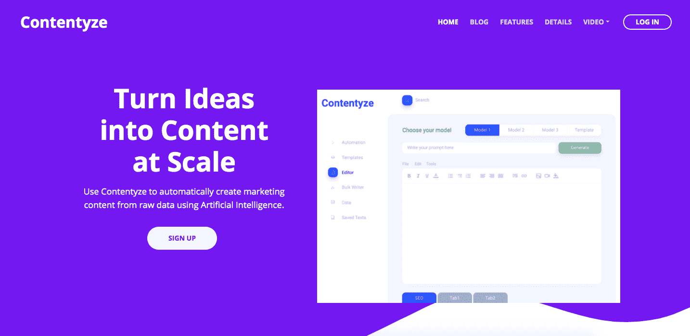
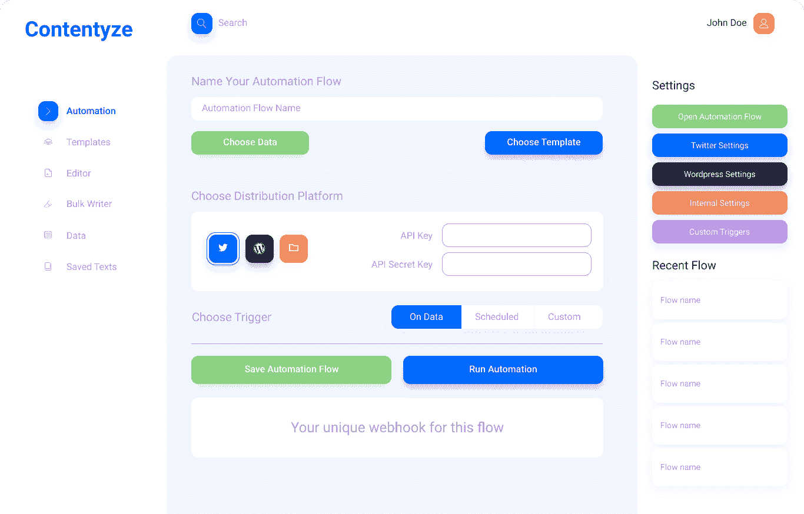
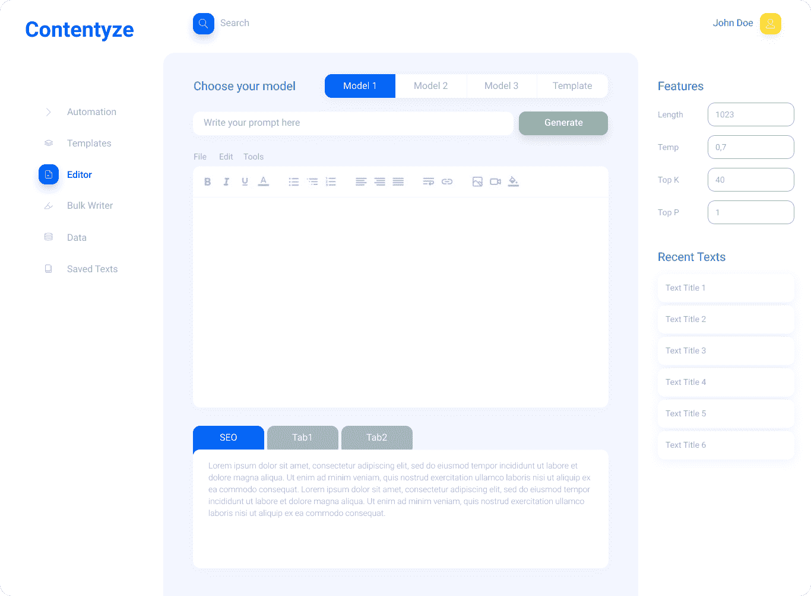

# 构建更好的人工智能如何让我的营销更容易

> 原文：<https://www.indiehackers.com/interview/how-building-better-ai-makes-my-marketing-easier-daa3b95374>

## 你好！你的背景是什么，你在做什么？

嗨，我叫普兹梅克·乔杰基。我出生在华沙，但目前住在伦敦。我在法国巴黎获得了数学博士学位，然后在牛津大学担任研究员。我回到华沙待了三年，基本上把职业从学术界转到了商界，从纯数学转到了机器学习。

到目前为止，我已经因为两个不同的原因让两家公司失败了。Contentyze 是我的第三次创业，它肯定是目前为止看起来最好的。

基本上，我们正在构建一个内容生成平台，目标是将原始数据转化为引人注目的内容——无论是内容营销文案、自动化新闻还是电子商务产品描述。

我们在 4 月份推出了该平台的测试版，目前每天有两到三个人注册。这项服务目前是免费的，但我们靠我们的内容赚钱，因为我们自己用它来试验引人入胜的故事。我们通过广告和附属链接赚了 4000 到 5000 美元。

最终，我们计划开始收取标准的月订阅费，以及用户可能对人工智能生成的文本提出的额外请求。

## 是什么促使你开始使用 Contentyze？

我总是喜欢广义上的内容。我读了很多，我写了三本小说(其中一本有英文版！)而且一般都很投入文化。另一方面，我的第二个爱好是生产力。我喜欢完成事情的感觉，因此我喜欢尽可能地自动化。

自 2019 年以来，我一直在大量尝试各种形式的写作，比如开设各种博客，其中最大的一个是我在 Medium 上的频道，拥有 3000 多名粉丝。有了技术背景，并利用我对自动化的热爱，我开始修补如何自动化我的内容创建过程的想法。Contentyze 就是这么来的。这极大地有助于创造更多的内容。

即使你现在失败了，你正在获得的技能在将来也会很有价值。

TweetShare

第一次验证来自半自动媒体渠道 [PetaCrunch](https://petacrunch.com/) 。目标是自动采访最近获得资助的初创公司(已经筹集了 100 多万美元的全球初创公司)的创始人，我的人工智能记者团队在不到三个月的时间里成功采访了 1000 多名高管。这就是我决定全力以赴进行(半)自动化内容创作的原因。

## 构建最初的产品需要什么？

Contentyze 于 2020 年 1 月诞生，开始时基本上是我在摆弄各种机器学习模型。然后我雇佣了我的朋友，一个帮我搭建平台的 Python 后端开发者，然后我也雇佣了我的硕士生，他专注于训练更多的深度学习模型。加上另一个全栈开发人员，我们是一个四人团队。

我们完全自力更生，项目资金来自我个人。平台的第一个版本在四个月后就准备好了，六个月后新的华丽的前端也准备好了。在接下来的两到三个月里，我们计划推出新的惊人功能。从 9 月份开始，我们计划集中精力在更大范围内接触客户。

到目前为止，我们所有的努力都只是为了构建产品，然后我将它直接用于我的内容创作。从某种意义上说，我为自己建造了 Contentyze。我很高兴它能起作用，现在我正在探索它对其他人的帮助。

在 2020 年 3 月之前，这有点可怕，因为除了作为数据科学家从事的个人咨询工作之外，我几乎没有任何收入。幸运的是，从 4 月份开始，我已经设法更好地理解了如何将内容货币化，从那以后一直在稳步增长。

我们目前的处境很好，不需要资金来发展。然而，我正在和各种风险投资人交谈，因为我发现他们的评论很有价值，我希望有一天能有一个商业伙伴将我们的业务扩大一百倍。

## 你的技术是什么？

我们的平台是基于 Python 和 Django 的。我们使用 Python 是因为这是机器学习的首选语言。

我们很高兴成为微软创业计划的一部分，该计划允许我们免费使用云计算。这对我们来说是一笔大交易，因为我们每个月已经在各种计算上花费了 1000 多美元，而且这个数字还在不断增长。

我们不断面临新的技术挑战，因为文本生成算法很难控制，尤其是如果你想要高质量的文本输出。

## 你们是如何吸引用户，让 Contentyze 成长起来的？

Contentyze 是关于内容创作的，因此内容营销对我们来说非常容易。我们每天通过各种平台创建几十到几千个内容，所以随着时间的推移，发现我们变得越来越容易。

我们也花了一些资金通过脸书做广告，这对我们来说很好。

我们的战略是通过有机流量增长，我们计划通过使用我们自己的平台创建内容来实现这一目标。我相信这将使我们受益匪浅，因为这是一个循环，更多内容给更多用户，更多收入给更好的机器学习模型，甚至给更多内容。

我绝对推荐任何一个创业的创业者进行内容营销，哪怕他们还没有一个产品。创建一个中型博客或时事通讯真的只需要时间。

## 你的商业模式是什么，你是如何增加收入的？

我们非常独特，因为我们有两种可行的商业模式。

第一种型号是标准型号。这只是 SaaS 的收入:每月订阅我们的平台或 API 请求，以及按请求付费。我们将在 9 月或 10 月纳入这一模式。目前，该平台是免费的。

第二种模式是间接的，通过使用我们的平台生成内容，然后通过各种博客和其他渠道分发，目前每月收入在 4000 美元到 5000 美元之间。这特别有趣，因为它把我们推向了成为一个新的模糊媒体公司的方向，从我的角度来看，这非常有趣。

在第二种模式中，我们看到了收入的稳定增长。基本上每月增长约 300-700 美元:

*   六月:4000 美元以上
*   阿美:3500 多美元
*   四月:2800 美元
*   三月:2400 美元
*   二月:1800 美元
*   一月:1500 美元

然而，这些数字并没有很好地显示我们的利润，因为在 1 月和 2 月，手动内容生成(即我自己编写内容)的工作量比 5 月或 6 月多得多，而在 5 月或 6 月，我们已经建立了各种流程。

| 月 | 收入 |
| --- | --- |
| 1 月 20 日 | 1500 |
| 2 月 20 日 | 1800 |
| 3 月 20 日 | 2400 |
| 2010 年 4 月 | 2800 |
| 5 月 20 日 | 3500 |
| 2010 年 6 月 | 4000 |

## 你未来的目标是什么？

我们希望在 9 月前完成我们平台的开发。Contentyze 现在可供任何人测试，但并不是所有的功能(如自动分发到 WordPress 或社交媒体)都已经实现。

到目前为止，我们一直在自举，但我确实希望在 2020 年第四季度或 2021 年 Q1 进行一轮风险投资，目标是促进增长。我们确实面临一些扩展挑战。例如，一些机器学习模型的计算量有多大，首次用户现在开始使用该平台有多困难。我们想纠正这两个问题。

所以这些目标更多的是在产品端。在流量和收入方面，我希望在 2021 年达到 1，000 名用户，并达到 10，000 美元/月的收入。为此，我们必须灵活扩展。

## 你面临的最大挑战和克服的障碍是什么？

我想我犯的最大的错误是我前两次创业中的某些决定。幸运的是，Contentyze 每月都在快速增长，现在看起来还不错。

这是我自己经营的第一家产品创业公司(我以前的创业公司都是和联合创始人一起经营的)，我很喜欢它。当然，这可能会随着时间而改变。从我们开始做 Contentyze 到现在才六个月。

## 有没有发现什么特别有帮助或者有优势的？

我喜欢快速迭代:有截止日期的清晰目标。对于机器学习模型来说，这并不总是可能的，但对于软件工程部分来说，这肯定是可行的。快速执行是关键。

经营公司没有单一的道路，成功的公司也没有单一的模式。

TweetShare

在经营了两家创业公司后，我养成的关键特质是对自己所做的事情充满信心。在我之前的尝试中，我总是关注其他人在他们的创业公司或业务中做了什么，并试图实现我认为有价值的一切。现在我很开心，我充分意识到经营公司没有单一的道路，成功的公司也没有单一的模板。成功的关键是奉献、耐心和对自己 100%真诚。你不能骗自己说一切都很顺利，但事实并非如此。

## 对于刚刚起步的独立黑客，你有什么建议？

耐心至关重要。努力工作，但也要聪明地工作，想想你要去的方向。最终，长期才是最重要的。即使你现在失败了，你正在获得的技能在将来也会很有价值。

另一方面，你也应该对你的目标持批评态度，不断评估它们，衡量你是否在朝着好的方向前进。仅仅为了已经在一个项目上花费的时间，而没有现实地看待未来的前景，很容易陷入这个项目。这就是为什么我热衷于衡量商业中的一切，从用户和收入到我获得的技能。

我的最后一条建议是与人们交谈，寻求他们的反馈。不要做人们让你做的每件事(因为总会有许多矛盾的意见)，但要接受任何批评。我倾向于写下我所有的反馈，如果有任何观点被重复，我会花更长的时间来看它们，并试图理解它们来自哪里。这样我就处于不断迭代的循环中，可以让我的产品对其他人更有吸引力。

## 我们可以去哪里了解更多？

首先去[我们的网站](https://contentyze.com/)，在那里你可以注册并免费测试这个平台。我很想知道你的反馈！

不然最好的关注我的方式就是[中](https://medium.com/@pchojecki)和[推特](https://twitter.com/prz_chojecki)。

如果你有任何关于 Contentyze 和如何使用它的问题，请告诉我！

——[<picture id="ember5250725" class="user-avatar ember-view user-link__avatar"></picture>Przemek Chojecki](/pchojecki?id=FjZAcb1T9ON9lBBg3Hv3MA2iI842)，Contentyze 创始人

## 想像 Contentyze 一样建立自己的事业？

你应该加入独立黑客社区！🤗

我们是几千名创始人，互相帮助建立有利可图的业务和副业。来分享你正在做的事情，并从你的同事那里获得反馈。

还没准备好开始使用你的产品吗？没问题。这个社区是一个认识人、学习和实践的好地方。随意[随便浏览](/)！

——[<picture id="ember5250730" class="user-avatar ember-view user-link__avatar"></picture>柯特兰艾伦](/csallen?id=ibTLPyjwVebnZjMGKvz6ztarnuV2)，独立黑客创始人

27votes