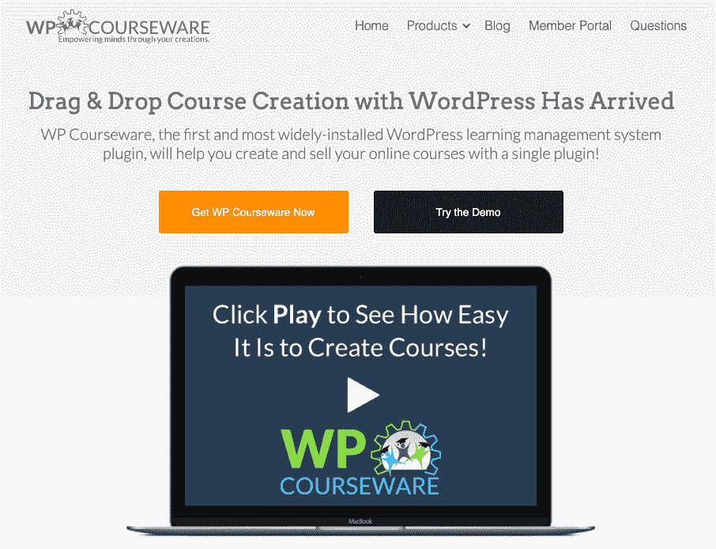
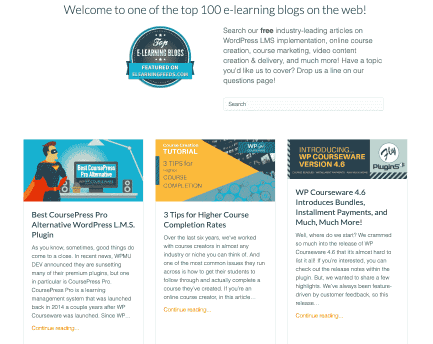
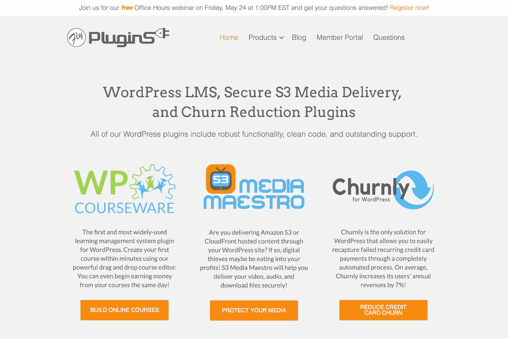

# 构建我自己的 WordPress 解决方案如何演变成 24K 美元的 MRR

> 原文：<https://www.indiehackers.com/interview/how-building-my-own-wordpress-solution-evolved-into-24k-mrr-499a016a36>

## 你好！你的背景是什么，你在做什么？

嗨，我叫本·阿雷利亚诺，我是一家名为 [FlyPlugins](https://flyplugins.com/) 的 WordPress 插件公司的联合创始人。

大学毕业并获得 IT 学位后，我花了 12 年时间在 IT 领域从事各种工作。我做了所有的事情，从制造和排除计算机故障到在服务器和网络上工作，以及自动化软件分发。不用说，我是一个技术极客。我从高中起就被创业吸引，但从未认真追求过什么，因为我不知道如何创业。

2009 年，我终于冒险一试，一头扎进了深水区——我不仅创办了一家企业，还创办了好几家。在接下来的几年里，我开始了电脑维修业务和制作乙烯基标牌的业务。我涉足网络开发，并开始开发 iPhone 应用程序。通过各种商业冒险和失败，我终于用 WordPress 插件找到了自己的位置。

插件很有吸引力，因为它们是用 PHP 构建的，PHP 是一种相对容易学习的编程语言。随着 WordPress 基本上驱动了互联网的三分之一，我们知道任何围绕它建立的业务都会有一个非常大的目标市场，并且可能是一个非常安全的赌注。当然，还有比这更多的起源故事，但是最后，我们想出了 [WP 课件](https://flyplugins.com/wp-courseware)，一个用 WordPress 创建和销售在线课程的插件。

正如预测的那样，我们拥有庞大的客户群，包括个人、企业家、作家、教练、组织、教育机构、学院和大学。我们甚至让政府部门和各种公司购买了用于员工培训的插件。我们的大多数客户都在教授他们恰好是专家的一门学科的技能，比如吉他课、拉丁语、数学、饮食和锻炼，甚至还有一门关于如何创建校对抄写业务的课程。每个人都是某方面的专家，所以为什么不用你的时间来换取金钱呢？

在过去的七年里，我们的业务显著增长，目前平均每月经常性收入为 2.4 万美元。有些月份比其他月份好，但总的来说，我们的总体轨迹逐年增加。

 

## 是什么激励你入门 WP 课件？

2011 年，我和 Nate(我的商业伙伴和联合创始人)正在开发一个在线课程，但是有一个问题:WordPress 没有一个学习管理系统(LMS)插件。我们继续进行并启动了这个课程，在 WordPress 中拼凑了一些标签和类别，使其看起来合法，但很明显我们偶然发现了一个做更多事情的机会。

老实说，我们没有太多的思考和零验证就一头扎了进去，并决定为 WP 启动 LMS 插件业务。2012 年，我们为 WordPress 推出了第一款 LMS！直到今天，我们还在开玩笑说是运气和完美的时机让这一切发生了。

当我们推出 WP 课件时，我正做着一份全职工作，并认为这只是补充我收入的副业。好处是，我可以将 100%的利润重新投入到制作更好的 WP 课件中。

## 构建最初的产品需要什么？

我们从第一天就知道我们需要一个开发者。我有基本的编码经验，但是我从来没有从头到尾做过插件。我们四处寻找，找到了一个在英国的 PHP/JavaScript 开发者，他在合同的基础上为 WordPress 开发插件，我们联系了他，签署了保密协议，然后开始了比赛。

令我们欣慰的是，第一张发票并不太痛苦。因为我有一个联合创始人，我们分摊了所有的成本，使得个人层面的财务负担更轻，并且完全可行。迄今为止，我们从未欠下任何商业债务，这没什么可嘲笑的，也是我们真正感激的。

自动化可以帮助你利用你的时间，这样你就可以做最重要的事情。

TweetShare

我们给了开发人员一个我们正在寻找的东西的基本轮廓，理解到我们正在寻找一个 MVP 来尽快进入市场并进行验证。对我们来说幸运的是，他拿走了我们的大纲，并按照它运行，最终给了我们一些伟大的东西。接下来，我们学习了如何创建项目范围和模型，但在那一点上，我们完全是新手，并且非常幸运地与我们签约。

当我们完成这些动作时，有三件事变得很明显:

1.  我们必须找到一种方法来提供和跟踪插件的许可证——我们需要确保我们支持我们的付费客户，同时监控他们的使用情况，并确保没有人滥用他们的许可证。像大多数企业一样，我们只为付费客户提供支持和更新。
2.  我们必须设计一种方法来发布插件的更新。
3.  我们必须找到一个平台来支持我们的客户。

那时，还没有现成的解决方案来许可或更新插件。我们的开发人员同意为我们提供一个独立的插件解决方案，他一直致力于满足我们的需求。我们实际上试图鼓励他把他的产品推向市场，因为显然有这种需求，但他认为不值得。最后，我们转而使用由 Easy Digital Downloads 的人创建的[软件许可](https://easydigitaldownloads.com/downloads/software-licensing/)。

我们一开始使用 ZenDesk 作为我们的支持平台，写了大量的支持文章，并创建了一些 YouTube 视频，但最终迁移到了 HelpScout，因为它与软件许可和轻松的数字下载有更好的集成。

我们在 2012 年 6 月开始制作 WP 课件，并在 2012 年 9 月出售了我们的第一个插件。我们花了很多时间测试插件和更新过程，以及创建一个网站，保护和建立社交媒体渠道，并创建营销材料。总的来说，我想说在不到四个月的时间里推出一个 MVP 对一些新手来说并不算太坏。

由于我是全职工作，我在周末、晚上甚至午休时间都在忙着完成发布前的任务。内特和我基本上划分和征服了我们所有的任务。发布后，我花了许多不知疲倦的夜晚工作的客户支持，但这是非常值得的。

## 你是如何吸引用户，让 WP 课件成长的？

我们以前从未推出过高级插件，所以我们决定在[勇士论坛](https://www.warriorforum.com/)上推出我们的产品作为勇士特供。我们最初以 19.99 美元出售该插件，其中包括无限的更新和支持。勇士论坛有一个相当大的基础，并给了我们的初始流量增加，我们正在寻找。除了勇士论坛，我们还通过 [ClickBank](https://www.clickbank.com/) 发布了我们的插件，作为快速获得一个互联网营销团队来推广 WP 课件的一种方式。不能不提的是，Nate 在早期不知疲倦地制作博客内容和客座博文，以建立我们的有机流量，这是一个巨大的帮助。

促成我们成功的一个重要因素是我们受到了 WordPress 领域一个主要影响者的关注，[克里斯·马乐](https://chrislema.com/building-an-online-course-woocommerce/)。我们还与其他插件开发者合作创建了[插件集成](https://flyplugins.com/plugin-integrations/)，并转化为交叉推广。

我们的网站流量在过去一年中大幅增长，从 2016 年和 2017 年的平均每月 8600 左右跃升至目前的 14K。我们认为这可以归功于我们在过去一年中所做的几项重要改变。我们开始更加关注我们的 [YouTube 频道](https://www.youtube.com/user/flyplugins?sub_confirmation=1)，并制作许多新内容，如教程和战略学习视频。我们还开始在 Instagram 上培养粉丝，这扩大了我们的营销渠道。我们正努力坚持制作博客内容、视频内容，并保持在社交媒体的领先地位，这似乎正在取得成效。Nate 还在 2018 年创造了一个销售线索磁铁，为我们带来了大量的脸书流量，并大大增加了我们的电子邮件列表。

我们的营销漏斗非常简单:我们有一个单一的销售线索磁铁，将潜在客户吸引到一系列的八封电子邮件中，最后一封电子邮件呼吁购买。我们在这封电子邮件中加入了折扣代码，并尝试每月至少发送一封促销电子邮件。

我们尝试了谷歌广告，但发现转换成本比脸书广告高得多。这似乎是 LMS 领域软件公司的标准。总的来说，脸书和 Instagram 已经开始被广告饱和，这意味着许多人习惯于完全忽略广告，这并不理想。我们最终想进入 YouTube 广告，但还没有找到带宽。

SEO 一直是一个挑战。搜索引擎优化的策略和方法是不断变化的，因为谷歌总是在改变规则。试图跟上搜索引擎优化是相当困难的，但我们已经努力打好仗，优化我们的网站，以跟上变化的步伐。最终，我们的大部分流量是有机的，这总是一件好事。

 

## 你的商业模式是什么，你是如何增加收入的？

根据许可证的数量，每个插件有三个不同的价格点。一个许可允许你在一个 WordPress 网站上安装插件，并且每个许可模式通过定期订阅的方式每年收费。我们使用简单的数字下载循环和贝宝专业插件为我们的支付系统。基本上，我们是一个全面的轻松的数字下载商店。

如前所述，我们最初的发布是通过勇士论坛和点击银行完成的。我们最初的插件价格是 20 美元，包括终身更新和终身支持。回过头来看，对于我们提供的服务，我们收取的费用实在是太低了。我指的是 20 美元的全套学习管理系统、终身更新和终身支持——你在开玩笑吗？

我们最终把价格提高到了一个更合理、更可持续的水平。然而，大约一年半后，我们开始注意到一个大问题。为所有这些客户提供支持功能并投资于产品开发，很快就积累了更多的资金，我们看到了这些资金的到来。支持插件、开发新功能和修复 bug 是很昂贵的。我们考虑收取更多费用，但认为这只会在短期内给我们带来更多的前期资金，我们更关心的是如何长期维持我们的业务。

投资你的企业的一部分就是投资那些能帮助你建立企业的人，这样你才不会筋疲力尽。

TweetShare

2014 年，我们决定让我们的产品基于订阅，这是我们能做的最好的事情。我们在我们的产品系列中实现了简易数字下载循环插件，并开始让人们注册订阅。虽然我们直到大约一年后才看到这个决定的成果，但它对我们业务可持续性的影响现在是不可估量的。

Nate 和我继续把钱投回到业务中，通过把我们的开发人员从英国外包出去来改进产品。每次我们有一个发布，我们都向当前客户和潜在客户宣布。我们会给非客户一个即将到期的折扣代码，并运行几天的活动，这导致在我们的主要更新期间收入出现一些巨大的峰值。有趣的是，我们还会看到每次更新的总收入增长。在过去的 5 年里，我们平均有 80%的利润率，这对于一个在线软件企业来说是非常好的。

2016 年，我们达到了一个点，我们在市场上有两个稳定的插件，我们每月的经常性收入约为 19，000 美元。我们决定开始寻找一名全职开发人员，并在 2017 年让科里担任我们的首席技术官。从那时起，我们的收入已跃升至每月 23，000 美元以上，因此我认为这是一笔不错的投资。

收入的增加并非偶然。在他上船的第一年，Cory 构建了 Churnly 来增加我们的插件系列，从头开始重建了 S3 媒体大师，为 WP 课件添加了大量新功能，并更新了我们的几个集成插件。

| 年 | 收入 |
| --- | --- |
| 2014 | 16000 |
| 2015 | 17000 |
| 2016 | 19000 |
| 2017 | 23000 |
| 2018 | 24000 |
| 2019 | 25000 |

## 你未来的目标是什么？

我们确实对其他产品有未来的计划，目前正在积极进行其中的一个项目。我们希望在一年内推出新产品，但目前，我们正在积极地重新编写 WP 课件，为我们的其他两个插件添加功能，并创建更多的集成附加插件。

谈到路障，我认为它们是成长的烦恼，而不是障碍。我很想引进第二个全职开发人员，以及 FaceBook 广告经理、Google 广告经理、SEO 专家、销售文案和内容作者，但我们现在负担不起这些。随着久而久之和收入的增加，我们会慢慢增加我们的团队来获得更大的动力。

我们希望到 2020 年夏天我们的收入能翻倍。与任何目标一样，我们需要保持一致并持续分析我们的方法，以确保我们尽可能高效，同时不影响产品和支持的质量。我们也在努力把精力集中在市场营销上，以提高我们产品的知名度。

## 你面临的最大挑战和克服的障碍是什么？如果你必须重新开始，你会做什么不同的事？

我觉得我们在创业初期犯了两个错误。第一个错误是没有在游戏早期引入全职开发人员。与开发商签约效果很好，因为这有助于我们立即产生现金流，而且我们只为每个项目的开发付费。然而，这迫使我在早期执行大量的支持并尝试修复许多错误，这花费了我本可以投入到其他事情上的大量时间。我不禁觉得这严重阻碍了我们的成长，但有时你只能做你该做的。

毫无疑问，一个全职开发人员可以用大约一半的时间把我们从 A 点带到现在。它会让我在业务上投入更多的精力。此外，根据我们的数据，每次发布新版本，我们的总销售额都会增加。即使是在我们引进 Cory 的那一年，我们也看到了整体年收入的大幅增长。

放弃对你投入了大量时间和精力的事情的控制权并不容易，尤其是在单独创始人的时代，但如果这能保持你的理智并有助于你的业务，这是值得探索的。

TweetShare

另一个错误是推出我们的终身支持和更新的产品。开发并不便宜，但这是确保产品持续增长和改进的必要投资。减少现金流的最佳方式是提供基于订阅的服务。大多数软件公司使用这种收入模式，因为它很有意义！

内特和我学到的一件事是，将资金重新投入到企业中是至关重要的。我们可能有一年或更长时间没有拿薪水回家。这确实有助于我们都有其他收入来源，但投资于你的企业是非常重要的。直到今天，我们还在不断地向我们的企业投资，无论是工具、教育还是个人成长。

另外三个非常有用的小贴士是尽可能多的投资营销。无论你是运行脸书广告还是谷歌广告，或者只是购买播客上的赞助部分，你都必须投资于营销和营销策略。如果你不知道如何经营广告，有一些服务可以帮你做。另一个建议是疯狂地建立关系网！结识你所在行业甚至相邻行业的人，为交叉推广、反向链接甚至客座博文创造机会。

最后，不要什么都亲力亲为。内特和我都试图自己做我们生意中的每一件事。我们最近才意识到，在你精疲力尽之前，这只能带你走这么远。投资你的企业的一部分就是投资那些能帮助你建立企业的人，这样你才不会筋疲力尽。我们一直在努力解决这个问题，因为我们是从零开始建立这项业务的，通过将业务的各种要素委托给其他人来放弃一些控制权是很可怕的。放弃对你投入了大量时间和精力的事情的控制权并不容易，尤其是在单独创始人的时代，但如果这能保持你的理智并有助于你的业务，这是值得探索的。

 

## 有没有发现什么特别有帮助或者有优势的？

我们成功的很大一部分是我们互补的工作方式。我们不会冒犯对方。Nate 是一个超级聪明、有商业头脑的人，他负责我们的财务、财务分析、售前和内容营销，而我负责技术方面、产品设计和测试，以及社交媒体营销和产品文档。

我们每周通过 Zoom 见两次面，讨论我们正在做的事情和我们将来要做的事情。这些会议非常有助于我们讨论一些日常斗争，并提供一些急需的动力。

我已经回避了这一点，但我真的觉得能够与其他插件公司联系以便合作对我们的销售和增长来说是一个巨大的好处。它可以创造一些非常好的协同效应，打开交叉推广的大门。

当我在 IT 领域工作时，我亲眼目睹了自动化的强大，并深深铭记在心。我试图尽可能自动化，并建议每个人都这样做。这意味着投资于软件工具，如自动化销售漏斗、电子邮件营销和社交媒体内容的工具。即使是像在我们的支持系统中准备好预先录制的响应，或者从 web 表单集成到 Trello 板以跟踪客户功能请求这样的小事，也是一个真正的时间节约器。自动化可以帮助你利用你的时间，这样你就可以做最重要的事情。

## 对于刚刚起步的独立黑客，你有什么建议？

看来踏入网商已经不像以前那么容易了。越来越多的人试图发展在线业务，这不可避免地会带来更大的竞争。社交媒体越来越拥挤，互联网上到处都是“专家”。这就是说，有很多噪音，很难在人群中被听到，所以我的建议很简单:要真实，真正有帮助，要尊重，并表明你真的在乎。

人们可以在一英里外发现一个说话很快的销售骗子。如果你做生意是为了赚快钱，那你永远也不会长期经营下去。倾听并从顾客的反馈中学习，即使是负面的。客户反馈是让你的产品变得更好的重要因素。

尽管把这些收入放进你的口袋可能很诱人，但我还是建议把这些利润重新投资到你的业务中，无论是改进你的产品、营销你的产品、购买工具，还是投资于个人成长。投资你的企业对你企业的成长至关重要。一开始很难做到这一点，尤其是如果你没有另一种收入的方法，但这是长寿所必需的。

这里有一份我们在业务中使用的工具清单。这些是我们实际使用的工具，老实说，它们为我们业务的成功做出了贡献。

 

## 我们可以去哪里了解更多？

每个月的第四个星期五，我们都会举办一个免费的办公时间会议，在会上我们会通过直播回答关于我们的插件、WordPress 或者在线业务的问题。欢迎[注册](http://flyplugins.com/office-hours)，参加，并提问。

你可以在 [FaceBook](https://www.facebook.com/flyplugins/) 、 [Instagram](https://www.instagram.com/flyplugins/) 、 [Twitter](https://twitter.com/FlyPlugins) 和 [YouTube](https://www.youtube.com/user/flyplugins?sub_confirmation=1) 上找到 us @flyplugins。

链接到我们的三个插件:

*   [WP 课件](https://flyplugins.com/wp-courseware)
*   [S3 媒体大师](https://flyplugins.com/s3-media-maestro)
*   [恰尔尼](https://flyplugins.com/churnly-for-wordpress)

如果你对 WP 课件有疑问，[发送问题给我们](https://flyplugins.com/questions/)。

如果有人对我们有任何问题，请不要犹豫，在评论中提问。我们会尽力回答所有的问题。感谢您邀请我们参加独立黑客节目！

——[<picture id="ember5314084" class="user-avatar ember-view user-link__avatar"></picture>本·阿雷利亚诺](/benito?id=uNUd4Oq6H1MMV778vxsiBt8WHau2)，WP 课件创始人

## 想像 WP 课件一样自己创业？

你应该加入[独立黑客社区](/)！🤗

我们是几千名创始人，互相帮助建立有利可图的业务和副业。来分享你正在做的事情，并从你的同事那里获得反馈。

还没准备好开始使用你的产品吗？没问题。这个社区是一个认识人、学习和实践的好地方。随意[随便浏览](/)！

—[<picture id="ember5314089" class="user-avatar ember-view user-link__avatar"></picture>考特兰艾伦](/csallen?id=ibTLPyjwVebnZjMGKvz6ztarnuV2)，独立黑客创始人

21votes