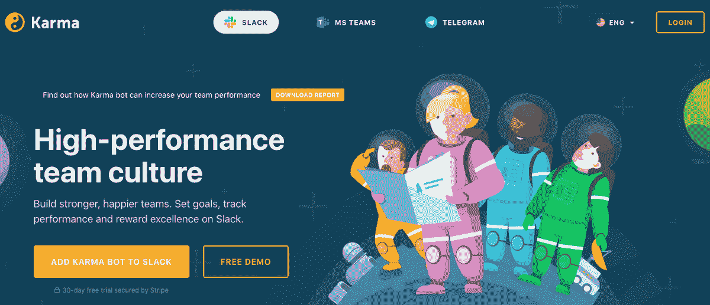
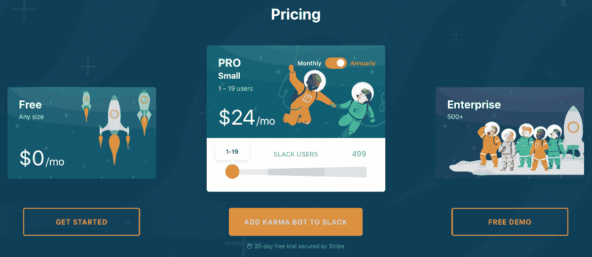
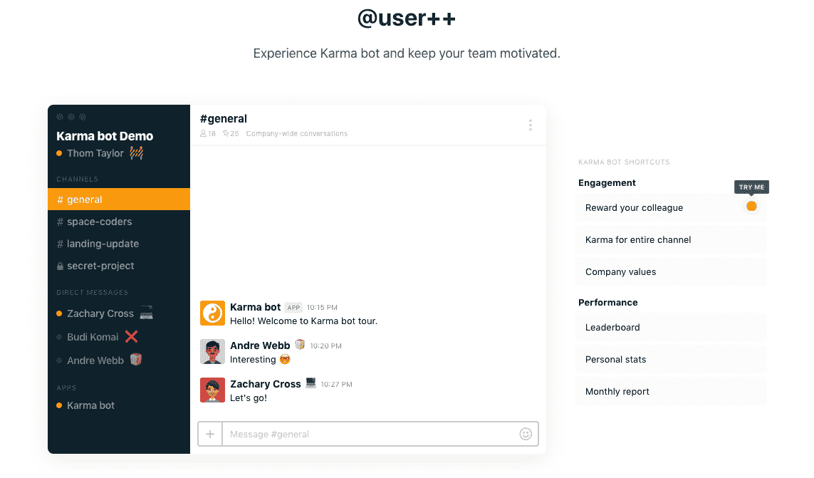

# 如何在一年内将我的产品卖到 73000 美元的 MRR

> 原文：<https://www.indiehackers.com/interview/how-building-to-earn-drove-my-product-to-7-3k-mrr-in-one-year-9c6ef7eea3>

## 你好！你的背景是什么，你在做什么？

嘿，我是斯塔斯·库勒什。我在西伯利亚的远东地区长大，学习计算机科学和核物理，在乐队演奏，对独立游戏制作感到兴奋，并离开 uni 成为一名数字设计师。在 21 世纪初的几年里，我远程工作，到处旅行和写博客(在那成为流行的主流事物之前)，最后在新西兰结束。

如今，我依然弹奏着各种乐器，在奥克兰经营着一家开发设计店，投入巨资成为有史以来最好的爸爸，还要照顾 [Karma](https://karmabot.chat/) 。希望因果报应能在某个时候照顾我。

[Karma](https://karmabot.chat/) 是一个聊天机器人，它收集并处理聊天数据，以构建全面的绩效报告并改善人员文化。它提升了团队士气，同时为团队领导提供了有价值的见解。该机器人在 Slack、微软团队和 Telegram 上可用。

Karma 每周有超过 6000 名用户，每月从 90 家付费公司获得 76000 美元的经常性收入，每周有 750 个新团队注册。

 

## 是什么激励你开始做 Karma？

最初，Karma bot 是我们为自己的数字工作室 [Sliday](https://sliday.com/) (超过 24 人的团队，大多数是远程员工)构建的内部工具。在一次成功的产品搜索发布后，我们发现其他人也希望使用它。一年左右的时间里，Karma 每月的收入不到 200 美元，所以我们并不认为它严重到需要投入大量资源，但越来越多的客户要求增加功能和更新。

大多数新想法都是通过我们的分布式开发团队在 Sliday 内部验证的，事后看来，这可能是一个错误。我们应该更多地倾听真实生活中的客户，而不仅仅是我们有些偏见的员工。结果，这款应用变得不成比例，变得晦涩难懂，难以使用和理解，难以解释和销售。

我们 2017 年接了开发，2018 年经历了 Y Combinator 的免费创业学校。我的商业伙伴大卫·克拉维茨(David Kravitz)自 2018 年 11 月以来几乎全职从事 Karma 的工作，主要专注于销售和营销。

YC 创业学校 2018 真的帮了大忙。我们重新设计了定价模式，简化了产品，并进行了大量改进。首先，与客户交谈(大卫每周做 5-10 次演示)确实有助于重塑产品，并使其回到它本来应该在的位置。这一共同努力推动我们的月收入从 2018 年 1 月的 156 美元增长到 2019 年 1 月的 13，361 美元。

只需*定期*跟踪重要指标(活跃用户、karma 请求数量、收入、付费客户等)。)真的有助于保持专注，及早发现错误和陷阱。对自己诚实至关重要。不诚实可以，而且很有可能会让你的创业公司陷入困境。

## 构建最初的产品需要什么？

Karma 是 Sliday 的一个兼职内部项目。我设计，有时候编码(大部分是前端)；大卫负责客户体验。

它没有花费太多的时间来建立一个原型，并根据我们自己的团队需要进行微调。一年多来，Karma bot 主要是一个内部工具。自然，我们想让这个新的工作空间更有趣、更吸引人，所以 Sliday 团队会建议一个功能，我们一起实现了它。向 Slack 的过渡并不容易，花了将近一年的时间。虽然我们在 Slack store 上提供了它，但我们并没有投入太多的思想或时间来保持它的相关性或吸引力。

很难估计我和大卫在这上面花了多少资金，但是时间追踪系统记录了 8，308.42 小时对抗 Karma。如果一个人相信“10，000 小时”规则，我们很可能在 2019 年成为聊天欣赏和参与领域的专家。

对自己诚实至关重要。不诚实可以，而且很有可能会让你的创业公司陷入困境。

TweetShare

我们在 2017 年 11 月推出了重大更新，并开始了产品开发。我们花了将近一年的时间来了解客户群，但一旦我们做到了，我们就能够吸引更多的客户，并获得更多的曝光率。2018 年初，微软找到我们，并支付了 10 万美元，为他们新鲜且渴望应用程序的微软团队平台开发 Karma bot。所有知识产权归我们所有。

就产品背后的团队而言，Sliday 团队由 20 名员工组成。作为一个数字工作室，我们提供设计和开发咨询和制作服务。我们的顶级开发人员已经为我们工作了 5 年多，首选的技术栈是 Ruby on Rails、Angular.js 和 Postgres。我们目前正在将前端转移到 Vue.js。

核心团队包括:

*   UX/UI 设计和前端编码:Stas Kulesh
*   Karma bot 应用:两位高级后端开发人员，Alexis 和 Victor
*   前端:数字游牧者和导师 Arkady
*   QA:一个兼职承包商，最大
*   插图:来自俄罗斯符拉迪沃斯托克的远程创意阿利亚

David Kravitz 负责 CX、质量保证、项目和产品管理、销售和运营工作。

我们一起打造了 100 多个数字产品:[网络应用](https://phben.ch)、[浏览器扩展](https://palette.site)和[移动应用](https://getskorch.com)。我们是 Slack app marketplace 和 MS Teams bot store 的最早开发者之一，随着平台规模的扩大，我们获得了关于这些平台的知识。

## 你是如何吸引用户并增长 Karma 的？

最初的发射进行得相当顺利。我是 ProductHunt 的新手，聊天机器人正在迅速发展。我们不断添加更多的功能，并将每一个功能都作为子产品推出，结果，Karma 分别被推荐了五次，并获得了大约 2500 次投票，这有助于获得最初的用户群。

虽然产品搜索运行良好，但它并没有真正带来我们感兴趣的客户。大多数早期的 Slack 采用者是初创公司，或者小型或免费(非盈利)社区。他们并没有真正看到该产品的价值。早期采用者准备支付每月 6 美元或每年 99 美元。虽然我们在这个过程中收集了一些反馈，但最终我们获得了近 10 万注册用户和每月 126 美元的经常性收入。可笑，真的。

我们尝试了脸书广告和谷歌 Adwords，但很快意识到要恰当地开展营销活动需要付出很多努力。这些付费广告渠道消耗的比它们带来的回报还多。

在获取用户方面，真正给我们动力的是与微软的合作。来自西雅图总部办公室的 Julian 带领我们完成了为微软团队聊天平台制作机器人的过程，然后微软帮助我们测试并在他们的新市场上推出了 Karmat。时至今日，微软 HQ 团队互送因果报应。不可否认，微软团队的开发过程并不尽如人意，但是用户群有很大的潜力，因为大部分都是企业用户。

与客户交谈真的有助于重塑产品，并使其回到它本来应该在的位置。

TweetShare

我们运用了各种营销技巧来传达信息。David 和 Vlad 在 MailerLite 中创建了许多电子邮件序列和流程，以确保团队在转换之前了解所有重要的功能。大卫花了数不清的时间发送冰冷的电子邮件——今天，他的“已发送”文件夹中有 12，404 封电子邮件。 [Crisp](https://crisp.chat/en/) 成为即时反馈和现场支持的首选聊天工具(902 次对话)。客户真的很喜欢这种即时的关注和联系。我们努力保持稳健和灵活。

通过 Karma，我们被 Y Combinator 创业学校录取，并参加了四次[先锋](https://pioneer.app/)锦标赛。可能的话，我会在 Reddit、黑客新闻和所有常见的极客网站上发帖。有一个在 Medium 上运行的 Karma 博客，一个 Twitter 账户，等等。

我不相信增长黑客或一刀切的用户获取方案。但是我确信，如果一个产品解决了顾客的问题，节省了时间，并且让她感觉更好，那么她会把它告诉她的朋友和同事——那么就去做吧。

 

## 你的商业模式是什么，你是如何增加收入的？

Karma 一直是基于订阅的付费产品。最初，我们给每个团队(任何规模的团队)设定了一个愚蠢的 6 美元/月的价格，并赠送了 48 美元的终身许可证。倾听理性和创业学校顾问的声音，我们更新了定价模式，不再承诺任何带有“永远”字样的东西。

2018 年 2 月，我们在 Karma bot 中为 Slack 引入了免费增值有限账户。今天，1288 支球队是免费的。73 支队伍在付钱。Stripe 是一款出色的、无与伦比的工具，可用于计费实施、争议、风险评估和收入回收。

我们是一家精益创业公司，所以我们试图跟踪成本和削减细节。今天，我想，我们是在为数字海洋托管(从 YC 创业学校获得免费学分)、[自述](https://readme.io/)、[酥](https://crisp.chat/en/)、[满足计](https://www.satismeter.com/)、 [MailerLite](https://www.mailerlite.com/) 、条纹费、[摘要](https://www.abstract.com/)设计版本控制系统、[视觉](https://www.invisionapp.com/)。Stripe 从第一天开始就为我们顺利工作；怎么推荐都不为过。

通过 Stripe 上的直接支付和经常性订阅，我们平均赚了大约 5000 美元，当我们与当前的一家企业客户签订试点项目时，这个数字曾经达到 133000 美元。

最困难的部分是发现人们在因果报应追踪工具中看到了什么价值。令人惊讶的是，你用得越多，它的价值就越大。Slack 收购了 Atlassian 的 HipChat，并于 2019 年 2 月弃用了该产品。在那个月，“karma bot”的搜索请求和新订阅达到高峰。我们今天最有价值、最省事的客户是 HipChat Karma 皈依者。

过度使用的建议是狂热地追随客户的需求和反馈，并解决他们提出的问题...超级有用。还有，业力分享是一件长期习惯性的事情，很长一段时间，我们都在努力接受它的“长期性”。

你可以亲自查看我们的月收入数据，我会在[独立黑客 Karma 页面](https://www.indiehackers.com/product/karmabot)上发布每周收入报告。

| 每月 | 收入 |
| --- | --- |
| 18 年 3 月 | 198 |
| 2018 年 4 月 | 355 |
| 2018 年 5 月 | 818 |
| 2018 年 6 月 | 1449 |
| 2018 年 7 月 | 1210 |
| 2018 年 8 月 | 1152 |
| 18 年 9 月 | 1427 |
| 18 年 10 月 | 2119 |
| 18 年 11 月 | 2425 |
| 2018 年 12 月 | 1580 |
| 19 年 1 月 | 2759 |
| 2019 年 2 月 | 13361 |
| 19 年 1 月 | 4526 |
| 2019 年 2 月 | 4046 |
| 2019 年 2 月 | 4878 |

## 你未来的目标是什么？

在过去的 12 个月里，长时间专注于一件事可能是最难学会的技能。

如今，我们期待在“++”的基础上进行构建，带来更多的价值，构建人们真正想要的东西。我们刚刚推出了[因果报应](https://karmabot.chat/#rewards)，并试图了解它如何影响转化率。在过去的 12 个月里，长时间专注于一件事可能是最难学会的技能。

我个人在从投资者那里筹集资金方面没有太多经验，但我们可能会寻求更多的资源来更快地扩大规模。

## 你面临的最大挑战和克服的障碍是什么？如果你必须重新开始，你会做什么不同的事？

最大的错误是误解了用户群。在与 100 多名客户(其中大多数是企业主、创始人、技术领导和高层管理人员)交谈后，我们认为我们现在知道，实际价值在于经理和团队领导的业绩报告，而不是让它成为员工的乐趣和游戏。

实际的付费客户不是普通的团队成员，而是团队所有者:高层管理人员、首席执行官和创始人、人员文化专家。他们需要业力来获得更好的控制和透明度。我们的聊天机器人帮助他们筛选日常聊天噪音，跟踪微反馈，记录绩效笔记，并传播团队赞赏。性能报告是 Karma 的真正价值，而不是它的乐趣和游戏方面。【T2

## 对于刚刚起步的独立黑客，你有什么建议？

不要为了建设而建设。你运送的每件产品都应该以某种方式带来收入。而且要尽可能自动化，尽可能节省时间，尽可能带来更多的钱。即使一开始看起来很小很微不足道，但随着时间的推移，如果你坚持学习、制作和运输，它将成为你财务稳定的重要组成部分。金钱通常是人们欣赏你工作的一个很好的指标。学会赚钱是一项基本技能，从长远来看，它能为自我发展和你喜欢的事情腾出更多时间。

我发现令人欣慰的是——或者至少我愿意相信——独立黑客社区不是为了快速致富，而是为了难以捉摸的工作与生活的平衡。在新西兰这个发达、美丽、偏远、闭塞的国家，寻找平衡是社会的核心价值观之一。在这方面，我是杰森·弗里德和大卫·海涅迈尔·汉森的忠实追随者。[上班不一定要疯](https://www.amazon.com/dp/0008323445/ref=cm_sw_em_r_mt_dp_U_hDTeDbK0P4ARV)、[远程上班](https://www.amazon.com/Remote-Office-Required-Jason-Fried/dp/0804137501/ref=sr_1_1?keywords=remote+work&qid=1561515894&s=gateway&sr=8-1)、[返工](https://www.amazon.com/Rework-Jason-Fried/dp/0307463745/ref=sr_1_2?keywords=re-work&qid=1561515917&s=gateway&sr=8-2)，虽然很撩人，但确实是很好很实用的素材。

学会赚钱是一项基本技能，从长远来看，它能为自我发展和你喜欢的事情腾出更多时间。

TweetShare

令人惊讶的是，我从一些伟大的思想书籍中获得了灵感，比如马克斯·泰格马克的《我们的数学宇宙》和《T2 生命 3.0》以及尼克·博斯特罗姆的《T4 超级智能》。通过宇宙的浩瀚或我们思想的难以想象的复杂性，他们表明大多数日常情况下的大多数日常事情都无关紧要。一个人应该做正确的事，保持冷静，坚持下去！

## 我们可以去哪里了解更多？

你可以在 [karmabot.chat](https://karmabot.chat) 了解更多关于因果报应的信息。

在 Twitter [@karmabot_chat](https://twitter.com/karmabot_chat) 上关注我们，一定要[在 IH](http://indiehackers.com/product/karmabot) 订阅我们的 karmabot 页面。

我们诚邀您在下面的评论区提出任何问题。祝你们好运。合十礼！😉

——[<picture id="ember5203205" class="user-avatar ember-view user-link__avatar"></picture>斯塔什库列什](/karmabot?id=jMVb8SthfMRy0dt439f0O8h20pE3)，因缘的创始人

## 想像 Karma 一样建立自己的事业？

你应该加入[独立黑客社区](/)！🤗

我们是几千名创始人，互相帮助建立有利可图的业务和副业。来分享你正在做的事情，并从你的同事那里获得反馈。

还没准备好开始使用你的产品吗？没问题。这个社区是一个认识人、学习和实践的好地方。随意[随便浏览](/)！

—[<picture id="ember5203210" class="user-avatar ember-view user-link__avatar"></picture>考特兰艾伦](/csallen?id=ibTLPyjwVebnZjMGKvz6ztarnuV2)，独立黑客创始人

9votes