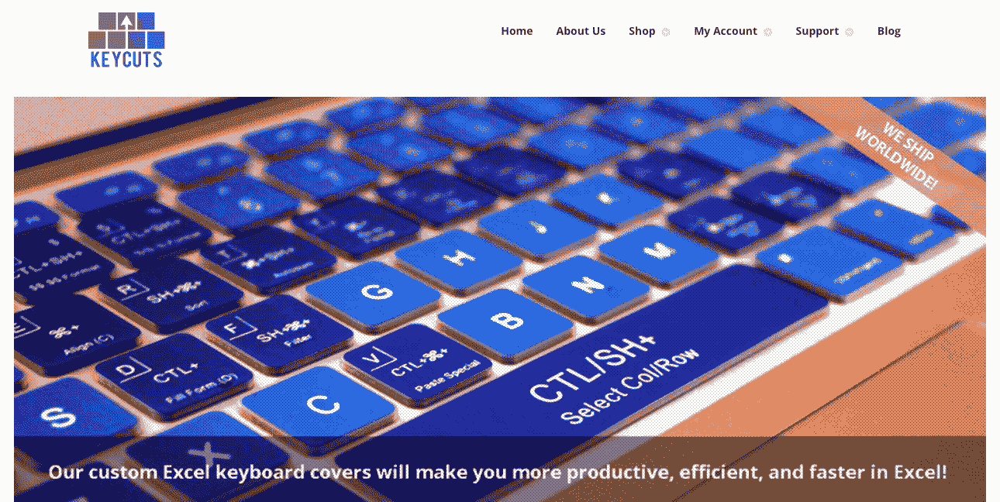
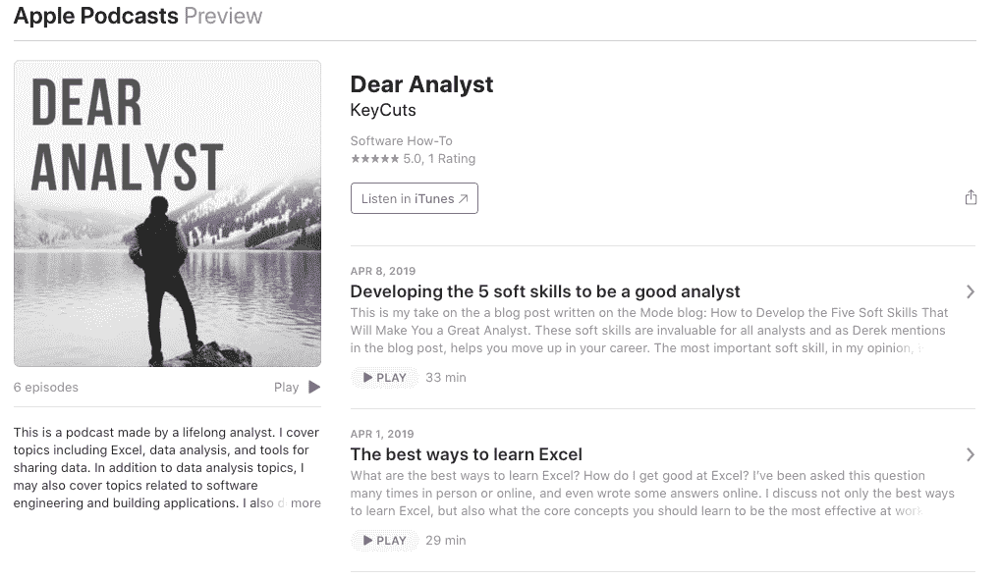
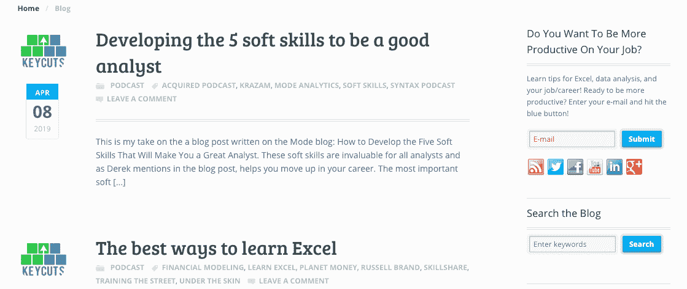

# 我如何将我的兼职项目与新的全职职业结合起来

> 原文：<https://www.indiehackers.com/interview/how-i-aligned-my-side-project-with-a-new-full-time-career-d2c4d6f8fa>

## 你好！你的背景是什么，你在做什么？

我的名字叫 Al，我在谷歌工作了 5 年多，最初是金融分析师，后来是销售分析师。离开谷歌后，我开始从事自由职业，帮助客户处理数据和 Excel 相关的项目。在我职业生涯的这段时间里，我还创建了一个名为 [KeyCuts](https://www.thekeycuts.com) 的网站，作为我自由职业、教学以及最终产品业务的主要品牌。我还共同创立了一个名为[合作平台](https://www.cooperatize.com)，专注于旅游行业的影响者营销。今天，我在 [Coda](https://coda.io/?utm_campaign=ih-interview-mar2019&utm_medium=blog&utm_source=indiehackers) 作为一名解决方案架构师，花了大部分时间帮助我们的社区构建像应用程序一样强大的文档。

KeyCuts 的目标是帮助人们使用 Microsoft Excel 提高工作效率。物理产品是覆盖在 MacBook 上的硅橡胶键盘盖。在键盘盖上，15 个最常用的键盘快捷键被印在按键上，帮助人们学习和承诺使用 Excel 键盘快捷键。有趣的是，使用 KeyCuts 键盘盖的人是*而不是*金融分析师或顾问。大多数从事金融工作的人已经知道所有的键盘快捷键。KeyCuts 的目标客户实际上是在市场营销、销售和人力资源部门工作的非财务专业人士，他们每天都必须使用 Excel，但希望在该工具中提高工作效率。尽管 Microsoft Excel 历史悠久，但它仍然是工作场所中使用最广泛的商业应用程序之一，知道如何高效地使用该工具有助于您更好地完成工作。

当 KeyCuts 在 2013 年首次推出时，我们每月仅从键盘盖销售中赚取约 1000 美元。今天，我们每个月的销售额约为 200-300 美元，但也有其他收入来源，如赞助和联盟营销。我最引以为豪的是 KeyCuts 博客的收视率，因为它在我们首次推出时还不存在。我们的博客和网站上的其他内容每天都有近 500 名不同的访问者。

 

## 是什么促使你开始使用 KeyCuts？

KeyCuts 产品背后的故事始于我还在谷歌工作的时候。在我的团队中，人们总是向我求助如何在 Excel 中执行 X 或 Y 操作。从编写公式到格式化，我一直在帮助我所有的同事确保他们的 Excel 电子表格不会“崩溃”我不仅在帮助我的同事，还会收到一些朋友的电子邮件和电话，请我帮忙处理他们的 Excel 文件。有一天，我决定在我的办公室组织一个 Excel 研讨会，并预订了一个会议室一个小时。我创建了一个简单的演示文稿，展示了所有我认为人们应该知道的重要的 Excel 键盘快捷键，得到了同事们的好评。

研讨会结束后，我的一位同事找到我，认为我们可以一起开发一个实体产品，帮助人们学习 Excel 键盘快捷键。谷歌当时有这些 Gmail 贴纸，你可以贴在键盘上，展示你常用的 Gmail 键盘快捷键。我不喜欢贴纸的持久性，因为如果你决定不要它们在你的键盘上，你必须一次一张地把它们撕下来。在做了一些研究后，我发现硅橡胶键盘套可以定制不同的颜色和文字，它们还有一个额外的好处，即保护你的键盘免受灰尘和手指上的油的影响。

鉴于我对 Excel 键盘快捷键的广泛了解，我创建了一个 PowerPoint，其中包含了我希望打印在每个键上的所有快捷键。这张幻灯片的每一张幻灯片实际上都是键盘上的一个键。在与几位同事讨论了我们的想法后，我们发现这将解决很多问题，因为每个人都希望更好地使用 Excel，尤其是整天在电子表格和文档中工作的人。人们认为这个是个好主意的原因是:

*   它不需要你去看键盘快捷键的备忘单
*   快捷方式触手可及
*   如果您不喜欢产品的外观和感觉，可以随时取下盖子

由于收到了积极的反馈，我们决定继续前进，开始构建原型。

## 构建最初的产品需要什么？

从我在 PowerPoint 中的最初设计到收到我们的第一批产品样品，我认为总共花了两个月的时间。它不是一个过于复杂的产品，更重要的是，它不是一个物理上*大*的产品；我会在下面解释更多。

就范围而言，我们可以在键盘盖上打印数百个键盘快捷键。我们实际上有一些竞争对手试图在键盘上打印所有内容，但我们希望保持简单，不要让用户记住太多东西。我根据自己教授 Excel 键盘快捷键的经验，选择了 15 个我认为最能引起 Excel 用户共鸣的快捷键，并在 PowerPoint 中创建了这些快捷键的模型。

当该说的都说了，该做的都做了，我唯一使用的“技术”就是 PowerPoint。在找厂家方面，我在阿里巴巴上搜了一下，发现当时中国广州市是硅胶产品之都。我找到的许多制造商都在那里，所以我给他们都发了信息，解释我想要什么。在我把我的低画质 PowerPoint 设计发给他们后，他们很容易就能制作出一个产品。我也懂普通话，所以我能够与我们选择的最终制造商谈判，以获得好的单价。

我们第一批 20 个封面的样品只花了大约 50 美元，从我把钱汇给制造商的那天起，仅仅两个星期就到了(不要让我从国际电汇费用开始)。运输如此便宜和快速的原因是因为产品*不是一个非常大的产品*。你可以在阿里巴巴上买到椅子、交通灯和 1000 磅的芒果，但它们很大，运输成本很高。这些类型的产品通常需要海运，这涉及到使用货运代理。由于 KeyCuts 产品相对较小且重量较轻，制造商可以通过空运来运输，这为我们节省了大量的资金和时间。

在我们进行了几次设计迭代后，我们最终下了第一笔 5000 个键盘盖的订单(每种颜色 1000 个)。以下是一些关于它所花费的时间和资源的高级统计数据:

*   我和我的业务伙伴之间的总成本分摊为 2，500 美元
*   用 PowerPoint 设计 4-5 个小时
*   10 个小时在阿里巴巴上寻找制造商，并与他们沟通和谈判
*   每次设计迭代 2-3 周发送给制造商，样品送回美国
*   15 个小时的包装设计
*   10 小时设计网站

如您所见，这并不需要投入大量的时间和资源，所以我和我的商业伙伴可以在周末或下班后完成大部分工作。最初的投资也很低，由于我们当时有全职工作，我们可以在从事这个项目的同时养活自己。

## 你是如何吸引用户和发展 KeyCuts 的？

扩大 KeyCuts 的客户群最初需要大量的手工工作。我在 Wordpress 中创建了一个基本网站，这样人们就有了购买产品的目的地，并通过手动接触一些不同的受众来传播信息:

1.  目前的同事(因为我知道他们是从我这里了解 Excel 的)
2.  我教过 Excel 的班级的学生(在我离开谷歌之后)
3.  我认识的从事金融工作的老同学或者我认识的像我一样的 Excel 极客

显然这没有规模，所以我转向数字营销。在两到三个月的时间里，我在网上研究了社交媒体营销、SEO、博客和其他吸引网站流量的有机方法。我来自谷歌，我知道我可以投资谷歌广告词，但我不想因为广告而倾家荡产，也知道有更多有机的方式来提高你的品牌知名度。

我用[的 PRLog](https://www.prlog.org/) 拼凑了一份新闻稿，基本上是在自我推销 KeyCuts 网站。我在我的个人脸书时间线上分享了这篇新闻稿，这是我第一次经历在几个小时内“病毒式”传播的事情。这看起来很棒，我认为这类似于如今人们如何开始寻找产品。

虽然分享的数量不是很大，但我想说看到新闻稿的观众是非常有针对性的，那天我们的网站有大约 5000 名独立访客。同样，没有什么大的，但我们开始看到订单涓涓细流。在接下来的几周里，我还开始通过竞赛、YouTube 视频和博客帖子从 KeyCuts 脸书页面发布更多内容，让更多关注我们脸书页面的人对该产品感兴趣。

一步一步来，这就是我建立和优化这个网站的目的，以获得*有机*可见性:

1.  建立一个基本的网站
2.  让产品页面和结账表单正常工作(我在 Wordpress 中使用了 WooCommerce)
3.  通过新闻稿和社交媒体“发布”
4.  为社交媒体营销构建博客和其他内容
5.  继续写博客

我不能强调博客对于内容营销和搜索引擎优化的重要性。我不再积极推广该产品，但我在 2013 年和 2014 年发布的 evergreen 博客帖子今天仍有大量流量。

## 你的商业模式是什么，你是如何增加收入的？

最初的主要产品是键盘盖，我今天还在继续销售。今天，它的售价为 24.95 美元，与我们推出时的价格相同。我研究了竞争对手的键盘盖，并根据“竞争对手”来定价，尽管没有多少键盘盖公司只专注于 Excel。我们已经为 Adobe Photoshop 和 Illustrator 制作了样本，但决定继续专注于 Excel，因为这是我的专长所在。

有抱负的企业家应该考虑如何使他们原来的业务多样化，甚至转向其他可能成为新收入来源的业务。

TweetShare

为了创造更多的收入和持续的业务，我们开始探索以下选项:

*   **合作关系**——许多像 Fab 这样的“当日交易”网站联系了我们(还记得他们吗？)当这些网站推出我们的产品时，这为我们带来了更多的销售和网络访客
*   **赞助**——每周到今天，我仍然会被那些想在网站上运行联盟链接和广告的公司推销。我不同意广告，但已经接受了一些代销商链接，每月产生 50-100 美元的收入
*   亚马逊——今天，我们 75%的销售额来自亚马逊的产品页面
*   **教授**——这不一定是核心 KeyCuts 商业模式的一部分，但我已经开始通过 Skillshare 这样的 MOOC 网站教授 Excel(我的 [Excel Skillshare 课程](http://skl.sh/2lsi6up)有超过 10，000 名学生)
*   **咨询**——也不是核心键盘业务的一部分，但键盘盖的可见性导致了咨询/自由职业的工作，我可以利用我的 Excel 技能来帮助企业

就在 KeyCuts 网站上设置支付而言，我在谷歌上搜索了“如何在 Wordpress 网站上收款”当时，最常见的框架是 WooCommerce，所以我一直使用这种方法。后来，我了解了 Stripe，并将 Stripe 整合到我的结账流程中，因为在此之前，我使用了一些第三方服务，这些服务从我的销售额中抽取一定比例，用于完成 Stripe 所做的事情。在 Stripe 之后，我想为什么就此打住呢？我增加了亚马逊，贝宝，甚至比特币作为潜在的支付方式。我认为我们不应该歧视顾客购买产品的方式。

有趣的是，在 2015 年，有几个人用比特币支付，而我已经忘记了那些进入我比特币钱包的支付。当时比特币的价值要低得多，去年比特币价格飙升至 2 万美元时，我查看了一下比特币钱包，惊喜地发现，按去年的汇率计算，我收到的比特币价值 1000 美元。今天，没有那么多。:)

今天，我们不再像以前那样从核心产品中获得那么多收入，而是从教学、赞助等其他方面获得收入。，每个月仍有几百美元的收入。有抱负的企业家应该考虑如何使他们原来的业务多样化，甚至转向其他可能成为新收入来源的业务。我认为今天的键盘盖只是一个进入新的潜在收入流的滩头阵地。就月收入而言，这些是发布后前五个月的数字:

| 月 | 收入 |
| --- | --- |
| 第一个月 | 1500 |
| 第二个月 | 1000 |
| 第三个月 | 900 |
| 第 4 个月 | 800 |
| 第五个月 | 600 |

正如你所看到的，发布会最初的“热潮”肯定会消退，但当我想到什么样的关键产品*可能是*而什么样的*是*时，我并没有因为核心产品收入的下降而感到太沮丧。

## 你未来的目标是什么？

我对 KeyCuts 的主要目标实际上不再与销售产品相关。尤其是现在随着苹果发布的新款 MacBooks，键盘布局有所改变，我认为该产品可能会在一年左右的时间内过时。这并没有让我气馁，因为我知道该产品会在某个时候自然结束，因为它依赖于硬件更新。

现在的目标是通过博客和内容营销增加网站的流量。正如我在之前的回答中提到的，我从在线教学、咨询和赞助中看到的新收入流更具可扩展性，更重要的是，*不涉及实物产品*。尽管我很喜欢 Etsy 和制造酷产品的制造商，但我对持有和运输库存并不感兴趣，这就是为什么我认为 [FBA](https://services.amazon.com/fulfillment-by-amazon/benefits.html) (亚马逊履行)是运输你的产品的正确方式，即使他们会从你的利润中提成。

我计划写更多的文章，做更多的教学，来提升凯切品牌，而不是凯切产品。我最近开始了一个名为 [*亲爱的分析师*](https://itunes.apple.com/us/podcast/dear-analyst/id1455099942) 的播客，谈论 Excel 和数据分析，以进一步为 KeyCuts 建立内容和品牌。

 

我最大的障碍是有时间平衡全职工作和我在 KeyCuts 的努力，但最棒的是我的全职工作与我对 KeyCuts 品牌的愿景密切相关。通过我在 [Coda](https://coda.io/?utm_campaign=ih-interview-mar2019&utm_medium=blog&utm_source=indiehackers) 的工作，我开始和我们的用户一起工作，在一个比 Excel 好 100 倍的平台上共享和处理数据。我认为，对于平衡全职工作和兼职项目的企业家来说，这两种追求应该密切相关，这样才能产生对两家公司都有利的协同效应。

## 你面临的最大挑战和克服的障碍是什么？如果你必须重新开始，你会做什么不同的事？

我早期遇到的一些最大的障碍都与合作有关。我正在谈判的一些主要合作伙伴关系在最后一刻告吹，这意味着失去了很多业务，但更重要的是，我投入到潜在合作伙伴关系中的时间和精力都白费了。在某种程度上，你可以说这只是销售。有得有失。然而，在一天结束的时候，你更需要你的伴侣，而不是他们需要你，有时这就是行不通的。

我想到了一个合作伙伴关系:我们正处于与一家公司谈判分销协议的最后阶段，该公司拥有所有主要机场的计算机产品商店。他们销售团队中的某个人联系了我，并对分发我们的产品表现出了极大的热情，但在几周的来回之后，他们只是屏蔽了我们的电子邮件和电话。我曾考虑飞往他们的总部，最后一次推销产品，但最终决定放弃。

另一个错过的机会是登上鲨鱼池。就我个人而言，我认为这个产品不够有趣，不足以在实际演出中亮相，但我们得到了试镜机会，为什么不呢？然后，当你进入试镜，听到来自制片人的积极信号时，你会在脑海中建立这样的形象:你将如何推介《鲨鱼池》，你将要求什么样的权益，你将对马克·库班说什么，等等。我们没有被选中参加这个节目是一个巨大的失望，但最终这是一次很好的学习经历。

学会如何学习在商业中是非常重要的技能，因为这是你创新和发现的方式。

TweetShare

老实说，我不会做任何不同的事情。我喜欢我们完全自举这个产品，它已经发展成为一个更大的品牌，教会人们如何通过面对面的课程、在线课程和实物产品更好地超越他人。如果我能够让员工的工作效率提高 10%,因为人们精通 Excel，那么我就实现了 KeyCuts 愿景的承诺。

## 有没有发现什么特别有帮助或者有优势的？

除了所有的博客、指南和在线教程，有一本书对我帮助很大，那就是蒂姆·菲利斯的《每周 4 小时工作制》。它教会了我原型制作、测试、学习如何学习等等。在产品管理领域，书中教授的课程可能更广为人知，如敏捷、冲刺跑、测试、迭代等。但是有一个“照做就是了”的层次是我从 Tim 的书里学到的。

多年来帮助我的一个元技能就是学会**保持好奇**。

你会从励志演讲人和毕业演讲人那里听到很多这样的话，但学会如何学习在商业中是一项非常重要的技能，因为这是你创新和发现的方式。我在 Maker Mag 博客上写了一篇关于[为什么拆开东西是制造商最重要的技能](https://makermag.com/2019/01/12/taking-things-apart/)的长文，如果你想了解更多关于这个主题的想法。

## 对于刚刚起步的独立黑客，你有什么建议？

最高提示:

1.  *好奇*——如上所述
2.  *数字测试*——如果你首先尝试通过数字媒介获得关于你产品的反馈，那么可以节省很多时间和金钱。例如，在你开始创作之前，把你的想法发布到独立黑客网站上，看看社区的反应，这是一个验证你的想法和假设的好方法。
3.  *去创造东西*——为了反驳我的最后一点，有时候你应该去创造东西，因为这是你发现下一个伟大想法的方式。现在，我正在测试一些新的 React web 开发框架，它们对我来说是全新的，但我只是想构建它，看看从中可能会产生什么新的想法。

当你在研究和学习你想做什么的时候，我会花你 80%的时间*学习如何建立*，比如如何建立一个 Wordpress 网站或者如何在阿里巴巴上得到定制的轻木，20%的时间在*上阅读其他人的故事，什么对他们有效*。我知道这听起来违反直觉，但你应该首先努力成为一名建设者和学习者。

 

## 我们可以去哪里了解更多？

*   你已经有了 KeyCuts 网站，但是如果你想了解更多关于 Excel 和生产力等相关话题，请访问 KeyCuts 博客[。](https://www.thekeycuts.com/excel-blog)
*   如果您想创建比 Excel 电子表格更强大的文档，请查看 Coda
*   我也在这里的 [Coda 博客上写了一点博客](https://blog.coda.io/columnist/home)
*   参加我在 [Skillshare](http://skl.sh/2lsi6up) 上的自定进度 Excel 课程
*   在 Twitter 上关注 key cuts[@ key cuts](https://twitter.com/keycuts)

如有疑问，欢迎在下方留言评论！

——[<picture id="ember8235407" class="user-avatar ember-view user-link__avatar"></picture>阿尔陈](/atc239?id=NKYYBYVMemS8uNS0v0qTyc2BeNG2)【奇兵的创始人

## 想像 KeyCuts 一样建立自己的事业？

你应该加入独立黑客社区！🤗

我们是几千名创始人，互相帮助建立有利可图的业务和副业。来分享你正在做的事情，并从你的同事那里获得反馈。

还没准备好开始使用你的产品吗？没问题。这个社区是一个认识人、学习和实践的好地方。随意[随便浏览](/)！

—[<picture id="ember8235412" class="user-avatar ember-view user-link__avatar"></picture>考特兰艾伦](/csallen?id=ibTLPyjwVebnZjMGKvz6ztarnuV2)，独立黑客创始人

18votes