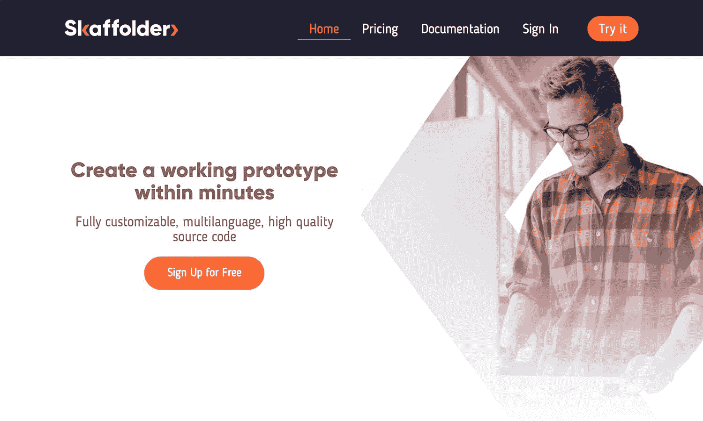
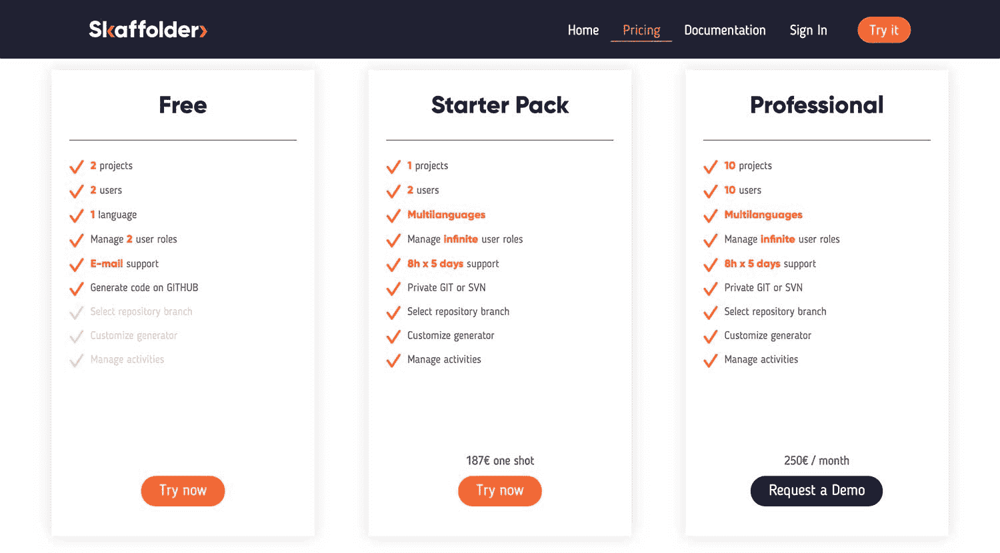

# 我如何自动化我的薪水工作，辞职，并开始我自己的创业

> 原文：<https://www.indiehackers.com/interview/how-i-automated-my-salary-job-quit-and-launched-my-own-startup-59061d9f08>

## 你好！你的背景是什么，你在做什么？

我是卢卡·卡杜奇，Skaffolder 公司的首席执行官。

我是一名网页开发人员。我和我的团队为像我们这样忍受大量工作和手腕疼痛(由于过多的键盘输入)的开发人员创建了一个工具。

Skaffolder 是一个 SaaS 平台，允许开发人员使用多种编程语言快速构建定制的 web 应用程序。从可视化建模开始，它允许你生成你需要的源代码。

我们的理想客户是软件公司和系统集成商，通过 Skaffolder，他们可以节省时间、资源和成本。

 

## 是什么促使你开始接触 Skaffolder？

我为一家大型意大利系统集成商工作了七年。每次我不得不开始一个新项目，我不得不重写我在以前的项目中写的相同的代码。所以我不得不复制和粘贴代码片段，并使它们适应新项目，浪费了大量时间来编写重构代码。

为了克服这个问题，我开始创建 [Skaffolder](https://www.skaffolder.com?coupon=indiehacker) 算法，以生成重复代码，避免重复，但仍然可以立即获得高质量的代码。

我用一些个人和企业项目验证了这种方法，后来我创建了第一个 Skaffolder 接口，显然是使用了 Skaffolder 生成器算法。也就是说 Skaffolder 是和 Skaffolder 一起造的！

我还为自己擅长的编程语言写了一些模板生成器，比如 NodeJS、Angular、PHP、Java。

得益于 [skaffolder-cli](https://www.npmjs.com/package/skaffolder-cli) ，现在每个 Skaffolder 用户都可以编写自己的模板生成器。

当时我有一份稳定的工作和经济状况，所以我决定辞职，建立一个团队，开始自己的创业。

## 构建最初的产品需要什么？

一开始，很难找到资金、时间和人员来打造产品和公司。

每天工作 8 小时，我几乎没有任何空闲时间。我花了很多个晚上在我的电脑前构建 MVP。

我是一名开发人员，不是一名商人，这意味着我必须掌握许多新技能。创建一个 SaaS 并不难，尤其是对于一个全栈开发者来说，但是创建一个公司就是另外一回事了。

所以我开始参加社交活动，建立关系，寻找关键人物来创建创始团队。

创建一个 SaaS 并不难，尤其是对于一个全栈开发者来说，但是创建一个公司就是另外一回事了。

TweetShare

经过一番努力，我找到了另外四个人，他们想和我一起开始新的冒险。我们瞄准了意大利顶级加速器 LuissEnLabs，在第一次未被选中后，我们在第二轮获得了资金。

有了这笔初始资金、良好的网络和工作空间，我们就可以开始了！

[https://www.youtube.com/embed/TszLnE2Kd1o](https://www.youtube.com/embed/TszLnE2Kd1o)

## 你是如何吸引用户和培养 Skaffolder 的？

我们通过直接联系开发人员、寻求反馈以及主持焦点小组和会议来开始验证。

我们推出了该平台的第一个 Alpha 版本，AdWords 中有 150 个€。这让我们获得了第一批 300 名用户，但他们不是很有特点，所以我们改进了我们的活动，并通过新的渠道获得用户，如技术活动和开发者社区。

后来，我们确定了一个更好的销售方案，并开始与软件公司和系统集成商等 IT 公司联系。我们通过电话推销、演示、安排演示和与客户一起开始试点项目来接触他们。

使用冷接触，您只有几秒钟的时间来解决客户的问题，并向他或她解释您将如何解决问题，否则您将失去这笔交易！

有了一个良好的人际关系网，开始工作会容易得多。这就是为什么我建议投入大量时间来建设它。

## 你的商业模式是什么，你是如何增加收入的？

我们通过向 IT 公司出售我们的平台来赚钱，让开发者免费使用。

我们意识到我们要解决的问题是一个关于时间和预算的问题。单个开发者感受不到这种痛苦，大公司感受得到。因此，我们刚刚加入 AWS Marketplace 和 Google Cloud Launcher，只需点击一下，我们就可以向公司销售我们的内部解决方案。

此外，账单由这些市场管理，因此销售我们的解决方案更容易。

我们还在自己的服务器上托管我们的软件，并将其出售给想要更便宜解决方案的小公司。

 

## 你未来的目标是什么？

我们的路线图上有很多目标要实现。

我们正在 AWS Lambda 上添加一个模板生成器来生成移动应用程序和一个无服务器后端层。

我们正在开发的另一个重要功能是在浏览器中运行代码的能力，同时让 web 应用程序启动并运行。为此，我们将把 Eclipse Che 集成到我们的平台中。

我们的下一个大步骤是将我们的业务转移到硅谷和开发者社区非常活跃的地方。我们刚刚开启了一轮筹款来达到这个目标。

## 如果你必须重新开始，你会做什么不同的事？

我犯的最大的错误是在业务之前建立产品。

作为一名开发人员，我喜欢编码。我开始在没有验证市场的情况下制造一个大产品。当我们意识到产品太大，一些功能给我们的销售解决方案增加了混乱，我们必须摆脱它们。

我们根据真实的用户反馈创造了一个更加垂直的产品。功能越少，价值越大！

我们根据真实的用户反馈创造了一个更加垂直的产品。功能越少，价值越大！

TweetShare

## 有没有发现什么特别有帮助或者有优势的？

当我把我的技能从技术调整到商业时，我读了很多关于沟通、关系、商业模式和战略的书。这些书让我，一个工程师，获得了我以前认为没有科学依据的技能——这是一个巨大的错误！

我学到的另一项基本技能是领导力。当只有你一个人编码时，做决定就容易了。但是管理一个 10 人的团队是非常不同的。你需要定义角色和职责，当然你还得依靠合适的人。

## 对于刚刚起步的独立黑客，你有什么建议？

我建议你们任何人都要相信:相信你自己，相信你的团队，相信那些想要帮助你的人。这是让你成功完成第二步的第一步:执行。

要快，要主动，要倾听你的用户——他们是唯一知道他们想为什么付费的人。理解这一点后，你就能提供他们想要的东西，然后你就能比你的竞争对手做得更好！

## 我们可以去哪里了解更多？

为了更好地了解 Skaffolder 的工作原理，您只需尝试一下。对开发者来说是免费的。

你可以通过[这个链接](https://www.skaffolder.com?coupon=indiehacker)在我们的网站上注册，并免费获得一份专业计划，这要感谢独立黑客的推荐。

我们渴望听到你对我与你分享的一切的反馈。您可以通过我们的[社交账户](https://twitter.com/Skaffolder)或 [Slack 社区](https://join.slack.com/t/skaffoldercommunity/shared_invite/enQtMzcwMjIwNjA4NzM4LTE5YTk4ZDhjNTUyYzVmMWM3MDc0OWRjZDlhZDVjN2ZjZTk0M2EyMGEwNzAyNGVjMTQxM2ViYmUzYzE4ZGE5NWU)联系我们，并与我们分享您的想法。

你也可以[免费试用 ska ffolder now](https://www.skaffolder.com?coupon=indiehacker)。

—[<picture id="ember8163615" class="user-avatar ember-view user-link__avatar"></picture>卢卡·卡杜奇](/Skaffolder?id=lyXykvzNoIOFmBmuuVfzyAORrUF2)【ska ffolder】创始人

## 想像 Skaffolder 一样建立自己的事业？

你应该加入[独立黑客社区](/)！🤗

我们是几千名创始人，互相帮助建立有利可图的业务和副业。来分享你正在做的事情，并从你的同事那里获得反馈。

还没准备好开始使用你的产品吗？没问题。这个社区是一个认识人、学习和实践的好地方。随便去[随便浏览](/)！

——[<picture id="ember8163620" class="user-avatar ember-view user-link__avatar"></picture>考特兰艾伦](/csallen?id=ibTLPyjwVebnZjMGKvz6ztarnuV2)，独立黑客创始人

27votes