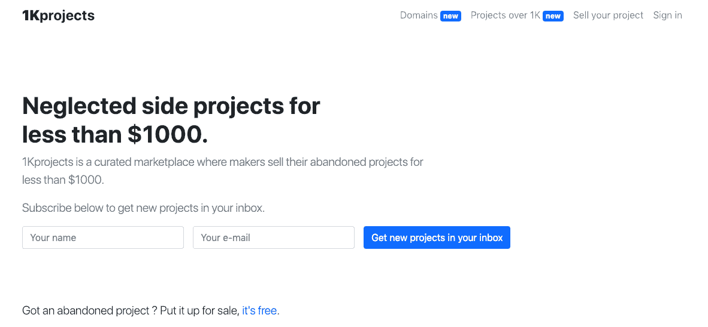
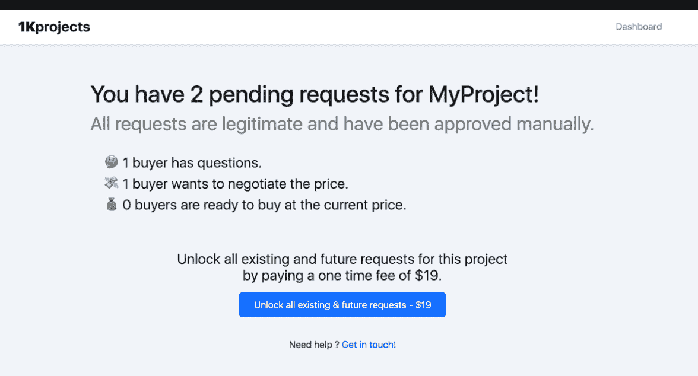

# 我是如何用一个每月 800 美元的副业项目击败“创客瘫痪”的

> 原文：<https://www.indiehackers.com/interview/how-i-beat-maker-paralysis-with-an-800-mo-side-project-075af15c98>

## 你好！你的背景是什么，你在做什么？

你好独立黑客！我叫奥斯曼，是一名全职独立制作人，目前在摩洛哥。

在过去的四年里，我一直是自由职业者，主要是制造新产品，并努力发展那些有前景的产品。有一次，我厌倦了把我所有的精力放在产品生命周期的构建部分，只是到了营销的时候才筋疲力尽。我记得我经常经历这种情况，并对自己说，如果我能买下别人的项目，并把我所有的精力和动力集中在获得客户上，那该有多好。

可悲的是，通过像 [Flippa](https://blog.flippa.com/) 这样的主流市场销售的项目质量不够好，而其他项目市场的价格非常高，收入很低或没有收入。这让我发起了 [1Kprojects](https://1kprojects.com/) ，这是一个被忽视的副业项目和 1000 美元以下领域的市场。

今天，它列出了 500 多个项目，售出了 100 个项目，平均每月收入 800 美元。

 

## 是什么促使你开始 1k 项目？

1Kprojects 是我称之为[的船疗法挑战](https://othmane.io/writing/ship_therapy_maker_paralysis_week_0)的挑战的一部分，我必须每两周公开发布一个新项目。在接受挑战之前，我经历了一段很长的低迷期，我不能发布任何东西，我在那段时间里构建或编写的所有东西都放在我的硬盘上。挑战的假设是，通过公开承诺，我将被迫运送一些东西，并克服“制造者瘫痪”，对我来说，这就像是制造者的写作障碍。

无论你在努力做什么，都要在公共场合做。

TweetShare

我花了第一个星期疯狂地勾画想法，然后扔掉它们。但由于最后期限越来越近，在第一周结束时，我选择了我勾画的最后一个想法:一个购买廉价副业的地方。我没有时间做任何形式的验证或客户采访，但我在 IH 和 Reddit 上做了一些研究，发现一些人试图出售他们的副业项目，还有一些人抱怨一些现有市场的高价。

## 构建最初的产品需要什么？

我只有一周的时间来完成整个项目，所以我把其他事情都搁置了，整个星期都专注于这个想法。

我用 Laravel 做后端，用 Bootstrap 4 做前端，还有一些 jQuery。因为它应该是一个市场，MVP 的特性非常简单，所以我不必花时间争论范围。

总的来说，建立一个有效的 MVP 花了五天时间，我花了整个周末试图找出一个商业模式并整合支付。

 

## 你是如何吸引用户并发展 1k 项目的？

起初，没有项目出售。为了吸引第一批卖家，我决定在 IH 和 Reddit 的/r/sideproject 上做一次预发布，并在挑战赛宣布后给订阅我博客的人发了一封电子邮件。

老实说，我并没有抱太大的期望——我只是很高兴我在截止日期前发货了。我记得我写了一个里程碑列表，第一个是增加五个项目，这样我就可以开始寻找产品了。

在短短几个小时内，超过 20 个卖家注册，超过一半的卖家添加了他们的待售项目，大约 100 人注册了简讯，以便获得新项目的通知。接下来的一天会有更多的卖家和买家注册，这个帖子最终在 IH 和 Reddit 上都排在了每周列表的首位。第二天，我有了足够的反馈、时事通讯订阅者和待售项目，可以开始寻找产品了。我在格林威治时间早上 7:00 醒来，这样我可以早点提交。

我给我个人列表和 1Kproject 列表中的每个人都发了邮件，告诉他们产品搜索的发布情况，并在 Twitter 上分享了这些信息。1Kprojects 最终以超过 1000 次的投票获得了当天的第一名产品，并最终获得了本周的第三名产品。

下面是 11 月 2 日和 3 日电子邮件列表预发布和 IH 和 Reddit 预发布的发布流量数据，以及 11 月 4 日的产品搜索发布。

| 一天 | 访问者 |
| --- | --- |
| 2018 年 11 月 2 日 | 58 |
| 2018 年 11 月 3 日 | 3859 |
| 2018 年 11 月 4 日 | 6240 |
| 2018 年 11 月 5 日 | 4175 |
| 2018 年 11 月 6 日 | 1700 |

到 11 月 7 日，尘埃落定，我们的发布统计如下:

*   1，500 多人订阅了时事通讯
*   超过 170 个卖家注册了
*   增加了 94 个项目
*   发送了 263 份报价
*   21 销售，这相当于约 400 美元的收入

发布后，我通过在 Twitter 上分享新功能来保持这种吸引力，我[在博客](https://othmane.io/writing/zero_to_top_producthunt)上写了一篇文章，详细介绍了周末的发布，我也在我的媒体账户上分享了这篇文章。

## 你的商业模式是什么，你是如何增加收入的？

商业模式可能是我最纠结的问题。虽然对于一个市场来说，有一个基于佣金的模式应该是非常简单的，只有当销售完成时我才能得到报酬，但由于我的位置，我不能这样做。我无法访问 Stripe 或任何支付网关，因此基本上只能在交易中充当中间人。

另一个流行的选择是向卖家收取上市费来出售他们的项目。但是作为一个像我的客户一样忽视项目的制造者，我知道我不会有足够的动力支付低于 1000 美元的费用来出售我的副业项目。我最有可能只是把它保存在我的硬盘上，或者把它添加到我的文件夹中，而不是经历这些麻烦。

所以我选择了一种不常见的模式，但如果我是卖家，我会很乐意接受这种模式:卖家可以免费提交他们的项目，但他们必须一次性支付 19 美元，才能解锁出价买家的信息和联系人。你只需为每个项目支付一次费用，就可以看到买家所有现有和未来的报价。

不是每个人都喜欢它——我收到了一些卖家发来的愤怒的电子邮件，说他们永远不会支付费用。但大多数人对此没有异议。我尽最大努力和愤怒的卖家对话，想办法解决。

这个特殊的卖家群体感觉他们是在不太了解信息内容的情况下被诱骗付款的。这是有道理的，因为最初我隐藏了报价的文本，直到费用被支付。所以我做的第一个改变是要求买家说明他们的意图，这意味着他们必须告诉卖家他们是否有问题，想要谈判，或者准备购买。在后台，我向卖家展示了我的意图:

 

我还想增加更多的透明度，以确保卖家确切知道他们将支付什么，所以我添加了他们收到的每条消息的预览。它看起来像这样:

 

除了一个卖家之外，所有最初说他们不会支付费用的卖家最终都支付了费用，并且他们都对结果感到满意。最终，我不再隐瞒报价的内容。

如果我没有在发布后的第一天整天给卖家发邮件，真诚地试图了解他们遇到的问题，这一切都不可能发生。其他用户也建议了一些很酷的功能，比如主页上的过滤和在网站底部出售的项目，我最终实现了这些功能。

在发布后的第二个月，我改变了定价，以考虑项目的价格:

*   价格低于 100 美元的项目可以通过支付 9 美元的费用解锁。
*   价格低于 300 美元的项目可以通过支付 19 美元的费用解锁。
*   价格低于 600 美元的项目可以通过支付 39 美元的费用来解锁。
*   价格低于 1000 美元的项目可以通过支付 49 美元的费用来解锁。

我还为卖家增加了一种方法，通过支付 19 美元的费用，在主页上 24 小时推广他们的项目。随着时间的推移，每天提交的项目数量下降，收入数字也随之下降。

| 月 | 收入 |
| --- | --- |
| 18 年 11 月 | 974 |
| 2018 年 12 月 | 530 |
| 19 年 1 月 | 500 |
| 2019 年 2 月 | 520 |

## 你未来的目标是什么？

最近，1Kprojects 被一个很棒的团队收购了，虽然我将不再参与这个项目，但我相信它有一个光明而令人兴奋的未来。

对我来说，我正在回到制造和运输更多的产品上来。具体来说，我希望在一个项目上投入比以前项目更长的时间。我的计划是用一些咨询来补充我现有的收入，这样我就可以无限期地尝试不同的想法，直到有东西坚持下来。

## 你面临的最大挑战和克服的障碍是什么？如果你必须重新开始，你会做什么不同的事？

如果有什么事让我后悔的话，那就是没有早点接受挑战。我面临的最大障碍是我的“制造者瘫痪”,无法创造或运输。这种痛苦的感觉很快变成了自我怀疑和抑郁。这对生意不好，但也影响了我生活的其他方面。接受挑战并最终发布 1k 项目是一件幸事，让我在短短几周内就克服了心理障碍。

能分享多少就分享多少，能分享就分享。

TweetShare

如果说过去几个月我学到了什么有价值的东西，那就是无论你在努力做什么，都要在公共场合做。克服公共场合的挑战所带来的责任感和支持能帮助你更快地到达你想去的地方，而不仅仅是靠自己。

## 有没有发现什么特别有帮助或者有优势的？

在过去的几个月里，Twitter 帮了大忙。许多人在听说我与航运的斗争后伸出援手，我结交了一群新朋友，他们总是有宝贵的建议和想法可以分享。IH 社区也帮助获得了早期的牵引力，并在第一个月给出了巨大的反馈。

在个人层面上，詹姆斯·克利尔的《原子习惯》帮助我找到了如何用好习惯取代坏习惯的方法，并建立了一个每天都在改进的系统。

## 对于刚刚起步的独立黑客，你有什么建议？

尽管我仍在摸索，但这些年来，一些感悟不断涌现:

*   只开始那些你愿意在接下来的几年里做的项目。
*   能分享多少就分享多少，能分享就分享。
*   只要有可能，就在公共场合做任何事情。
*   出货要快，你不可能真的预测到出货后会发生什么，除非你真的预测到了。

## 我们可以去哪里了解更多？

你可以在[推特](https://twitter.com/get_eo)上跟进 1k 个项目。

对于我来说，我目前在公共场合做任何事情，从学习到建筑到运输。你可以在[我的博客](https://othmane.io)和推特 [@get_eo](https://twitter.com/get_eo) 上关注我的旅程。

感谢您的反馈，如果您有任何问题，我很乐意倾听！把那些留在下面。感谢您的阅读。

—[<picture id="ember5331679" class="user-avatar ember-view user-link__avatar"></picture>奥斯曼](/EO?id=aW72cKGwcWWLmE9O6mNZUNh4Lug1)，1kProjects 创始人

## 想像 1kProjects 一样自己创业？

你应该加入独立黑客社区！🤗

我们是几千名创始人，互相帮助建立有利可图的业务和副业。来分享你正在做的事情，并从你的同事那里获得反馈。

还没准备好开始使用你的产品吗？没问题。这个社区是一个认识人、学习和实践的好地方。随意[随便浏览](/)！

——[<picture id="ember5331684" class="user-avatar ember-view user-link__avatar"></picture>柯特兰艾伦](/csallen?id=ibTLPyjwVebnZjMGKvz6ztarnuV2)，独立黑客创始人

53votes