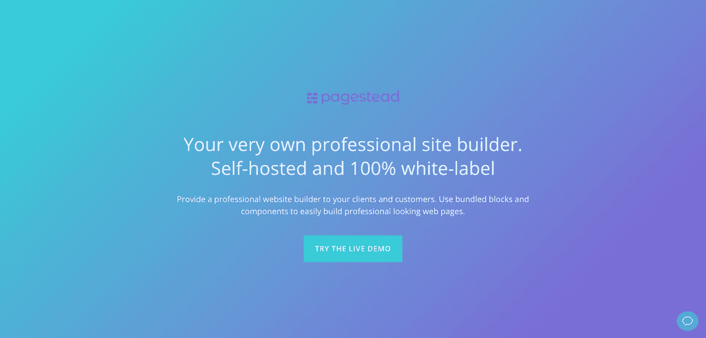
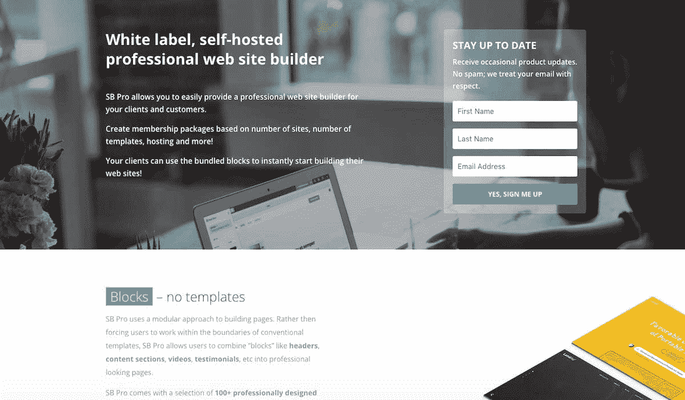
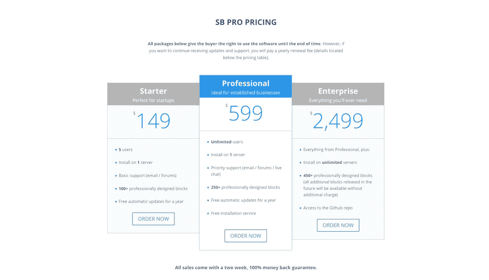

# 我如何使一个网站建设者每月收入达到 6000 美元

> 原文：<https://www.indiehackers.com/interview/how-i-bootstrapped-a-site-builder-to-6-000-in-monthly-revenue-bd9c0f4f54>

## 你好！你的背景是什么，你在做什么？

我的名字是 Mattijs Naus(我通常用“马特”)。我是一个 34 岁的荷兰人，在过去的 13 年里我一直住在泰国。我 20 出头的时候搬到了泰国，觉得这是个好地方，于是就留了下来。当我还住在荷兰的时候，我花了一些时间学习计算机科学并攻读 MBA 学位(不过当我搬到泰国时，我从大学退学了)。我在 12 岁的时候写了我的第一个代码，从那以后我一直在编程和构建东西。

我目前拥有并运营一家名为 Chilly Orange 的软件公司，我们的旗舰产品叫做 [Pagestead](https://pagestead.com/) (原名 SB Pro 我们在 2018 年 1 月对产品进行了更名)。这是一个自我托管，全白标签的 DIY 网站建设者。把它想象成你自己的 Wix、Weebly 或 Squarespace。成为自托管平台意味着我们的客户购买软件，下载源代码副本，并将其安装在自己的基础设施上。

由于它是一个白标平台，通常我们的客户会将他们自己的品牌应用到它上面，并作为他们自己的产品来销售。它主要由专注于网页设计、网页开发和营销的中小型数字机构使用，但也由世界各地的托管公司、互联网营销商和企业家使用。

像 Wix 和 Squarespace 这样的 DIY 网站建设者越来越普遍，我们的客户已经注意到了这种增长的需求。他们不想让客户流失到现有的平台，但他们也认识到开发自己的平台是多么昂贵和耗时。Pagestead 为他们处理这项服务。

 

在 2017 年 5 月推出后，我在 2017 年的收入刚刚超过 5 万美元，大约每月 5500 美元。自推出以来，我们的客户群已经发展到 140 家。

## 是什么促使你开始使用 Pagestead？

当前版本的 [Pagestead](https://pagestead.com/) 是我几年前开发的一个略有不同的产品的迭代。这一切都是从我制作的一个产品开始的，目的是在 Envato 的 CodeCanyon 网站上销售。就在那时，像 Wix 和 Squarespace 这样的 DIY 网站建立者开始流行起来。我以前在 ThemeForest 上卖过产品，我的想法是，在这个平台上卖 HTML 模板的人可能喜欢将他们的模板与一个简单的工具集成在一起，这个工具允许客户拖放诸如标题、内容块、联系表单、功能部分等部分。，快速方便地修改他们的页面。

所以我开发了这样一个工具，并开始在 CodeCanyon 上提供。我特别提到该产品对 theforestauthors 有用，相当多的 HTML 模板作者最终购买了许可证，并开始向构建器提供他们的 HTML 模板。

除了 HTML 模板作者，我们很快发现 web 开发人员、托管公司和其他小型企业对灵活的自托管网站构建器感兴趣。这促使我继续将这个脚本开发成一个适当的自托管 web 应用程序。所以几个月后，我在 CodeCanyon 上发布了一款名为“SiteBuilder Lite”的产品。在接下来的几年里，我继续开发和支持这个产品。从那以后，我在 CodeCanyon 上推出的网站建设者产品让我净赚了将近 80，000 美元。

这个产品的最新版本 Pagestead 是我开始在 Envato 环境之外销售的第一个产品。之前的所有版本都是通过 CodeCanyon 销售的。

我通过从第一天开始就有实际的付费用户来验证这个想法。恩瓦托在这方面帮了大忙。由于从一开始就有付费客户，我可以很早就开始收集用户反馈。我能够了解我的早期客户和潜在客户在寻找什么，他们愿意支付多少钱，等等。

此外，当我们开发当前版本的 Pagestead 时，我们开始接受预购。预购页面提到了我们计划推出的功能，事实上，相当多的人最终都进行了预购，这表明我们正在朝着正确的方向前进。

在我开始制作产品之前，我做了几年的合同工作，并在欧洲和美国的数字机构工作了相当一段时间。这让我很好地理解了典型的代理商是如何工作的，以及他们是如何做出购买决定的。

预购页面提到了我们计划推出的功能，事实上，相当多的人最终都进行了预购，这表明我们正在朝着正确的方向前进。

TweetShare

此外，我自己也经营过一段时间的代理公司，这加深了我对行业以及他们所面临的与我们产品相关的问题的理解。由于迄今为止我们的大多数客户都是数字机构，我多年来收集的见解对理解我们的客户非常有帮助。

当我为 CodeCanyon 创建第一个页面生成器时，我已经在 CodeCanyon 上销售一些其他产品了。如果我没记错的话，我从这些产品中每个月大概赚了 1000 美元。此外，我还在做合同工作。我估计我每月的总收入大约是 2，000 到 3，000 美元。一旦我推出额外的产品，我的月收入开始上升。

我从承包工作和我的 Envato 投资组合中赚到的钱足以让我放心大胆地在 Envato 生态系统之外销售我们的下一个产品。我最终投入到第一版 modern Pagestead 的现金投资大约是 10，000 美元。

## 构建最初的产品需要什么？

现代版的第一版花了大约 18 个月才完成。然而，在这 18 个月里，我们并没有全职做这个产品。我估计，当我们发布 Pagestead v1 时，我们已经花了大约 1000 个小时来编码它，这还没有考虑到构建 Pagestead 所基于的页面生成器的早期版本所花费的时间。

在 Pagestead 上开始开发之前，我们开始接受预购，并根据客户反馈(来自我们以前的产品)决定初始功能集。

在此期间，我在洛杉矶的一家公司做合同工作，晚上和周末在 Pagestead 工作。这绝对是一个充满挑战的时期。我记得有很多天我都在思考是否要继续下去，以及我们是否能够完成它。我知道我们手上有一笔潜在的好生意，因为预购订单会定期到来，客户会主动询问我们最终何时发布。

然而，我们的进展太慢了，令人不安。我们不得不不断推迟发布日期，导致预购客户沮丧。我记得有几次想拔掉插头。

由于 Pagestead 是一个自托管的 web 应用程序，所以让买家尽可能容易地在他们的服务器上安装该软件非常重要。为此，我们决定使用流行的 CodeIgniter PHP 框架作为应用程序的后端。

我个人并不热衷于任何流行的 JavaScript 框架。这一点，再加上我希望使用我们以前的站点构建器产品的前端作为起点，导致我使用常规的普通 JavaScript 作为应用程序的前端和页面构建器部分。前端代码是使用 CommonJS 模块构建的，我们使用 Webpack 来构建和生成我们的前端代码。

两位开发人员帮助开发了 Pagestead，他们至今仍参与其中。没有他们，创建产品将会花费很长时间(假设我能够完成它)。此外，我们从现有客户和潜在新客户那里获得了很多帮助，他们为我们提供了源源不断的有用反馈。

## 你是如何吸引用户和发展 Pagestead 的？

我们于 2017 年 5 月 31 日正式向公众推出了 [Pagestead](https://pagestead.com/) 。那时，我们已经接受了整整一年的预购，并且能够处理超过 30，000 美元的预购收入。

我们预购页面的大部分流量都来自于我们现有产品的推荐。除了偶尔向我们的邮件列表发送电子邮件之外，我们在推出之前没有做太多的营销工作。(我们名单上的大多数人都是以前购买过我们一种或多种产品的客户。)当我们实际推出第一个版本时，只通知了我们的邮件列表；我们没有提交给黑客新闻，产品搜索，或任何其他网站。

我们的预购页面非常简单，使用了 Divi Wordpress 主题，解释了主要功能，一两张应用程序截图，以及一些我们与应用程序捆绑在一起的模块示例。

下面是我们在构建实际产品时用于预购的登录页面:

 

在我们发布后的最初几个月，大多数潜在客户和客户都是由我们的邮件列表和现有产品驱动的(我们在几个网站上推广 Pagestead 的其他产品)。推出后，我开始花更多的时间在内容制作和内容营销上，这导致越来越多的业务来自谷歌和其他搜索引擎。

这是我们正式发布后几个月的流量情况:

| 月 | 会议 |
| --- | --- |
| 六月 | 2237 |
| 七月 | 2611 |
| 八月 | 3681 |
| 九月 | 4076 |
| 十月 | 4237 |
| 十一月 | 4371 |
| 十二月 | 3667 |

对我们来说非常有用的是之前在 Envato 的 CodeCanyon 网站上发布了受欢迎的类似产品。我们的其他几个产品类似于 Pagestead，但功能更少，它们推动了 Pagestead 的大量流量和销售。它只是建立在以前成功的产品之上。

目前，我们专注于利用自己的博客进行内容营销。这无疑给了我们的网站流量一个很大的提升。然而，我无法确定我们从搜索引擎流量中获得了多少线索和转化。

最初，我们开始每周发表两篇长文(每篇 1000 至 1250 字)，但我很快开始努力寻找新的话题，并找到合适的作家来撰写文章。我尝试过使用 Upwork 和其他自由网站的自由撰稿人。这是漫无目的的，我无法与优秀的作家建立长期的关系。我最终使用了 CrowdContent，我对这项工作相当满意。如果你继续使用新的作家(你以前还没有用过的作家)，你仍然冒着对最终作品失望的风险。然而，一旦你找到了好的作家，你可以直接把未来的任务交给他们，这很好。我目前支付每篇文章 100 至 150 美元。

做好内容营销的最大问题是你必须长期坚持——我认为至少一年，最好更长。当一周发布两次时，你会很快浏览完你的内容主题列表。这是我至今仍在纠结的事情。

我计划在未来开始尝试付费流量(谷歌和脸书广告)，我也在探索合作的可能性。然而，就目前而言，我们的邮件列表、现有产品和搜索引擎流量在增加我们的收入方面做得足够好，直到我们达到产品市场契合度，我们准备开始更多地投资探索不同的营销渠道。

通过在现有的市场上发布小产品，我能够开始建立自己的受众，并利用现有的受众。

TweetShare

我对希望发展业务的创业者的建议是，研究一下罗布·沃林(Rob Walling)的[阶梯创业法](https://www.softwarebyrob.com/2015/03/26/the-stairstep-approach-to-bootstrapping/)。当时我并不知道这种方法(大约两年前，我才第一次看到 Rob 的博客帖子)，我完全遵循了这种方法。这个想法是采取小步骤来发展你的业务。通过在现有的市场上发布小产品，我能够开始建立自己的受众，并利用现有的受众。正是这些观众给了佩吉斯特德最初的吹嘘。

向现有受众发布你的第一个产品(无论是通过市场、别人的博客还是邮件列表)将会省去你在发布之前构建自己的产品的努力和麻烦。

合作伙伴关系是另一个寻找现有受众来推出产品的好选择。为你的产品寻找市场和受众，并找出最简单快捷的方式来接触这些受众。如果你像我一样是一个产品人员/程序员，这几乎总是意味着走出你的舒适区，与人交谈。

## 你的商业模式是什么，你是如何增加收入的？

在我们目前的业务模式中，我们以三种不同的价格等级出售软件的终身许可证:初级版(149 美元)、专业版(599 美元)和企业版(2499 美元)。此外，我们使用年度订阅来获取支持和更新。第一年的支持和更新包含在初始许可费用中。如果客户希望继续接收更新并获得支持，他们将需要支付年度续订费。

 

正如我之前提到的，我们在开发产品的时候就开始预购了(比标价低 20%)。对于每个预订单，我们会收集信用卡的详细信息，以及在我们推出产品时对这些信用卡收费的许可。(Gumroad 让这一切变得非常简单。)所以，当我们真的推出时，我们立刻筹集了一大笔钱——足够支付接下来几个月的产品开发和业务增长。

当我们准备开始接受预购时，我们寻找最简单的方式来收取付款和分发我们的代码，我们最终选择了 Gumroad。尽管 Gumroad 是一个很好的解决方案(我们仍然经常向刚刚起步的企业家朋友推荐)，但我们现在开始感觉到需要更多的灵活性和控制力。因此，我们将在 2018 年的某个时候开始过渡到我们自己的解决方案。

目前，该公司的月收入约为 5500 美元。当我们在 9 月推出最高定价层时，我们的收入出现了大幅增长。接近年底时，事情有所放缓(因为假期期间业务往往会放缓)。除了工资，我们的运营成本仍然很低。由于我们自己不运行 SaaS，我们的服务器成本相当低。我们目前每月在运营成本上花费大约 300 美元(主要是我们使用的一系列 SaaS 应用程序，外加一台专用服务器)。

| 月 | 收入 |
| --- | --- |
| 七月 | 5261 |
| 八月 | 5924 |
| 九月 | 14572 |
| 十月 | 9459 |
| 十一月 | 3737 |
| 十二月 | 2993 |

## 你未来的目标是什么？

就产品本身而言，我们还有大量的功能尚未实现。本月早些时候，我们发布了一篇博客文章,提到了其中一些。

对于企业来说，今年的目标是每月收入至少达到 10，000 美元，并努力在总收入中占据更大的份额。这一切都归结为让企业达到长期可持续发展的水平，这意味着我们都可以拿一份体面的薪水，并剩下一些钱来重新投资企业。

为了实现这一目标，目前的首要任务是实现产品与市场的契合。我对产品实现这一目标的方向有一个非常清晰的描述，所以这只是一个进入状态并朝着这个愿景前进的问题。在我们努力实现产品与市场匹配的同时，我们将开始探索额外的营销渠道，并对这些渠道进行试验，以找出我们如何开启下一个增长高潮，以及一旦我们实现产品与市场匹配，我们将在哪里投资营销资金。

营销本身已经并将继续成为一个障碍，尽管我在这方面投入了更多的时间。这并不是说它太难了——实际上并没有那么难；和大多数事情一样，常识能让你走得更远——或者说，我不喜欢营销本身。只是对我来说，确保我腾出时间去做这件事仍然很难。(也就是说，我以前确实讨厌它，可能是因为我本质上是个程序员，对营销一窍不通。)

## 你面临的最大挑战和克服的障碍是什么？如果你必须重新开始，你会做什么不同的事？

在处理页面时，我犯了一些错误。然而，我应该指出，正如经常发生的“错误”一样，事后才发现它们是错误。我主要指的是选择关注业务的哪些部分。

例如，我们花了大量的时间和金钱为 Pagestead 开发模板，但我们实际上从未使用过。(事实证明，这在当时完全实施起来成本太高、耗时太长。)事后来看，这些时间和金钱本应该更好地用于尝试营销或添加高度受欢迎的功能。这是一个例子，但还有很多。回首往事，我们总是很容易说:“嘿，我早该知道的。”然而，我不会纠结于此，甚至不会花时间去想它。我只是简单地考虑是否有任何真正明显的教训可以吸取(在我看来，这种情况并不常见)，然后继续前进。

在产品/技术方面，我们一直在处理的一个主要障碍是软件更新过程的自动化。事实证明，这比我们最初想象的要复杂得多。也就是说，我们知道这是我们需要的一个功能，所以自从我们去年推出以来，我们一直在努力改进处理这部分业务的代码。

这种复杂性源于我们需要将更新自动分发到大量的服务器上。这本身没什么大不了的，但是我们的一些更新的规模和客户使用的不同服务器配置增加了复杂性。

当你考虑到我们也将主题(块)与我们的软件捆绑在一起时，又增加了一层复杂性。举一个例子:当我们对模板进行更改时，我们必须确保这些完全相同的更改也应用到以前用该软件创建的页面，这意味着我们需要对客户数据库中的数据进行更改。不用说，我们已经为此头疼了好几次。

 

正如我之前提到的，做营销对我来说是一件大事。和许多其他独立黑客一样，我本质上是一个程序员/产品人员，做市场营销对我来说并不容易，也不容易。然而，我们只需要接受这样一个事实:营销是建立和发展企业的一部分。如果你不愿意克服对这些事情的厌恶，你需要重新考虑创业。正如我之前指出的，它远没有我们许多人想象的那么困难或复杂。一旦你开始进入它，你很快就会意识到它大多是简单的，常识性的东西。但这是你需要花时间去做的事情。

成为或者努力成为一名经理对我来说也是一个障碍。当我独自开发一个产品的时候，我最得心应手，不受干扰。在我的职业生涯中，我曾几次处于不得不管理人的位置，我一直认为这有点拖累人。当有人需要我的时候，我需要让自己有空，接受这个事实对我来说是一大步。

然而，我也将此视为创业的一部分。如果你到了需要别人来完成任务的地步，你就需要确保进入那个管理角色并接受它。

最后，作为一名独立创始人，生理上的挑战确实会时不时地让他们付出代价。创办一家公司或企业真的会非常孤独。这绝对是我仍在努力解决的问题，尤其是当它与远程分布式团队的工作相结合时。

此外，我住在泰国南部，在那里很难找到志同道合的技术创始人。我通过尽可能会见其他企业家、冥想、锻炼和保持健康来克服这一点。我也仍然在寻找一个合适的策划小组，但还没有找到。

## 有没有发现什么特别有帮助或者有优势的？

我读了很多书，这让我很难找到对我有帮助的书。我认为它更像是你所消费的所有内容、信息和提示的组合，帮助你前进。我最近刚刚读完蒂姆·费里斯的新书(导师部落)，书中充满了世界上一些最伟大的成就者的智慧。

我也从 Rob Walling 和 Mike Taber 的《为我们其余的人创业》播客中受益匪浅。Rob 和 Mike 在他们的播客上做得很棒(看起来已经持续很久了)。他们还每年组织两次名为“MicroConf”的会议(一次在美国，一次在欧洲)。两年前我参加了欧洲版，玩得很开心。如果情况允许，我一定会再参加。参加这个会议的人大多是白手起家的创业者(通常是单身创业者)，所以这正合我的胃口。和志趣相投的人在一起呆几天，发现其他人已经处理或正在处理和你一样的问题，这真是太棒了。

独立黑客等社区网站也是如此。我是播客的忠实粉丝。这甚至不一定是关于学习的东西(虽然我确实从听这些播客中学到了很多，很明显)。每当我墨守成规、感到停滞不前、没有安全感或没有动力时，只要听听人们谈论创业，就足以重燃激情，让我继续前进。

运气、时机、天时地利，无论你怎么称呼它，都是我们取得成功的主要因素。老实说，我仍然觉得我对自己正在做的事情知之甚少，并且经常感觉我在不知何故地蹒跚向上(如果这有任何意义的话？).我从未真正坐下来计划建立我今天的事业。事情就这么发生了，不知何故，感觉“运气”比技能、知识、关系等等起着更大的作用。，做。

举个例子，在 CodeCanyon 上发布产品时，我非常幸运地把握住了时机。在我创业的日子里，竞争并不激烈，网站建设者也刚刚开始流行起来。如果我今天做完全相同的事情，我相当肯定它不会起作用(或者远不如几年前)。有很多类似的场景，通常很小，但并非无关紧要。而当我回过头来看时，我不禁想:“该死，我们在那里很幸运。这很可能会变得非常不同。”

运气、时机、天时地利，无论你怎么称呼它，都是我们取得成功的主要因素。

TweetShare

另一个巨大的推动力是学会相信“直觉”或“内心的声音”。这是一件棘手的事情，因为你显然不想最终对进入你头脑的每一个无用的想法采取行动。你想要注意的是不同于你头脑中典型的、日常的“噪音”,能够分辨出这种差异是巨大的！

冥想，或者练习觉知在这里可能会有帮助，因为当我头脑清晰并且暂时关闭了常规的精神噪音时，有用的想法通常会出现(或者至少对我来说是这样)。对我来说，这通常是在早上，在我晨间冥想之后，在我每天跑步的时候，或者当我出去遛狗的时候。众所周知，你的潜意识会接收并处理大量的输入，我相信当你能够关闭噪音时，你就给了你的潜意识空间来使用这些处理过的数据来形成想法，这对你目前正在处理或挣扎的事情非常有用。

事实证明，拥有以下一些技能对我很有帮助:

*   能够保持开放的心态
*   不喜欢权威(创业的巨大动力)
*   固执(对我来说，这意味着需要验证自己的假设，而不仅仅是简单地接受事实)
*   懒惰(作为效率的驱动力，而不是“无法做好一天的工作”)

## 对于刚刚起步的独立黑客，你有什么建议？

*   问问你自己，你是否真的对创业感兴趣，而不仅仅是创造一个产品。当你开始创业时，你应该绝对确保你意识到这样一个事实，那就是创业不仅仅是简单地生产你的产品。你对与客户交谈、做市场营销、做广告、做支持、处理行政工作、记录流程、编写操作手册、可能雇用和管理员工等想法“满意”吗？？如果你是为了建立一个企业而不是仅仅编码一些很酷的东西，你会有更好的成功机会。
*   如果你是一名独立黑客，没有观众，没有追随者，或者没有任何你可以向其推销的人，考虑利用现有的观众(比如使用市场，客座博客，合资交易等。)而不是去操心怎么增长你的受众。建立一个足够重要的受众群体来进行营销需要很长很长的时间。
*   "赢和输的区别通常在于不放弃."——华特·迪士尼。我喜欢这句话。对我来说，这是一个很好的提醒，事情需要时间(尽管流行媒体会让你相信巨大的一夜成功是正常的，而不是例外)，只要坚持下去，不放弃，你就可以大大增加成功的机会。玩长线游戏。如果你愿意长期致力于某事，致力于改善你业务的所有运转部分(不仅仅是产品)，定期评估你正在做的事情，运用常识，不要放弃。
*   小心接受建议(包括我的！).所有的建议，即使是最好的意图，都来自于给出建议的人的具体经历，并且应该总是，最初，带着健康的怀疑态度对待。即使你一次又一次地听到同样的建议，也不一定意味着它适用于你的情况或者对你有用。
*   当处理令人讨厌、沮丧或愤怒的客户时，后退一步，意识到在大多数情况下，他们是情绪化的，因为他们关心你的产品。如果他们不在乎，他们就不会为此如此激动。从这个角度来看，想想有人关心你在做什么是多么棒的事情。
*   采取冥想的常规，即使每天只有五分钟。我还没有遇到一个没有从冥想中受益的人。(注意:你会希望确保这成为一种惯例；仅仅沉思一两次不可能对你有什么大的帮助。)

## 我们可以去哪里了解更多？

Pagestead 的主站点位于 https://pagestead.com/的。你可以在[推特](https://twitter.com/chillyorange)上关注我。

如果你对采访、Pagestead 本身或来自泰国的独立黑客有任何问题，请在下面的评论区留下。

——[<picture id="ember8063218" class="user-avatar ember-view user-link__avatar"></picture>马特瑙斯](/chillyorange?id=WLSJijug4JhxX8ZXtm0r3jF9An12)，Pagestead 创始人

## 想像 Pagestead 一样建立自己的事业？

你应该加入独立黑客社区！🤗

我们是几千名创始人，互相帮助建立有利可图的业务和副业。来分享你正在做的事情，并从你的同事那里获得反馈。

还没准备好开始使用你的产品吗？没问题。这个社区是一个认识人、学习和实践的好地方。随意[随便浏览](/)！

——[<picture id="ember8063223" class="user-avatar ember-view user-link__avatar"></picture>柯特兰艾伦](/csallen?id=ibTLPyjwVebnZjMGKvz6ztarnuV2)，独立黑客创始人

51votes