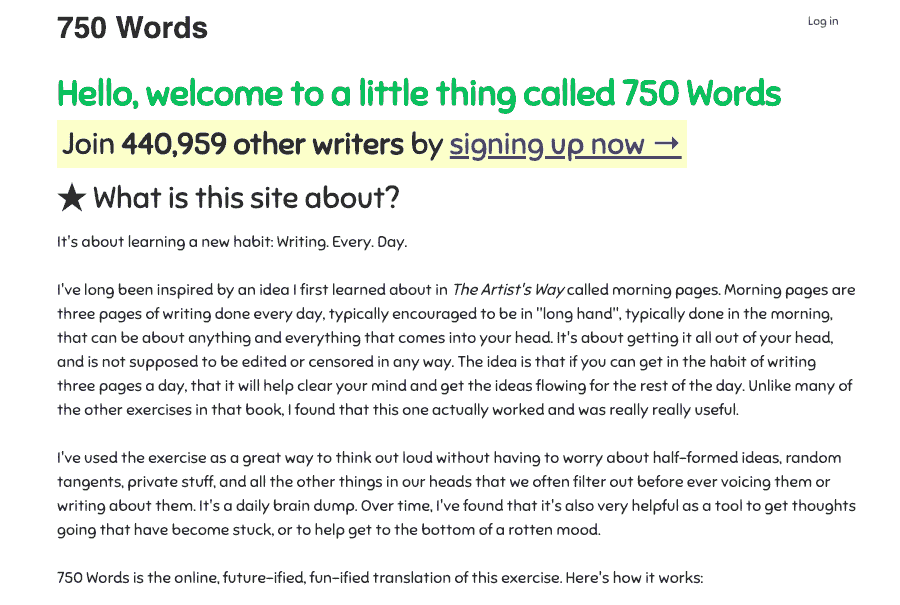
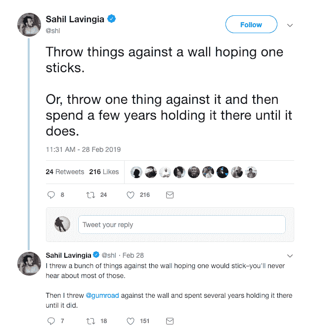

# 我是如何将我的副业发展成每月 2 万美元的生活方式生意的

> 原文：<https://www.indiehackers.com/interview/how-i-bootstrapped-my-side-project-into-a-20k-mo-lifestyle-business-063525ef84>

## 你好！你的背景是什么，你在做什么？

你好！我是巴斯特·本森。我想写一部伟大的美国小说，并在沉迷于互联网奇迹之前获得创意写作学位(从 1998 年左右的 Diaryland、LiveJournal 和 weblogs 开始)。大学毕业后加入亚马逊，边工作边学习编码，很长一段时间没有回头。2003 年，我与人共同创立了机器人合作社(Robot Co-op)，该公司创建了 43things.com(现已死亡)。我开发了一个早期的 iPhone 应用程序，名为 Locavore。我在 2006 年至 2009 年期间共同创立了 McLeod Residence，这是一家位于西雅图的艺术画廊和酒吧，然后共同创立了 Habit Labs，在那之后建立了 healthmonth.com。我喜欢有很多旋转的盘子，这些年来，很多盘子都掉下来了，但是有几个还在转！

是我在 2009 年心血来潮建立的一个网站，它现在仍然很强大。今年 12 月它就 10 岁了！这是一个允许你实践每天写私人日记的习惯的网站(与所有出版平台相反)。你写的文字会被保存起来，锁起来，只给你看，所以你可以写下你心里真正想的，而不用担心会泄露出去。这基本上是《晨报》的数字版，我是从朱莉娅·卡梅隆的《T2 艺术家之路》中了解到这个想法的。如果你每天都写，你会得到徽章和分析等等。免费试用后每月收费 5 美元。

截至今天，已有超过 40 万人注册，超过 50 亿字被写下。968 人连续写了 365 天以上，265 人连续写了 1000 天，68 人连续写了 2000 天。

 

整个事情一直在运行，因为这个想法很简单，每天写作本身就是一个非常有益的习惯。

TweetShare

## 是什么激励你入门 750 字？

我一直是一个热情的记者，从高中和大学的论文开始，但我也非常怀疑人们会阅读我的日志。多年来，在最终放弃并试图为自己建立一个完美的私人日记之前，我已经想出了许多不同的隐藏它们、加密它们的精心制作的方法。

那时，我会为几乎所有的东西建立一个网站，这可能是我在五年左右的时间里利用业余时间建立的 20 个网站之一。这些年来，除了这辆车和设法蹒跚前行的[peabrain.co](http://peabrain.co/)之外，所有其他的车要么已经退休，要么最终因为缺乏使用而死亡。

750 Words 通过捐赠支持了很多年，直到我最终遇到了太多的规模问题，并决定让它成为一个付费网站(新用户每月 5 美元，所有加入的人终身免费)，以减少它的增长...诚然，这是一个好问题。即使这样也没有真的降低它的速度，但它确实给了我预算来更好地扩展它，并支持我现在管理社区和支持队列的妻子。这一直是我自己、另一个朋友和我妻子(她现在在这方面的工作比我做得还多)爱的工作。整个事情一直在运行，因为这个想法很简单，每天写作本身就是一个非常有益的习惯，并且完全通过口口相传来发展。

## 构建最初的产品需要什么？

我用 Ruby on Rails 和 jQuery 在一个共享服务器上用了大约一周的时间构建了这个网站的第一个版本。我雇了一个设计师来帮我制作一些徽章。在最初的几年里，当我可以的时候，我会在这里或那里添加一些功能，但是最终这项工作的支持部分占用了我们所有的空闲时间。最大的挑战一直是及时回复所有丢失密码或因个人或与错误相关的原因而中断记录的人。因为它是关于每天的写作，并且一天在午夜结束，所以经常会有大量的人在一天结束时写作，这将导致网站崩溃，然后条纹被打破。该网站有一个奇怪的架构，因为大多数数据库查询都是写表而不是读表。在 2009 年，我们是仅有的几个做自动保存的地方之一，我用 jQuery 写了所有的东西，但可能没有优化得很好。现在我们有了更好的方法来完成所有这些(我认为 Vue + Nuxt + Netlify 的 JAM 栈可能是我目前最喜欢的)，但我只是在幻想最终的重构。

该网站仍然运行在一个古老版本的 Rails (2.3)上，使用 JQuery，尽管我们计划今年可能会重写一些内容。那将是令人兴奋的。

## 你是如何吸引用户，增长到 750 字的？

我会尝试从旧推文和 Tumblr 帖子中拼凑出这些内容。

2009 年 12 月 16 日，我发布了一篇博客文章，这篇文章现在只能在互联网档案馆找到:每天 750 字，或者为私人的、未经过滤的、无计划的写作辩护。

2010 年 3 月 1 日，它出现在 Lifehacker 上[，并导致我第一次](https://lifehacker.com/750-words-clears-your-mind-gets-ideas-flowing-5482921)[停电](http://750words.tumblr.com/post/422326133/site-problems)。3 月 19 日，我接受了一个[采访](http://www.becomingwhoyouare.net/an-interview-with-750-words-creator-buster-benson/)，我在采访中提到，当天有 11000 人注册，1500 人完成了他们的话，比前一周的 425 人有所增加。接下来的几个月，我所有的 Tumblr 帖子都是关于宕机、条目丢失和其他托管问题的。我记得那是一段压力很大的时间，因为每次停机都会造成我不得不修复的中断，而且在我丢失一些单词的情况下，往往没有办法再找回它们。

那时，我添加了一种向网站捐款的方式，尽管这完全是自愿的，以帮助补贴未来的扩展成本。2010 年 4 月，我们的注册用户超过了 20，000 人。我的第一个儿子 Niko[出生于 5 月](http://750words.tumblr.com/post/617113356/yes-this-happened-im-on-another-planet-of)，这让我对网站有点分心。

我们对那些已经连续写作 100 天的人做了一系列的采访，叫做凤凰厅([这里有一个](http://750words.tumblr.com/post/715571959/hall-of-phoenixes-olga-vorozheykina-1)的例子)。这是非常有益的，我认为它真的有助于强调屏幕后面的人，使它更人性化。尽管整个网站都是关于私人写作的，但事实证明你仍然可以建立一个相当稳固的社区。

让所有人都来批评我们的每一个缺点和限制并不总是感觉很好，但在一天结束时，它帮助我们在应对挑战时建立信任和善意。

TweetShare

出于事后看来命运多舛的原因，我在那年 8 月推出了一个名为“健康月”的新网站和业务。我想我发现用一个行为改变网站比用一个写作网站更容易赚钱，于是我为它筹集资金，雇人等等。有一段时间，它似乎是有效的，但最终它变得清晰，写作网站实际上是更好的业务。谁会想到！？几年后，当健康月结束时，我在 Twitter 找了份工作，搬到了湾区，[发表了一篇帖子](http://750words.tumblr.com/post/40322046809/the-future-of-750-words-please-read-and-reply#comments)，问 750 字的用户我该如何处理这个网站。我列出了五个选择:卖掉网站(这不是我真正考虑的一个选择)，雇佣帮手，关闭网站，把它变成一个付费网站，什么都不做。令人惊讶的是，大多数人投票将它变成了一个付费网站，所以这就是我们在接下来的几个月里所做的。当时我非常倾向于关闭这个网站，但是现在我非常高兴我们选择让它继续存在。从那以后，它继续缓慢增长。

截至 2011 年底，我们拥有 10 万注册用户，约 1000 名付费用户。八年后，我们拥有 43 万注册用户和 4000 名付费用户。自 2011 年以来，除了错误修复和一些新徽章(如 2000 天连续徽章和 200 万字徽章)之外，该网站一直保持相对相同，但我们很高兴今年终于投入更多精力。

我们告诉自己为什么这个小主意奏效的部分原因与我们对挑战的透明度有关。当事情分崩离析的时候，我们承认它，当我们有选择的时候，我们把社区包括在这个过程中。让所有人都来批评我们的每一个缺点和限制并不总是感觉很好，但在一天结束时，它帮助我们在应对挑战时建立信任和善意。

## 你的商业模式是什么，你是如何增加收入的？

我们收入的绝大部分来自 30 天免费试用后每月 5 美元的订阅费。如果愿意，人们也可以单独购买几个月，也可以直接捐赠，但这只是总收入的一小部分。我使用贝宝，尽管我有点讨厌它。我们多年来一直希望开始支持 Stripe，这将是我们即将进行的改进的首要目标，因为这将使我们能够比目前更好地控制订阅。

2009 年至 2011 年间，当我们是一项基于捐赠的服务时，收入峰值约为每月 2000 美元。这些年来，这种增长和成本也有所增加，但速度不同。

| 年 | 收入 |
| --- | --- |
| 2012 | 2500 |
| 2013 | 5000 |
| 2014 | 8000 |
| 2015 | 12000 |
| 2016 | 17000 |
| 2017 | 19000 |
| 2018 | 20000 |

## 你未来的目标是什么？

自 2011 年以来，我在几家不同的公司做全职工作:Twitter、Slack 和 Patreon。然而，去年 10 月，我决定暂停全职工作，写一本关于更有成效的分歧的书(将于 2020 年由企鹅/兰登书屋出版),并考虑将 750 个单词转化为可以完全支持我和我家人的生活方式业务的可能性。

为此，一旦我完成了我的书，我们计划在 Kickstarter 上资助一个 750 字的大更新，这将带来一个移动应用程序、本地化、对希望鼓励在课堂和其他小组环境中写私人日志的写作小组的支持，以及一系列其他直接来自社区当前成员的东西。这有点冒险，可能不会成功，但我们正处在一个让我们对挑战感到兴奋的时刻。

## 你面临的最大挑战和克服的障碍是什么？如果你必须重新开始，你会做什么不同的事？

事后看来，我们面临的所有挑战都不值得回避。找到一个人们想用的产品已经够难了，所以花太多时间去优化它是不成熟的。我想到了我建立的其他 20 个项目，它们都没有任何进展，我很高兴我没有带着可能扩展到今天 750 的期望来建立它们。

商业模式也是如此。我认为在你试图以此谋生之前，建造一些有价值的东西是很重要的。从免费网站开始，转向捐赠，最终转向订阅模式是我们正确的选择。我想让这个网站再次对负担不起的人免费，因为真正的目标是帮助人们以可持续的方式改善生活，而不是建立一个巨大的盈利企业。

## 有没有发现什么特别有帮助或者有优势的？

我喜欢[萨希尔](https://www.indiehackers.com/interview/4fc6cbc0e8)前几天发的推文:

 

我是[有意非优化](https://writtenonbart.com/intentionally-unoptimized-1746f35fe343)的忠实粉丝。要优化的最重要的东西是无法衡量的，试图这样做可能会以一百种不同的方式轻易地扼杀这个项目。

## 对于刚刚起步的独立黑客，你有什么建议？

我听说所有的好建议都集中在一个幸运饼干里。所以这是我的贡献:总是从回到你的北极星开始——你想给自己和世界带来什么变化？

然后，试着向你认为对世界有价值的北极星走几步，并把它们做好。然后，试着让它变得可持续，这样你就可以继续做下去。

我认为在你试图以此谋生之前，建造一些有价值的东西是很重要的。

TweetShare

我自己发现，创造一个地方来倾倒未经审查的想法以清理我的大脑是一件有价值的事情，因为它使我做的其他事情变得更加清晰和真实。其他人也觉得它很有价值。要真正做好这件事，最重要的是不要试图同时做其他事情。

## 我们可以去哪里了解更多？

我在 [buster.wiki](https://buster.wiki) 有一个个人网站。我写过最受欢迎的东西是[认知偏见小抄](https://betterhumans.coach.me/cognitive-bias-cheat-sheet-55a472476b18)，但是在[媒体](https://medium.com/@buster)上还有很多不太受欢迎的东西。我写的对我的生活最有价值的东西是[我的信念文件](https://buster.wiki/beliefs)。我正在写一本书，并在我的时事通讯中分享关于这本书(和其他东西)的更新。而我是推特上的 [@buster](https://twitter.com/buster) 。

我喜欢问题，所以欢迎在评论中提问！

——[<picture id="ember7377461" class="user-avatar ember-view user-link__avatar"></picture>巴斯特本森](/buster?id=7OLDMrtmyPSi1O76tQ0mAfYbaTE2)【方正 750 字

## 想像 750 字一样自己创业？

你应该加入[独立黑客社区](/)！🤗

我们是几千名创始人，互相帮助建立有利可图的业务和副业。来分享你正在做的事情，并从你的同事那里获得反馈。

还没准备好开始使用你的产品吗？没问题。这个社区是一个认识人、学习和实践的好地方。随意[随便浏览](/)！

—[<picture id="ember7377466" class="user-avatar ember-view user-link__avatar"></picture>考特兰艾伦](/csallen?id=ibTLPyjwVebnZjMGKvz6ztarnuV2)，独立黑客创始人

227votes