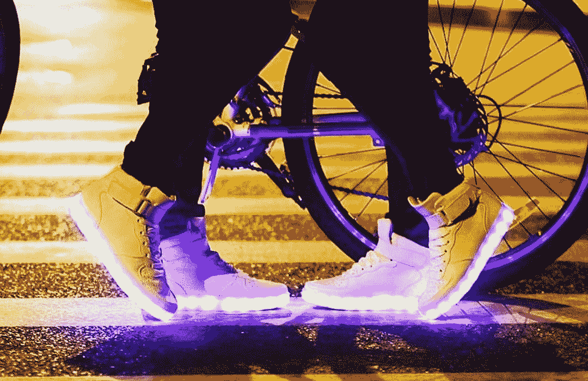

# 我是如何收购一家我一无所知的企业，并使其收入翻倍的

> 原文：<https://www.indiehackers.com/interview/how-i-bought-a-business-i-knew-nothing-about-and-doubled-its-revenue-17e01fe5b8>

## 你好！你的背景是什么，你在做什么？

嗨，我叫丹·鲁苏。2006 年，从华盛顿大学获得商学学位后，我开始为一家数字营销公司工作。最终，我拓展了自己的业务，接待了自己的客户，这样我就可以有更多的自由时间去旅行，追寻自己的梦想。这些年来，我还自学了软件开发，这给了我自动化工作任务和分析思考的技能。

[发光鞋](http://lightingshoes.net)卖发光 LED 鞋。我们有从幼儿到成人的各种尺码，以及各种颜色的各种款式，包括运动鞋、高帮鞋和低帮鞋。

我们有两个人口统计数据，它们彼此之间有天壤之别。第一类是参加 EDM 节日和狂欢的人，第二类是可能每天或在生日聚会和去迪斯尼乐园旅行等活动中穿着它们的孩子。

我们上个月的销售额刚刚超过 10，000 美元(大约有 11，000 名访问者访问了我们的网站)，我们这个月的销售额有望接近 20，000 美元。

 

## 是什么激励你开始做照明鞋？

实际上，我如何拥有[发光鞋](http://lightingshoes.net)还有一个有趣的故事。我想探索为 Shopify——一个流行的电子商务平台——开发插件，作为一种“副业”。我想我可以建立一些插件，并产生一些简单的经常性收入。

然而，事实证明很难判断 Shopify 市场想要/需要什么。我决定找出答案的最好方法是拥有自己的 Shopify 商店。

我碰巧在 [Flippa](https://flippa.com) 上看到 LightingShoes.net 出售。我和老板谈过了，我觉得这个价格对它的利润和潜力来说是个好价钱。所以接下来我知道的是，我在卖一个我没有体验过的产品。:)

我认为主要的买家是狂欢者和 EDM 粉丝。原来他们大多是小孩和蹒跚学步的孩子。

TweetShare

这是我第一次拥有一个电子商务网站，尽管在我的数字营销生涯中，我曾为一些在线商店做过营销，所以我并不完全是绿色的。我也很幸运有一份主要的工作，它给了我稳定的收入和大量的空闲时间，所以我觉得我可以冒这个险。

## 买下这家店并把它变成你自己的是怎么回事？

我用自己的积蓄买了这块地。这不是一个很大的数目，如果事情变得更糟，我觉得损失这笔钱也没什么。

现在，由于这是一个我继承的网站，我的过程与那些从头开始的人有很大的不同。当你收购一家公司时，一般的过程似乎是首先了解业务的运作和细节，然后解决业务目前存在的任何问题，最后做出进一步的改进。

我建立企业的第一个任务实际上是了解正在发生的事情。为此，我自己订购了一双鞋，以便熟悉它们。然后，我做了市场和竞争对手研究，以确保我正确理解了人口统计学。这一点至关重要——当我第一次买下这家店时，我认为主要买家将是狂欢者和 EDM 粉丝。原来他们大多是小孩和蹒跚学步的孩子。

我还花时间学习了客户支持、订单执行和 Shopify 本身。我绝对低估了这一切需要多长时间。很容易过了三个星期，我才适应了一切。

下一步是解决企业当前面临的问题。“清理”它是一项巨大的工作。以下是我最后做的事情:

*   **找到了新的供应商:**目前最大的问题是我们的供应商。之前的主人用 AliExpress.com 的[将鞋子从中国直接运给买家。如今，随着亚马逊 Prime 在 2 天内发货，许多其他零售商也在做同样的事情，没有人会等 3 周才能拿到订单。最重要的是，许多订单在运输途中丢失了。所以我找到了一家在美国有仓库的供应商，他们会在 3-5 天内将鞋子直接运送给我们的买家。](https://www.aliexpress.com)

*   重新设计了网站: Shopify 有很棒的主题，但你需要在使用它们创建网站时注意细节。用[光鞋](http://lightingshoes.net)还没有做到这一点。徽标有拼写问题，网站加载速度极慢，页脚不准确，等等。我最终做了大量的重新设计，以确保人们在访问网站时信任他们。

*   **转换率提高:**站点转换率为 0.75%。通过改善产品形象，添加折扣弹出窗口，放弃购物车电子邮件等。我把它提高到了 2%。

一旦这些问题得到解决，我就开始致力于增加网站和产品的影响力。这包括增加点击付费和社交媒体广告的预算。

将商业收益投入到公司本身，雇佣专家来进行改进。

TweetShare

我们也在为公关和搜索引擎优化做一个大的活动——联系舞蹈和妈妈/爸爸社区的博客写手来写我们的产品。我希望这能让人们了解这个网站，并通过搜索引擎给我们带来更多的有机访问者。

为了完成所有这些，我每天花大约 5 个小时在网站上，通常是在工作时间和下班后。我尽可能地做自由职业者，这样我就可以利用别人的工作和专业知识。

## 你能谈谈你是如何提高网站的影响力的吗？

以下是我们为吸引和增加[照明鞋](http://lightingshoes.net)顾客所做的一切:

1.  聘请了 Adwords 顾问来优化当前的 Adwords 活动。由于我们的大部分流量和销售额来自 Adwords，这对增加我们的数量和转化率非常有帮助。他能够清理我们的产品提要，提出现场转化优化建议，并努力降低每次点击的成本。

2.  在 FB 和 Instagram 上为没有购买的网站访客发起了再营销活动。

3.  开始了公关/搜索引擎优化活动。为此，我们正在开展博主外展活动，以联系那些拥有对我们产品感兴趣的读者的博主。我们也在同意它的各种博客上发表客座博文。我们正在利用 HelpAReporter.com 与记者联系，并让我们的网站在出版物上上市。到目前为止，所有这一切已经导致了 50 多个反向链接和对我们网站的提及，以及搜索引擎流量的相应增加。

4.  增加我们的社交媒体追随者。我们正在张贴来自买家和粉丝的用户生成的照片，以吸引更多关注者。我们还接触了有影响力的人，请他们尝试我们的产品，并让他们的追随者了解我们的产品。

5.  社交媒体广告。我们刚刚开始探索可以在其上做广告的不同网站，包括 Pinterest 和 Instagram。

由于我们的大部分活动(除了 Adwords)都是新的，我们在许多方面仍处于早期阶段。但这里是我们目前收集的一些数据:

*   Instagram 上每周超过 1，000 次展示，300 多名新粉丝
*   353 名访客来自有机谷歌搜索
*   脸书上有 400 个赞

## 你的商业模式是什么，你是如何增加收入的？

我们的商业模式很简单:卖 LED 鞋！这是我们目前销售的全部产品，尽管我们将在未来开发其他 LED 产品作为交叉销售产品。我们使用贝宝和 Authorize.net 处理所有付款。虽然我们的授权费用有点低，但我知道我们的一些客户更喜欢贝宝，所以我们已经包括在内。

我们 2017 年 3 月的销售额刚刚超过 1 万美元。预计本月将接近 20，000 美元。算上所有费用，我只剩下 20%的利润。

因为我自己拥有这个网站才一个月，所以我可以每周做一次收入明细，而不是每月做一次。

| 周 | 收入 |
| --- | --- |
| 3 月 8 日 | 1578 |
| 3 月 15 日 | 3371 |
| 3 月 22 日 | 5285 |
| 3 月 29 日 | 4870 |

我们的价格保持不变，因此这些增长来自于通过我们的营销努力获得的转化率和流量的提高。

## 你未来的目标是什么，你打算如何实现它们？

我的主要目标是让我们的主要产品关键词在搜索引擎上排名第一。由此带来的销售收入将是该网站当前收入的巨大增加。如果我知道我可以将一个品牌的 SEO 从几乎不存在提升到搜索结果的第一页，这对我也是一个巨大的信心提升。

另一个营销目标是增加社交媒体营销的访客和销售额。对于这个网站来说，这仍然是一个非常新的领域。

我已经提到将其他 LED 产品添加到网站的库存中。一旦所有的营销渠道都得到优化并且表现良好，这就是我想做的事情。

至于个人目标，我想找个人来处理客户支持和社交媒体，这样我就可以有时间探索其他项目想法。

## 你面临的最大挑战是什么？

一个大问题是供应商。虽然他们在美国很好，但他们已经缺货，我不得不寻找外部供应商来完成这些订单。我给你的一些建议是，你和你的供应商一样好。确保你的供应商能够处理好你的订单。

如果我必须重新开始，我会改变网站的品牌。目前，它非常通用。你的品牌对你的营销表现起着巨大的作用。

## 到目前为止有什么对你特别有帮助的吗？

聘请 Adwords 顾问是一项大工程。我的一个建议是聘请专家。将商业收益投入到公司本身，雇佣专家来进行改进。

如今另一个巨大的优势是自由职业者的存在。例如，我在 [Fiverr](https://www.fiverr.com) 上设计了我们的标志，在 [Upwork](https://www.upwork.com) 上找到了一个公关人员，并向 Elance 寻求 SEO 帮助。通过利用这些网站寻找自由职业者，你可以更好地利用你的时间。

## 对于刚刚起步的独立黑客，你有什么建议？

在你开始或购买一家企业之前，真正做好你的尽职调查。当你开始做一件事时，会有很多兴奋和诱惑，认为这个项目会很容易。但不会。创业是一项艰苦的工作。一定要从各个角度进行研究和调查，真正想清楚这个项目要做什么。

就我个人而言，我是一个超级 T4 迷。我喜欢向其他创始人和企业家学习，我发现你从面试中学到的最多。就书籍而言，我向没有读过的人推荐斯蒂芬·R·科维的经典之作《高效人士的 7 个习惯》。

## 我们可以去哪里了解更多？

*   你可以在[www.lightingshoes.net](http://lightingshoes.net)看到我们的网站
*   我们的博客:[www.thedanceandartblog.com](https://lightingshoes.net/blogs/promoting-dance-art-movement-blog)
*   www.facebook.com/lightingshoes
*   www.instagram.com/taglightingshoes

如果你有任何问题，请联系我。我很乐意帮忙！

—[<picture id="ember5332669" class="user-avatar ember-view user-link__avatar"></picture>照明鞋](/lightingshoess?id=ncmFQLbYdgeh0avul0wN8LtZ2Hw2)，照明鞋的创造者

## 想像擦鞋一样自己创业？

你应该加入独立黑客社区！🤗

我们是几千名创始人，互相帮助建立有利可图的业务和副业。来分享你正在做的事情，并从你的同事那里获得反馈。

还没准备好开始使用你的产品吗？没问题。这个社区是一个认识人、学习和实践的好地方。随意[随便浏览](/)！

——[<picture id="ember5332674" class="user-avatar ember-view user-link__avatar"></picture>柯特兰艾伦](/csallen?id=ibTLPyjwVebnZjMGKvz6ztarnuV2)，独立黑客创始人

4votes