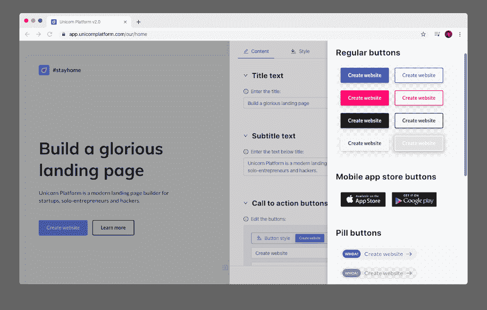
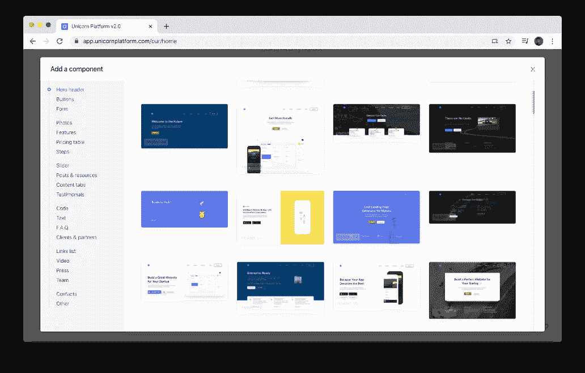
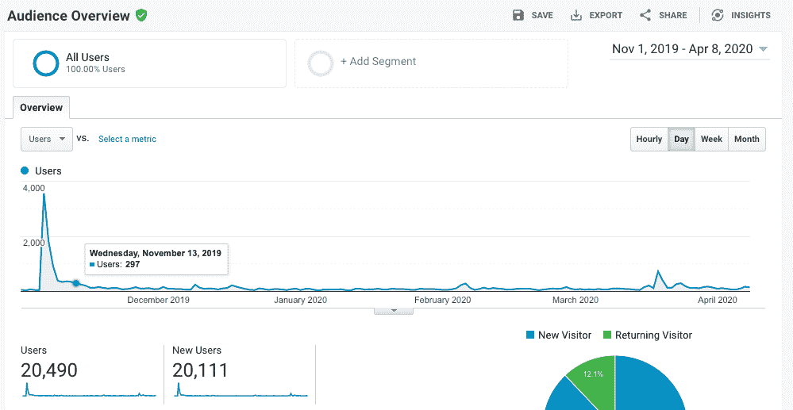
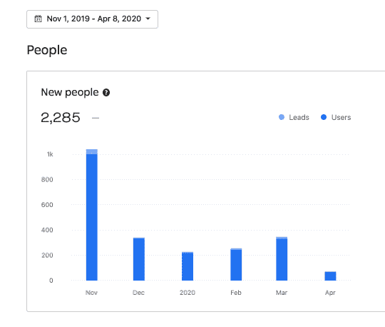
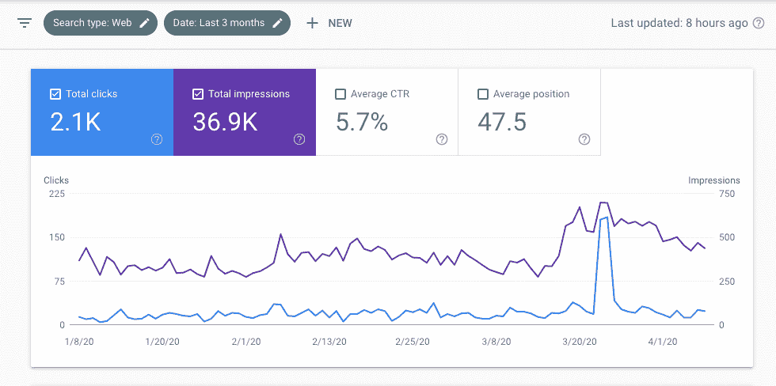
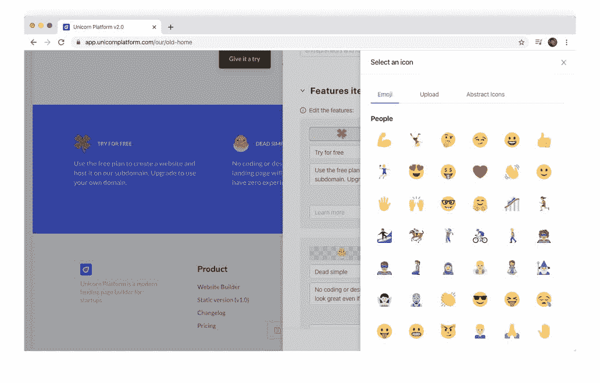
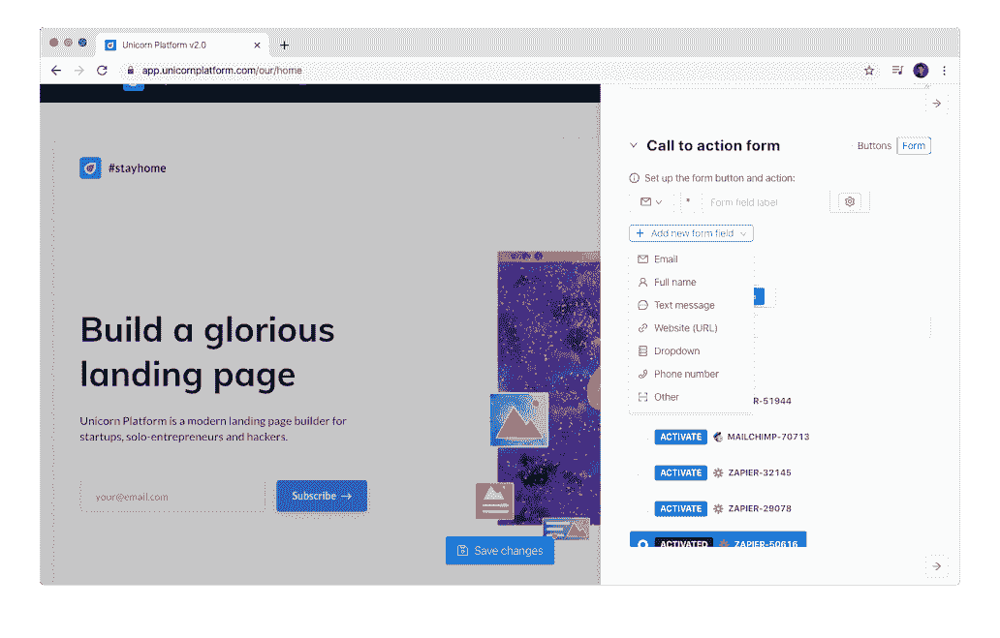

# 我是如何打破传统，在拥挤的市场中获得成功的

> 原文：<https://www.indiehackers.com/interview/how-i-bucked-tradition-and-found-success-in-a-crowded-market-2d9b923e29>

## 你好！你的背景是什么，你在做什么？

嘿！我叫亚历克斯。我是*的创始人，也是另一个*登陆页面构建者——[独角兽平台](https://unicornplatform.com/)。我的宝贝在 MRR 赚了 2678 美元。很快我将庆祝 3000 个网站。

但是是什么让独角兽平台在所有 100，500 的竞争对手中脱颖而出呢？我是如何创造它的，我又是如何培育它的？让我从头说起这个故事。🙂

我出生在西伯利亚的一个小镇。那里的冬天很冷:我记得最高温度是零下 55 摄氏度(-67 华氏度)。伙计，太冷了！

那里的人们所做的就是生产石油。那对我来说不是一个非常吸引人的工作。所以当我 18 岁的时候，我搬到了圣彼得堡，俄罗斯最美丽的城市。

我进入了当地的二流大学，学习如何设计发电站。那是我一生中最无聊和沮丧的一段时间，因为我知道在俄罗斯，电力工程师的生活离天堂还很远。我没有像硅谷明星那样退学，因为我不够勇敢。😐

在我大学学习期间，我开始研究不同的东西，只是因为我不想设计那些发电厂。我很幸运地偶然发现了 web 开发。那是一见钟情，这么多年过去了，我还是很喜欢！

## 是什么激励你入门独角兽平台？

许多网站开发者梦想着他们的网站建设者。但是技能和愿望只是秘诀的一部分。要构建网站构建器，您还需要:

*   深思熟虑的产品愿景
*   好的设计品味
*   营销策略
*   深入了解你的用户
*   对万维网保持在过度拥挤的利基市场中战斗的热情爆发
*   敢于冒险

我有幸作为 Itmeo 的联合创始人开始了我的创造者生涯。我们为开发者和设计师打造了一些 dope 产品(比如 WebGradients)。在这项工作中，我学会了如何制作 lit UI，以及如何提供出色的客户服务。此外，这次宝贵的经历让我对 web 开发市场及其需求有了必要的了解。

这一切促成了我的*产品愿景*。

所以一年后当我问自己下一步该做什么时，我很清楚答案会是什么:**一个网站建设者！**

在我与另一家创业公司失败后，我创建了独角兽平台。我们花光了所有的钱，然后两手空空地回家了。

所以我当时的财务状况是:“在当地市场四处寻找打折食品。”😅我在认真考虑找一份真正的工作。但是我的脑海中仍然留有那个景象，我迫切地想把它变成现实！

我需要以某种方式证实我的想法。要测试一个产品，你需要一个 MVP。但是，对一个网站建设者来说，什么是 MVP 呢？是的，这是最棘手的事情。他们说，“打造一个 MVP，不要浪费太多时间。”但是他们不说多少时间是太多了！

所以我认为一个静态登陆页面生成器就足够了。“静态”意味着你不能编辑我的应用程序的内容，只能用预先设计的组件组成一个页面。然后你需要下载一个 HTML 格式的网页，并在你的本地电脑上编辑文本和图片。

你知道——它成功了！完成 MVP 花了紧张的 [160 个小时](https://isora.me/from-idea-to-mvp-in-160-hours/)。人们喜欢它！

我进行了一轮小型众筹，筹集了 1 万美元。(如果你想了解这方面的更多信息，请在评论中告诉我。)最有价值球员本身也很受欢迎，销量不错。这解决了我的财务问题，并让我专注于 Unicorn 平台的 v2——具有在线内容编辑器、酷集成和设计定制的完整网站构建器。就像我在梦里一样！😌

## 构建最初的产品需要什么？

v2 的构建过程持续了大约一年。是啊，整整一年的隔离和独自制造产品。日复一日的编码看不到阳光或用户的反馈是不酷的。强烈不推荐。

快速迭代会让你的动力得到提升。

TweetShare

如果可能的话，争取频繁分娩(5 到 10 天一个周期)。快速的迭代会让你的动力得到提升，除此之外，它还会*引导你走向完美的产品*。

这是给你的一个小测验！😁

谁最了解你的产品？选择以下选项之一:

1.  你们
2.  你的朋友，有 10 年经验的苹果 UX 设计师
3.  你妈妈
4.  您的服务的实际用户

正确答案是第四个。你不需要考虑需要添加什么特性——问问你的用户就知道了。他们会告诉你的。

我的技术栈很琐碎:ReactJS，Python + Django，Postgres。我还将 Trello 用于[公共路线图](https://trello.com/b/P5mOquUI/unicorn-platform-product-roadmap)，Uploadcare 用于托管图像，Paddle 用于支付，Intercom 用于客户通信，而 idea 用于文档和注释。

一个网站建设者，技术上不是很复杂。是的，我知道，每个人都是在做过之后才这么说的。😅

反正我被问了几十遍怎么建一个建站器。正如我所说的，许多开发人员想要构建他们自己的工具！我很兴奋也很高兴认识新的竞争对手，因此我开始了一系列关于这个话题的文章:[https://isora.me/building-a-website-builder-part-1](https://isora.me/building-a-website-builder-part-1)。欢迎光临！

## 你们是如何吸引用户，壮大独角兽平台的？

我有 3 个用户获取渠道:

1.  **SEO:** 我很幸运地为一些甜蜜的关键词排到了好位置。事实证明，由 Unicorn Platform builder 提供的默认 SEO 优化工作做得非常好。这给了我每天大约 20 次点击。
2.  **产品搜寻:**我每年在 PH 上推出一次我的小马。每次它都给我的项目带来了显著的提升，从登陆页面访问者到付费客户的转化率大约为 0.4%。
3.  **现有用户和关注者:**这是最重要的。SEO 是微不足道的，PH 发布是罕见的。我的伙伴们(大部分是独立黑客)和现有的独角兽平台用户的支持让火一直燃烧。当 Wix 再投入 100 万美元的广告时，我可以闭上眼睛，祈祷周围的人会支持我——你做到了！所以谢谢你们支持我的发布和更新，分享我的文章，喜欢我无聊的推文。我爱你们所有人！

我知道你很想看到一些数字:

*访客登陆页面。高峰是 PH 发布日。通过谷歌分析。*

*报名。高峰是 PH 发布日。通过对讲机。*

*出现在谷歌搜索结果中。通过谷歌控制台。*

我认为我是一个糟糕的企业家，因为我很少做市场营销。

我本可以写 100 篇文章，录制 10 个视频，与其他 10 家创业公司合作，在聊天和 IH 上更卖力，创建一个漏斗，在付费广告中投入一些现金，创建一个副业项目，并在我垂死的[电报频道](https://t.me/serene_startup)写 50 篇文章。😂

但我只接受了几次采访。；)

## 你的商业模式是什么，你是如何增加收入的？

说到网站建设者，有很多方法可以赚钱:

1.  出售自定义域名
2.  出售更多网站广告位
3.  出售更多流量限制
4.  提供“为我做”服务
5.  添加付费集成和组件
6.  销售网站导出
7.  添加电子商务功能
8.  销售更多定制产品(如定制代码)

我可以继续！但我决定走最简单和最容易理解的路:用户获得免费计划的所有功能。所有组件和所有集成都被解锁。你可以自由创建你梦想的网站。当你准备好把你的项目推进到严肃的阶段时，你付费连接一个自定义域，你就可以开始了。不再有额外的付款。

因此，即使一个托管在 Unicorn 平台上的网站开始每天获得数千次浏览，产生数百千兆字节的流量，我也不会向我的客户收取更多费用。我更喜欢让定价模型尽可能简单。即使有时我不得不为此多付钱。

有趣的事实:我在三月份为一个客户的流量支付了 100 美元，因为他的网站火了。但至少我得到了一次“免费”的加载测试！😅

## 你未来的目标是什么？

我唯一的目标是为创业公司提供一个完美的登陆页面生成器。我相信我在路线图中的所有关键功能都可以在 2020 年底完成。然后我可能会休息一下，开始考虑营销方面的事情。

我可以设定一些流量目标、收入目标、漏斗目标，就像所有职业企业家说的那样。但我没有。所以我打算继续走这条固执的“只做产品”的路。

数字对业务很重要，但它们分散了我对更重要的东西的注意力:产品。所以我只是忽略数字。(也许这就是我被 TechStars 拒绝的原因。😁)

## 如果你必须重新开始，你会做什么不同的事？

我最大的错误是直到上个月我才雇佣任何人。

我非常幸运地遇到了 Asad——一位才华横溢的前端开发人员和 cybersport 爱好者。他帮我提供客户支持，这是 Unicorn 平台的重要组成部分。我们不只是向建筑商出售使用权；我们帮助用户的创业公司茁壮成长。这包括帮助设置自定义集成、查找特定的第三方小部件、在登录页面上提供反馈、与某人联系，或者——通常——仅仅是欢呼一下！

阿萨德总是心情很好，看起来他从不睡觉。他真的是把*变成了*的每一个支援请求。我和他一起工作非常开心！他的帮助让我有更多的时间在产品开发部分，就像我提到的，我非常喜欢。

下一步将雇用一个反应忍者。但我需要在雇用全职开发人员之前，增加 MRR。

## 有没有发现什么特别有帮助或者有优势的？

有一件事在游戏中扮演了重要的角色。如果没有朋友们的支持，我永远也不会创造出 Unicorn 平台的 v2。

从别人的错误中吸取教训。如果你做不到，那就从自己的错误中吸取教训。

TweetShare

特别感谢克斯特亚，当我陷入困境时，他在技术问题上给了我指导。谢谢你第 100 次了，伙计！🤓

## 对于刚刚起步的独立黑客，你有什么建议？

哦，孩子，我不喜欢给别人建议，但这里有一条:从别人的错误中学习。如果你(像我一样)做不到，那就从*你自己的*错误中吸取教训。

如果你在生活的任何一部分都有过不愉快、痛苦、可怕的经历:职业、个人生活、爱好、朋友——反思一下。再想想可能会很痛苦，但是你需要做出事实上的结论才能进化。问问你自己[五个为什么](https://en.wikipedia.org/wiki/Five_whys)，找到你失败的原因，永远不要让它再次发生。

如果你不承认和分析自己的错误，你将永远不会成长。

## 我们可以去哪里了解更多？

*   你可以在我的*另一个*在线社区[Broadwise.org](https://broadwise.org/)上找到我。欢迎各位。清新凉爽。
*   我在我的博客和电报中写关于创业的文章。
*   我也有一个[推特账号](https://twitter.com/alexanderisora)！

感谢您的关注！

——[<picture id="ember8068628" class="user-avatar ember-view user-link__avatar"></picture>亚历山大·伊索拉🦄](/alexanderisora?id=SU6aSYLTkTMS4hWMNCG53K5s8v22)，独角兽平台创始人🦄

## 想像独角兽平台一样建立自己的事业🦄？

你应该加入[独立黑客社区](/)！🤗

我们是几千名创始人，互相帮助建立有利可图的业务和副业。来分享你正在做的事情，并从你的同事那里获得反馈。

还没准备好开始使用你的产品吗？没问题。这个社区是一个认识人、学习和实践的好地方。随意[随便浏览](/)！

——[<picture id="ember8068633" class="user-avatar ember-view user-link__avatar"></picture>考特兰艾伦](/csallen?id=ibTLPyjwVebnZjMGKvz6ztarnuV2)，独立黑客创始人

43votes