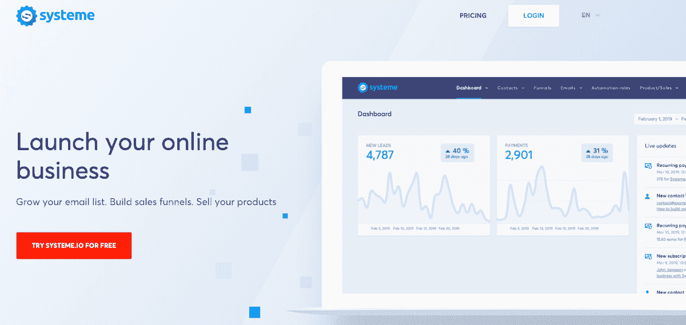
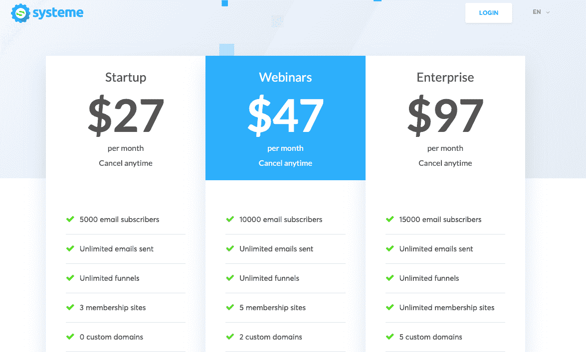
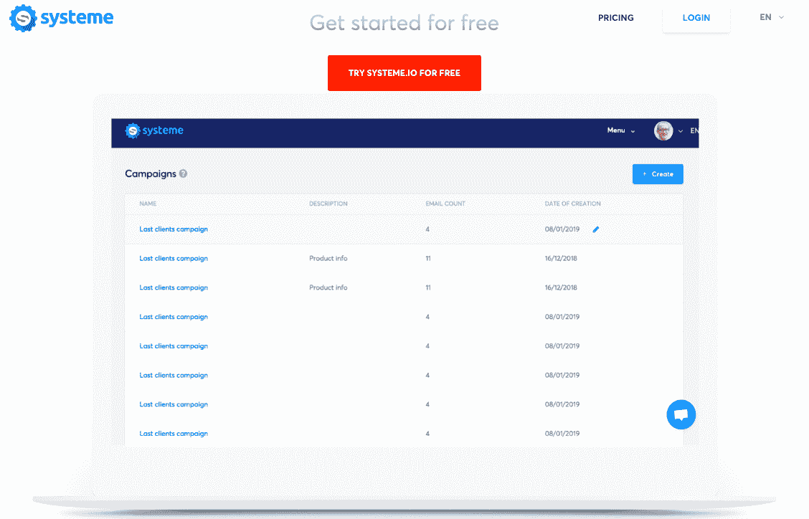

# 我如何建立一个更好的团队，并使收入增长到$50K MRR

> 原文：<https://www.indiehackers.com/interview/how-i-built-a-better-team-and-grew-revenue-to-50k-mrr-ce4055dcd1>

## 你好！你的背景是什么，你在做什么？

我叫奥雷连恩·阿马克，是一名法国企业家和网络营销人员。自 2010 年以来，我一直在法国市场销售在线课程，重点是教人们英语以及如何开展在线业务。

我的风险投资最终让我建立了一个 SaaS 应用程序 [Systeme.io](https://systeme.io) ，它提供了启动在线业务所需的所有功能，包括销售漏斗构建器、自动回复器、会员网站构建器、联盟计划管理等等。

如今，在推出一年后，Systeme.io 拥有 1，500 名付费客户和每月 5 万美元的经常性收入。

 

## 是什么促使你开始使用 Systeme.io？

大约在 2012 年，我读了 Eric Ries 的《T2》和《T3》，也开始听一些关于创业公司的播客，比如《T4》和《T5》和《T7》。精益创业公司让我大吃一惊，结合所有的播客，我渴望开发一款 SaaS 应用。但是在那个时候，经营网上生意并没有太多好的选择。除非你是一个编码天才，否则你不得不把几个应用程序或软件包捆绑在一起来建立你的业务，这是很昂贵的，对于刚刚起步的人来说，成本或多或少是令人望而却步的，尤其是如果你是自举的话。

梦想的解决方案将是一个应用程序，将所有主要功能集中在一个屋檐下——页面生成器、电子邮件营销和会员网站——但构建这么多功能感觉是不可能的。

尽管我对这个看似巨大的挑战犹豫不决，但我还是决定在 2015 年迈出这一步。36 岁时，我决定投资房地产，在这个过程中，我开始反思自己的生意不仅仅是一种挑战，还是一种投资。什么都不放进去就拿不出来，有时候冒这个险还是值得的。此外，我认为我多年来在这个行业获得的经验将使投资我的企业成为一个更安全的赌注，并有可能获得更高的回报。

当时，我的业务是销售在线课程，每月收入 3 万美元，所以我能够自己为这个项目提供资金。

## 构建最初的产品需要什么？

我最初在另一个国家雇佣了一家公司来开发这个产品。所有者是我的在线课程的客户，一个住在国外的法国人，所以这是一个足够简单的连接，看起来似乎是有益的。不幸的是，他们一无所知。他们从不回我的电子邮件，最终我自己写了所有的会议记录和报告，尽管我付钱给了一个项目经理。

现在看来这很傻，但我甚至飞去见他们，亲自了解一下情况，看看能不能从中斡旋。我记得我坐在他们的会议室里向他们解释 scrum，告诉他们应该用它来构建我的产品——他们根本不知道我在说什么。

最后，很明显，他们很擅长告诉我一切会好起来的，但却不擅长实际构建产品。六个月后，我认输并解雇了他们。它花了我大约 34K 美元和整整一年的工作。

我们当然会犯错误，但错误会让你成长。这是游戏的一部分。

TweetShare

在那次巨大的失败后，我转向 Upwork，试图找到一个更可靠的人。2017 年初，我找到了一个站在其他人之上的开发者。他正是我要找的人，与第一家公司截然相反。如果他告诉我某事会在两小时内完成，他就会在两小时内完成——没有借口，没有抱怨，只是完成。这真是一股新鲜空气。

由于我们必须构建许多功能，我很快添加了两个以上的开发人员，使我们达到两个后端开发人员和一个前端开发人员(以构建我们的页面编辑器)。后端构建在 Symfony(一个 PHP 框架)上，我们的编辑器使用 ReactJS 框架构建在 JS/NodeJS 上。我们的团队是 100%远程的，使用 Slack 进行通信。

这很难解释，但这个团队似乎有一点魔力:我们喜欢一起工作，我们行动很快。拥有一个小团队可以防止我们在无意义的会议上浪费时间，让我们更有效率。每个人都专注于各自的任务，可以高效地工作。

2017 年，我们将我的在线业务迁移到了我们的应用程序上:首先是我的电子邮件列表，然后是我的支付页面，最后是我的在线课程。

## 你们是如何吸引用户并壮大 Systeme.io 的？

我们于 2018 年 4 月在法国市场推出。我已经通过我的在线课程业务、我的博客和 T2 的 Youtube 频道建立了一个大约 50，000 封邮件的列表。我给他们发了几周的电子邮件，让他们了解产品，并为他们提供特别优惠。

发布后，我们很好地解决了大约 400 名付费用户的问题。虽然这相对于我的邮件列表来说不算多，但是你的邮件列表越大越老，它的响应就越慢。幸运的是，我们保持了每月 10%的增长率，六个月后，我们的付费用户达到了 1000 人。如今，我们拥有 1，500 名付费客户和每月 5 万美元的经常性收入。

人们很容易被所有的闲聊压垮或分心，但重要的是不要根据人们说的话，而是根据事实和数据来做决定。

TweetShare

主要的增长渠道是子公司。我们向我们的会员支付 40%的终身佣金，以激励他们大力推广我们，这似乎很有效。我们的客户喜欢这个产品，这也没有坏处。我们一直从用户那里得到很好的反馈，所以即使我们为推荐支付佣金，我知道产品的质量在产生口碑增长方面起着决定性的作用。

我们花了很多时间思考如何使每个功能尽可能简单，我们聘请了加州的顶级设计师来设计。给你一个建议——找到一个伟大的设计师很容易，联系他们...没有那么多。优秀的设计师会收到很多邀请，所以你需要坚持不懈，再加上一点运气。

此外，相对于我们的竞争对手(每月 97 美元)较低的起价(每月 27 美元)无疑有助于我们吸引客户。当你刚刚开始创业时，很难每月投资 100 美元，所以我认为我们的价格点对客户的最终目的地有很大影响。此外，我喜欢这种商业模式，即以非常实惠的价格吸引顾客，然后继续向他们推销。

## 你的商业模式是什么，你是如何增加收入的？

如今，我们每月的收入约为 12 万美元:

*   Systeme.io 的付费订阅费为 5 万美元
*   在线课程销售收入 3 万美元
*   指导销售收入 4 万美元

这三个产品系列相互配合，因为一个产品系列的理想客户反过来也是另外两个产品系列的大客户。

如果你能想出如何让球滚动起来，在线课程是一个高利润率的伟大产品。一旦课程制作完成，你可以在几年内出售它们，几乎没有任何开销，所以这是一个很好的收入来源。我们的在线课程涵盖广泛的主题，如文案和电子邮件营销。

大约在我们推出 Systeme.io 的同时，我雇佣了一名销售人员向我们的客户销售教练产品。每周，我们都会为客户举办一场现场网络研讨会，最后邀请他们与我们的销售人员通过电话预约一次战略会议，向他们推销我们的教练服务。指导由我的一名团队成员(我在线培训的前学生)负责。

我的销售人员和我们的教练都是以佣金为基础获得报酬的，所以对我来说，花很少的时间，这是一个很好的收入来源。仅在第一个月，我们在辅导销售方面就创造了近 2 万美元的收入。这一点，加上推出我们的应用，让我们在几个月内将收入翻了两番:2018 年 1 月，我们的收入为 3 万美元，到 12 月，我们的收入为 12 万美元。

我不明白为什么大多数初创公司不在他们的软件上销售服务或在线课程，因为这似乎是一种显而易见的大幅增加他们成功机会的方式。客户会更高兴，更有可能继续使用你的产品，这是一个额外的收入来源，而且开销很小。这似乎是显而易见的。

 

## 你未来的目标是什么？

我们的竞争对手每年的收入在 1000 万美元到 1 亿美元之间，所以我相信，即使我们做得不好，我们每年也会有大约 500 万美元的收入。我的目标是将收入提高到 1000 万美元，然后是 2000 万美元。

我的愿景是一个小团队，每个人都热爱自己的工作，互相了解，没有政治，没有压力，大本营式的。我只是想打造一个伟大的产品和一个可持续发展的企业。凭借我们的低价位，我们或许能够在目前可能服务不足的新兴市场(如拉丁美洲和非洲)获得一些吸引力。

## 你面临的最大挑战和克服的障碍是什么？如果你必须重新开始，你会做什么不同的事？

如果让我重新开始，我什么都不会改变。我们当然会犯错误，但错误会让你成长。这是游戏的一部分。

我甚至不后悔最初的外包失误，因为我为此承担了责任，它教会了我应该更加小心与我合作和投资的公司。此外，与糟糕的开发人员一起工作让我能够看到并欣赏当我最终找到一个真正好的开发人员时的差异，并努力创造一个让他和其他人留下的环境。所有这些“错误”让我认识了今天和我一起工作的出色的人。

今天，我们的主要挑战是在英国市场发展。我们的应用程序有英文版本，但我们只有十几个客户。我们计划尝试不同的营销渠道，看看效果如何。

## 有没有发现什么特别有帮助或者有优势的？

我喜欢理查德·科赫的《简化 T2》这本书，到目前为止我已经读了三遍。他研究了几十家成功的公司，发现它们要么是:

*   提议简化——以高价提供更好的产品(想想苹果)
*   简化价格——以 5 到 10 倍的价格提供足够好的产品(想想宜家、福特、麦当劳)

我们试图通过提供比竞争对手便宜 3 到 10 倍的产品来简化 Systeme.io 的价格，我相信这是我们能够在短短一年内从零到每月 5 万美元的收入的主要原因。

## 对于刚刚起步的独立黑客，你有什么建议？

继续努力。在我损失了一年和 34K 美元之后，我只是继续尝试。你投入的越多，你就越投入。

我从 2010 年开始创业，我可以告诉你一个经验法则:

*   你尝试的 20%会失败
*   你尝试的 60%会产生一般的结果
*   你尝试的 20%会产生很好的结果

这是 80/20 原则在起作用([理查德·科赫的另一本伟大的书](https://www.amazon.com/gp/product/B000SEGG5G/ref=dbs_a_def_rwt_hsch_vapi_taft_p1_i0))，我认为这意味着你必须不断努力找到适合你的方法。

此外，人们很容易被所有的闲聊压垮或分心，但重要的是，不要根据人们说的话，而是根据事实和数据来做决定。每个人都说你应该提高价格，但是我们发现，价格越低，我们的顾客就越多。你不应该销售服务，这也是常见的说辞，但我们发现这是一种相对低风险的产品，结果却是一个不错的收入来源。

 

## 我们可以去哪里了解更多？

你可以[在脸书](https://www.facebook.com/aurelien.amacker.969)上加我，如果你想连接[你也可以免费试用 Systeme.io】。](https://systeme.io)

我很乐意回答你评论中的任何问题！

—[<picture id="ember5206469" class="user-avatar ember-view user-link__avatar"></picture>奥雷连恩·阿马克](/systemeio?id=iiapJHqpFnSh1P4AQvj4KUhfnlc2)，Systeme.io 创始人

## 想像 Systeme.io 一样建立自己的事业？

你应该加入[独立黑客社区](/)！🤗

我们是几千名创始人，互相帮助建立有利可图的业务和副业。来分享你正在做的事情，并从你的同事那里获得反馈。

还没准备好开始使用你的产品吗？没问题。这个社区是一个认识人、学习和实践的好地方。随意[随便浏览](/)！

——[<picture id="ember5206474" class="user-avatar ember-view user-link__avatar"></picture>考特兰艾伦](/csallen?id=ibTLPyjwVebnZjMGKvz6ztarnuV2)，独立黑客创始人

15votes