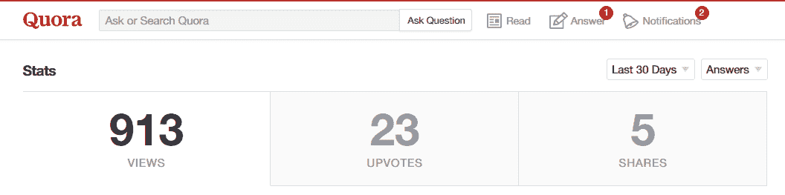

# 我如何帮助人们评估他们的想法

> 原文：<https://www.indiehackers.com/interview/how-i-built-a-business-helping-people-evaluate-their-ideas-1125a53422>

## 你好！你的背景是什么，你在做什么？

大家好，我叫尼克，是 [IdeaCheck.io](http://www.ideacheck.io/?utm_source=indiehackers) 的创始人。

IdeaCheck.io 通过自动化从创意的目标受众那里收集反馈的过程来验证创业创意。我们根据用户的想法生成一份调查问卷，在 24 小时内他们会收到一份关于这个想法可行性的报告。此外，我们将这些结果与我们迄今为止所做的所有其他想法评估进行比较，这样我们的客户就能感受到他们的想法是否真的有价值。

我们在 2016 年年中开始建设网站，从那时起，我们的收入增长到 1500 美元/月左右。

## 是什么促使你开始使用 IdeaCheck.io？

我总是有很多想法，并纠缠我的朋友寻求反馈，所以在某个时候，我失去了能忍受我源源不断想法的朋友。

我在大学学过统计学，也知道在询问朋友和家人时，有一种叫做“采访者偏见”的东西在起作用:你的朋友不想让你失望，因此，如果你的想法来自一个随机的陌生人，他们会给你更好的评价。

此外，很有可能你的朋友并不在你的目标受众中。当然，听取他们的反馈仍然是有价值的，但是你的目标受众是否关心你的想法是一个关键的洞察力，你朋友的意见不是一个很好的替代品。

许多创业书籍建议构建一个最小可行产品(MVP)来衡量初始兴趣，但我甚至会在此之前就开始。时间是你最宝贵的资源——不要在你甚至不知道实际可行的事情上花费不必要的时间。然而，你需要了解潜在客户是否对你的想法感到兴奋。

起初，在 SurveyMonkey 上发起一项调查并发送电子邮件似乎很容易，但我很快意识到:a)识别我的目标受众中的人很难*；b)让他们回复我的调查甚至更难。我因此建立了一个平台来解决我自己的问题。*

 *使用像 [IdeaCheck.io](http://www.ideacheck.io/?utm_source=indiehackers) 这样的平台而不是建立你自己的调查的另一个好处是，我们有一个现有想法评估的巨大宝库，我们用它来比较每个新想法。这意味着，我们不仅会给你的想法的创新性打 3.6/5 分，还会告诉你这是不是一个“好”的结果。此外，我们也有客户在缺乏早期销售数据的情况下与早期投资者交谈时，利用这份报告来提高他们的可信度。

## 构建最初的产品需要什么？

一开始，这个网站只是一个美化了的“联系我们”表单，我使用外部面板提供商根据提交的想法手工创建了调查。

随着订单的增长，我使用专业消费者小组的 API 自动化了问卷创建过程。该小组允许根据年龄、性别、国家和语言进行细分。我能够引导平台的开发，并在周末实现自动化算法。

## 你用你自己的平台来测试 IdeaCheck.io 的想法了吗？

当然啦！嗯，不是真正的平台，因为它还不存在 MVP 之前的初始验证，记得吗？😉但是我们将我们的验证方法应用到了 [IdeaCheck.io](http://www.ideacheck.io/?utm_source=indiehackers) 想法中，反馈是积极的。

这当然是一个相当小众的产品，但我认为每个人都有过这样的经历:他们有一个商业想法，但不知道它是否值得追求。我们为那些认真想在他们的目标受众中测试这个想法的人提供了一个简单且经济的方法。

## 你用了什么策略来发展 IdeaCheck.io 和寻找客户？

我把网站发布到 ProductHunt 和 Reddit 上，仅在第一周就从这两个渠道获得了 5 个订单。

当用户询问如何验证他们的创业想法时，我会不时地在 Quora 上发布答案。有了 Quora，提供一些与问题直接相关的可靠、高质量的内容是很重要的，而不是简单地发布一个链接到你的网站，这将(理所当然地)被否决而被遗忘

当你真正回答这个问题时，Quora 可能是一个有价值的牵引渠道，而不是简单地推销你的网站，这个渠道目前还没有被充分利用，而且最好的是，完全免费！

我仍然在尝试付费搜索广告，这当然是一个强大的工具，但需要微调以防止超支。我们正在研究 Gabriel Weinberg 的优秀著作[牵引](http://amzn.to/2kYrTec)中概述的不同营销渠道，看看每个渠道转化的如何。

到目前为止，我们已经为 [IdeaCheck.io](http://www.ideacheck.io/?utm_source=indiehackers) 确定了三个主要的目标群体，即*希望验证其假设的初创公司*、*希望确保他们所投资的初创公司*拥有良好的商业理念的投资者*以及*希望测试新产品创意的大型公司*。每个目标群体都需要不同的营销方式，我仍在为每个群体寻找理想的渠道。*

## 你的商业模式是如何运作的？你的营收背后有什么故事？

我们提供了三个等级，主要基于将为用户想法提供反馈的回答者的数量。从最小包装的 25 名受访者到最大包装的 100 名受访者不等。25 个回答者向用户提供了他们是否“有所发现”的早期指示，但是只有 100 个回答者才能获得统计上可靠/有效的结果。大多数用户选择 50 人套餐，其次是小套餐，我们使用贝宝处理付款。

我们每个订单的内部费用因所要求的目标群体而异——面板提供商对非常特殊的群体收费更高，如“女性，年龄 25-30 岁，墨西哥”，而不是“所有性别，年龄 15-65 岁，美国”。

自我们推出以来，该网站的收入稳步增长，目前达到每月 1500 美元。

## 你未来的目标是什么，你打算如何实现它们？

在接下来的两个月里，我的目标是建立一个交互式结果仪表板，用户可以在那里实时看到新的回复。仪表板将包括私下分享您的结果和导出为 PDF 格式的能力。

在商业方面，我计划通过尝试直销的方式来进入企业市场。中小型公司可以使用该工具快速测试新产品创意，以获得他们应该集中精力的早期指示。

IdeaCheck.io 当然不能取代广泛的焦点小组测试，但这是一种廉价测试大量替代品的好方法。

## 到目前为止，哪些事情对你最有帮助？对于刚刚起步的独立黑客，你有什么建议？

我和我的联合创始人都有博士学位，所以围绕用户的想法想出一个标准化的问卷对我们来说很自然。例如，重要的是问一些问题，让你实际判断你的想法是否值得追求，例如，“你多久面临一次这个问题”，而不是“你曾经面临过这个问题”。询问你的目标受众认为“太贵”的价格，而不是他们愿意为该产品支付的价格——当然，每个人都希望支付尽可能少的价格！

有一个方面在刚开始的时候经常被忽略，但似乎对 [IdeaCheck.io](http://www.ideacheck.io/?utm_source=indiehackers) 来说是有回报的，那就是将网站翻译成不同的语言。该网站目前有英语和德语版本，我计划在未来几周内增加西班牙语和法语版本。翻译网站后(没有调整我们的营销工作)，我们看到来自德国的增长明显上升。尽管几乎每个德国人都会说英语，但让用户有宾至如归的感觉似乎有助于当地市场的增长。

最后，我想推荐贝宝创始人彼得·泰尔的《T2 零比一》,因为它既有很强的激励性，又包含了实用的建议。

另一个很棒的读物是大卫·卡达维的[黑客设计](http://amzn.to/2lybycW)，这是那些在自己的项目中处理从编码到设计一切事务的开发人员的必读之作。

## 我们可以去哪里了解更多？

请随时通过 [【电子邮件保护】](/cdn-cgi/l/email-protection#c4aaada7af84ada0a1a5a7aca1a7afeaadab) 联系！我也可以在下面的评论区回答问题:

—[<picture id="ember5297694" class="user-avatar ember-view user-link__avatar"></picture>尼克·菲舍尔](/nick?id=4aYxwNqVp3aHrtjsw62eb3QfkeJ3)，IdeaCheck.io 的创建者

## 想像 IdeaCheck.io 一样建立自己的事业？

你应该加入[独立黑客社区](/)！🤗

我们是几千名创始人，互相帮助建立有利可图的业务和副业。来分享你正在做的事情，并从你的同事那里获得反馈。

还没准备好开始使用你的产品吗？没问题。这个社区是一个认识人、学习和实践的好地方。随意[随便浏览](/)！

—[<picture id="ember5297699" class="user-avatar ember-view user-link__avatar"></picture>考特兰艾伦](/csallen?id=ibTLPyjwVebnZjMGKvz6ztarnuV2)，独立黑客创始人

8votes*