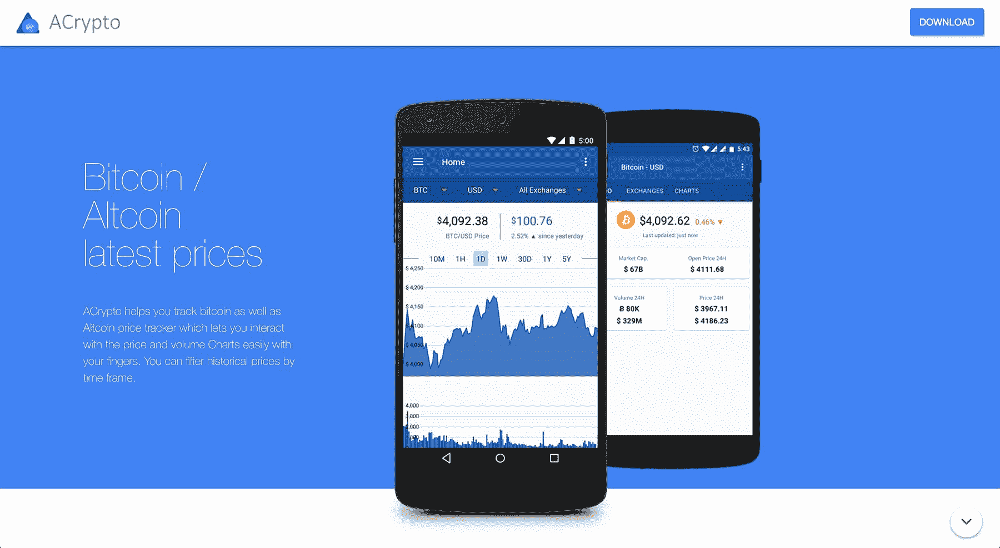
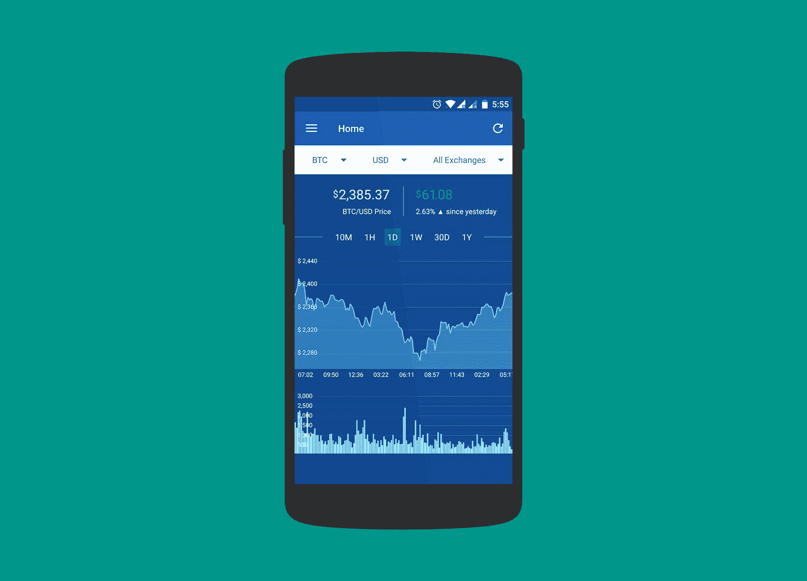
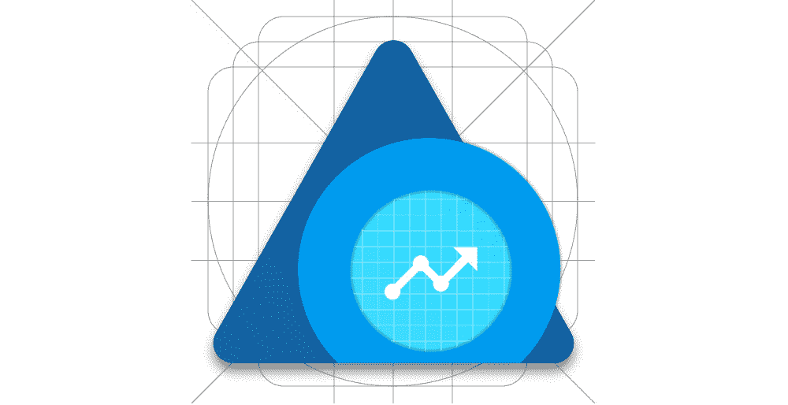

# 我如何建立一个加密货币交易应用程序，每月赚 4k 美元

> 原文：<https://www.indiehackers.com/interview/how-i-built-a-cryptocurrency-trading-app-that-makes-4k-mo-1a0b19fdc4>

## 你好！你的背景是什么，你在做什么？

你好。我是 Hari Krishna，来自印度的计算机科学毕业生。在过去的八年里，我做过开发人员、工程经理、产品经理、企业家、设计师和成长黑客。

我目前正在开发 [ACrypto](https://acrypto.io) ，这是一款面向交易者的一体化加密货币工具。它使用户能够跟踪他们所有的加密货币，为他们的首选价格设置警报，寻找套利机会，在一个地方维护来自多个交易所的加密投资组合，并阅读来自加密世界的最新消息。

任何人，无论是交易者还是投资者，或者只是对加密货币感兴趣的人，都可以开始使用该应用程序。他们喜欢 ACrypto 的地方在于它简单、不友好，而且非常全面。

目前，ACrypto 拥有超过 **10 万**的用户和**100 万**的月会话，并且用户和月收入还在以 80% 和 56% 的速度增长。

 

## 是什么促使你开始使用 ACrypto？

毕业后，我于 2009 年创建了 DWorkS，从那以后，我一直从事小型应用程序、开源库和创业公司的工作(除了我的案头工作)。我建立了一个浏览器，一个下载量超过 100k 的文件管理器，我也是一个非常受 android 开发者欢迎的叫做 VolleyPlus 的网络库的作者。

这一切都很好，但我真的想在一家初创公司工作——我最终做到了。但在两次失败的尝试(Gotogether 和 Shifoo)之后，我意识到创业并不是我真正喜欢的，于是我缩小了规模，考虑做一些微型创业。我也想周游世界，像数字流浪者一样生活在不同的城市。与此同时，我想结识不同的人，体验不同的文化，并在此过程中建立微型创业公司来解决世界上的小问题。

大约在这个时候，我的一个好朋友向我介绍了比特币。我对加密货币非常着迷，开始小额投资。第一周一切都很好，因为我对一切都很陌生，但第二周我开始意识到有这么多问题。交易甚至管理加密货币都不容易。我来总结一下问题:

*   对于每个任务，我都必须使用不同的网站，而且不是每个网站都支持所有的法定货币
*   我经常使用移动设备，用手指与各种 UI 元素进行交互，比如缩放图表转盘，这是一件非常痛苦的事情
*   为了获得最新的加密货币新闻，我不得不访问不同的新闻网站
*   我想为这些网站添加提醒，但它们中很少支持提醒(并且少数支持提醒的网站缺乏其他重要功能)
*   我发现有很多套利的机会，但没有网站或应用程序以一种容易理解的方式展示这一点
*   我想保持我的投资组合和所有这些东西，这同样是不可能的

所以我把这件事掌握在自己手中，决定给自己建一个 app。在这个过程中，我意识到我并不是唯一一个面临这种问题的人，于是我决定在《谷歌 Play 商店》上发表这篇文章。我开始在公司内部分享，一炮而红。这帮助我认识到它的潜力。

当时，我在 Practo 公司担任高级产品经理，过得很开心，但我无法抗拒密码世界的召唤。于是我辞掉了工作，决定全职做我的项目，从此一往无前。从那以后它一直呈指数增长。

## 构建最初的产品需要什么？

我决定开发一个 android 应用程序，因为我已经做了五年的 Android 开发者，并且很擅长这个。我休了一周的假，坐在家里不停地编码，七天后发布了 MVP。我知道这听起来如何，但是我使用了来自我的开源项目[a explorer](https://github.com/1hakr/AnExplorer)的样板代码，这让事情变得简单了。

我想一次开发所有的功能，但是我的产品经理直觉告诉我，我把功能削减到了我认为最重要的前三个(如果没有这三个功能，应用程序将毫无用处)。

所以我选择了图表、硬币清单和新闻。我在网上搜索这些数据的免费 API，幸运的是找到了一些，并开始使用其中的一个。为了制作图表，我使用了一个名为 [MPCharts](https://github.com/PhilJay/MPAndroidChart) 的开源库。你会惊讶地发现，只使用开源项目就能构建出又大又漂亮的应用程序。

人们经常犯的一个错误是想得太多，花太多时间来推出产品。

TweetShare

我花了一两天时间准备好 v0.1。有趣的是，这不是第一次公开发布。我在谷歌 Play 商店上使用了 [alpha 测试功能](https://developer.android.com/distribute/best-practices/launch/beta-tests.html)，这是一个测试 MVP 的好方法，没有任何副作用。我邀请了我的兄弟和我公司的几个朋友，开始 [dogfooding](https://en.wikipedia.org/wiki/Eating_your_own_dog_food) ACrypto，我很快发现了大量的问题和漏洞。我每天都在修复和发布新的更新。直到 v0.4 我才公开发布 app。

此后，我每周挑选一个功能，并在 Google Play 的测试版上推出 3-4 天。

我使用[云函数](https://firebase.google.com/docs/functions/)编写了我所有的生产就绪后端代码，我可以告诉你，学习、编写和发布它绝对是一种乐趣。我不知道 NodeJS，但因为它太简单了，我能在一周内掌握它。再过一周，我的产品后端就准备好了。

我不得不为 [Firebase](https://firebase.google.com) 为开发者制作了如此神奇的工具而欢呼。我目前在 Firebase 中使用了超过 12 个特性，我敢打赌，它至少节省了我 2-3 个月的开发时间，这对处于微启动阶段的你来说非常有价值。

 

## 你是如何吸引用户并发展成一个网站的？

我知道要发展，我需要更多的用户。我最初并不知道“产品发布”，只是在七周内通过 **10k 下载**后才知道。是的，我知道你可能在想什么，但这是我的第一次微型创业，它是如此势不可挡，以至于我没有围绕它组织或创建一个计划。一切都是临时的。我做了几件零成本的事情，赢得了我所有的现有用户。到现在为止，我还没有在营销上花一分钱。

所以我是这样做的:

*   敲定了 **ASO** (应用的 SEO)。这是最难的部分之一，它可以很容易地成倍增加你的下载量，或者彻底击垮你。确保你做对了。我做了一个功能的初步草案，然后得到了所有我的竞争对手的描述，提取关键字。然后我使用 [Apptimizer](https://www.appbrain.com/apptimizer/bitcoin-price-portfolio-alerts-tracker-acrypto/dev.dworks.apps.acrypto) 获得更多的关键字，并重新构建我的应用程序描述以适应这些关键字。这是一项乏味的工作，但完成的成果是值得的。
*   获得正确的**应用图标**。是的，没错——这是描述之后第二重要的事情。我从一开始就是一个动手的设计师，这对我帮助很大。我从我的设计师朋友那里得到了反馈，就是这样。
*   寻找**朋友和同事**。它们也是获得大量下载的好方法。我骗了我的一个朋友把它发布在我们公司面向开发者的 Slack 频道上。😁
*   构建**登陆页面**。这主要是为了分享链接，所以它不需要那么大。简单的独立网站就可以了。查看[加密登陆页面](https://acrypto.io)。如果你想在网上分享你的产品，这是必须的。
*   脸书和 Google Plus 社区是获得目标用户的另一个简单方法。搜索所有相关组。只需加入并在其中发帖。确保你有好的 gif 图片，上面有这些特征，并添加一个链接。
*   **Product Hunt 和 reddit** 也是开始推广你的应用并获得良好反馈的好地方。我为这两个平台制作了两个不同版本的副本，因为受众完全不同。Reddit 用户喜欢直截了当，而产品搜索用户更愿意接受更花哨、更俗气的措辞。
*   **客户支持**。这很容易被大多数人忽略，但它是目前为止应用增长和产品增长最有力的工具。所以我以前做的就是回复每一封邮件。我以前每个月会收到 1000 多封电子邮件。我知道，这很疯狂，但是我喜欢解决和回复用户的问题。除此之外，我还会附上一份结束调查问卷，询问用户是否喜欢这个应用程序。相信我:这可以创造奇迹。

就这样。六个月后，ACrypto 的下载量已经超过了 **10 万次**。

 

## 你的商业模式是什么，你是如何增加收入的？

这对我来说非常棘手。我必须赚取一些收入来帮助我支付我的账单，因为我不想回到办公室工作。此外，我在第一个月对收费非常怀疑，因为我的产品处于非常早期的阶段。此外，对于像我这样的服务，我不能收取一次性费用，因为加密是一项持续的服务。所以唯一的选择就是每月订阅一次。

因此，我没有直接从付费订阅选项开始，而是发布了所有的付费功能，并附上一个小横幅，上面写着“这是一个专业功能，需要尽快付费。”。我把它放在 Firebase 的另一个神奇工具[远程配置](https://firebase.google.com/products/remote-config/)的后面。这种方法在两个方面帮助了我:

1.  我可以测试、改进并使应用程序变得健壮，并为订阅做好准备。要做到这一点，你需要大量的测试，因为这是在金融领域，而我只是一个人。远程配置是改进付费功能的一个很好的工具。
2.  我可以随时打开付费功能，并且可以根据使用情况来打开。

以下是我做的一些其他事情:

*   我添加了一个新的付费功能的部分，只有一个“即将到来”的消息，以获得需求的感觉。它非常有效。
*   我将价格保持在每月 1.99 美元，尽管我的竞争对手每月收费 6-12 美元。这给了我一个巨大的优势。

三个星期后，下载量突破了 10k，我启用了付费功能，订阅来自左边、右边和中间。我的策略得到了回报，并巩固了我对 ACrypto 未来潜力的信心。

目前我的月薪是 3500 美元，我预计在未来几个月内会增长 3 倍。我有 60%的利润率，因为谷歌拿走了 30%，世界各地的税收下降了近 10%。刚刚过去四个月，营收已经高于预期。

| 月 | 收入 |
| --- | --- |
| 八月 | 850 |
| 九月 | 1810 |
| 十月 | 1830 |
| 十一月 | 2265 |
| 十二月 | 3500 |

注:12 月的收入是预计的。

我做的最好的决定之一是尽早赚钱，而不是等到应用程序有很多用户的时候。我知道多等一会儿是一种常见的策略，但相信我，一旦你有了大量的用户群，开始收费一点也不容易。如果你提供增值服务，尽早赚钱。

## 你未来的目标是什么？

加密货币目前正以 1000%的速度增长。这对加密货币领域的人来说是一件好事，它不仅为加密人，也为其他人提供了很多机会。

可以肯定的是，这个领域的竞争非常激烈，我们不是市场上唯一的大玩家。但我的愿景是真正让 ACypto 成为交易者的一体化工具，为此，我需要构建以下功能:

*   **交易所整合**使得交易可以在一个地方完成
*   实现**税收和会计**功能来管理交易者的买卖——目前还没有人这么做
*   产生**交易信号**。我想使用机器学习和人工智能以及[回测](https://en.wikipedia.org/wiki/Backtesting)模型来预测并给出交易建议。

我不得不承认，我被《埃及艳后》的成功惊呆了。除了新功能，我计划将用户群增加至少 3 倍。为此，我建立了一个推荐功能，给推荐人和被邀请人免费订阅。我相信这将是以短期收入机会为代价获得更多用户的另一个好方法。

我最近还在 iOS[上发布了一个 ACrypto。它的发展方式与安卓应用类似，但仍处于早期阶段。我的主要关注点是给平台带来平等，让一切都变得稳定和健壮。](https://itunes.apple.com/us/app/acrypto-bitcoin-price-tracker/id1305881380?mt=8)

## 如果你必须重新开始，你会做什么不同的事？

我犯的一个最大的错误是包含了一个我认为可以工作的库，而没有对它进行测试。每当有新版本的应用程序时，它都会向用户显示更新。这是一行代码，由于某种原因，我没有测试它。但是一个月后它回来咬我。

我还记得我发布 ACrypto 0.7 版的时候。不到一小时就有一万起撞车事故。一切都乱套了，我陷入了一片混乱的恐慌之中。但我还是鼓起勇气解决了这个问题。然后，我发布了一个更新，并立即向我的所有用户发送了关于崩溃的通知更新。我认为这让我损失了超过 5000 个用户，我甚至还没有跨过 10k 大关。

那天我学到的一课是，不管事情有多糟糕，总有办法让事情变得好一点。

我犯的另一个大错误是为亚马逊应用商店构建。这本来是一件简单的事情，但不幸的是，谷歌和亚马逊并没有很好地融合。Firebase 在 Andorid、iOS、Web、Unity、C++等平台上运行良好。但它在 Fire OS 上无法工作，Fire OS 是谷歌自己的 Android OS 的一个分支。

但我发现增长的潜力令人信服，所以在为 iOS 开发之前，我重写了 30%的应用程序，使其适用于亚马逊设备。我在亚马逊应用商店上发布了它，但直到今天我都没有运气——他们拒绝了 ACrypto，称它为赌博应用。我已经和他们的支持人员联系了十几次，但总是得到相同的标准答复，他们无法确定问题，因为他们收到了太多的提交。

如果让我再做一次，我会直接跳过亚马逊应用商店，这样可以节省一个月的时间。我想引用我自己的推特，它总结了我的经历:

> 大多数情况下，与应用商店的合作都很棒。和@GooglePlayDev 一起工作绝对是一种享受，就像走蛋糕一样。而使用[@苹果](https://twitter.com/Apple) appstore 就像在一个繁忙的公园里散步。和 [@AmazonAppDev](https://twitter.com/@AmazonAppDev) 在一起就像在沙漠中行走，这是你最可怕的噩梦
> 
> —Hari([@ 1 hakr](https://twitter.com/1HaKr))[2017 年 12 月 18 日](https://twitter.com/1HaKr/status/942907193321328640)

 

## 你面临的最大挑战和克服的障碍是什么？

对于 iPhone 应用程序，我必须学习 Swift 和 iOS。最大的痛苦之一是掌握 XCode 中的自动布局，但我设法做到了这一切，并在 35 天内发布了它。是的，我自己也很惊讶。它现在正经历着 70%增长率。我很开心，也很自豪。我学到了一些新东西，并且乐在其中。

就记忆而言，我做了一些事情，也学到了一些东西:

*   你需要不断地(并且无限期地)接触你的用户。不管你有什么类型的产品，也不管你在哪个领域经营。
*   确保你的应用程序不会崩溃。这是记忆的经验法则。ACrypto 有一个 **99.67%** 的无崩溃率，我可以把 ACrypto 的大部分保留归功于此。
*   通知就像是任何应用程序成功的燃料。这是另一个可以决定你的应用成败的特性，取决于你如何使用它。我使用通知来缓解问题，比如提前通知用户即将到来的停机时间、关键错误等。因此，在留住用户方面，通知也帮助我走了很长的路。

## 有没有发现什么特别有帮助或者有优势的？

真正帮助我的事情之一是抓住了加密世界的上升趋势，并乘着这股浪潮前进。如果我等到今天才开始，我怀疑我会获得同样的成功。所以找准时机非常关键。

另一件我认为一直有效的事情，至少对我来说，是建造我个人非常需要的东西。在我看来，你是产品/市场适合度的最佳验证来源。我的两个微型创业公司都做得很好，因为它们是我专门为自己打造的。一个细微的变化是当你很好地理解了这个问题。这大大增加了你成功的机会。

我把这件事掌握在自己手中，并决定为自己开发一个应用程序。

TweetShare

此外，我作为开发人员、产品经理、设计师和增长黑客的经验很容易地为我节省了很多我原本要花在学习上的时间。

## 对于刚刚起步的独立黑客，你有什么建议？

我在网上看过很多关于独立黑客开发惊人产品的资料，但大多数都是网络应用。对于像我这样的移动应用开发者来说，几乎没有任何例子。因此，对于所有像我一样想开发优秀产品或运营小型创业公司的移动开发者来说，请记住以下几点:

*   只是释放。人们经常犯的一个错误是想得太多，花太多时间来推出产品。我建议不要超过两周，拿出你的 MVP。我认为，这是独立黑客的最佳策略
*   总是在尽可能多的渠道发布你的产品，比如 Android、iOS、Amazon、Mac 和 Windows(当然是按照你自己的节奏)。这绝对有助于你最大限度地发挥你的潜力。
*   大胆梦想，不要犹豫；做任何事都不要保守。在你所追求的事情上要有进取心，并学会处理失败。这是你要处理的最困难的事情，但是一旦你克服了它，没有什么能阻止你前进。

## 我们可以去哪里了解更多？

你可以随时通过 Twitter 联系我，电话是 [1HaKr](http://twitter.com/1HaKr) 。如果你想了解我更多，请访问我的[网站](https://1hakr.com)。如果你有任何问题，或者想了解更多关于我是如何做到这一切的，欢迎在这里发表评论。

我要感谢钱宁邀请我参加独立黑客。我非常喜欢分享我的经历。😊

——[<picture id="ember8159117" class="user-avatar ember-view user-link__avatar"></picture>HaKr](/1hakr?id=DUeGPz3o8HXmTZFDrwNRYlKSKmj1)，ACrypto 创始人

## 想像 ACrypto 一样建立自己的事业吗？

你应该加入独立黑客社区！🤗

我们是几千名创始人，互相帮助建立有利可图的业务和副业。来分享你正在做的事情，并从你的同事那里获得反馈。

还没准备好开始使用你的产品吗？没问题。这个社区是一个认识人、学习和实践的好地方。随意[随便浏览](/)！

——[<picture id="ember8159122" class="user-avatar ember-view user-link__avatar"></picture>柯特兰艾伦](/csallen?id=ibTLPyjwVebnZjMGKvz6ztarnuV2)，独立黑客创始人

19votes