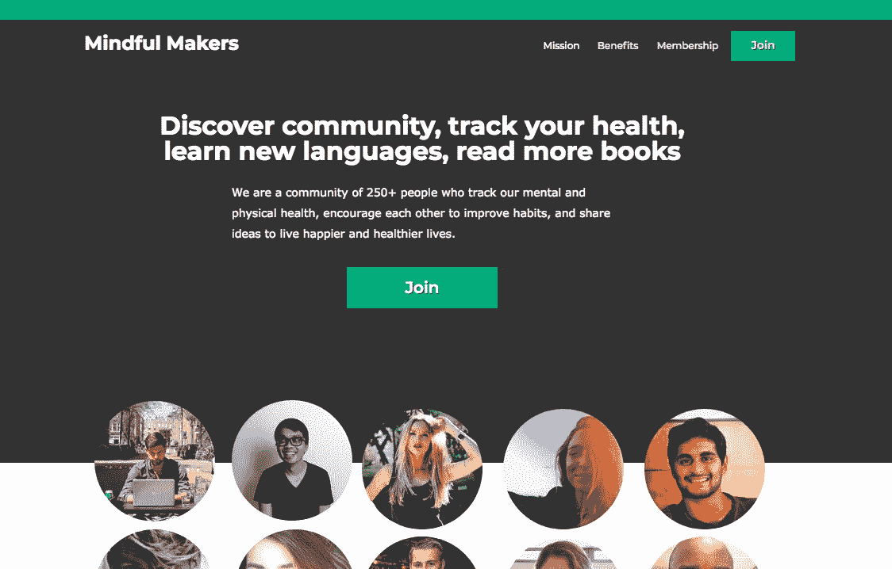
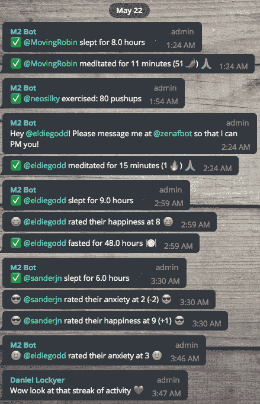
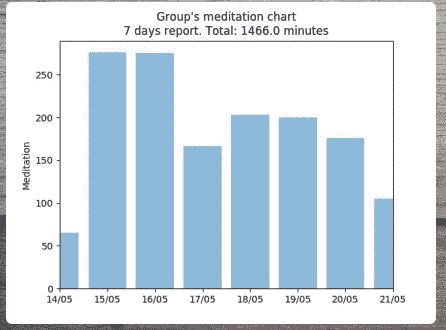
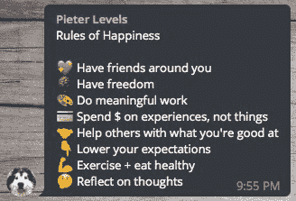
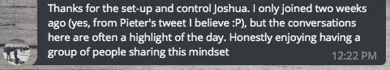

# 我如何用机器人和人类建立一个健康快乐的社区

> 原文：<https://www.indiehackers.com/interview/how-i-built-a-health-and-happiness-community-with-bots-and-humans-879a00fce7>

## 你好！你的背景是什么，你在做什么？

你好。我叫 Joshua Voydik，我创建了一个名为[minded Makers](https://mindfulmakers.club/)的社区，这个社区是为制造者、创造者和创始人提供的，他们可以使用机器人来跟踪精神和身体健康，与优秀的人联系，互相学习，变得更加快乐和健康。

我们有一个主要的聊天小组，一个读书俱乐部，语言俱乐部，和一个小的智囊团。我在全职工作的时候就开始做“正念创客”,从那以后我开始做兼职。自 2014 年以来，我一直在远程工作，为科技初创公司做业务开发。

我们现在每月 500 美元，而且还在稳步增长。

 

## 是什么促使你开始关注创客？

我的朋友 [Pieter Levels](https://twitter.com/levelsio) 在 2017 年 12 月向我介绍了平台电报。我开始使用它，并喜欢它是一个可编程的平台——创建机器人做你想做的任何事情。我第一次加入 Work In Progress 是一个由 Marc klbrugge 创建的 Telegram 社区，专注于发布新功能和产品，我还加入了其他一些团体。

2018 年 1 月，我开始了[正念创客](https://mindfulmakers.club/)。我一直渴望深入的对话，我发现 Twitter 不是一个进行细致入微的对话的好地方，因为它们并不完全是实时的——你只能获得某人实际上试图传达的信息的一小部分。没有多少地方可以让人们联系到哲学思想、大局和生活。我试图创建一个不一定关注工作，而是关注生活方方面面的社区，并带有正念和自我成长的意味。

我试图创建一个不一定关注工作，而是关注生活方方面面的社区，并带有正念和自我成长的意味。

TweetShare

几乎没有产品验证。当我随意邀请新成员时，人们告诉我这是一个好主意，我注意到对话的质量在不断提高。人们要求机器人提供更多功能，我们开始受到关注。所以我一直坚持下去。最终，我们开发了这个机器人，让会员可以追踪:

1.  每晚睡眠
2.  幸福水平
3.  焦虑水平
4.  日记账分录
5.  冥想课程
6.  练习
7.  处于禁食状态的时间

从一开始，成员们就一直在谈论深刻、复杂、感性和哲学的观点，我意识到保持高质量的对话非常重要。在看到像罗宾·威廉姆斯和安东尼·鲍代恩这样的人自杀后，我明白心理健康是一个至关重要的问题。如果正念创客中的任何人正在处理焦虑或抑郁，我们鼓励他们表达自己，无论是在主要的小组聊天中，还是与某人单独交谈。如果我们看到有人高度焦虑或低幸福水平，许多成员会伸出手来提供支持。

 

## 构建最初的产品需要什么？

当创建自己的社区时，有一些很好的平台可以使用，如 Slack、Discord 和 Telegram。我选择了电报，因为它看起来很有前途。

设置它花了几分钟。我尝试了很多品牌和营销战略/策略。我想尽一切办法看看什么能坚持住。重新命名这个组，最初叫做“Zen AF ”,但是我认为这个名字太粗糙了，而且不可扩展。我甚至买了一个麦克风，并开始了播客，但这也没有坚持。

早些时候，我在考虑创建一个机器人来记录冥想会议。我的一个早期成员想要帮助创建一个机器人，所以他写了基本代码。从那以后，我与机器人开发者和[流浪者名单](https://nomadlist.com/)的经理[丹尼尔·洛克耶](https://twitter.com/daniellockyer)建立了良好的关系，并提拔他为社区管理员。在他的帮助下，以及他的室友 Jet Holt 的一点帮助下，我们能够创建一个强大的机器人来跟踪精神和身体健康，显示每周/每月记录数据的图表，以及将您的统计数据发送到您的电子邮件的汇总功能。

 

最初，我并不认为这个团体会成为什么。但是随着越来越多的用户开始加入，对话开始升温，人们开始记录东西，其他制造商鼓励我赚钱。于是我照做了。

我的起薪是每月 9 美元。我意识到那个价格太低了。现在是 14 美元/月。对于集团的货币化，条纹是我的首选方法。我目前正在使用 Zapier 自动处理一封在有人付费后带有私人邀请链接的电子邮件。

我通常每天和周末都参与社区工作。像这样的社区很酷的一点是，我们鼓励人们用心参与，所以我的目标不是让人们粘在他们的屏幕上。事实上，我想要完全相反的。当他们参与到社区中时，我希望人们能找到平衡点并报告他们的发现。

我不断地问人们他们会发现什么是有价值的，他们想要什么。很多时候，成员的反馈决定了特性和社区的性质。其他时候，我用我最好的判断来引入一个新的想法，看看它是否可行。我们在《用心创客》中引入的每一个好主意，都有 10 个坏主意。

我利用我在 Twitter 上的关系，亲自邀请人们来我的平台。Pieter Levels 在推特上发了几次关于我的小组的消息，这对我帮助很大。它基本上是零成本启动的。我在甘地花了 0.99 美元购买了 mindfulmakers.club。

我认为我很擅长将人们联系在一起——让他们从不同的角度看问题，帮助引入新的想法。当你有了自己的社区，就没有规则了。我喜欢把它变成我想要的东西的创造力。

我非常感谢社区成员的所有帮助。我很幸运。

 

## 你是如何吸引用户和培养有意识的创造者的？

我知道，为了获得新面孔，我们需要正确的信息和使命。我花了很多时间来管理这个小组，以反映我们开放、负责和细致入微的讨论的价值观。这个团体并不适合所有人，我希望人们明白这一点。我开始在 Twitter 上与人们交谈，并邀请他们中的许多人加入我们的社区。

在成立这个小组后不久，我问一些正在工作的成员是否有兴趣免费加入。在 WIP 上发了几次邀请，在 Twitter 上发了几次帖子之后，我有了一个健康的社区，人们几乎无所不谈——没有什么是禁忌。太棒了。感觉就像高中或大学。然后更多的人想要加入这个社区。

这个社区有几个月是免费的，但是当我有了 200 多个成员后，我意识到这是赚钱的好时机。从那以后，我非常感激 Pieter Levels 能够在推特上发布几次关于这个社区的消息。我们的大部分增长来自 Twitter 和口碑。

我的朋友凯文·埃斯皮里图经营着一家超级成功的网站[史诗园艺](https://www.epicgardening.com/)，他告诉我，我应该做一些*做不到的事情*。如果我过于关注规模而不是社区，它可能会降级并失去其价值。

以下是我所做的总结:

1.  找出我们的核心使命，帮助人们变得更快乐、更健康
2.  询问当前社区他们喜欢它的什么，以及如何改进它
3.  鼓励讨论问题，以及跟踪机器人的健康状况
4.  在 Twitter 上分享人们的赞美、突破和经验
5.  偶尔向 Pieter Levels 和其他社区成员寻求帮助
6.  对于每一个新加入社区的人，我都试着和他们建立个人联系，欢迎和感谢他们

我努力培养一群真正想去那里的人，同时确保高质量的对话。许多这种类型的网络社区都是由男性主导的，所以在社区中有一个强大的女性存在是很重要的。目前，分享这一话题的男性和女性数量相当可观。

六月，在一篇讨论正念和冥想的*华尔街日报*文章中提到了正念制造者。像 Headspace 和 Calm 这样的应用程序提到了我们的名字，这很酷。

 

## 你的商业模式是什么，你是如何增加收入的？

Mindful Makers 是一种标准的订阅模式，拥有月、年和终身会员资格。一开始我觉得我没有提供足够的价值，我没有。但一旦我们提供了一个更强大的跟踪机器人，我决定尝试一下货币化。一开始觉得不值得 20 美元/月，就从 9 美元/月开始。从那以后，我慢慢地把价格提高到每月 14 美元，因为我们找到了提供更多价值的方法。

这个社区很酷的一点是，我们鼓励人们只在有意义的时候使用它。用心消费，而不是沉迷于产品/社区。我希望人们在有意义的时候参与并记录事情(我们有一个 backlog 功能来跟踪事情，即使你错过了一天)。我试图维持一种既反映深思熟虑的被动又反映参与的定价结构。

赚钱后不久，我的收入达到了 100 美元，然后第一个月是 200 美元，第二个月是 300 美元，第三个月是 400 美元，现在是 500 美元。唯一的开支基本上是新的机器人开发，如先进的机器人功能。有时我会编写一些基本的机器人功能，但通常在我们需要其他东西时会利用丹尼尔的专业知识。

## 你未来的目标是什么？

我们希望继续引进具有不同观点的新人。有可能为我们的用户创建独特的仪表板，尽管我不认为它们会有用。此外，我希望人们少看屏幕和仪表盘，多生活在现实世界中。我们也在寻找扩大社区的方法，以包含更多的主题，例如我们新的读书俱乐部、语言小组和一个小型策划小组。

我们将在未来几周推出产品搜索，这应该有助于将有意识的制造商提升到一个新的水平。我将花一些时间瞄准并与一些有影响力的人一起工作，他们可以帮助社区带来新的流量和成员。

我们当然面临挑战，比如 Telegram 关闭，以及相关社区抢走我们的一些用户。不过，我不太担心。现实地说，人们不希望不断地转换群体。我们已经能够培养那些看到价值并希望看到社区扩大的个人的坚实基础。

我想通过利用视频和音频更好地使社区人性化。我们已经在这么做了，但是还有很多发展的机会。

 

## 你面临的最大挑战和克服的障碍是什么？如果你必须重新开始，你会做什么不同的事？

找到合适的产品并接触到合适的受众是非常重要的。有些人没有在社区中找到价值，而其他人提到这改变了他们的生活。因此，它是关于创建功能、传递信息和招募合适的人，以便它继续提供价值。

增长并不容易。目前，我们只在 Twitter 上列出。弄清楚如何在不同的平台上传播我们的社区将是一个挑战，同时保持使命和信息的一致性。

集团在不断发展，因此确保我们在保持核心原则的同时继续提供价值是非常重要的。

## 有没有发现什么特别有帮助或者有优势的？

真的在乎。关心其他人类。与你的用户群互动。我发现，如果我把自己放在那里，真诚地征求人们的意见、反馈和帮助，他们会很乐意提供，最终引导产品。

关心其他人类。与你的用户群互动。我发现，如果我把自己放在那里，真诚地征求人们的意见、反馈和帮助，他们会很乐意提供，最终引导产品。

TweetShare

社区鼓励彼此创造和追求健康和快乐的习惯，所以说出我的感受很有帮助。在某种程度上，这就像团体治疗，这是非常强大的。

运气不在你的掌握之中，所以尽你所能去创造你自己的运气。每天都出现，尽量不要气馁。当你对生活中的任何事情感到沮丧时，与其他人交谈会有很大的帮助。

除此之外，把你自己放在那里，友善一点，试着创造性地为你遇到的每个人提供价值。

## 对于刚刚起步的独立黑客，你有什么建议？

要真实。建立你真正想要的东西，不要让别人(或你自己)阻止你。不断向你的用户群寻求反馈。向他人学习，但要意识到没有人知道所有的答案——他们就在那里等着你去发现和探索。

把你自己放在那里，友善一点，试着创造性地为你遇到的每个人提供价值。

TweetShare

## 我们可以去哪里了解更多？

如果我们的社区听起来很有趣，我们很乐意邀请你。你可以在这里加入我们。

你也可以在推特上找到我: [@joshvoydik](https://twitter.com/joshvoydik) 。

— [约书亚·沃迪克](https://joshvoydik.com/)，专注制造者的创造者

——[<picture id="ember5203031" class="user-avatar ember-view user-link__avatar"></picture>约书亚·沃迪克](/joshuavoydik?id=djK1pFMm1ag7mrB5HggvvPyWQ782)，正念制造者的创始人

## 想像有意识的创客一样建立自己的事业吗？

你应该加入[独立黑客社区](/)！🤗

我们是几千名创始人，互相帮助建立有利可图的业务和副业。来分享你正在做的事情，并从你的同事那里获得反馈。

还没准备好开始使用你的产品吗？没问题。这个社区是一个认识人、学习和实践的好地方。随意[随便浏览](/)！

——[<picture id="ember5203036" class="user-avatar ember-view user-link__avatar"></picture>考特兰艾伦](/csallen?id=ibTLPyjwVebnZjMGKvz6ztarnuV2)，独立黑客创始人

36votes