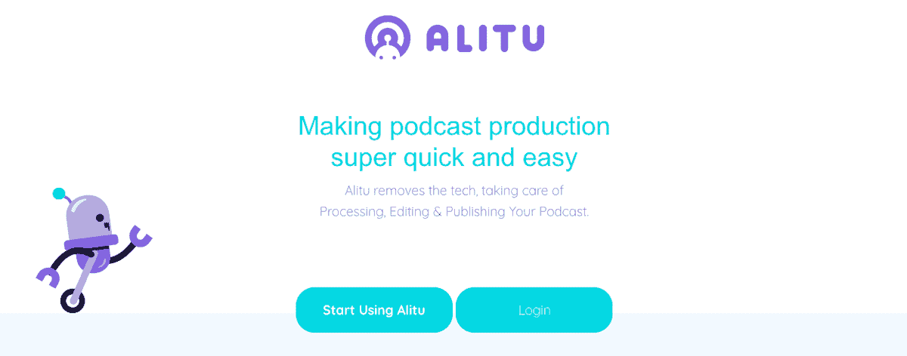
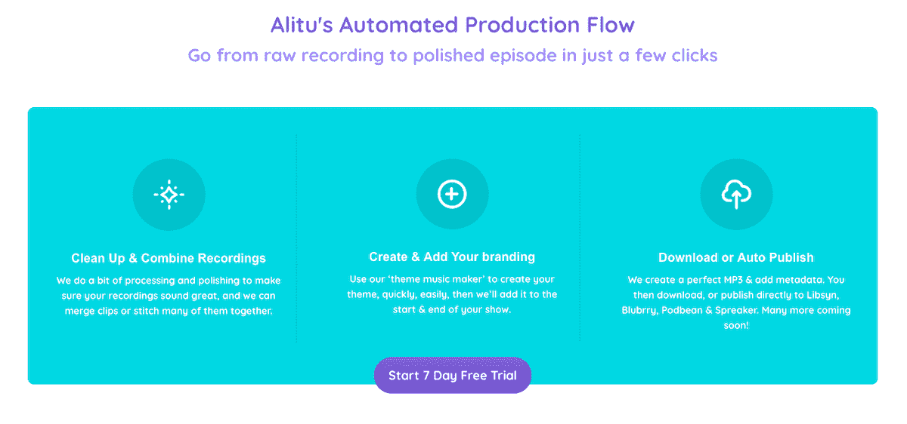
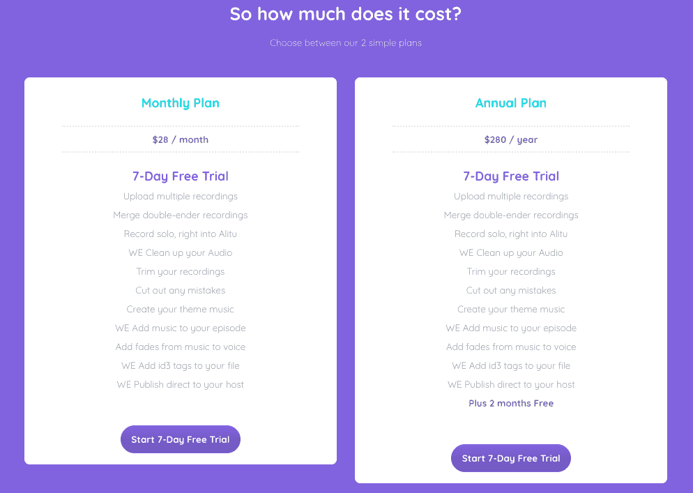
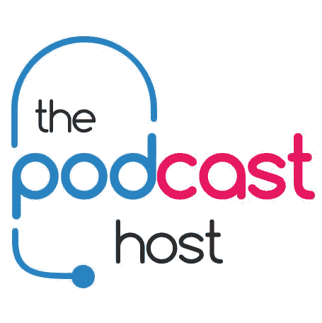

# 我如何构建一个可扩展的产品来推动我的业务(反之亦然)

> 原文：<https://www.indiehackers.com/interview/how-i-built-a-scalable-product-that-fuels-my-business-and-vice-versa-32ab051fb9>

## 你好！你的背景是什么，你在做什么？

我叫科林·格雷，住在苏格兰的邓迪。我的背景有点不拘一格。我一开始是一名天体物理学毕业生，但我认为要弄清楚空间是如何工作的太复杂了，所以我跳到了网页和媒体设计领域，做了几年网页开发员。我最终在爱丁堡从事学习技术的工作——基本上是教讲师如何使用技术来提高他们的教学水平——当然，我们讨论的技术之一就是播客！所以我把学习播客作为我演讲角色的一部分，并结合我的网络开发经验，让我在 2011 年创办了 ThePodcastHost.com。

在接下来的几年里，我以兼职的方式发展这个网站，建立代销商收入和客户工作，最终赚到足够多的钱(亚马逊代销商和客户收入已经增长到大约 4000 英镑/月)来雇人，并在 2015 年成为全职。收入不足以支付我们两个人的工资，但足以承担风险。那时，我的目标是在三个月内支付这两笔工资，并为我们自己开发一些产品，以摆脱我们所依赖的 75%的代销商收入。

首先是我们的教练会员产品。其中包括一系列关于播客的深度课程(学习技术背景在这里派上了用场！)，一些资源，播客工具，一个音乐库，一个论坛社区，每两周一次的现场辅导。

但是，在 2016 年底，我有点厌倦了与所有其他教学资源竞争，并有了一个暗示，我想建立一个软件产品。我想让我们的平台更加独特，更难与之竞争。我们的观众经常提出的最大问题是关于剪辑的。很多人讨厌使用 Audacity 和 Audition 这样的工具。他们想做的就是让他们的唱片走向世界，听起来很棒。

所以，这就是 [Alitu](https://alitu.com/) 的设计目的:作为普通播客的个人制作人。它绕过了编辑软件，自动化了许多重复的任务，如添加音乐、转换音频、调平、剪辑过渡、导出和发布。如果你需要的话，它还可以帮助你编辑剪辑，并把一系列的录音放在一起，包括广告。

不过，在这段时间里，我们一直在把 ThePodcastHost.com 作为一个有会员收入的免费内容资源，以及作为付费会员产品的学院来发展。这使得我们能够在一年半的时间里启动 Alitu，现在 Alitu 已经运行了五个月，并开始收回成本。

目前，ThePodcastHost.com 仍然是我们的主要收入来源，每月大约有 14，000-16，000 美元的收入在会员收入中分配。Alitu 现在有 130 名付费用户，每月增长约 25 %, 11 月超过 3000 美元 MRR。

 

## 是什么促使你开始使用 Alitu？

我在上面提到了这个想法是如何产生的，但是当涉及到动机时，验证是一个有趣的问题。这真的归结为与我们现有的许多观众交谈。我们的主网站 ThePodcastHost.com 每天接收大约 5000 到 6000 名用户，我们通过电子邮件列表、调查和网站上的聊天工具对他们进行游说。我们问了尽可能多的人——你在纠结什么？就像我说的，许多人提到编辑和制作是最大的障碍。要么他们学不会技术，要么他们没有时间。

基于这些信息，我们对 Alitu 做了一个简短的描述——实际上只是一个口头原型或推介——并开始与用户讨论它。许多人说，只要它能减轻他们的压力和节省他们的时间，他们就会使用它并为此付费，所以我们知道我们正在做一些事情。

如果我们有更少的用户来游说，我想我会想创造一些更具体的东西，并在真正投入之前与用户一起测试。或者，我会考虑开展预售活动，以获得更强的认可。但是，我们设法交谈的人的数量足以说服我在这方面投资。除此之外，我从事播客已经超过 10 年了，并且和这个领域的很多人一起工作过，有时候直觉就足够了。

## 构建最初的产品需要什么？

2016 年 9 月，我整理了 Alitu 的第一份计划。其中包括所有功能的完整概述和一组用户案例。我最初考虑与一家代理公司合作，然后外包给三四家不同的网站开发公司。回来的提议和成本是如此的不同，以至于我意识到外包太不可预测，并且把太多的控制权放在别人手里。通过这些谈话，我也开始认为与代理机构合作会受到太多的限制。他们设定了一个规格，并且，在很大程度上，我们将始终坚持这个规格，或者整个提案/成本估算和项目计划将不得不改变。

于是，我开始关注开发商。通过一个朋友的介绍，我找到了一个当地的开发人员，并开始和他一起工作。他的角色是一名 DevOps 工程师，本质上是一名后端开发人员——node . js 和 AWS 是他的行业工具——我们设定的第一个任务是构建服务器基础架构，并确保我们可以构建一个工具来完成我们对媒体文件的所有要求(即处理、剪切、连接、导出)。

最初，Alitu 的计划是处理音频和视频。我仍然计划在某个时候这样做，但很早就很清楚，构建这种功能需要两个非常不同的接口。和视频在文件大小上有很大的不同。所以在最初的三个月里，我们决定建立一个纯音频的工具，然后在晚些时候建立视频。然而，我们从一开始就创建了一个能够处理视频的基础设施，所以以后很容易包括它。

不要低估在尽可能早的阶段拥有活的和可用的东西的力量。

TweetShare

不到三个月，我们就有了一台运行的服务器，以及一个非常基本的用户界面，这样我就可以测试所有的“处理器”，我们这样称呼它们。成功了！我们可以用音频做任何我们需要做的事情，所以是时候构建前端了。这就是棘手的地方。我从 2017 年 1 月开始寻找一个前端开发人员，直到 5 月份才找到人。在那段时间里，我意识到走出去疯狂搜索是多么重要——在那个时候，我的全职工作几乎完全是招聘！有几个月，我只是在 AngelList、LinkedIn、本地开发社区、社交媒体等网站上。，试图找到拥有合适技能并愿意与像我们这样的小团队和开发工具一起工作的人。最终，我确实通过 AngelList 找到了一个很棒的前端 dev。他还处于起步阶段，但非常热情，对解决问题很有眼光，所以我抓住了机会，从那以后他就一直和我们在一起。他主要与 React 合作，并在 Heroku 中建立了一个开发工作流，开始为我们现有的后端系统构建 UI。

我们的两个开发人员开始合作，到 2017 年 9 月左右，我们有了一个我可以测试的工作系统。我原本希望在九月份发布我们的测试版，但是，由于一些意想不到的问题，我们改变了一些东西来改进系统。我们最初是边走边处理文件，但是速度太慢了。我们不得不改变整个过程，在整个过程中记录用户输入，然后只在最后应用它。所以我们最终设法在 2018 年 1 月推出了我们的公开测试版。

自始至终，我都在奔波于 ThePodcastHost.com 和阿里图之间。我们获得了一些当地研发资金(通过当地政府，旨在帮助企业承担风险和开发新产品)，但我们必须提供相应的资金。我们用主网站的收入来资助发展，所以我的部分工作是继续增加播客主持人的客户收入、会员收入和会员收入。但是 Alitu 占据了我大部分的注意力！

 

## 你们是如何吸引用户，壮大阿里图的？

我们对现有的大约 5000 封邮件列表进行了公开测试。我在 2017 年 9 月和 10 月发出了一些预告，详细介绍了 Alitu 是什么以及它将为人们做些什么。这导致了各种各样的等待列表，这实际上只是我们的 Convertkit 帐户中的一个标记。然而，在 11 月和 12 月，等待名单变得有点冷，因为我们越来越多地被相当大的最终障碍所延迟(通过浏览器处理大型媒体文件是一件很糟糕的事情)。所以，当我开始测试注册的时候，我们从大约 400 人的等待名单中只得到大约 50 个活跃用户。对我来说，这是一个学习的时刻——要么保留这些笑话，直到你知道你准备好发布，要么，这可能是更好的途径，把它们变成一个故事，让它们继续下去。我认为，如果我把这些挑逗邮件更多地视为从 9 月到 1 月每隔几周发布一次的幕后故事，它会让人们更多地参与进来。相反，我只是做了两三次标准的“即将推出”公告，然后未能实现“即将推出”方面的目标。

最初，我一次邀请 50 个用户，效果很好。第一周，从最初的 50 人到现在的 15 人。这暴露了一些问题，我们已经解决了。然后又是 50 个邀请，又是 10 到 15 个用户。这暴露了另外几个问题。我觉得 drip-feed 测试版运行得很好，所以我们没有大量的人遇到同样的问题并被推迟。我发现，测试版用户通常愿意忍受小故障和粗糙的应用程序，但仍然不需要花太多时间来推迟他们回来。

我做的一件事，可能是也可能不是一个好的决定，是我用一种支付方式注册了 beta 用户。信息是，“我需要认真使用该应用程序的人的帮助，所以我希望你现在就做出承诺。在测试结束之前，你不会付费，当我们完全付费时，我会提前告诉你，但我们将测试视为免费试用，当你最终为应用付费时，你将获得很大的测试折扣。”这确实大大减少了注册用户的数量，但那些注册的用户是认真的，给了这个应用一个很好的发展，并在测试中帮助了我们很多。在这方面，我想追求质量而不是数量。

测试持续了大约五个月。比我喜欢的或预期的要长，但是，再一次，处理大的和各种各样的媒体文件，并试图创建一种编辑音频的新方法，出现了许多意想不到的问题！最后，我们在 2018 年 6 月推出了 fully live。到那时，我们有大约 60 个测试用户，由于我们的“尽早提交”方法，转化为付费用户的障碍很低。我很高兴地看到他们中的一半，30 个测试版用户，第一个月就付费了(测试版折扣为 30%，价格降至每月 18 美元)。我也在我们的邮件列表中发布了全部内容(那时大约有 7.5k)——两周内发布了三个大消息。和....蟋蟀。我们得到了大约十个注册。我承认，我从来没有从大张旗鼓的发布中获得过巨大的成功，无论是这个产品还是以前的产品，比如课程或我们的会员资格。在发布两周结束时，我有了大约 40 个付费用户。这是令人沮丧的。除了继续前进，开始将 Alitu 打造成为我们的主要漏斗之外，别无他法。

我开始在我们的主网站上加入 Alitu 的广告，以横幅的形式告诉人们它能为他们做什么。然后我们在文章中加入内容提及。例如，如果我们发布了一篇题为“简化编辑的 10 种方法”的文章，我们会在结尾提到“如果你想要一个为你做这件事的工具，请查看 Alitu！”我还在我们的[如何开始播客](https://www.thepodcasthost.com/planning/how-to-start-a-podcast/)文章中提到了 Alitu，它在流量方面做得非常好，以及我们的 20 天开始播客电子邮件序列，每天有 30 到 40 人注册。我慢慢地在五月到八月间完成了所有的工作，到了八月，注册人数开始增加。但这是一个缓慢的几个月，在 6 月和 8 月之间有 40 到 50 个用户！到 8 月底，我们有 64 人，然后 9 月底有 84 人，10 月底有 99 人，11 月底有 127 人。现在，我们已经添加了脸书重定目标，这是非常好的工作。

对我来说，建立一个深入、可靠、稳定的漏斗总是比大张旗鼓的发布更成功、更重要。这项工作为我们在 ThePodcastHost.com 的收入带来了回报，现在也开始真正影响到 Alitu。

## 你的商业模式是什么，你是如何增加收入的？

现在，我的重点是增加我们的三个主要收入来源:联盟、会员和 SaaS 收入。我发现，基于我们发布的内容，这三者之间有很强的协同作用。我们每周至少发布两篇文章、一个播客和一个视频，通过诚实的产品评论和推荐直接帮助我们的会员收入。然后，一旦内容有了一点吸引力，它往往会转化我们的两个主要产品——要么是我们的会员，要么是 Alitu。以我的经验来看，开始创作有帮助、有价值的内容从来都不是一个坏时机，而且它适合你的漏斗的所有层次。

开始创作有帮助、有价值的内容从来都不是一个坏时机。

TweetShare

第二部分是两个产品本身有很多交叉推广的机会。在学院里，我们教人们如何运行一个伟大的播客，而通过 Alitu，我们提供了一些使运行一个伟大的播客变得容易的东西。我已经发现学院成员很可能会注册 Alitu，反之亦然。而且在这一点上，我还是没有下大力气去交叉推广。将来，我计划以较低的价格提供两者的捆绑服务，并向其中一方的会员提供优惠券代码，以说服他们加入另一方。

一个值得分享的实验是关于我们的注册过程。我在上面提到过，我原本打算追求承诺而不是数量，这意味着我们要求人们提供支付细节以进入免费试用。有一次，我对我们登录页面的低转换率感到沮丧，并决定尝试无卡注册。我认为我们从免费试用到付费用户的转化会下降，但我希望注册人数会增加，最终仍然会有更多的付费用户。在改变之前，我们从试用版到付费版的转换率非常高，平均在 50%左右，但是我们平均每天只有一到两个注册，这意味着我们平均每个月有 25 次激活

一旦我们做出了改变，奇怪的事情发生了:我们的注册人数上升了，正如预期的那样，但转化率下降了，甚至低于我对无卡注册的预期。我们从每天激活一次减少到每周一次。从这些数字来看，似乎不得不输入卡的详细信息让那些乐意继续为这项服务付费的人望而却步。我相信绝大多数仍然注册的人是因为他们想这么做，而不是因为他们忘记取消，因为统计数据显示他们使用这项服务，我们很少收到退款请求。因此，当在注册之后的某个阶段需要“输入支付”时，它似乎是一个真正的障碍。

大约三个星期后，我们的激活量急剧下降(据我回忆，在这三个星期里只有三个新的付费会员),我们又回到了注册时要求提供卡的详细信息。我们的转换率比以前更好了，而且现在还在继续增长，尽管我们在免费试用前设置了“付费”障碍。现在，我们在登录页面上获得了大约 2.9%的转化率——这是试用的注册数。然后仍然有大约 50%转化为付费。因此，它似乎不会让人们太过反感，而且在这个过程中，它大大减轻了我们的支持负荷和服务器负荷。

 

## 你未来的目标是什么？

我对 Alitu 的第一个目标是达到我们其他业务的收入。如果我能让 Alitu 达到 14000 美元的 MRR，那么它将与我们在 ThePodcastHost.com 的收入相当，并且真正证明我们投入的时间是值得的。这个水平也将涵盖每月的维护和开发成本，加上允许我聘请一名营销人员。营销是我工作的一大部分，但我认为我们很快就会需要一个专门负责营销的人。

现在，我们在 ThePodcastHost.com 的流量是每月 20 万独立访客。这种流量是 Alitu 注册的主要驱动力，将读者和听众引向这个工具。我们从去年的 120，000 左右开始增长，主要是通过我们的常规输出和相当多的 SEO 工作，我认为我们今年可以做得更好，这要归功于我们正在对网站进行的大更新，预计将于 1 月份推出。我的目标是到 2019 年底，让我们的流量翻一番，达到每月 40 万独立访客。

我计划让我们的网站(在 ThePodcastHost.com)重新启动，做一些更重要的事情，那就是显著提高我们从消费一般内容到浏览我们学院或 Alitu 登陆页面的转化率。目前，这个比例相当低，在 1%到 2%的范围内。但是，我正在重新设计我们的博客文章和播客剧集页面布局，以真正突出对用户最有帮助的工具，并且尽可能在最佳时间。例如，这意味着定制的盒子，指的是“将有助于[这个]的工具”。重新设计的重点是将读者和听众引向对他们最有帮助的资源，其中最主要的是我们的付费产品，Alitu 和 Academy。但是，针对代销商收入相关的工具也将是一个奖金。

不要听那些说你作为一个单独的创始人不能成功的人。

TweetShare

其中最大的障碍与最后一个目标密切相关，那就是全职雇佣另外三名员工，其中两名是开发人员。我现在有四个兼职开发人员在为公司工作，目前来说这很好，但是兼职的性质确实阻碍了我们。沟通和进步有时会很慢。我们需要将目前的兼职人员升级为全职人员(首选，但目前不可能),或者招募一些新的全职开发人员。

问题是，招聘真的很难。在我看来，现在开发人员的工资有点泡沫。我甚至不能以低于我认为很高的工资来招聘远程毕业的工程师，作为一家白手起家的公司，这是很困难的。似乎现在有太多的风险投资资金在流动，受资助的公司只是把钱扔给各个级别的开发者，这让我们这些不太富裕的人很难做！

## 你面临的最大挑战和克服的障碍是什么？如果你必须重新开始，你会做什么不同的事？

有几件事我肯定会做得不同，其中之一是将 Wordpress 集成为我们的会员管理系统！当 Alitu 刚创建时，我使用 Woocommerce 订阅作为注册、支付和授权系统。在某些方面，这是有意义的；我很了解这个工具，已经为它付费了，而且它的成本相对较低，可以自托管。但是，在与真实客户合作的最初几个月，很明显，与这样的工具集成对 SaaS 来说是一个非常糟糕的主意。主要原因是我们正在以 Woocommerce 没有计划好的方式进行认证。它最初工作得很好，但问题是更新。Woocommerce 是一个很棒的产品，得到了很好的支持，但这意味着它的发展速度也很快。在三个月的时间里，它管理用户的方式改变了两次，每次都打破了我们的认证系统，这显然不好。幸运的是，它仍处于测试阶段，我们没有太多的用户，但它仍然让我们止步不前。

多花一点钱，多花一点时间来使用那些专门为他们将要使用的环境而设计的工具。

TweetShare

最后，我们决定使用一个专门为 SaaS 企业设计的订阅平台:Zoho Subscriptions。这意味着它更加稳定，并且有许多我们可以利用的工具。将来，我还会额外多花一点钱，多花一点时间来使用那些专门为他们将要使用的环境而设计的工具。

我想做的另一件事是更快变小。我提到了削减我计划的视频功能。我想，再做一次，我会进一步削减它，让我们的测试版更早开始。我认为，如果有一个更简单的 MVP，也许削减我们的编辑工具，只做自动化处理，我们就可以更早地开始围绕 Alitu 大肆宣传。不要低估在尽可能早的阶段拥有活的和可用的东西的力量。这意味着你开始建立一个观众群。你开始建立意识。加快速度真的很难，所以你越早这么做，你就能越快扩大规模。

## 有没有发现什么特别有帮助或者有优势的？

几年前，我发现了奥马尔·汗的[conversation id](https://saasclub.io/saas-podcast/)播客(现在叫做 SaaS 播客)。他是一个很棒的采访者，和业内一些最好的 SaaS 创作者交谈过。我从那个播客中学到了很多。

同样，我找到了 [Scott Barstow 的博客](https://scottbarstow.com/blog/)，里面有一些很好的资源。他关于记录软件产品的系列文章确实在我需要的时候帮助了我。[内森·巴里关于定价和员工分红的文章对我来说也很有见地。最近，我关注了很多贾斯廷·杰克逊的工作，我喜欢关注他和乔恩一起主持的“打造你的 SaaS”播客。和我在同一个行业，这很有帮助，但我认为他们的实验和辩论适用于任何地方！](https://nathanbarry.com/)

就我们自己的情况而言，毫无疑问，在我现有的内容网站 ThePodcastHost.com 的形式以及它存在的时间长度方面，我们有很大的优势。我从 2011 年开始写这篇文章，它随着播客行业的发展而发展。内容是一个巨大的营销优势，该品牌的可信度多年来一直在增长，现在，它带来了大量的流量，我可以将这些流量导向有帮助、有用的产品，我真诚地认为这些产品对他们来说是有价值的。

 

与此相关的是，在同一时期，我也积累了在活动中展示的经验。我喜欢公开演讲，而且我已经花了很多功夫去擅长它。我在世界各地的活动中发表过演讲，如 Inbound、Problogger、Podcast Movement、内容营销学院和许多其他活动，我知道这些活动所带来的知名度和可信度对 ThePodcastHost.com 多年来的发展以及 Alitu 现在的发展都有所帮助。登上舞台并不是最具扩展性的营销策略，必须小心使用。例如，我认为很容易陷入自我，最终花太多时间在活动上，而不是构建你的产品。但是，如果用得好，用得少，它真的很强大。

最后，关于优势(或缺乏优势！)，我不是一个特别有条理的人，但在建设 Alitu 的过程中，我不得不管理如此多的新事物，这迫使我变得有条理并为此开发一个系统。事实上，我去年在 350 人面前做了一个关于这个的会议演讲，在人们开始注意到我写的关于我使用的项目管理和生产力系统的文章之后。在过去的三年里，我开发了一系列工具，它们对我帮助很大。我认为这就好像我在[建立自己的老板](https://www.thepodcasthost.com/planning/build-your-bosses/)，在不同的层次上。

## 对于刚刚起步的独立黑客，你有什么建议？

以下是我的大部分心得，包括一些相对经常说的，可能值得重复的，因为我第一次没有听！

1.  越小越好，越快越好。
2.  记录过程！利用社交、视频、播客、博客向人们展示产品的创造。这将有助于在发布前建立一个观众群。
3.  在这个过程中创造其他有趣的内容，真正帮助你的产品的目标受众。
4.  不要过多考虑你使用的工具——我发现真正评估订阅平台、支持工具等东西几乎是不可能的。，一周或更长时间不使用它们。所以，只要选择一个有体面的评论，并与它去。我花了几天时间研究平台，但最终还是选择了不适合的平台，不得不进行自我筛选，然后构建新的平台。
5.  如果不是马上开始招聘，也要比你想象的更早开始招聘！首先要花很长时间才能找到优秀的人才，无论如何，花一两个月的时间做兼职是值得的，所以从开始寻找开始，这个过程可能需要 4 到 6 个月。
6.  花比你想象更多的时间去招聘。在我试图找一个全职开发人员的时候，我每周都会花几天时间在这上面。那差不多是我工作时间的一半！
7.  不要听那些说你作为一个单独的创始人不能成功的人。如果你找到一个优秀的第一、第二、第三员工，那么你可以给他们股权，他们就成为你的创始团队。这意味着，在做出承诺之前，你可以随着时间的推移测试那些潜在的联合创始人。因为你付给他们薪水，他们通常会买入少得多的股票。
8.  不要依赖大张旗鼓的发布，杀手级产品的发布，或者闪亮的新增长。围绕一个稳定可靠的漏斗来构建你的产品，这个漏斗将随着时间的推移可预测地招募用户。

 

## 我们可以去哪里了解更多？

如果你想开始一个播客，看看我们的[开始指南](https://www.thepodcasthost.com/planning/how-to-start-a-podcast/)。如果你想让它变得简单，当然，去 Alitu.com 的！我很乐意在这里或社交网站上聊天——在下面的评论中提出任何问题，或者发推特给我 [@ThePodcastHost](https://twitter.com/thepodcasthost) 。我也时常在 Instagram 上做一些幕后的事情。

——[<picture id="ember8224861" class="user-avatar ember-view user-link__avatar"></picture>科林·格雷](/thepodcasthost?id=SGc9c0WiMfNELh9I4wFkvid4W1A3)，阿力图创始人

## 想像阿里图一样建立自己的事业？

你应该加入独立黑客社区！🤗

我们是几千名创始人，互相帮助建立有利可图的业务和副业。来分享你正在做的事情，并从你的同事那里获得反馈。

还没准备好开始使用你的产品吗？没问题。这个社区是一个认识人、学习和实践的好地方。随意[随便浏览](/)！

——[<picture id="ember8224866" class="user-avatar ember-view user-link__avatar"></picture>柯特兰艾伦](/csallen?id=ibTLPyjwVebnZjMGKvz6ztarnuV2)，独立黑客创始人

31votes