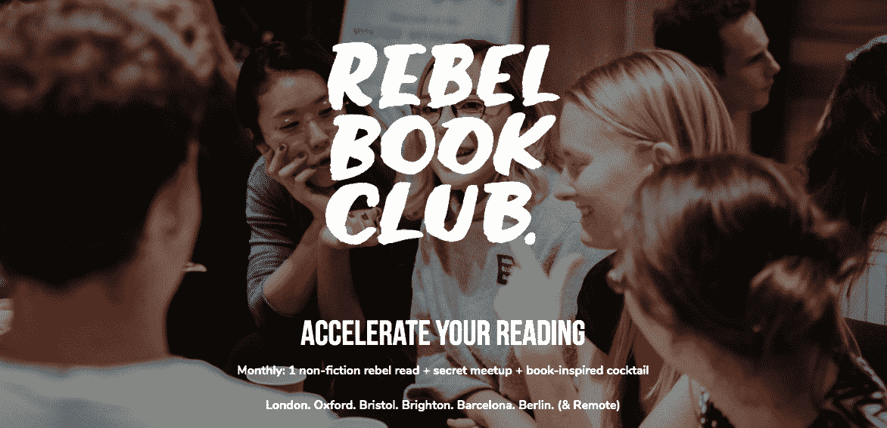
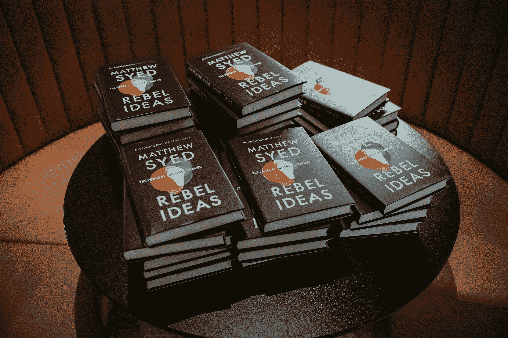

# 我是如何通过从不提前计划来建立一个繁荣的企业的

> 原文：<https://www.indiehackers.com/interview/how-i-built-a-thriving-business-by-never-planning-ahead-71b6544ba6>

## 你好！你的背景是什么，你在做什么？

你好。我叫本·基恩，我是[反叛读书俱乐部](https://rebelbook.club)的联合创始人。我花了 20 年时间建立创业公司和社区，包括[部落客](http://www.tribewanted.com/)(在偏远岛屿上众筹生态旅游项目)和[逃离城市](https://www.escapethecity.org/)(帮助专业人士找到更有成就感的工作)。

我和我的联合创始人想完成更多的非小说类书籍，并从我们阅读的内容中提取切实的价值。在日语中有一个词可以形容你床头柜上那堆从未读完的书: *Tsundouku* ，我们正遭受着它的诅咒！我们觉得和其他好奇的人同时阅读同一本书会很酷。我们很快测试了这个想法，认为它有足够的理由收取每月 15 英镑的订阅费，包括:

*   1 本非小说类书籍
*   1 次鼓舞人心的聚会
*   一杯受该书启发的定制鸡尾酒，在聚会上提供

我们于 2015 年 5 月推出，拥有 24 名付费会员，其中一些人现在是我的好朋友！每个月，我和我的联合创始人都会投入一点时间来保持正常运转，这个社区也在逐月有机增长。一年后，我们有了 104 个付费会员，有了足够的影响力去接触一些更大的作者……并得到了回应。

57 本书之后，我们有 850 名活跃的订阅会员，MRR 为 17，000 美元。

## 是什么促使你开始加入反叛者读书俱乐部？

事实上，我们没有足够的带宽在这个项目上投入大量的时间。我们保持了简单的模式，尽管规模很小，但我们继续通过零营销支出的口碑逐月增长。在电影节上举办了几次关于“如何从坏书中获得最大价值”的研讨会后，我们被邀请在 TEDx 活动上发言。

事情开始变得合情合理了。

我们通常的分销渠道是通过亚马逊代金券，让会员可以自由兑换我们每月书籍的 Kindle 或平装版本，但我们也有几次被实体书吸引。这部分是因为我们有足够的规模直接与出版商谈判批发价格，部分是因为我们认为用品牌信封包装的实体书可以让会员体验更上一层楼。

在最初的两年半时间里，我们没有从加拿大皇家银行获得任何收入。

TweetShare

我们很快意识到，对我们来说，物流越来越费时，如果书没有如期送达，还会增加一大堆客户服务挑战。我的一部分仍然认为，有一天我们可能会回到这个方法，并得到它的权利，但现在我们决定把它留给世界的贝佐斯。

我们俩都建立并运营过精简、低代码的创业公司和社区，所以这有助于保持一切最小化、简单和专注。

当时我们都在巴厘岛，然后回到伦敦从事其他项目。在最初的两年半时间里，我们没有从加拿大皇家银行获得任何收入。

## 构建最初的产品需要什么？

一开始可能一周要花两个小时，当我们举行月度会议时，时间会多一点。我们每周查看两次收件箱，给新成员发邮件，发推文和 Instagram 帖子，并在列表中添加书籍。大概就是这样。

我们想要测试的假设是:人们会愿意花两倍于平装书或 Kindle 书的价格加入一个酷读书俱乐部吗？我们的目标是在一个月内找到 15 个人花 15 英镑成为 RBC 会员。

我们的第一个项目是建立在[醒目的](https://www.strikingly.com)上的一个简单网页(在下周切换到 Wordpress 网站之前，我们一直用它来发展俱乐部和业务到今天的水平)。我们的口号是，“不是一般的读书俱乐部> 1 本非小说类书籍+ 1 杯鸡尾酒+ 1 次秘密聚会。”

我和我的联合创始人在我们的社交网络上分享——我们都加入了伦敦的创业社区——并直接发送电子邮件和信息，邀请我们认为可能感兴趣的人。我们在申请中使用了[字体](https://www.typeform.com)，然后通过电子邮件向那些看起来很合适的人发送了一个[无卡支付链接](https://gocardless.com)。从申请(两分钟的表格)到付款的转化率超过了 70%，在两周内我们有 20 名会员注册。

然后，我们考虑购买这本书并发给每个人，但意识到这将花费很多时间，我们无法在实现上竞争。相反，我们发现通过亚马逊我们可以提供代金券。我们决定发送 Kindle 图书价值的代金券，会员可以用它在 Kindle 上购买图书或升级到平装本。我们的计划是在一两个月后转而购买书籍并发货，但 57 个月后，我们仍在使用这种方法，因为它既简单又受欢迎。

代金券寄出后，我们定了一个聚会的日期，给一个有凉爽工作空间的朋友发了电子邮件，并在维珍公司伦敦总部的楼顶找了个安全的地方。我们找到了一个朋友，他制作朗姆酒鸡尾酒，并主持了我们的第一次聚会。幸好没下雨！

收入在 200 左右，我们花了 120 左右。我们开始运作，并决定再做一个月，剩下的就是历史了。

## 你的技术是什么？

我们总是使用无代码工具。

我们从醒目的登陆页面开始(差不多五年后，这个月才迁移到 WordPress 网站)。

我们用 GoCardless 支付订阅费，用 Amazon 支付代金券，用 Typeform 支付申请和调查。

最后，我们利用社交媒体渠道进行社区宣传；我们最初有一个脸书集团，现在有 WhatsApp 和 [Mighty Networks](https://www.mightynetworks.com) 。

很明显，随着我们对增长的投资，我们正在增加更多的工具，但这非常困难。我们的目标只是让我们的年收入达到 10 万英镑。

## 你们是如何吸引用户，壮大反叛书友的？

我们使用我们的社交网络来发展第一批成员，然后通过与任何人分享故事来口口相传。我们最好的推荐是一年前的 [Time Out 杂志](https://www.timeout.com/london/things-to-do/rebel-book-club)，它提到 RBC 是伦敦一个很酷的读书俱乐部。因此我们每周都有会员加入！

教堂价格/取消总是最大的挑战。人们离开是因为他们没有时间读书或参加聚会，或者他们要离开城镇。我们已经开始提供更灵活的会员资格，这使得价格有所下降。

如果有疑问，我们总是会问:“什么能帮助我们的成员加快他们的阅读习惯，并在社区中建立有价值的联系？”然后我们试着做更多。

下面是我们 2019 年(与 2018 年相比)的一些统计数据:

*   ‪🚗独立用户 21k (7k)‬
*   ‪📝应用 1918 (780)‬
*   ‪👶新成员 1020 (450)‬
*   ‪⛔取消 626 (230)‬
*   ‪💭会面与会者 2120 (775)‬
*   ‪💷收入 11.5 万英镑(45k)‬
*   ‪👸🏽现役成员 802 名(393)‬
*   ‪🌃城市 5 (2)‬
*   ‪📚改变游戏规则的书 12 (12)

## 你的商业模式是什么，你是如何增加收入的？

会员资格细分如下:

*   平均每月 16 次
*   20%的增值税
*   购书券平均 6.50 英镑
*   聚会平均 2.50 分
*   团队/运营的剩余人员

最近的众筹让我们第一次开始投资产品和增长计划。也就是说，在我们开始招聘之前，我们的利润率是健康的。

我们的商业模式是简单的订阅模式，会员注册三个月，有三种不同类型的会员资格:

*   社交:适合那些想阅读所有书籍并参加大多数聚会的人
*   对于那些需要更多灵活性的人来说，每隔一个月一本书和一次聚会，当他们能够或者想要加入的时候
*   *沙发:*适合那些想远程加入，或者不在我们当前城市的人

平均会员资格为 15 个月，包括购书券(5-7)，以及我们聚会的邀请。Meetups 的人均成本约为 3.50 英镑，但只有一小部分会员会去，所以每位会员的成本更像是 2 英镑。

把一个大想法重新组织成一个小项目，你可以尝试一下，看看效果如何。

TweetShare

税前利润率约为 40%，其中一部分我们会重新投资到俱乐部，然后拿一小笔年终奖金给那些运营俱乐部的人。

直到一个月前，当我们最终开始作为一个团队积极致力于 RBC 时，我们没有任何员工、增值税或营销成本。

我们的商业模式仍然是盈利的，但现在我们有了增长目标，而不是简单的有机增长。一个月后，我们开始看到更多关注会员和一些社交广告的影响。

## 你未来的目标是什么？

有了资金，现在有了一个小而有才华的团队，这就是我们的 2020 年愿景。

我们的第一个目标和首要任务是改善当前的会员体验。我们将更多的精力放在联系我们的成员上，这样他们就可以一起提高他们的阅读习惯(和影响力),并参加其他相关的活动和项目。我们希望每个人都能感受到会员的卓越价值，而不仅仅是我们的一些会员充分利用了它。所以一切都是为了社区。

我们的第二个目标是通过更好的在线宣传(通过我们的新网站)和更强大的社交渠道和广告，将 RBC 的价值传达给新的目标受众。我们将在未来几周内看到结果。我们希望通过扩展到更多的城市和增加我们的远程会员来做到这一点。

我们的第三个目标是开始支持扫盲项目。我们很幸运有时间(和金钱)投资更多的阅读。我们希望与解决整个社会扫盲问题的组织合作，并探索我们可以支持他们完成使命的方式。

我们的第四个目标是与愿意帮助他们的团队和社区加快阅读习惯的组织和品牌建立合作伙伴关系。我们已经在野外进行了第一次尝试，最初的迹象很有希望。

## 如果你必须重新开始，你会做什么不同的事？

在节奏、保持 it 精简、社区建设和商业模式方面没有太多进展。

我想我们可能做的主要事情是尽快筹集资金，但我们都没有做好准备，因为我们正忙于其他项目。

我认为我们可以在每一个新城市投放更多的精力，让他们更快地达到更大的规模，但我们直到几周前才真正有时间或资源。现在我们做到了，我们做到了！

## 有没有发现什么特别有帮助或者有优势的？

到目前为止，使加拿大皇家银行运转良好的关键因素是:

*   对获得巨大成功的期望/压力低。我们只是用项目思维一次尝试一个月
*   当有一个关键主题时，回应成员的反馈
*   像数据一样跟随我们的直觉
*   享受乐趣:我们享受的越多，它的效果就越好！

我们也(当然！)来点书 rec！我们可以推荐这么多，但专门针对建立这种类型的创业:

*   让一个想法走进世界:* * 100 美元的启动资金——或者说*家门口的一英里*
*   一个经典的商业故事:*鞋狗*
*   如何不这样做(但有趣，令人震惊的阅读):*坏血*
*   你唯一需要的关于营销的书:*这是营销*

## 对于刚刚起步的独立黑客，你有什么建议？

我经常看到人们被他们头脑中的东西所阻碍:

*   “害怕失败”
*   “职业自杀”
*   “冒名顶替综合征”
*   “我的想法不够好”

所有这些都是引号，因为它们是我们的感知，而不是活生生的现实。

对抗这些的最好方法是把一个大的想法重新组织成一个小的项目，你可以尝试一下，看看效果如何。对，大胆一点，也要有所为！如果你想熬过第三天，那就对你的合作伙伴或实际客户/会员负责。

## 我们可以去哪里了解更多？

*   [rebelbook.club](https://rebelbook.club)
*   [🐦@rebelbookclub](https://twitter.com/rebelbookclub)
*   [📸@rebelbookclub](https://www.instagram.com/rebelbookclub)

我很想听听独立黑客关于阅读对他们有什么帮助(以及什么书！)以及他们是否有兴趣将 RBC 带到他们的城市。

谢谢你们的灵感和责任感！

—[<picture id="ember5220825" class="user-avatar ember-view user-link__avatar"></picture>本基恩](/BenKeene?id=25vIKnTb7tQfxaUKqQJJMTFPLG32)【叛逆书友】联合创始人

## 想像叛逆书友会一样建立自己的事业？

你应该加入[独立黑客社区](/)！🤗

我们是几千名创始人，互相帮助建立有利可图的业务和副业。来分享你正在做的事情，并从你的同事那里获得反馈。

还没准备好开始使用你的产品吗？没问题。这个社区是一个认识人、学习和实践的好地方。随意[随便浏览](/)！

—[<picture id="ember5220830" class="user-avatar ember-view user-link__avatar"></picture>考特兰艾伦](/csallen?id=ibTLPyjwVebnZjMGKvz6ztarnuV2)，独立黑客创始人

35votes