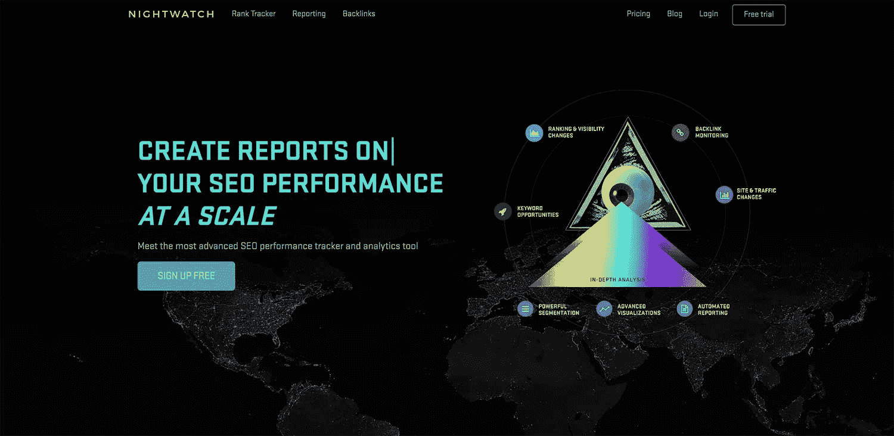
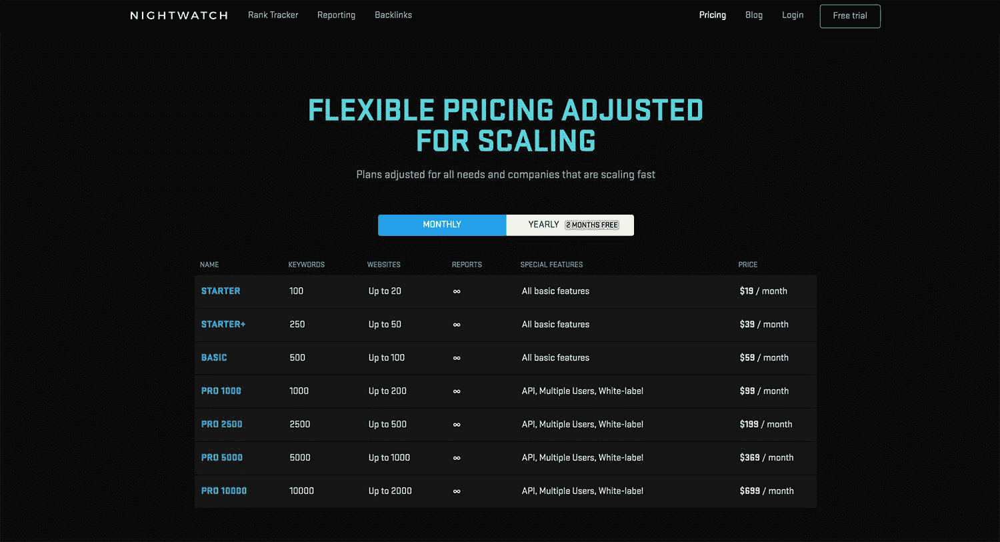
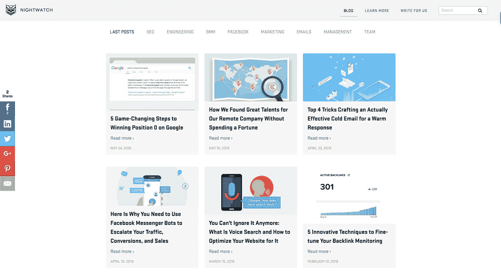

# 我如何在不花积蓄的情况下建立并开始发展我的公司

> 原文：<https://www.indiehackers.com/interview/how-i-built-and-began-to-grow-my-company-without-spending-my-savings-3dbff597b9>

## 你好！你的背景是什么，你在做什么？

我叫 Aljaž，从事互联网营销十多年了。在过去的五年里，我和我的团队一直专注于 SEO 产品。

我们的最新产品， [Nightwatch](https://nightwatch.io) ，是一款搜索可见性跟踪器，专为营销机构和搜索引擎优化专业人士设计，他们正在跟踪大量的关键词和高流量网站。我们的用户喜欢它，因为它的界面简洁，具有独特的优势——该工具在数据分割和可视化方面表现出色，具有复杂的功能，如自动关键字发现、智能通知、可定制的报告等。

我们的收入目前约为每月 35，000 美元，并且每个月都在稳步增长。

 

## 是什么促使你开始玩《守夜人》的？

Nightwatch 实际上是我们之前的工具 [RankTrackr](https://ranktrackr.com) 的继任者，我们在五年多前开始使用这个工具。当时，我意识到没有一个简单的搜索引擎关键词追踪器是可靠的，准确的，对本地搜索结果很好，或者排名经常更新。所以我开始为 SEO 营销人员制作自己的基本排名跟踪工具。

我当时的用例非常具体——我需要一个工具来跟踪我的许多联盟网站(超过 50 个),这意味着我需要一个能够轻松切换网站并快速查看哪些网站需要我的关注的工具。作为各种联盟和在线营销社区的成员，如 WarriorForum 和 BlackHatWorld，我知道这种排名追踪器的市场已经存在。虽然，在那个时候，Moz 和其他几个人在这个领域是一个强大的存在，但 SEO 市场远没有今天这样饱和。

发展新业务时，搔搔自己的痒处极其重要。

TweetShare

我没有攒下任何可以投资开发的钱，但我自己就是一名开发人员，我知道创建一个原型不会花太长时间。我用 Ruby 编写了一个简单的脚本，从搜索引擎中检索排名，并在控制台中打印出来。

尽管 RankTrackr 的原型相当简单，但构建和维护它却比我最初想象的要花费更多的时间和精力。维护从搜索引擎(尤其是谷歌)检索数据的代码并跟上对 SERP(搜索引擎结果页面)所做的更改实际上需要很多时间，所以我向我的一位同事提出了这个想法，并邀请他帮助项目的技术方面。

## 构建最初的产品需要什么？

当我们决定要提供更多的功能而不仅仅是等级追踪时，就有了 [Nightwatch](https://nightwatch.io) 的想法。我们意识到，如果我们想扩大我们的业务，并进入下一个层次，我们应该重塑这个工具的品牌，并扩大我们一直用 RankTrackr 提供的功能。

我们希望开发一款产品，让用户能够监控自己和客户的网站可见性——关键词排名、反向链接、网站页面、网站变化(索引页面、点击率变化)、聚合谷歌分析和搜索控制台数据——同时保持查看多个网站概览的能力，以便机构或用户能够快速、轻松地跟踪进度和变化。

我们的代码库和我们从 RankTrackr 获得的经验是一个很好的基础，但是我们希望通过基础设施来改进开发过程和技术栈。那时，我们团队的专业知识主要是 Ruby on Rails、Backbone.js 和 Scala，我们希望找到能够提高开发速度和降低维护成本的新技术。为了做到这一点，我们决定从 Backbone.js 转移到 Ember.js，并放弃我们的旧 Scala 程序，用 Elixir 重写所有内容，以便进行后台处理。旧的 Scala 程序写得很差，而且太难维护，所以这个改变产生了很大的不同。

我们花了大约一年的时间来构建和发布第一个版本的 Nightwatch。我们希望进展更快，但是一个核心开发人员由于意见不一致而离开了项目，此时我们不得不重组公司并雇佣新的开发人员，同时仍然试图掌握我们正在使用的新技术。尽管如此，我们坚持不懈，仅仅延迟了几个月就完成了。

## 你们是如何吸引用户，壮大 Nightwatch 的？

为了在发布前推广[夜巡](https://nightwatch.io)，我们创建了一个特殊的测试版发布页面，允许用户申请测试邀请来试用该工具。共享页面并邀请朋友加入的用户会获得额外的积分，这意味着他们会更快收到邀请。

我们会时不时地列出提供宝贵反馈和发现重要漏洞的用户名单，并送给他们贴心的礼物。

TweetShare

这一策略使得 Nightwatch beta 的邀请帖在 Twitter 上被分享了 300 多次，这帮助我们扩大了推广活动的范围，并吸引了许多新访客。

我们在 BetaLaunch 和 ProductHunt 等网站上推广了 Nightwatch.io 测试版页面。最好的结果来自于向我们以前的 RankTrackr 用户群推广这个页面，以及在脸书和 Linkedin 上以专业、封闭的营销为导向的群体中分享信息。

## 你的商业模式是什么，你是如何增加收入的？

我们专注于 SaaS 的商业模式。我们的大部分定期订阅是按月订阅，但我们试图鼓励他们转向打折的年度订阅，以便从长远来看为他们节省一些钱，并让我们在前期获得更多的钱。

随着 Nightwatch 的推出，我们为所有用户提供了一个月的免费测试账户。正如我们所希望的，一些用户在测试版结束后继续订阅付费版本。对于一些独家用户，我们实际上最终延长了免费试用期。

我们决定使用 Braintree 支付系统，因为它提供了原生 PayPal 集成。尽管有缺点，我们还是能够调整系统以适应我们的需求和我们的业务模式。我们的计费系统需要更大的灵活性，所以我们不再使用经典的 Braintree 订阅服务向用户收费。相反，我们实现了自己的逻辑，根据用户的计划配置和他们选择的功能向用户收费。

 

如前所述，我们的收入目前约为每月 35，000 美元，并且每个月都在稳步增长。尽管我们在过去两年的主要重点是开发而不是营销，但我们每年平均增长约 40%以上。最大的收入增长通常来自添加主要功能和推广它们。在它们发布后，我们投入了额外的努力来宣传新功能和升级的优势，以便用户选择加入。

业务支出(不包括工资)主要是托管成本和运行基础设施的成本，用于收集和处理从搜索引擎和网站检索的数据。托管费用大概 800 美金/月，剩下的基础设施和服务大概 1000 美金/月。随着时间的推移，我们已经能够减少这些开支，但我们一直在努力寻找进一步降低成本的方法。

## 你未来的目标是什么？

目前，我们的开发人员正专注于推出两个新的大功能。第一个是网站审计，它将为我们的用户提供关于网站结构、健康状况、内容和标记优化的全面报告。我们将大部分资源用于第二个功能，这是一个跟踪所有不同谷歌片段的改进能力——从有机排名和本地包排名到零位置和其他不太常见的片段，如桌面和移动设备上的传送带。我们还增加了一个功能，可以预览 Google 对任何特定位置，国家，地区，城市或邮政编码级别的每个 SERP 响应。

在营销方面，我们正在为我们的团队配备新成员，他们专注于集客营销以及与现有和潜在客户的沟通。我们已经建立了一个稳定的工作流程，并在权威网站和博客上发布客座博文和分享我们的知识。我们的集客营销工作在不断发展，我们正在开发一个 Nightwatch 博客，专注于出色的 SEO、营销和业务增长内容。我们的目标是成为业内最相关、最高质量的博客之一。

 

摆在我们面前的一个更大的挑战是招聘新的远程员工，并扩大我们由六人组成的紧密团队。我们仍在寻找最明智的方式来推进这一方面，这样我们就可以成功地扩大业务规模，并与行业内的主要参与者竞争。

## 你面临的最大挑战和克服的障碍是什么？如果你必须重新开始，你会做什么不同的事？

我们花了太多时间专注于产品的开发，而忽略了营销和推广我们已经拥有的工具。

另一个令人痛苦的错误(实际上我们犯了两次)是与不同细分市场的人和公司合作。我们决定与一家荷兰公司建立合作关系，这家公司希望专门在荷兰和德国市场销售我们的产品，但这个决定证明是浪费时间和资源。另一个不成功的合作是与一家公司合作，该公司希望将我们的产品用于 Shopify 应用程序，但不幸的是，这导致了双方的挫折和时间浪费。我们认识到，在决定与谁做生意时，我们需要更加小心，对期望要更加现实。

我们还了解到，当经营一个成功的在线业务时，人们会一直接近你——试图合作，提供他们的服务，试图让你实现某些功能，等等。这很诱人，但在现实中，抵制几乎总是更好。前面提到的荷兰营销公司负责通过运行我们工具的自有品牌版本(由我们托管)并分享利润来为我们带来收入。为了支持这一点，我们对我们的应用程序进行了大量的修改，结果却发现我们的新合作伙伴不具备推广这种服务的条件，我们所有的努力都白费了。

我们认识到，在决定与谁做生意时，我们应该小心谨慎，对期望要现实一些。

TweetShare

我们也意识到我们坚持传统的 Scrum 方法已经太久了，因为它们并不适合开发和计划过程。我们试图将我们的工作融入到这些开发方法框架中，这些框架是我们在为其他公司工作时获得的。但是在现实中，我们的团队倾向于频繁地在优先级之间轮换，有时我们会改变优先级，所以经典的两周冲刺对我们根本不起作用。我们最近改用了简单的看板，这是一种更轻松的计划和工作跟踪方式，更符合我们的敏捷理念。

对我个人来说，最重要的一课——我相信几乎每个企业主最终都会学到——是学习如何委派工作。

## 有没有发现什么特别有帮助或者有优势的？

真正让我们区别于其他同类产品的是对用户的特殊照顾。我们认为这是我们的主要竞争优势之一。我们的用户是特殊的，我们会相应地对待他们，作为回报，他们会经常分享他们在使用产品时遇到的困难，而不是不加解释地取消订阅。我们会时不时地列出提供宝贵反馈和发现重要漏洞的用户名单，并送给他们贴心的礼物。

我真的很喜欢米哈里·契克森米哈的书。它提供了一些很好的见解，告诉你如何安排你的一天，设计你的工作习惯以获得最大的效果，并达到令人垂涎的“心流”状态。当我开车时，我经常听各种播客，如[自制人](https://www.selfmademan.com/podcasts)、[向上扩展！我发现它们是灵感和动力的巨大源泉。](http://scalinguph2o.com/)

## 对于刚刚起步的独立黑客，你有什么建议？

我用来提高效率的最有用的应用之一是 [RescueTime](https://www.rescuetime.com/) 。它可以让你跟踪和分析你是如何在电脑上度过时间的——相信我，当你意识到你在社交媒体和漫无目的的浏览上无意中浪费的时间本可以做些什么时，你会感到震惊。

不要因为处理大的、遥远的、复杂的问题或追逐不切实际的收入预期而给自己压力。更重要的是专注于解决你此时此地所面临的较小但重要的问题，而这些问题是你不需要花费数百万进行开发就能解决的。当你埋头解决面前的问题时，最大的解决方案和机会就会出现。

最后，当发展一项新业务时，搔搔自己的痒处是极其重要的。当你的企业在解决一个问题时，你必须非常好地理解这个问题，只有当你亲身经历过这个问题时，你才能做到这一点。

## 我们可以去哪里了解更多？

要了解更多关于守夜人的信息，请访问我们的[网站](https://nightwatch.io/)或[博客](http://blog.nightwatch.io/)。

你也可以在推特上关注[守夜人](https://twitter.com/nightwatch_io)！我的联合创始人 [Matic](https://twitter.com/matixmatix) 和我([aljai](https://twitter.com/aljazfajmut))偶尔会发一些有趣的事情。

——[<picture id="ember5247387" class="user-avatar ember-view user-link__avatar"></picture>网络武士](/InternetSamurai?id=Oxg044XpBBh4RQ0D9qWLSRVaooi2)，【夜巡】创始人

## 想像 Nightwatch 一样建立自己的事业？

你应该加入[独立黑客社区](/)！🤗

我们是几千名创始人，互相帮助建立有利可图的业务和副业。来分享你正在做的事情，并从你的同事那里获得反馈。

还没准备好开始使用你的产品吗？没问题。这个社区是一个认识人、学习和实践的好地方。随意[随便浏览](/)！

——[<picture id="ember5247392" class="user-avatar ember-view user-link__avatar"></picture>考特兰艾伦](/csallen?id=ibTLPyjwVebnZjMGKvz6ztarnuV2)，独立黑客创始人

54votes