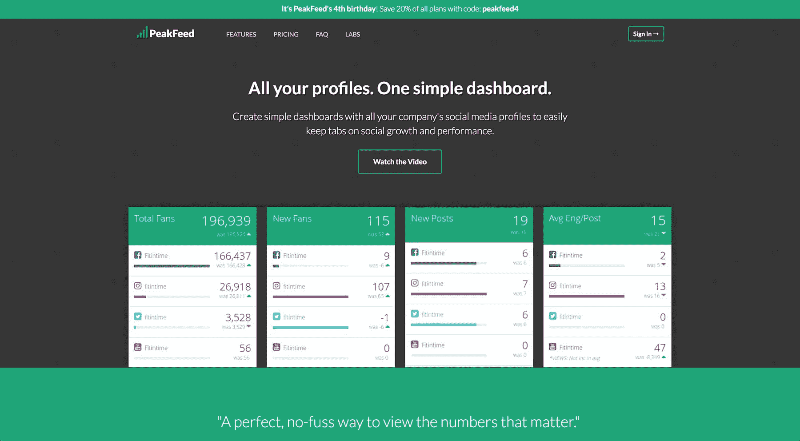
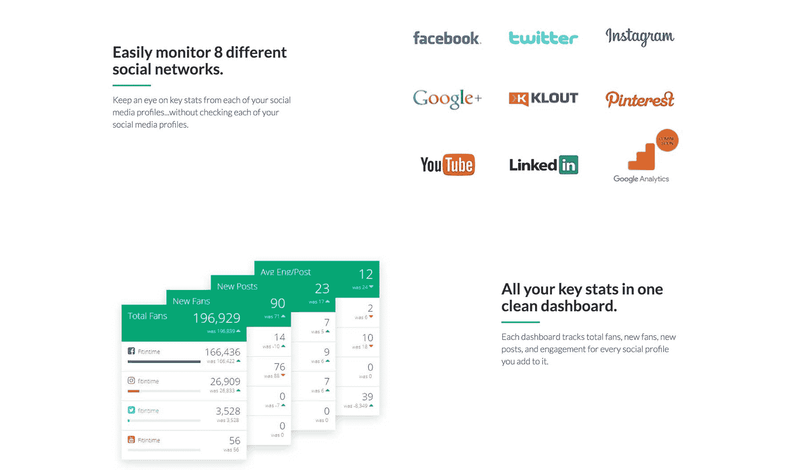
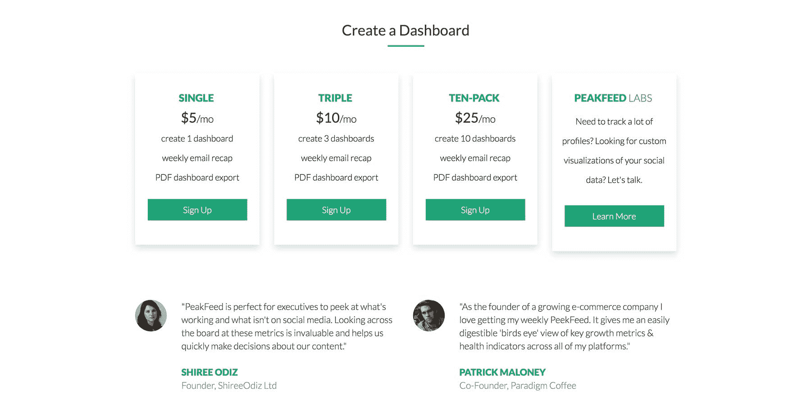

# 我如何建立 PeakFeed 并使其每月收入达到 500 美元

> 原文：<https://www.indiehackers.com/interview/how-i-built-and-grew-peakfeed-to-500-mo-in-revenue-db9ce6394e>

## 你好！你的背景是什么，你在做什么？

嗨，我叫格雷格·布兰查德。我是一个叫做 [PeakFeed](http://peakfeed.com) 的简单社交分析服务背后的人。PeakFeed 更多的是一个问题的解决方案，而不是一个平台。也就是说，它没有太多的选项可以定制，但是设置起来非常简单。把它想象成杂货店对餐馆。前者给你无限的选择，但需要更多的时间和技能。后者给你的选择更少，但给你一个非常好的结果，既快又容易。

那是泥炭饲料。

你创建一个账户，输入你公司的社交资料的网址，就大功告成了。每周你的收件箱里都会出现一份你所有账户的主要统计数据的周报，只要你想看一眼，就可以从一个网络仪表盘上看到。

现在，PeakFeed 每月产生大约 500 美元的收入。

 

## 是什么促使你开始使用 PeakFeed？

嗯，我是个小商人，小商人有很多头衔。社交媒体在我的盘子里，但它不是一个大的焦点。尽管如此，我还是想留意一些事情。事实证明有两种方法可以做到这一点:要么花大价钱购买一个花哨的分析包，要么用该网站的内置报告单独跟踪每个账户(或者只是手动访问)。

当时我一直在涉猎社交媒体 API，所以当我与其他忙碌的营销人员或企业主进行了几次交谈，他们也有同样的沮丧时，我决定值得一试。

## 构建最初的产品需要什么？

当时，我并没有像我想的那样努力赚钱来建立自己的品牌，所以我实际上是以社交媒体趋势时事通讯的形式开始这项服务的，碰巧在底部显示了这些简单的统计数据。

我是一个小商人，小商人有很多头衔。

TweetShare

最终，我不仅写了每一篇综述，而且每天滚动 Mashable 和 TechCrunch，寻找我的订户真正关心的非耸人听闻的新闻，这让我筋疲力尽。(什么都没有。)所以最终我放弃了每周新闻，将他们可以追踪的网站增加到四个(脸书、推特、Instagram 和谷歌+)，只专注于此。

这释放了更多的时间，我最终也增加了对其他几个网站的跟踪。

最初的时事通讯概念非常简单，所以我在一个周末就完成了大部分的启动和运行。

 

## 你是如何吸引用户和发展 PeakFeed 的？

从一开始，让我的用户告诉他们的朋友是为 [PeakFeed](http://peakfeed.com) 获得动力的重要部分。

当它免费时，用户可以通过他们的链接让几个朋友注册来解锁一些功能。我真的很努力地工作，不只是推动股票，而是在正确的渠道上推动股票。推特股份？咩。脸书？好多了。但对 PeakFeed 来说，有人在 LinkedIn 上分享他们的链接就是黄金。因此，我投入了大量的时间和精力来优化信息和布局。

一旦我去了 paid，事情就有点棘手了。

我最终做的是建立一个永久的等候名单。也就是说，没有人可以注册一个账户并付钱给我——他们必须给我他们的电子邮件地址。然后，每天我都给他们发后续消息。第一天是他们实际注册的访问链接，但第二天是关于如果他们有三个朋友为帐户付费，他们将获得一个自己的免费帐户的消息。

这是一个微妙的平衡，既要激励人们分享，又要避免电子邮件列表中除了等待朋友注册的人什么都没有，所以第 3-5 天更专注于产品和功能，让人们付费并注册。

一旦我拨通了电话，我不仅得到了大量的股票，而且还得到了稳定的付费用户，我用这个公式用了一年多。

## 你的商业模式是什么，你是如何增加收入的？

PeakFeed 的独特之处在于，当我第一次使用付费账户时，新用户可以为他们想要的服务支付任何费用。这是一个风险，但它做了一些事情。

首先，它很快给了我一群付费用户，这很好，因为他们对这项服务的反馈结果与免费用户非常不同。其次，它给了我无价的数据，一旦我采取行动，我就可以在此基础上建立更传统的费用结构。第三，它给了我很多很好的用户证明，可以用在我的营销中。第四，它让我成为了“随心所欲付费”的权威，这为我赢得了一些额外的公关和流量。

今天，我有一个标准的分层定价结构，但它很有效，因为我是基于数据，我有一个强大的营销信息，这要归功于推荐(以及推荐提供的对产品关键功能的洞察)，我的产品面向付费用户。

自去年夏天以来，所有这些都使收入增长了 3 倍:

| 月 | 收入 |
| --- | --- |
| 6 月 17 日 | 143 |
| 7 月 17 日 | 172 |
| 8 月 17 日 | 222 |
| 9 月 17 日 | 216 |
| 十月十七日 | 271 |
| 十一月十七日 | 348 |
| 十二月十七日 | 433 |
| 1 月 18 日 | 526 |

因此，虽然我绝对会向刚入门的人推荐一种“按需付费”的模式，但你也会很快遇到上限。所以我觉得对大多数人来说这不是一个长远的概念。

最后一点:我在 [Moonclerk](https://www.moonclerk.com/) 上建立了“想付多少就付多少”和“固定价格”的东西，我很高兴我做到了。我绝不是一个专业的开发人员，所以即使像 Stripe 这样的东西也超出了我的能力范围。Moonclerk 是基于 Stripe 构建的，但它为您提供了一个安全的托管支付表单，您可以使用 CSS、内置通知电子邮件以及一个超级简单的 API 来完全定制该表单，一旦用户在支付后被重定向回您的网站，您可以调用该 API 来获取用户详细信息。

 

我甚至无法告诉你这些年来它为我节省了多少时间，这对我这样的时间非常有限的项目来说是至关重要的。

## 你未来的目标是什么？

有一点要指出的是，辞去我的日常工作并不是我这个或任何其他副业的最终目标。我喜欢创造性的出路，我喜欢额外的钱。但是我有两个非常可爱的孩子，一份我非常喜欢的工作，我喜欢在下午 5 点关掉电脑，把这一切都抛在脑后，或者去度假，而不必把我的工作带走。

所以我对 [PeakFeed](http://peakfeed.com) 的目标非常简单:继续发展它，不要在这个项目上投入比我已经投入的时间更多的时间。如果非要我说个数字的话，1500 美元/月绝对是个好数字。

同样需要注意的是，PeakFeed 实际上已经有四年的历史了。一些 IH 的读者可能会在四年后嘲笑 500 美元/月，但我对这个数字非常满意，因为我每周最多只工作 2-4 小时，而且我已经长达 6 个月没有碰过它(当我儿子出生时)。此外，在去年(现在我的生活中有了更多的空闲时间)，我已经能够将收入增加两倍，这让我对未来几年非常乐观。

你必须非常有耐心，始终如一，并且小心你的期望。

TweetShare

## 你面临的最大挑战和克服的障碍是什么？

可能我最大的挑战是支持。我在兼职项目和我的日常工作或家庭时间之间划了一条清晰的界线。例如，我直到结束一天的工作后才查看 PeakFeed 邮件。而且，正如我提到的，我甚至不会在度假时查看它们，这样我就可以享受与家人在一起的时光。

这意味着我失去了很多用户，他们在遇到问题时，给我发邮件，在我解决他们的问题之前就离开了，因为我要花一两天的时间回复。

花一些额外的时间在注册体验上，并清楚地知道这只是幕后的一个人，这有所帮助，但我的流失率将因此永远高于其他服务，接受这个事实是一颗难以下咽的药丸，但一旦我接受了这个事实，就非常自由。

## 有没有发现什么特别有帮助或者有优势的？

考虑到这句话的出处，这听起来有点讽刺，但是我已经很少读到关于创业和副业的文章了。我只允许自己偶尔听听 IH 的故事。

原因很简单:我每花一个小时阅读别人的项目，就有一个小时不是我自己在工作。但当我回顾这些年的副业项目时，在收入和成功方面真正产生影响的经验教训是我通过自己的尝试和错误学到的，而不是研究别人的。

我花在阅读别人的项目上的每一个小时都不是我自己工作的一个小时。

TweetShare

减少我的内容消费的催化剂大多只是超载，但随着我清理了一些精神带宽，我开始更清楚地看到我自己的项目，并意识到我不需要像我想象的那么多外部洞察力。

## 对于刚刚起步的独立黑客，你有什么建议？

我认为你必须非常有耐心，始终如一，而且你必须小心你的期望。

PeakFeed 现在显示出很大的潜力，但这只是因为我已经坚持不懈地研究了 3-4 年。Cameron Moll 曾经说过，任何新事物通常需要几年时间才能获得持续的吸引力，我完全同意。

尤其是当你在做一个副业项目的时候，你真的需要用你投入的时间来衡量你的期望。如果你一周只工作 10 个小时，而一个传统企业家一周花 100 个小时在他们的工作上，学会对他们 1/10 的结果感到满意。500 美元/月的价格对 PeakFeed 来说很棒的部分原因是，这些年来，我只花了相当于几个月全职工作的时间。

## 我们可以去哪里了解更多？

我把它保持得非常简单，这样你就可以在 http://peakfeed.com 的[跟踪 PeakFeed。我写的任何关于项目的博客现在都在我自己的网站上，这个网站是 http://www.greggblanchard.com。如果你有任何问题或反馈给我，我很乐意听到。我会关注下面的评论部分。](http://peakfeed.com)

—[<picture id="ember8235620" class="user-avatar ember-view user-link__avatar"></picture>格雷格·布兰查德](/greggblanchard?id=obr56vIGMge2YTeSpN7978s51ss1)，PeakFeed 创始人

## 想像 PeakFeed 一样建立自己的事业吗？

你应该加入独立黑客社区！🤗

我们是几千名创始人，互相帮助建立有利可图的业务和副业。来分享你正在做的事情，并从你的同事那里获得反馈。

还没准备好开始使用你的产品吗？没问题。这个社区是一个认识人、学习和实践的好地方。随意[随便浏览](/)！

——[<picture id="ember8235625" class="user-avatar ember-view user-link__avatar"></picture>柯特兰艾伦](/csallen?id=ibTLPyjwVebnZjMGKvz6ztarnuV2)，独立黑客创始人

29votes