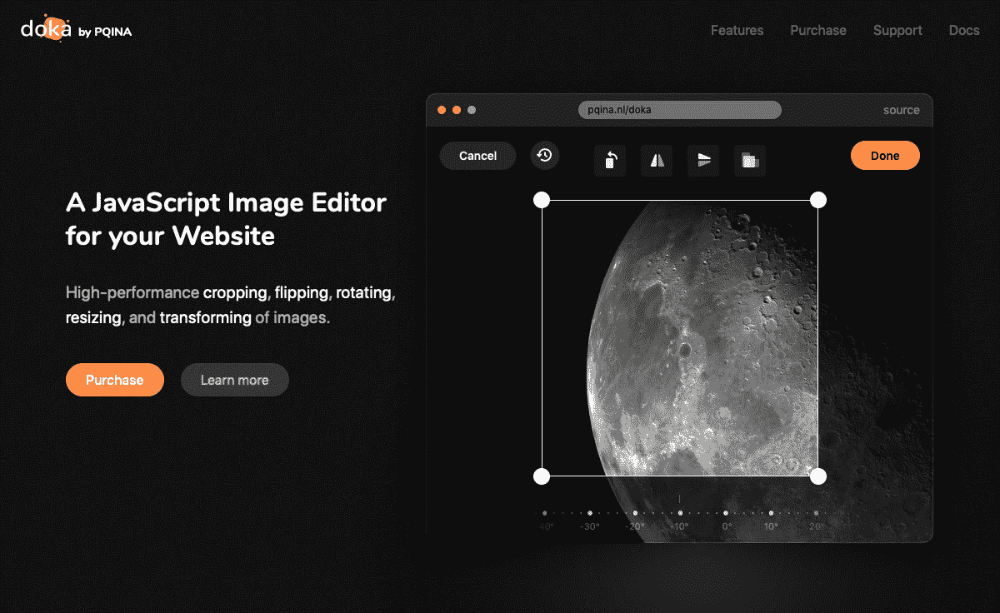
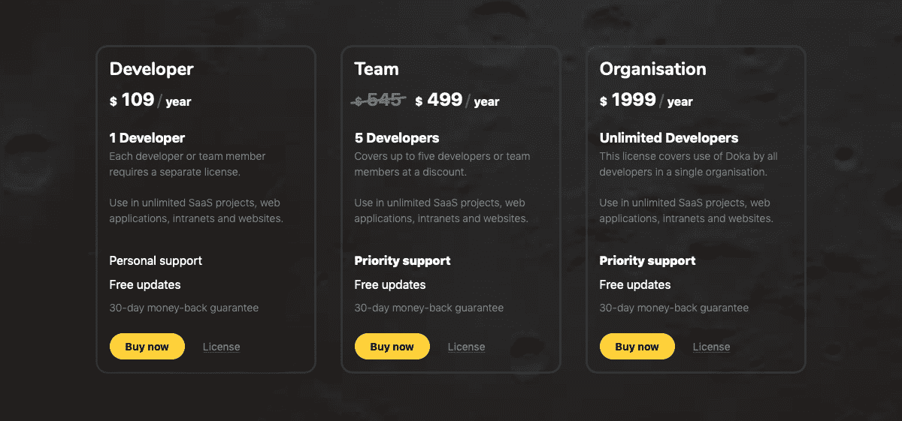
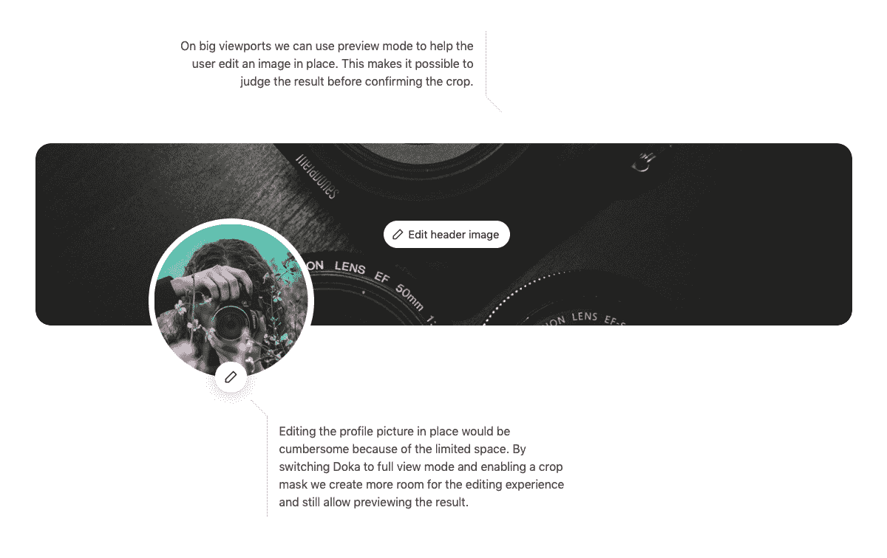

# 我如何利用一个成熟的市场，并增长到$ 3K/月

> 原文：<https://www.indiehackers.com/interview/how-i-capitalized-on-an-established-market-and-grew-to-3k-mo-3aa3037d0c>

## 你好！你的背景是什么，你在做什么？

嗨！我是 Rik Schennink，我是一个人的 web 组件公司 [PQINA](https://pqina.nl/) 的所有者。几年前，我辞去了前端开发人员的工作，去追求构建商业和开源 JavaScript UI 组件的梦想。

2018 年 11 月底，我推出了 [Doka.js](https://pqina.nl/doka/) ，这是一款基于网络的图像编辑器，提供近乎原生的用户体验。多卡使用户能够快速裁剪、旋转、调整大小，并对他们上传的图像应用滤镜效果。我的客户用它来保护他们的用户上传的图片质量。

六个月后，多卡的平均房价约为 3000 美元 MRR。

 

## 是什么促使你开始使用 Doka.js？

在过去的几年里，我一直在 [Envato](https://codecanyon.net/user/pqina/portfolio/) 上开发和发布插件，这就像是一个网络产品的应用商店。我的主要策略是在他们的市场上搜寻我认为我可以做得更好的成功组件，假设如果一个组件成功了，一个更好的版本可能也会成功。我构建了几个非常依赖动画的丰富的 UI 插件。在我搜索的过程中，一个图像裁剪和上传组件弹出来，我决定尝试一下，认为这将是一个很好的 UI 来进一步探索网络上的动画。这就是 [Slim](https://pqina.nl/slim/) 的诞生。

斯利姆是我进入多卡的垫脚石。

斯利姆引起了这么大的兴趣，这让我有点吃惊。声称多年来一直在寻找类似 Slim 的产品的客户数量告诉我，这是一个尚未开发的市场。我收集了很多客户反馈，积压工作很快开始增长，但在改进 Slim 的同时，我发现代码库不够灵活，无法包含客户需要的每一个功能。

对此的解决方案将由两部分组成:[文件池](https://pqina.nl/filepond/)和[多卡](https://pqina.nl/doka/)。由于我想退出 Envato 市场(稍后会详细介绍)，这两个新产品将独立存在。文件池负责文件管理部分，多卡负责文件编辑部分。它们将一起提供 Slim 的功能，以及更多的功能。

我知道下一个想法似乎更好，更有趣，但这只会导致硬盘驱动器充满了原型。我去过那里。

TweetShare

我最初推出 FilePond 是作为一个高级(付费)组件，计划以后提供多卡作为一个免费的附加组件。但事实证明，有大量的文件上传组件可用，所以客户没有太多的动力去花钱买一个高级的(不幸的是，好看是不够的)。

我决定改变一下，让 FilePond 成为一个免费产品，并把它作为进入多卡的入口，现在它将成为一个付费产品。这也将使多卡的设置更容易，它可以与其他文件上传库如 [Dropzone](https://www.dropzonejs.com) 和 [Uppy](https://uppy.io) 一起工作，从而吸引更多的观众。我在麻省理工学院的许可下开源了 FilePond，并开始在多卡上工作。

## 构建最初的产品需要什么？

建造多卡花了我大约六个月的时间。我会一周花三天左右的时间在这个项目上，其余时间通过咨询工作获得额外收入。我是两个孩子的父亲，我不想牺牲和孩子在一起的宝贵时间，所以所有的工作都必须在一周工作四天的时间内完成。

多卡使用与 FilePond 相同的渲染引擎，所以幸运的是这部分工作已经完成了。困难的部分是计算产量的数学问题。我一定重构了多卡的裁剪逻辑四五次。我的数学技能不是最好的；我不得不画一些东西，这样才能让我的大脑理解复杂的概念，比如交叉的裁剪和图像矩形。有些时候我准备放弃，我不得不离开代码几天来保持理智，但我很高兴我坚持下来了。

我想尽快进入市场，以便利用开源版本 FilePond 产生的势头。我决定专注于高质量的裁剪体验，而忽略所有其他的。将它作为 FilePond 的一个插件发布会减少很多工作，因为它不需要一个单独的品牌标识。将它作为一个独立的产品推出，将不得不等到 v2。这也是我在自己的网店上销售的第一个产品，所以我想知道我的网站产生的流量是否可能。

多卡(FilePond Image Editor)的初始版本于 10 月初试运行，当月销售额约为 1500 美元。我在 10 月的剩余时间和 11 月的很长一段时间里迅速开发了独立版，然后以多卡的名字正式发布。

 

## 你们是如何吸引用户，壮大 Doka.js 的？

我从推出 FilePond 中了解到，推出像多卡这样的 web 组件并不是为了大量销售，而是为了创造知名度。

这些产品的问题在于，它们不是你冲动购买的产品。

*   如果你对开发感兴趣，你必须先找到公司的信用卡才能开始。
*   如果你拿到了公司的信用卡，仍然需要分配时间来将组件与你正在开发的产品集成在一起。
*   如果你刚刚完成一个产品，回去替换现有的解决方案并不是一件容易的事情。此外，你可能已经在这上面花费了时间和金钱，所以如果它有效的话，可能就足够好了。
*   如果您仍在开发产品，最好等到您准备好开始集成时再购买组件。

因此，为了获得一些关注，我制作了一个不错的宣传视频，并成功地在产品搜索上推出了[多卡](https://www.producthunt.com/posts/doka-js/)，赢得了“#2 本周产品”徽章。[发布推文](https://twitter.com/rikschennink/status/1067337579413028865?s=20)产生了大约 300，000 个印象，超过 30，000 人观看了推广视频。这比我预想的要多得多。

那天我卖出了两份订阅，虽然这正是我所期望的，但仍然令人失望。因为我设法引起了比我预想的更多的关注，我对发布日的进展非常满意。许多开发者了解了多卡，这意味着当他们需要一个图像编辑器的时候，他们可能会看看多卡。

| 月 | 游客 |
| --- | --- |
| 19 年 1 月 | 2500 |
| 2019 年 2 月 | 3400 |
| 19 年 3 月 | 3300 |
| 2019 年 4 月 | 3600 |
| 19 年 5 月 | 3600 |
| 19 年 6 月 | 3700 |

为了将流量从 FilePond 发送到多卡，我在 FilePond 产品页面上设置了一个多卡演示，并在 FilePond GitHub 库上添加了多卡 GIF 动画。将 FilePond 与多卡集成在一起很快就能完成，所以一旦开发人员开始使用 FilePond，他们也应该知道多卡的存在。这些都有助于提高多卡产品页面的知名度和流量。

为了尽可能容易地开始使用 FilePond，我监视了与 FilePond 相关的堆栈溢出问题。在 GitHub issue 选项卡上看到关于堆栈溢出的高质量回答和健康的对话，应该会让人对产品在生产中的使用充满信心。

目前，我正在慢慢扩展多卡功能集，并发布关于 FilePond 和多卡如何帮助简化用户文件上传的文章。这些文章旨在吸引有机交通；然后，访问者最终会登录 FilePond 或多卡网站，最终可能需要一个许可证。

在制作《多卡》和《T4》的时候，我在推特上发布了混合了技术建议的动画 gif 图。这在很大程度上受到了独立游戏开发者的启发，比如 Anton Kudin 和 Stephan hvelbrinks 以及他们如何推广他们正在开发的游戏。

## 你的商业模式是什么，你是如何增加收入的？

| 月 | 收入 |
| --- | --- |
| 18 年 11 月 | 388 |
| 2018 年 12 月 | 1164 |
| 19 年 1 月 | 1358 |
| 2019 年 2 月 | 1843 |
| 19 年 3 月 | 1358 |
| 2019 年 4 月 | 1843 |
| 19 年 5 月 | 2813 |
| 19 年 6 月 | 3239 |

我是通过 Envato 卖插件起家的。他们有庞大的客户群，所以这是一个很好的方式来快速了解营销和产品主张，并获得一些初步客户。他们还从销售额中抽取相当大的一部分——当你开始销售时抽取 50%，这是你通过 Envato 独家销售的时候。他们经营店铺，管理客户数据库；作为一名作者，你不能直接接触到你的客户，对我来说，这感觉非常受限制。例如，当你在你的一个产品中发现一个严重的错误时，没有办法联系到你所有的客户。

目前 PQINA 大约一半的收入来自 Envato 上托管的插件。多卡正在迅速成长，并取而代之。这个月是多卡第一个收入超过恩瓦托的月份。

我在 Envato 上卖的插件是一次性购买的插件。多卡按年订阅出售，订阅价格基于开发团队的规模。只要客户订阅了，就可以获得更新和支持。这给了我稳定的收入来源，进而为我在多卡的工作创造了稳定的环境。

因为我想自己销售多卡，所以我也必须建立一个商店。我不想与 VAT-MOSS 打交道，也没有时间编写电子商务系统，所以我决定使用 [Gumroad](https://gumroad.com/) 。Gumroad 是一家经销商，从每笔销售中抽取 3%的佣金，它提供了我需要的大部分功能。这使我能够专注于产品，而不是维护客户门户、处理退款和发票以及管理欧盟增值税率。

## 你未来的目标是什么？

我的近期目标是在年底前为多卡筹集 4000 美元 MRR。有了 4000 美元的 MRR，我可以放心地停止我的咨询工作，专注于产品。看起来这种情况会更快发生，但是，根据我的经验，我已经看到了夏季销售的下降。它们可能会在夏季后回升，但通常没有春季回升那么多。

为了实现每月的经常性收入，我正在慢慢扩展多卡的功能，让多卡成为一个图像编辑器，而不是图像裁剪器。我不打算创建一个新版本的 Photoshop，但如果它能向用户展示一套主流的图像编辑工具就好了。

当前的代码库仍然可以扩展很多，但是我已经开始研究新的方法来进一步提高性能，努力实现 web 上的本地体验。WebGL、服务人员和屏幕外画布都是有助于解决这一问题的技术。

最终，我计划将插件文件转移到 Gumroad 之外的系统上，这样我的客户可以更容易地访问它们。这有可能使用包管理器来安装库文件。

目前最大的障碍可能是许可证订阅期的结束。我只提供年度订阅，我很想知道哪些客户决定续订。2019 年 11 月是订阅开始过期的第一个月，所以我只能耐心等待。

## 你面临的最大挑战和克服的障碍是什么？如果你必须重新开始，你会做什么不同的事？

我应该立即推出一个开源版本的 FilePond，而不是一个高级的 FilePond 版本。这可能会产生更多的曝光，导致更快的采用。因为 FilePond 是一个拥有 GPLv3 许可证的商业插件，所以很多最初的讨论都是关于定价，而不是所提供的功能。

上数学课本来是个好主意，但我担心对我来说可能太晚了！但说真的，那会节省很多时间。这对我来说并不自然，所以有时我会卡住，感觉我在浪费宝贵的时间。

就这一点而言，我学会了在早上做困难的事情——需要大量脑力的事情，在下午做无需动脑的生产工作。太多时候，早晨的我不得不扔掉昨天下午完成的工作。

## 有没有发现什么特别有帮助或者有优势的？

我订阅了 [WIP](https://wip.chat) ，一个创客社区。在分享你自己的工作时，接触一个同行社区并获得投入是非常有帮助和令人振奋的。我喜欢在家工作，像 WIP 这样的社区有助于减少孤独感。这些社区也有助于建立你的网络，这在推广你的产品时会很方便。

在分享你自己的工作时，接触一个同行社区并获得投入是非常有帮助和令人振奋的。

TweetShare

为了引起注意，在[产品搜索](https://blog.producthunt.com/how-to-launch-on-product-hunt-7c1843e06399)上发布你的产品，并把握好时机。仔细准备你的发布会，看看其他产品，弄清楚他们做了什么，他们的产品是如何脱颖而出的。对于多卡，我创建了一个缩略图，其中有一个被裁剪掉的多卡标志的视频循环。

当然，一点运气总是受欢迎的。去年，Adobe 决定停止他们的图像编辑器 Adobe Aviary。这可能会导致大量客户开始寻找替代品，因此如果多卡适合他们的需求，一些人可能会选择它。

尝试使用热门的和对你有利的事情。例如，新宣布的 iOS 黑暗模式可能是我推广新的[多卡明亮模式](https://twitter.com/rikschennink/status/1134462119641059329)的一个很好的方式。可惜我在写这一段的时候才想到这个所以现在太晚了:d。

## 对于刚刚起步的独立黑客，你有什么建议？

我只有一个建议:**完成某事**。

当你刚刚完成上一个想法的 0.0.1 版本时，不要继续下一个想法。我知道下一个想法似乎更好，更有趣，但这只会导致硬盘驱动器充满了原型。我去过那里。

相反，集中精力，继续努力。告诉别人你正在做什么，这样就很难离开，因为他们会问你的产品做得怎么样。把它变成实际的产品。不管是免费的还是付费的。设计一个标志。建立一个产品网站。写文档。

然后实际启动它。

从实际完成一个产品并推出它的过程中，我们可以学到很多东西。如果那个充满原型的文件夹让你想起了什么，那么你可能在完成部分而不是构建部分需要学习更多的东西。是时候改变一下了。

 

## 我们可以去哪里了解更多？

您可以在[多卡产品页面](https://pqina.nl/doka/)上找到更多信息。如果你想了解多卡的最新发展，或者对偶尔的网站开发技巧感兴趣，最好[在 Twitter 上关注我](https://twitter.com/rikschennink/)

如果你还有其他问题，欢迎在下面提问，我很乐意回答！

——[<picture id="ember5217657" class="user-avatar ember-view user-link__avatar"></picture>里克·申宁克](/rikschennink?id=A86XMhhyyEW8mLIN88uXJeQvxAo1)，平图拉图片编辑创始人

## 想像 Pintura 图像编辑器一样建立自己的事业？

你应该加入[独立黑客社区](/)！🤗

我们是几千名创始人，互相帮助建立有利可图的业务和副业。来分享你正在做的事情，并从你的同事那里获得反馈。

还没准备好开始使用你的产品吗？没问题。这个社区是一个认识人、学习和实践的好地方。随意[随便浏览](/)！

—[<picture id="ember5217662" class="user-avatar ember-view user-link__avatar"></picture>考特兰艾伦](/csallen?id=ibTLPyjwVebnZjMGKvz6ztarnuV2)，独立黑客创始人

30votes