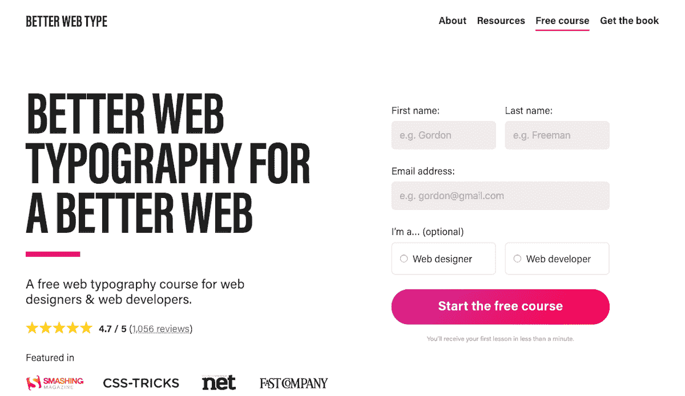
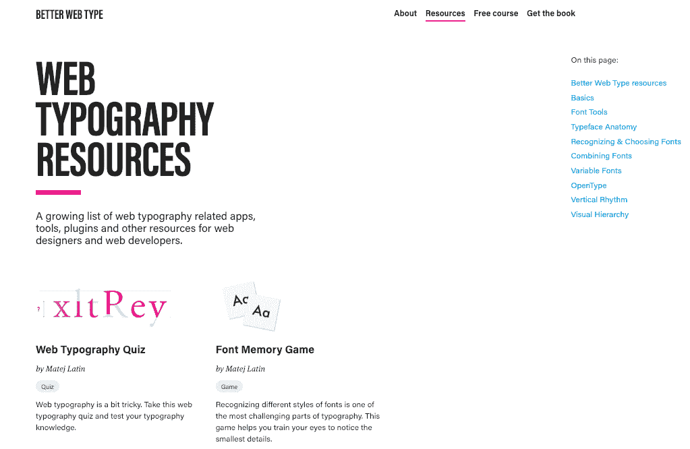
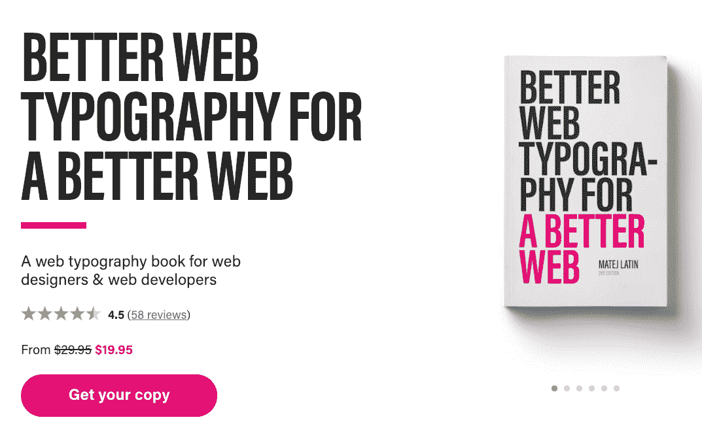

# 我是如何爱上印刷术，并在其上写了这本书的

> 原文：<https://www.indiehackers.com/interview/how-i-fell-in-love-with-typography-and-literally-wrote-the-book-on-it-2127f50e61>

## 你好！你的背景是什么，你在做什么？

我的名字叫 Matej，我是 UX 的一名设计师，也是一名字体设计爱好者。当我 13 岁参加课外班时，我开始了成为一名设计师的旅程。这个课程叫做“网页设计”，我参加这个课程是因为我想上网(那是 90 年代末，互联网在家里才刚刚开始成为一件事)，这样我就可以下载我当时玩的视频游戏的作弊代码。我最终学习了 HTML 的基础知识，到我上高中时，我已经开始为客户设计和建立网站了。最终，我开始作为一名自由职业者专注于做更多的 UX 设计工作，但我一直想体验作为一名现场设计师的角色。所以我搬到了德国，开始了我的第一个全职 UX 职位，然后去了伦敦，在那里我为另外几家公司工作。对我一直做的工作感到失望，我真的想开始自己的事业。当我还在德国的时候，我就有了更好的网页排版的想法，两年后当我住在伦敦的时候，我发布了这个想法。

[为了更好的网络，更好的网络排版](https://betterwebtype.com/)是一门以书籍形式出现的课程。它教授网页设计者和网页开发者关于网页排版以及如何在实践中掌握这门艺术。这个想法很简单:自从我第一次遇到这种有趣的艺术，我已经学到了很多关于印刷术的知识，但大部分是关于印刷中的印刷术。我想翻译我学到的东西，看看它如何应用到网络上，所以我为网页设计者和开发者推出了一个关于网页排版的免费课程。这是对该主题的一个基本但扎实的介绍，在推出后的第一个月就有 10，000 人注册。报名的人渴望更多，所以我决定扩展课程内容，并以书的形式发布。第一版发布一年半后，我发布了第二版，它不再是一本简单的书了。添加数字内容，如设计师的草图示例、web 开发人员的源代码、练习和学习游戏，将它变成一门以书籍形式出现的课程。

自从我推出免费课程以来，两年过去了，订阅者的人数已经超过了 2 万人，销售额平均每月约为 2 万美元。我还设置了自动化系统，可以将印刷书籍送到世界各地。

 

## 是什么促使你开始为一个更好的网站做更好的网页排版？

我当时在一家小型初创公司工作，这家公司希望改变数字杂志的设计和阅读方式。我从未学过设计，所以当时我对排版的了解有限，而排版对于设计杂志来说非常重要。所以没有学历，我决定做我一直做的事情:自学。我买了一本罗伯特·布林赫斯特(Robert Bringhurst)的书，名为《印刷风格的要素》(The Elements of a Typographic Style)，被设计界视为印刷圣经。那时候我就迷上了。

印刷术是一门艺术，当你浏览它的时候，它似乎是肤浅的。人们认为主要是字体的问题。但是一旦你深入研究，你会发现印刷术不仅仅是这样，它有一种让人们对它着迷的方式。罗伯特·布林赫斯特的书只关注印刷字体，所以它激发了写一些类似的东西的想法，但重点是如何应用于网络。最终，我得出结论，最好的打包方式是在线/电子邮件课程。起初，我想创建一个具有良好排版的网站画廊，但意识到有足够多的画廊类型的网站。此外，我一直对写作情有独钟——人们告诉我，他们非常喜欢阅读我写的东西——所以以某种形式制作教育内容是完全有意义的。我选择了电子邮件课程的形式，因为我想在某个时候把它变成一个常规的时事通讯。

从小处着手，及早发布，但要不断完善和更新。

TweetShare

我创建了一个登录页面，描述了这个想法，并有一个人们可以注册的表格。我对自己说:“如果我能让 500 人报名，这是一个应该实施的想法。”与初创公司合作时，我非常清楚运送卖不出去的东西的风险。在我的情况下，当时，它不是关于销售，而是关于人们注册。

当我想到“更好的网页排版”(原名)这个想法的时候，我仍然为一家小公司工作。我对自己的第一份现场、内部职位相对满意，但我仍然想要更多。我想做一个兼职项目，帮助我发展技能，同时也让我可以做自己想做的事情，把自我放在家里。我坚信这是成为一名优秀设计师的一个重要方面。我从来没有打算把它变成今天这样的生意。我只是看到了一个帮助别人学习一些我自己觉得很难学的东西的机会。因此，我的 Better Web Type 项目的核心目的一直是帮助设计师和开发人员了解 Web 排版，并以此创建具有高质量排版的漂亮网站。

## 构建最初的产品需要什么？

为了让更好的网络成为现实，最重要的事情就是写作。当我开始写这本书的时候，我已经用英语写了很多年了。英语只是我说的第三种语言，但也是最简单的。我相信这就是它与我的写作风格如此契合的原因，我的写作风格注重简洁。但这是前所未有的挑战。写 2000 字的文章是一回事，写 4 万字的书是另一回事。这需要极其敏锐的注意力、巨大的意志力和毅力。人们花很多年来写一本书，这通常是因为他们缺少这三者中的一个。

写这本书花了我三个月的时间。这个过程有点快，因为我已经从免费课程中打下了基础。但我最终重写了大部分内容，并添加了许多新内容。电子邮件课程仅限于几节课，字数限制在 1000 字以内。我想让它简短而甜蜜。现在我可以写下我想要的所有细节。当我在 2017 年夏天写这本书的时候，这是伦敦最热的夏天之一。我会在下午 6 点左右下班回家后写作，我仍然记得有些日子让自己开始写作有多难，但我坚持了下来。我甚至请了整整一周的假来完成最难的章节。

我心中有一个具体的发布日期，我正在努力实现:2017 年 7 月 31 日。我记得我把这本书送去编辑和校对，甚至在它有数字之前。我用 Markdown 写了它，然后把它转换成 epub 格式(iBooks ),再转换成 PDF 和 mobi 格式(Kindle)。我对 PDF 版本的结果不是 100%满意，所以在发布后不久，我就用合适的文本编辑软件重新做了一遍。我支付了编辑和校对的费用，我自己做了发行一本书所需的一切事情。

## 为了一个更好的网站，你是如何吸引用户和发展更好的网页排版的？

当我发布这本书的时候，我的邮件列表上已经有将近 15000 名订阅者，他们都来自我在那年早些时候发布的免费电子邮件课程。所以我知道大部分流量将来自那里。我实际上做了一个预购活动，他们可以以折扣价买到这本书。这是我第一次在网上设置支付和自动化，所以我想确保在发布日一切都完美运行。我收回了之前积累的所有成本(大约 1000 美元)，并开始仅通过预发布就开始盈利。当时我没有一个固定的方法给网站带来稳定的流量，所以销售额波动很大。

| 月 | 收入 |
| --- | --- |
| 2017 年 7 月 | 2764 |
| 2017 年 8 月 | 2834 |
| 17 年 9 月 | 307 |
| 17 年 10 月 | 2332 |
| 17 年 11 月 | 720 |
| 2017 年 12 月 | 333 |

我在头两个星期卖出了 600 多本书，但后来流量停止了。这是只关注电子邮件列表的一个消极方面，所以我开始在社交媒体上分享关于我的新书的消息，并为 [CSS Tricks](https://css-tricks.com/equilateral-triangle-perfect-paragraph/) 、Web Designer 杂志和 Net 杂志写了一篇客座文章。这有助于获得更多的牵引力，此后销售再次回升。在接下来的几个月里，我更新了这本书，增加了新的内容，增加了额外的数字内容(备忘单，示例文件)，并且每当我增加新的内容时，就向我的邮件列表发送一个活动。我从未尝试在社交媒体上做广告或为搜索结果付费。我的产品价格相对较低，我不认为在脸书优化广告是值得花时间的。我不想以我最终收取的价格的 80-90%来“购买”客户。

不过，我的确创建了一个脸书主页，并组织了一些赠品。我发现，如果参加赠品活动需要提及可能感兴趣的朋友，那么这些对获得“免费广告”是有好处的。我还不断创造学习游戏，比如[等边三角形](https://betterwebtype.com/triangle)游戏、[网页排版测验](https://betterwebtype.com/web-typography-quiz)、[字体记忆游戏](https://betterwebtype.com/font-memory-game)以及类似的游戏。所有这些都出现在聚合器和邮件列表中，比如侧边栏和黑客新闻。这有助于在短期内获得更多的流量。我把书中的章节作为文章发表在了更好的网络类型网站上，这些文章也被各种来源所采用。

学习游戏特别成功。例如，[字体记忆游戏](https://betterwebtype.com/font-memory-game)就有“竞争”的一面。最后，玩家得到了他们的结果，并被鼓励在推特和脸书上分享:“我在[x]分钟和[x]步内完成了字体记忆游戏的正常模式。你能做得比我好吗？”然后，玩家将在社交媒体上分享他们的结果，这将导致其他人看到他们的结果，并亲自尝试。它肯定有一个病毒系数，但我无法测量它。我意识到，我更愿意花时间来创建这样的学习游戏(同时学习如何更好地编码)，而不是花时间来找出如何在脸书上最好地宣传产品。

 

## 你的商业模式是什么，你是如何增加收入的？

我只靠卖产品赚钱。我一直在考虑其他赚钱的方法，比如对我的时事通讯中的广告收费，但我决定不这么做。我想让我的时事通讯和我的订阅者保持一定的私人关系。我想继续制作对他们有价值、有教育意义的东西。在电子邮件简讯中添加广告并不符合这一点。我也很幸运，这是我的副业，因为我仍然全职工作。我不需要依赖它作为我唯一的收入来源，所以更容易做出这样的选择。这有时很有挑战性，但它让我能够与我的客户和订户建立基于友好和信任的关系。最近，我一直收到人们的电子邮件，告诉我他们有多喜欢我的每月简讯。我真的对此感到惊讶，甚至他们也承认，他们对自己能如此喜欢一份时事通讯感到惊讶。

所以，我的商业模式是建立在我给我的客户/订户的价值之上的:要么免费(电子邮件课程和时事通讯)，要么付费。我试图在我免费提供的价值和让人们不断回到我网站的软性广告之间找到平衡。让我与众不同的是客户服务。我自己处理。对许多人来说，这可能是浪费时间，但人们从我这里购买这本书，所以如果他们的订单有问题，我希望成为他们可以依赖的人，而不是日复一日处理这些案件的第三人。我对排版和我的业务充满热情，当客户出现问题时，我也热衷于为他们解决问题。这也是我从未走上传统出版道路的原因。我想掌控一切，并与我的客户保持联系。

根据你的产品提供的价值来收费，而不是根据其他类似的产品。

TweetShare

所有付款都通过 Shopify 处理。我有 Stripe 处理的卡支付，我也支持 PayPal、Apple Pay 和 Google Pay。大多数人用贝宝支付，这有点令人惊讶。我猜这是因为它不是一个巨大的支付金额，而且更方便。

正如我前面提到的，我不断给这本书添加新的内容和数字附加内容，这样我就能够相应地提高价格，这对稳定收入产生了积极的影响。我的客户意识到他们得到的不仅仅是一本书，所以他们不介意为高质量的产品付费。我真的认为我一开始低估了我的产品。我太沉迷于电子书的思维模式和它们通常的价格。我没有意识到我的产品不仅仅是一本电子书。真正有助于稳定销售的是推出一种组合产品——图书的数字版和印刷版的组合。毕竟，这是一本关于排版的书，人们喜欢看到实物形式的细节。

| 月 | 收入 |
| --- | --- |
| 2018 年 8 月 | 992 |
| 18 年 9 月 | 2543 |
| 18 年 10 月 | 3318 |
| 18 年 11 月 | 2100 |
| 2018 年 12 月 | 1371 |

我学到的最重要的事情是，我不应该低估我的产品。根据你的产品提供的价值来收费，而不是根据其他类似的产品。是的，我的产品最初只是一本电子书，但即便如此，它也不仅仅是一本典型的电子书。它已经包含了源代码和代码示例。另一点是，产品一开始就应该被认为是未完成的。最近几个月，我对这本书做了如此多的改进，以至于它和我第一次发行时几乎是一个完全不同的产品。从小处着手，及早发布，但要不断完善和更新。再加上合理的定价，这就是成功的秘诀。

## 你未来的目标是什么？

我想再写一本关于网页排版的书。这是一个一直吸引着我的话题，关于它还有很多可以写的东西。例如，如何将我在第一本书中概述的类似原则应用到更复杂的 web 应用程序中。我还想为设计师制作其他教育内容。有了更好的网络类型，我意识到我喜欢做一名企业家，我喜欢帮助人们学习新事物。不过，我想未来我会更关注纯数码产品，主要是因为它带来的简单性。最后一件事是为更好的网络项目保持稳定的流量。我正致力于引入一个博客，在那里我会定期发布文章，从长远来看，应该会不断带来新的人。我真的没有什么流量目标，因为这还是我的副业。不管结果如何，我都很感激。对我来说，最重要的事情是，这仍然是我工作的乐趣所在。

我现在知道写一本书有多难(写第一本书时的天真已经一去不复返了)，所以我需要集中意志力，再次找到我之前说过的清晰的焦点。我现在远程工作，所以我有更多的时间控制权，但我仍然认为这是一个很大的挑战。

## 你面临的最大挑战和克服的障碍是什么？如果你必须重新开始，你会做什么不同的事？

我从一开始就没有做到的一件事——至今仍未解决——是设置我的技术解决方案来支持在线销售。我用 MailChimp 做邮件列表，用 Shopify 做电子商务。但我从一开始就没有使用 Shopify，当我第一次发布这本书时，我使用了一个非常基本的 PayPal 支付版本，直到今天，很难在 Mailchimp 中看到谁购买了这本书以及什么版本。因此，我无法向已经买过书的订户发送更复杂的信息，也无法向没有买过书的订户发送促销信息。我一开始不使用 Shopify 的原因是我想节省成本。我后来意识到，它的精简版每月只需 10 美元，这个价格带来的价值令人难以置信。降低成本很重要，但有些成本是值得的。这是其中的一个案例。如果我必须建立另一个类似的项目，我会从一开始就使用 MailChimp 和 Shopify。

## 有没有发现什么特别有帮助或者有优势的？

我认为在尝试自己的东西之前，作为一名与许多初创公司合作过的 UX 设计师真的很有帮助。在某种程度上，我可以从别人的错误中学习。我做的最好的决定是从非常小和基本的开始，验证它，然后在此基础上构建和扩展。另一个积极的事情来自于 UX 设计师和软件开发人员的工作方式，那就是把事情分解成可解决的问题。[商业模式生成](https://smile.amazon.com/dp/0470876417/ref=cm_sw_em_r_mt_dp_U_6c.JCb6WKQCMQ)、[初创公司所有者手册](https://smile.amazon.com/dp/0984999302/ref=cm_sw_em_r_mt_dp_U_pc.JCb6Y1Z39P)和[精益 UX](https://smile.amazon.com/dp/1491953608/ref=cm_sw_em_r_mt_dp_U_0d.JCb669EM2S) 都是可以帮助你更好理解这些概念的好书。我绝对推荐他们。有时候我发现自己不愿意开始做下一件事，原因不明。我很快意识到原因是缺乏信息或恐惧或两者兼而有之。如果你把事情分解成你知道如何处理的小问题，你就积累了解决问题所需的信息，恐惧也会随之消失。

把事情分解成你知道如何处理的小问题。

TweetShare

我确实相信 Better Web Type 的成功与运气有关——比如免费课程被如此强烈地推荐并吸引了如此多的人注册。这让我可以创建一个邮件列表，在销售产品时减少对他人的依赖。但另一方面，有一个个人特质也有助于我的项目的成功:我给我的个人副业带来的无情的结构。我不把它当成爱好。所以我不只是在我喜欢的时候才工作。我把它当成生意。我知道有些事情需要去做，即使我并不急于去做。我还知道，合理安排我的空闲时间，让我总是有时间做我的兼职项目是非常重要的。我总是提前计划事情。我计划我想在 2019 年的 Q1 做什么，然后将其分解为每月的“里程碑”。没有这一点，我不认为更好的网络类型会像现在这样成功。

 

## 对于刚刚起步的独立黑客，你有什么建议？

我看到其他人强调的东西，但是很多人仍然忽略它:邮件列表。这是建立你的受众并与你的订户建立关系的最佳方式。我见过有人创建脸书群和页面。我确实认为有这样的地方，但是邮件列表让你可以直接联系到你的人。另一方面，脸书(和其他社交媒体)可以决定在一夜之间改变一些事情，这可能会对你的业务产生深远的负面影响。

另一件事是产品开发的方法。不要只是想出一个想法，如果你还没有验证它，就固执地坚持把它变成现实。如果你试图验证它但失败了，不要固执。让它去吧。将来你会有其他更好的想法。这就是它的酷之处:更多的想法总是会产生更多的想法。在你验证了你的想法之后，生产一些有价值的、人们可以支付的东西。一些小而基本的东西，但后来扩展并建立在它之上。一旦你确认了这个想法，不要忘记目标。当我写书的时候，我把它画在我的白板上，这样它就能不断提醒我正在努力的方向。写书，设计，做软件，真的很辛苦。你每天都需要一些东西来激励你。

## 我们可以去哪里了解更多？

我很乐意回答你的读者可能有的任何问题。如果你想了解更多关于更好的网页类型的知识，你可以查看免费课程，或者如果你非常想学习网页排版，[直接买这本书](https://betterwebtype.com/web-typography-book)。你也可以[阅读书中的样本章节](https://betterwebtype.com/rhythm-in-web-typography)。当然，你可以在 Twitter [@matejlatin](https://twitter.com/matejlatin) 上关注我，这是我唯一积极参与的社交媒体。

—[<picture id="ember5200065" class="user-avatar ember-view user-link__avatar"></picture>Matej 拉丁文](/matejlatin?id=h38GbH72CzRXFU7zmgnBt17wI1X2)，更好的网页排版的创始人为了更好的网页

## 想为更好的网络建立自己的事业，比如更好的网络排版？

你应该加入独立黑客社区！🤗

我们是几千名创始人，互相帮助建立有利可图的业务和副业。来分享你正在做的事情，并从你的同事那里获得反馈。

还没准备好开始使用你的产品吗？没问题。这个社区是一个认识人、学习和实践的好地方。随意[随便浏览](/)！

——[<picture id="ember5200070" class="user-avatar ember-view user-link__avatar"></picture>柯特兰艾伦](/csallen?id=ibTLPyjwVebnZjMGKvz6ztarnuV2)，独立黑客创始人

17votes